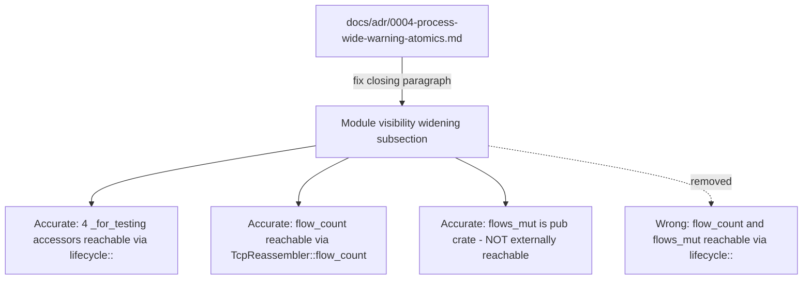
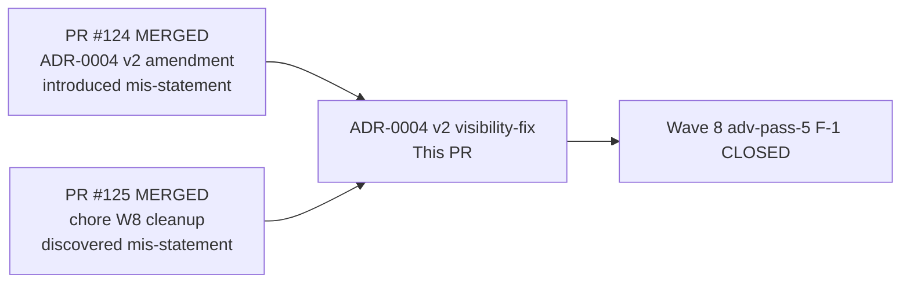
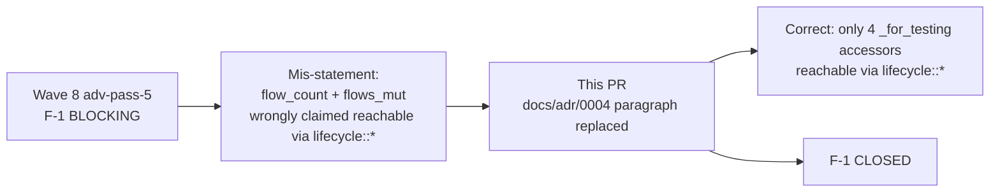

## Summary

Fixes an inaccuracy in the ADR-0004 v2 amendment's "Module visibility widening" subsection.
The original text incorrectly claimed `flow_count()` and `flows_mut()` are reachable via
`wirerust::reassembly::lifecycle::*`. This PR replaces that closing paragraph with an
accurate description of what the `pub mod lifecycle` widening actually exposes.

**Docs-only change:** no `src/`, `tests/`, or `Cargo.toml` files modified. `cargo check` and
`cargo fmt --check` are both clean.

**Wave:** 8 (wave-level adversarial pass-5 F-1 remediation)
**Closes:** Wave 8 adv-pass-5 F-1
**Refs:** PR #124 (introduced the mis-statement), PR #125 (chore PR that discovered it)

---

## Context

Wave 8 wave-level adversarial pass-5 identified **F-1 (BLOCKING):** the ADR-0004 v2
amendment's "Module visibility widening" subsection (appended in PR #124) ended with:

> `flow_count()`, `flows_mut()`, and the four `_for_testing` accessors are now reachable
> via `wirerust::reassembly::lifecycle::*`.

This is wrong on two counts:
1. `flow_count()` lives on `impl TcpReassembler` in `mod.rs` — it is reachable as
   `wirerust::reassembly::TcpReassembler::flow_count`, NOT via `lifecycle::*`.
2. `flows_mut()` is `pub(crate)` — it is not externally reachable at all.

The same amendment (line 217) correctly said `flows_mut` is `pub(crate)`, making the
closing paragraph self-contradictory. This PR replaces that one paragraph with accurate text.

---

## What This PR Does

Replaces the closing paragraph of the "Module visibility widening" subsection in
`docs/adr/0004-process-wide-warning-atomics.md` to accurately state:

1. Only the four `_for_testing` accessors in `src/reassembly/lifecycle.rs`
   (`close_flow_missing_warned_for_testing`, `reset_close_flow_missing_warned_for_testing`,
   `trigger_close_flow_missing_key_for_testing`, `force_set_flow_state_for_testing`) became
   externally reachable via `wirerust::reassembly::lifecycle::*` as a result of the widening.
2. `flow_count()` (added in Wave 7, logged under W7.1) remains reachable as
   `wirerust::reassembly::TcpReassembler::flow_count` and was unaffected by this widening.
3. `flows_mut()` is `pub(crate)` and not externally reachable — it exists solely to support
   the in-crate `force_set_flow_state_for_testing` seam.

Single-line diff: 1 file changed, 1 insertion(+), 1 deletion(-).

---

## Architecture Changes

---

## Story Dependencies

**depends_on:** PR #124 (merged — introduces the text being fixed), PR #125 (merged — chore PR on develop HEAD)

---

## Spec Traceability

---

## Test Evidence

Docs-only PR — no test changes. No behavioral code modified.

- `cargo check`: clean (no src changes)
- `cargo fmt --check`: clean (markdown not validated by rustfmt)
- Underlying test suite remains: 463 tests passing on develop (per STATE.md)

---

## Demo Evidence

N/A — docs-only paragraph correction. No behavioral change to demonstrate.

---

## Holdout Evaluation

N/A — evaluated at wave gate.

---

## Adversarial Review

Wave 8 wave-level adv-pass-5 identified:
- **F-1 (BLOCKING):** ADR-0004 v2 amendment "Module visibility widening" subsection
  incorrectly stated `flow_count()` and `flows_mut()` are reachable via
  `wirerust::reassembly::lifecycle::*`. Both claims false — `flow_count()` is on
  `impl TcpReassembler`, `flows_mut()` is `pub(crate)`. Also contradicted line 217
  of the same amendment.

This PR IS the adversarial remediation artifact for F-1.

---

## Security Review

Docs-only change. No source code modified. No security surface. Zero new code paths.

---

## Risk Assessment

| Dimension | Assessment |
|-----------|-----------|
| Blast radius | Docs-only; zero runtime impact |
| Behavior change | None |
| Performance impact | None |
| Breaking changes | None |
| Rollback | Revert single commit `e7291b6` |

---

## AI Pipeline Metadata

| Field | Value |
|-------|-------|
| Pipeline mode | VSDD Factory — Wave 8 adv-pass-5 remediation |
| Models used | claude-sonnet-4-6 |
| Story | ADR-0004 v2 visibility-text-fix (Wave 8, closes adv-pass-5 F-1) |
| Triggered by | Wave-level adversarial-pass-5 F-1 |
| Wave | 8 |
| Branch | docs/w8-adr-visibility-fix |
| Commit | e7291b6 |

---

## Pre-Merge Checklist

- [x] PR title uses `docs(adr):` prefix (semantic PR gate: `docs` type)
- [x] Docs-only change — no src/test/Cargo.toml impact
- [x] Single-paragraph fix — does NOT rewrite ADR decision, Amendment 1, or Amendment 2 structure
- [x] `flow_count()` correctly described as `TcpReassembler::flow_count` (not lifecycle::*)
- [x] `flows_mut()` correctly described as `pub(crate)` and not externally reachable
- [x] Four `_for_testing` accessors correctly enumerated as the only lifecycle::* additions
- [x] Self-contradiction between closing paragraph and line 217 resolved
- [x] Dependency PRs merged (#124, #125)
- [x] CI: cargo check clean, cargo fmt --check clean
- [ ] pr-reviewer approval
- [ ] CI passing on this PR
- [ ] Squash-merged to develop
