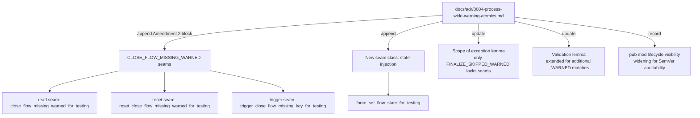
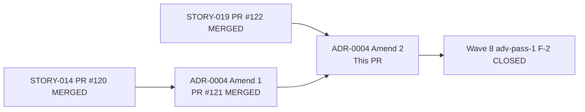
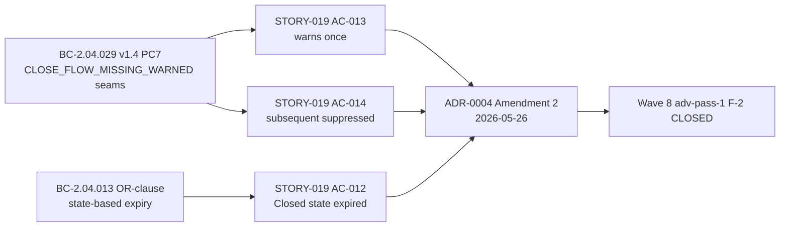

## Summary

Appends a second amendment block (dated 2026-05-26) to `docs/adr/0004-process-wide-warning-atomics.md`
documenting the three `CLOSE_FLOW_MISSING_WARNED` test seams and the new `force_set_flow_state_for_testing`
state-injection seam class added by STORY-019 (Wave 8, PR #122). Closes Wave 8 wave-level adv-pass-1 F-2.

**Docs-only change:** no `src/`, `tests/`, or `Cargo.toml` files modified. `cargo check` and
`cargo fmt --check` are both clean.

**Wave:** 8 (ADR follow-on)
**Refs:** STORY-019 (PR #122), BC-2.04.029 v1.4, prior ADR amendment PR #121

**Closes:** Wave 8 wave-level adv-pass-1 F-2

---

## Context

STORY-019 (Wave 8, merged via PR #122 `c141c094`) added 3 `#[doc(hidden)] pub fn` test seams for
`CLOSE_FLOW_MISSING_WARNED` plus a 4th state-injection seam `force_set_flow_state_for_testing`.
The Wave 7 ADR-0004 amendment text (PR #121) said `CLOSE_FLOW_MISSING_WARNED` has NO test seams
"as of Wave 7" — that statement is now factually stale on develop. This PR closes the gap.

---

## What This PR Does

Appends a second amendment block (dated 2026-05-26) to
`docs/adr/0004-process-wide-warning-atomics.md` documenting:

1. The 3 `CLOSE_FLOW_MISSING_WARNED` seams (read/reset/trigger) per BC-2.04.029 v1.4 PC7
2. The trigger seam's replicate-body design (preserves PC6 debug_assert in production)
3. The new `force_set_flow_state_for_testing` seam — a new test-seam CLASS (state-injection,
   not warning-guard) authorized under the opt-in-per-guard doctrine for BC-driven discrimination
   tests (STORY-019 AC-012 BC-2.04.013 OR-clause)
4. Updated "Scope of the exception" lemma: only `FINALIZE_SKIPPED_WARNED` lacks test seams
   as of Wave 8
5. Extended Validation lemma to account for additional `_WARNED` accessor matches
6. Recorded the `pub mod lifecycle` visibility widening for SemVer auditability

---

## Architecture Changes

---

## Story Dependencies

**depends_on:** STORY-019 (merged #122), ADR-0004 Amendment 1 (merged #121)

---

## Spec Traceability

---

## Test Evidence

Docs-only PR — no test changes. The underlying behavioral tests from STORY-019 (PR #122)
remain passing on `develop`:

- STORY-019 test suite: 32 tests, all passing (CI green on PR #122 merge commit `c141c094`)
- `cargo check`: clean (no src changes)
- `cargo fmt --check`: clean (markdown not validated by rustfmt)

---

## Demo Evidence

N/A — docs-only amendment. No behavioral change to demonstrate.

---

## Holdout Evaluation

N/A — evaluated at wave gate.

---

## Adversarial Review

Wave 8 wave-level adv-pass-1 identified:
- **F-2 (BLOCKING):** ADR-0004 Wave-7 amendment text states `CLOSE_FLOW_MISSING_WARNED` has
  "NO test seams as of Wave 7" — factually stale after STORY-019 merged three seams for that
  guard plus a new state-injection seam class.

This PR IS the adversarial remediation artifact for F-2.

---

## Security Review

Docs-only change. No source code modified. No security surface. Zero new code paths.

---

## Risk Assessment

| Dimension | Assessment |
|-----------|-----------|
| Blast radius | Docs-only; zero runtime impact |
| Behavior change | None |
| Performance impact | None |
| Breaking changes | None |
| Rollback | Revert single commit `e502354` |

---

## AI Pipeline Metadata

| Field | Value |
|-------|-------|
| Pipeline mode | VSDD Factory — Wave 8 ADR follow-on |
| Models used | claude-sonnet-4-6 |
| Story | ADR-0004 Amendment v2 (Wave 8, closes adv-pass-1 F-2) |
| Triggered by | Wave-level adversarial-pass-1 F-2 |
| Wave | 8 |

---

## Pre-Merge Checklist

- [x] PR title uses `docs(adr):` prefix (semantic PR gate: `docs` type)
- [x] Docs-only change — no src/test/Cargo.toml impact
- [x] ADR Amendment 2 block appended (not rewriting original decision or Amendment 1)
- [x] CLOSE_FLOW_MISSING_WARNED seams documented (read/reset/trigger)
- [x] Trigger seam replicate-body design rationale documented
- [x] New state-injection seam class documented (force_set_flow_state_for_testing)
- [x] Scope of exception lemma updated (only FINALIZE_SKIPPED_WARNED lacks seams as of Wave 8)
- [x] Validation lemma extended for additional _WARNED accessor matches
- [x] pub mod lifecycle visibility widening recorded for SemVer auditability
- [x] Dependency PRs merged (STORY-019 #122, ADR-0004 Amend 1 #121)
- [x] CI: cargo check clean, cargo fmt --check clean
- [ ] pr-reviewer approval
- [ ] CI passing on this PR
- [ ] Squash-merged to develop
