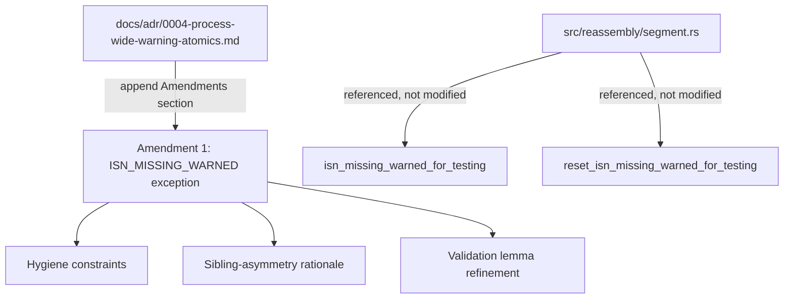
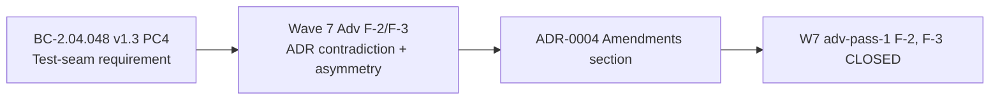

## Summary

Appends an `## Amendments` section to `docs/adr/0004-process-wide-warning-atomics.md` to formally document the ISN_MISSING_WARNED test-seam exception introduced by STORY-014 / BC-2.04.048 v1.3 PC4. This resolves Wave 7 wave-level adversarial-pass-1 findings F-2 (ADR contradiction) and F-3 (sibling-asymmetry unexamined).

**Docs-only change:** no `src/`, `tests/`, or `Cargo.toml` files modified. `cargo check` and `cargo fmt --check` are both clean.

**Wave:** 7 (ADR follow-on, not a new story)
**Refs:** STORY-014 (PR #120), BC-2.04.048 v1.3, original ADR-0004

**Closes:** Wave 7 wave-level adv-pass-1 F-2, F-3

---

## Context

STORY-014 / BC-2.04.048 v1.3 introduced two `#[doc(hidden)] pub fn` test seams
(`isn_missing_warned_for_testing`, `reset_isn_missing_warned_for_testing`) in
`src/reassembly/segment.rs`. These seams enable integration tests to observe the
one-shot `ISN_MISSING_WARNED` atomic — a pattern the original ADR-0004 explicitly
prohibited: "a test cannot reliably assert 'this run warned'".

The Wave 7 wave-level adversary flagged this as:
- **F-2 (BLOCKING):** ADR contradiction — the ADR said no test can assert the atomic,
  but STORY-014's test seams enable exactly that.
- **F-3 (BLOCKING):** Sibling-atomic asymmetry unexamined — `CLOSE_FLOW_MISSING_WARNED`
  and `FINALIZE_SKIPPED_WARNED` do not have equivalent test seams; no rationale given.

The ADR was not amended at the time of the original STORY-014 PR (#120). This PR
closes the gap.

---

## What This PR Does

Appends `## Amendments` to `docs/adr/0004-process-wide-warning-atomics.md` with four sub-sections:

1. **Amendment 1 (2026-05-25) — ISN_MISSING_WARNED Test-Seam Exception**: documents
   the two `#[doc(hidden)]` accessors, their rationale (BC-2.04.048 v1.3 PC4 requires
   deterministic AC-level observation), and hygiene constraints.
2. **Test-seam hygiene constraints**: must be `#[doc(hidden)]`, must use `_for_testing`
   suffix, must NOT be called from production code.
3. **Sibling-asymmetry rationale (F-3 closure)**: test seams are opt-in per guard, gated
   by BC-driven AC need. `CLOSE_FLOW_MISSING_WARNED` and `FINALIZE_SKIPPED_WARNED`
   continue to follow the original guidance (no seam needed, no BC requires it).
4. **Validation lemma refinement**: the canonical-shape claim ("all `_WARNED` symbols
   use identical shape") applies to guard sites, not to all `_WARNED` symbols. Test-seam
   symbols are `_for_testing`-suffixed and are not guards.

---

## Architecture Changes

---

## Story Dependencies

---

## Spec Traceability

---

## Test Evidence

Docs-only PR — no test changes. The underlying behavioral tests from STORY-014 (PR #120)
remain passing on `develop`:

- STORY-014 test suite: 17 tests, all passing (CI green on PR #120 merge)
- `cargo check`: clean (no src changes)
- `cargo fmt --check`: clean (markdown formatting not validated by rustfmt)

---

## Demo Evidence

N/A — docs-only amendment. No behavioral change to demonstrate.

---

## Holdout Evaluation

N/A — evaluated at wave gate.

---

## Adversarial Review

Wave 7 wave-level adv-pass-1 identified:
- **F-2 (BLOCKING):** ADR-0004 contradicts STORY-014 implementation — resolved by this PR.
- **F-3 (BLOCKING):** Sibling-atomic asymmetry unexamined — resolved by Amendment sub-section 3.

This PR IS the adversarial remediation artifact.

---

## Security Review

Docs-only change. No source code modified. No security surface.

---

## Risk Assessment

| Dimension | Assessment |
|-----------|-----------|
| Blast radius | Docs-only; zero runtime impact |
| Performance impact | None |
| Breaking changes | None |
| Rollback | Revert single commit `5a8da96` |

---

## AI Pipeline Metadata

| Field | Value |
|-------|-------|
| Pipeline mode | VSDD Factory — Wave 7 ADR follow-on |
| Models used | claude-sonnet-4-6 |
| Story | ADR-0004 Amendment (not a new story) |
| Triggered by | Wave-level adversarial-pass-1 F-2, F-3 |

---

## Pre-Merge Checklist

- [x] PR title uses `docs(adr):` prefix (semantic PR gate: `docs` type)
- [x] Docs-only change — no src/test/Cargo.toml impact
- [x] ADR Amendments section appended (not rewriting original decision)
- [x] Hygiene constraints documented
- [x] Sibling-asymmetry rationale documented (F-3 closed)
- [x] Validation lemma refined (F-2 closed)
- [x] CI: cargo check clean, cargo fmt --check clean
- [x] Squash-merge with branch cleanup
