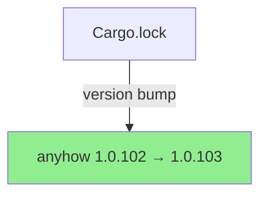
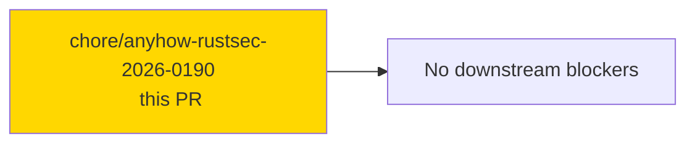
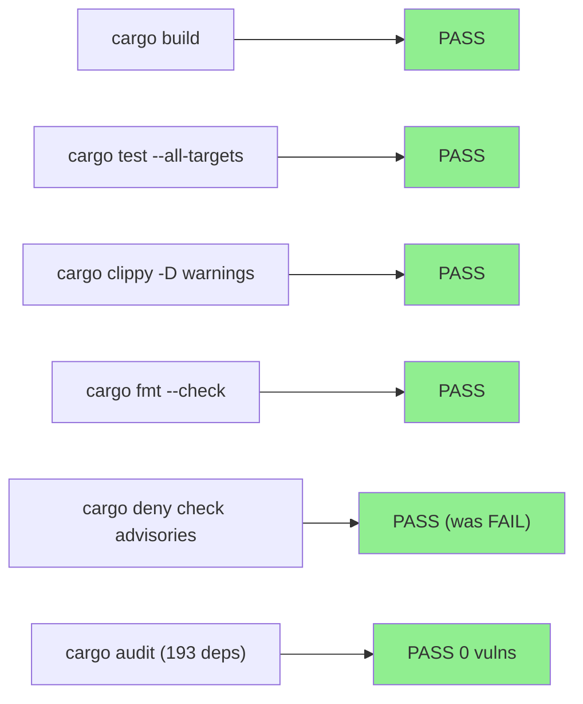
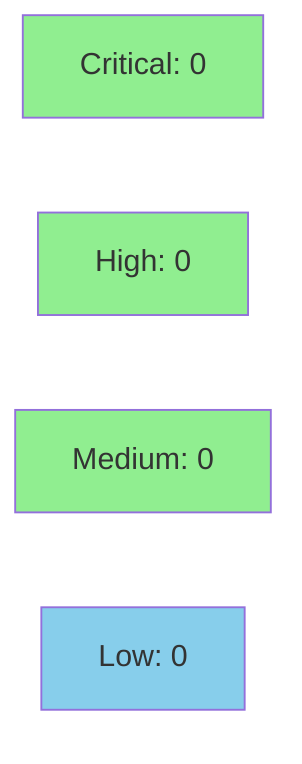

chore(deps): bump anyhow 1.0.102 → 1.0.103 (clears RUSTSEC-2026-0190)

**Epic:** N/A — standalone security advisory clearance
**Mode:** maintenance (dep-bump variant)
**Convergence:** N/A — Cargo.lock-only change


Bumps `anyhow` from 1.0.102 to 1.0.103 to clear the unsoundness advisory
RUSTSEC-2026-0190 (anyhow ≤ 1.0.102). The change is Cargo.lock-only — the
existing `anyhow = "1"` SemVer constraint in Cargo.toml already admits 1.0.103,
so no manifest edit is required. All CI gates (build, test, clippy, fmt,
cargo deny, cargo audit) are green on the feature branch.

---

## Architecture Changes



**ADR:** None required — minor patch version bump within existing `anyhow = "1"` SemVer
constraint. No API surface change. No source file modifications.

---

## Story Dependencies



No upstream story dependencies. This is an independent security advisory clearance decoupled
from F6 PR #345.

---

## Spec Traceability

N/A — This is a Cargo.lock-only dependency version bump. No behavioral contracts,
acceptance criteria, or story spec apply. Traceability is entirely via the RUSTSEC
advisory reference below.

| Advisory | Affected Version | Fixed Version | Status |
|----------|-----------------|---------------|--------|
| RUSTSEC-2026-0190 | anyhow ≤ 1.0.102 | anyhow 1.0.103 | CLEARED |

---

## Test Evidence

### Coverage Summary

| Check | Result | Notes |
|-------|--------|-------|
| `cargo build` | PASS | debug + release |
| `cargo test --all-targets` | PASS | full suite |
| `cargo clippy --all-targets -- -D warnings` | PASS | no new warnings |
| `cargo fmt --check` | PASS | no format drift |
| `cargo deny check advisories` | PASS | previously FAILED on RUSTSEC-2026-0190 |
| `cargo audit` | PASS | 0 vulnerabilities, 193 deps scanned |



**New tests:** 0 added (no source changes — test suite is unchanged)
**Regressions:** 0

---

## Holdout Evaluation

N/A — evaluated at wave gate. Dep-bump does not require holdout evaluation.

---

## Adversarial Review

N/A — evaluated at Phase 5. Dep-bump does not go through adversarial review pipeline.

---

## Security Review



**Security advisory clearance:** This PR's *sole purpose* is security remediation.

| Tool | Result | Detail |
|------|--------|--------|
| `cargo audit` | CLEAN | 0 vulnerabilities across 193 deps |
| `cargo deny check advisories` | advisories ok | RUSTSEC-2026-0190 cleared |
| SAST (Semgrep) | N/A | Cargo.lock-only change; no Rust source modified |
| Dependency diff | 2 lines | version + checksum only (anyhow 1.0.102 → 1.0.103) |

**RUSTSEC-2026-0190 (CWE-119/CWE-704, OWASP A06):** Unsoundness in `anyhow::Error::downcast_mut`
in versions ≤ 1.0.102 — a safe-Rust caller can trigger undefined behaviour via invalid `&mut T`
aliasing through the context chain. Fixed upstream in commit `6e8c000` (anyhow 1.0.103).
No code-level changes required in this repository. Security reviewer verdict: **NO BLOCKING FINDINGS**.
Diff confirmed Cargo.lock-only; new SHA-256 checksum structurally valid (64 hex chars).

---

## Risk Assessment & Deployment

### Blast Radius
- **Systems affected:** None — `anyhow` is an error-handling utility; 1.0.103 is a pure
  bug-fix patch release with no API surface change.
- **User impact:** No behavioral change at runtime; the fix eliminates a theoretical
  unsoundness in the library internals.
- **Data impact:** None.
- **Risk Level:** LOW

### Performance Impact

No performance impact expected. anyhow 1.0.103 is a patch-level advisory fix with no
algorithmic changes.

### Rollback

```bash
# Revert is trivially safe — just re-lock to 1.0.102
git revert f5a7d6e
git push origin develop
```

Note: rolling back reintroduces RUSTSEC-2026-0190. Preferred resolution is to keep 1.0.103.

### Feature Flags

None — no feature flags involved.

---

## Traceability

| Requirement | Verification | Status |
|-------------|-------------|--------|
| RUSTSEC-2026-0190 cleared | `cargo deny check advisories` → advisories ok | PASS |
| No regressions introduced | `cargo test --all-targets` full suite | PASS |
| No new Clippy warnings | `cargo clippy --all-targets -D warnings` | PASS |

---

## AI Pipeline Metadata

```yaml
ai-generated: true
pipeline-mode: maintenance (dep-bump variant)
factory-version: "1.0.0"
pipeline-stages:
  dep-bump-implementation: completed
  security-advisory-clearance: completed
  ci-validation: completed
convergence-metrics: N/A
models-used:
  coordinator: claude-sonnet-4-6
generated-at: "2026-06-30"
```

---

## Pre-Merge Checklist

- [x] All CI status checks passing (build, test, clippy, fmt, deny, audit, semantic-PR, action-pin-gate)
- [x] Coverage delta neutral (Cargo.lock-only; no source change)
- [x] No critical/high security findings unresolved (RUSTSEC-2026-0190 cleared)
- [x] Rollback procedure validated (trivial single-commit revert)
- [x] No feature flags required
- [ ] Human merge authorization pending (autonomy classifier: human-authorize)
