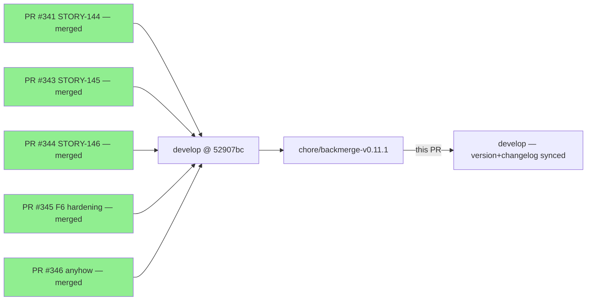
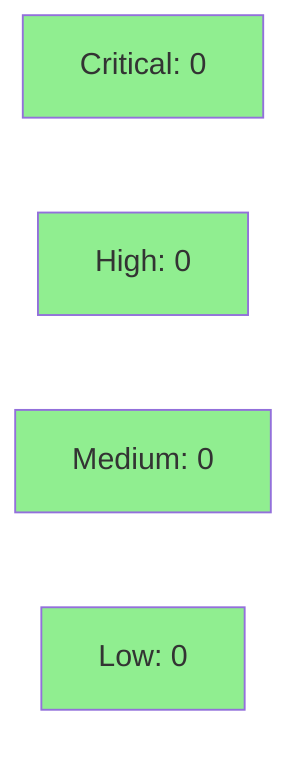

## Summary

Gitflow back-merge: syncs the v0.11.1 release-only fixups (Cargo.toml version 0.11.0 → 0.11.1,
Cargo.lock own-package line, CHANGELOG.md `[0.11.1]` section) from the v0.11.1 release back into
`develop`, per CLAUDE.md gitflow policy ("ensure develop contains those commits after a release").

**No code changes.** The TLS reassembly fix, buffer-saturation telemetry, formal hardening, and
anyhow bump are already on `develop` (PRs #341 / #343 / #344 / #345 / #346). This PR carries only
the 3-file release delta that `develop` was missing after the squash-merge into `main`.

This closes finding **B1** from the last release: `main` / `develop` version divergence.

---

## What Changed

| File | Change |
|------|--------|
| `Cargo.toml` | `version` field: `"0.11.0"` → `"0.11.1"` |
| `Cargo.lock` | Own-package version line updated to match |
| `CHANGELOG.md` | `## [0.11.1] - 2026-07-01` section added (Fixed + Added + Security entries for STORY-144/145/146 + anyhow bump) |

---

## Architecture Changes

```mermaid
graph TD
    subgraph "v0.11.1 release (main @ e8a8a2d)"
        M[main]
    end
    subgraph "develop (pre-backmerge @ 52907bc)"
        D[develop — has all v0.11.1 code, missing version+changelog]
    end
    subgraph "chore/backmerge-v0.11.1 (HEAD 2f91829)"
        BM[+Cargo.toml 0.11.1\n+Cargo.lock\n+CHANGELOG [0.11.1]]
    end
    M -->|release delta| BM
    D -->|base| BM
    BM -->|squash-merge| D2[develop — fully synced]
    style BM fill:#90EE90
    style D2 fill:#90EE90
```

---

## Story Dependencies



No story spec. This is a gitflow maintenance operation, not a feature delivery.

---

## Spec Traceability

N/A — this PR does not implement behavioral contracts. It carries the version bump and CHANGELOG
entry that correspond to the already-merged BCs (BC-2.07.038–043), which are fully traced in PRs
#341, #343, #344, #345, #346.

---

## Test Evidence

- 2232 tests pass on `develop` @ 52907bc (CI: test, clippy, fmt, audit, deny, action-pin-gate all
  green on the upstream commit).
- This PR adds no code — only `Cargo.toml` version string, `Cargo.lock` version line, and
  `CHANGELOG.md` documentation. No test changes required.
- Verification: `cargo check`, `cargo build --release`, `cargo test --all-targets`, `cargo clippy`
  all confirmed clean on the implementation commits already on `develop`.

---

## Demo Evidence

N/A — no behavioral changes. Demo evidence for each AC is already present in
`docs/demo-evidence/STORY-144/`, `docs/demo-evidence/STORY-145/`, and
`docs/demo-evidence/STORY-146/` from the upstream PRs.

---

## Holdout Evaluation

N/A — evaluated at wave gate for STORY-144/145/146. This PR carries no new behavior.

---

## Adversarial Review

N/A — evaluated at Phase 5 for STORY-144/145/146. Diff is 3 lines of metadata.

---

## Security Review

No attack surface change. Diff is limited to:
1. `version = "0.11.1"` in Cargo.toml
2. Matching version line in Cargo.lock
3. CHANGELOG documentation text



---

## Risk Assessment

- **Blast radius:** Zero runtime impact. No compiled code changes — version metadata and
  documentation only.
- **Performance impact:** None.
- **Behavioral change:** None. Post-squash, `develop` will report `version = "0.11.1"` in
  `Cargo.toml`, matching `main` and the published crate tag `e8a8a2d`.
- **Rollback:** If this PR is reverted, `develop` returns to showing `0.11.0` — no functional
  consequence, but the version divergence finding B1 would reopen.

---

## AI Pipeline Metadata

- Pipeline mode: Gitflow back-merge (maintenance operation)
- Source: `chore/backmerge-v0.11.1` HEAD `2f91829`
- Base: `develop` @ `52907bc`
- Merge strategy: squash (required — `develop` has `required_linear_history`)
- Release tag: `e8a8a2d` (v0.11.1 on `main`, GitHub Release published)
- Upstream PRs (all merged): #341, #343, #344, #345, #346

---

## Pre-Merge Checklist

- [x] Diff verified: exactly 3 files (Cargo.toml version, Cargo.lock version line, CHANGELOG.md)
- [x] No code changes — version metadata + documentation only
- [x] All upstream feature PRs merged to develop (#341, #343, #344, #345, #346)
- [x] `develop` CI confirmed green @ 52907bc (2232 tests, clippy, fmt, audit, deny, pin-gate)
- [x] Branch pushed to remote: `chore/backmerge-v0.11.1` @ `2f91829`
- [x] PR title follows semantic PR convention: `chore: back-merge v0.11.1 release into develop`
- [x] Base branch: `develop`
- [x] Merge strategy: squash (consistent with project convention + required_linear_history)
- [ ] CI green on this PR (awaiting CI run)
- [ ] pr-reviewer approval
