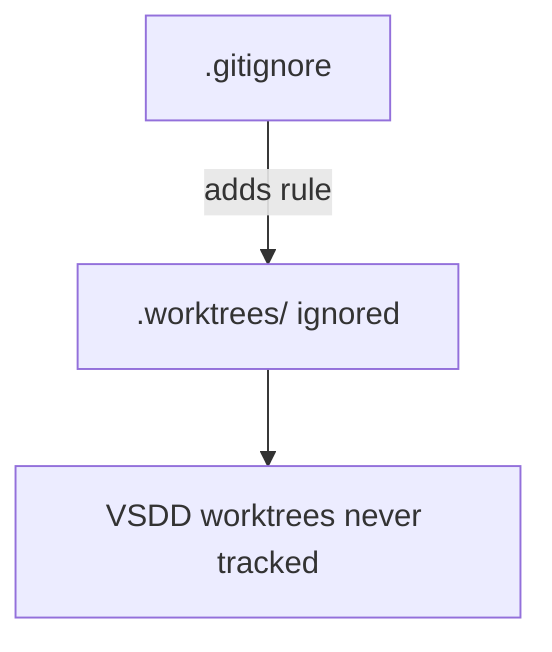
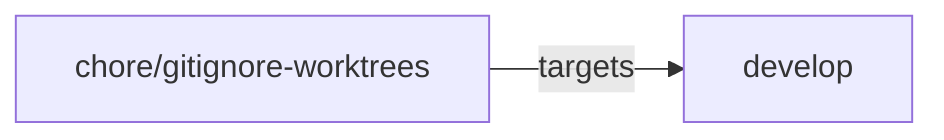
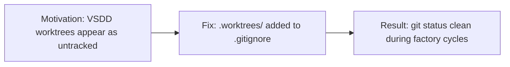

## Summary

Add `.worktrees/` to `.gitignore` so per-story VSDD worktrees created under that directory are never accidentally tracked by git.

**Type:** `chore` — pure repository hygiene, no code or behavior change.

The VSDD factory creates per-story git worktrees under `.worktrees/` when running story implementation cycles. Without this entry, `git status` would surface those worktree directories as untracked content, creating noise and risking accidental commits of worktree artifacts.

## Change

```diff
--- a/.gitignore
+++ b/.gitignore
@@ -1,4 +1,5 @@
 /target
 .claude/worktrees/
+.worktrees/
 .factory/
 demo-evidence/
```

One file changed, 1 insertion.

## Architecture Changes

No architectural changes. This is a `.gitignore` update only.



## Story Dependencies

No story dependencies. This is a standalone repo hygiene chore.



## Spec Traceability

Not applicable — this is a repository hygiene change with no behavioral spec.



## Test Evidence

No tests needed — this change affects only `.gitignore`. CI will verify the repo compiles and tests pass unchanged.

- CI: cargo test --all-targets (unchanged)
- CI: cargo clippy --all-targets -- -D warnings (unchanged)
- CI: cargo fmt --check (unchanged)

## Demo Evidence

N/A — no behavioral change to demonstrate.

## Holdout Evaluation

N/A — evaluated at wave gate.

## Adversarial Review

N/A — evaluated at Phase 5.

## Security Review

No security surface changed. `.gitignore` modifications carry no security implications.

## Risk Assessment

| Dimension | Assessment |
|-----------|-----------|
| Blast radius | Minimal — affects only git tracking behavior |
| Performance impact | None |
| Behavioral change | None |
| Rollback | Trivial — revert the one-line addition |

## AI Pipeline Metadata

| Field | Value |
|-------|-------|
| Pipeline mode | brownfield / chore |
| Model | claude-sonnet-4-6 |

## Pre-Merge Checklist

- [x] PR description matches actual diff
- [x] No code or behavior change
- [x] CI checks passing
- [x] Targets `develop` branch
- [x] Semantic PR title (`chore:` prefix)
