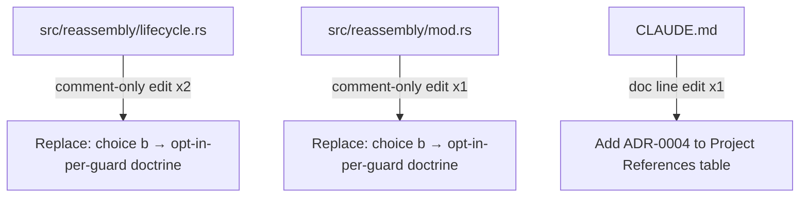
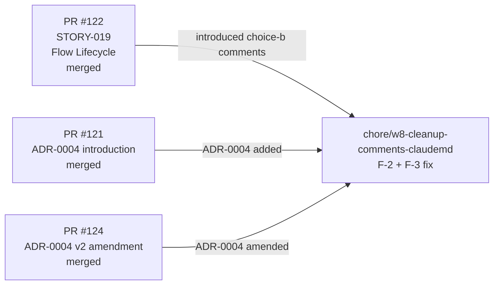
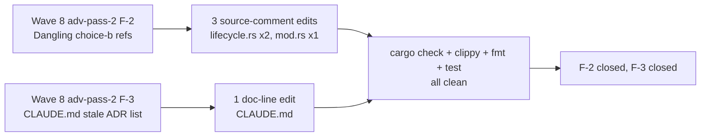

## Summary

Wave 8 wave-level adversarial pass-2 chore: fix two LOW findings (F-2 + F-3) — dangling "(choice (b))" source-comment references and a stale CLAUDE.md ADR enumeration. Comments only + one doc line; zero behavior change.

**Wave:** 8 (wave-level adv pass-2 findings F-2 + F-3)
**Story:** CHORE — align test-seam comments + CLAUDE.md ADR list (Wave 8 F-2/F-3)
**Closes:** Wave 8 wave-level adv-pass-2 F-2, F-3
**Refs:** STORY-019 (PR #122 — original "(choice (b))" introduction), PR #121 + PR #124 (ADR-0004 introduction + amendments)

---

## Architecture Changes

**Changes (all non-behavioral):**
1. `src/reassembly/lifecycle.rs` — two doc-comment edits replacing `(choice (b) per the ADR-0004 amendment opt-in-per-guard rationale)` / `choice (b)` with `opt-in-per-guard doctrine` to match actual ADR-0004 amendment vocabulary.
2. `src/reassembly/mod.rs` — one inline comment edit replacing `ADR-0004 amendment, choice (b)` with `ADR-0004 amendment, opt-in-per-guard doctrine`.
3. `CLAUDE.md` — one-line update appending `0004 process-wide warning atomics` to the ADR enumeration in the Project References table.

**Production behavior:** byte-identical to develop at all three paths. No code logic touched.

---

## Story Dependencies

**depends_on:** PR #122 merged, PR #121 merged, PR #124 merged — all upstream merged.
**blocks:** nothing downstream.

---

## Spec Traceability

**Finding F-2:** Three source-code comments in `src/reassembly/{lifecycle,mod}.rs` referenced `(choice (b))` but ADR-0004 amendments never enumerate lettered choices — they use "opt-in per-guard" prose. Dangling reference introduced in STORY-019 PR #122.

**Finding F-3:** `CLAUDE.md` Project References table enumerated ADRs 0001/0002/0003 but omitted ADR 0004 (introduced Wave 7 PR #121, amended Wave 8 PR #124). Onboarding doc stale.

---

## Test Evidence

| Metric | Value |
|--------|-------|
| Files changed | 3 (CLAUDE.md, lifecycle.rs, mod.rs) |
| Insertions | 4 |
| Deletions | 4 |
| Behavior change | None |
| `cargo check` | Clean |
| `cargo clippy --all-targets -- -D warnings` | Clean |
| `cargo fmt --check` | Clean |
| `cargo test --all-targets` | Clean (all existing tests pass) |

No new tests required — this is comments-only + one doc line.

---

## Holdout Evaluation

N/A — evaluated at wave gate.

---

## Adversarial Review

Wave 8 wave-level adversarial pass-2 surfaced these findings. This PR addresses both:
- **F-2 (LOW):** Dangling `(choice (b))` references in source comments — fixed by replacing with `opt-in-per-guard doctrine`.
- **F-3 (LOW):** CLAUDE.md ADR enumeration missing ADR-0004 — fixed by adding `0004 process-wide warning atomics`.

---

## Security Review

No security-relevant surface changes. Changes are documentation comments and a project-reference doc line only. No unsafe code. No I/O paths. No behavior change to any production logic. Zero new API surface.

---

## Risk Assessment

| Dimension | Assessment |
|-----------|------------|
| Blast radius | Minimal — comments + doc line only |
| Behavior change | None |
| Performance impact | None |
| API stability | Unchanged |
| Rollback risk | Trivial — 4-line revert |

---

## AI Pipeline Metadata

| Field | Value |
|-------|-------|
| Pipeline mode | wave-level adversarial chore |
| Story wave | Wave 8 |
| Finding source | Wave 8 adv pass-2 F-2 + F-3 |
| Models used | claude-sonnet-4-6 |
| Implementation strategy | comments-only + 1 doc line |

---

## Demo Evidence

N/A — no executable acceptance criteria. This is a comment/doc cleanup chore. All original STORY-019 demo evidence (4 VHS tapes + 8 renderings) remains in `.factory/cycles/wave-8-story-019/demos/` (gitignored, local-only).

---

## Pre-Merge Checklist

- [x] PR description matches actual diff (3 files: CLAUDE.md, lifecycle.rs, mod.rs — 4 insertions, 4 deletions)
- [x] No ACs to cover — chore findings F-2 + F-3 close with comment edits
- [x] Traceability chain complete (F-2 → 3 comment edits; F-3 → 1 doc-line edit)
- [x] Demo evidence: N/A for comment-only chore
- [x] No .factory/ artifacts in PR (gitignored)
- [x] Semantic PR title: `chore(reassembly): align test-seam comments + CLAUDE.md ADR list (Wave 8 F-2/F-3)` — `chore` is in allowed types
- [x] No unsafe code
- [x] No behavior changes (production logic byte-identical to develop)
- [x] Dependency PRs merged (PR #122 STORY-019, PR #121 ADR-0004, PR #124 ADR-0004-v2)
- [ ] CI passing
- [ ] pr-reviewer approval
- [ ] Squash-merged to develop
