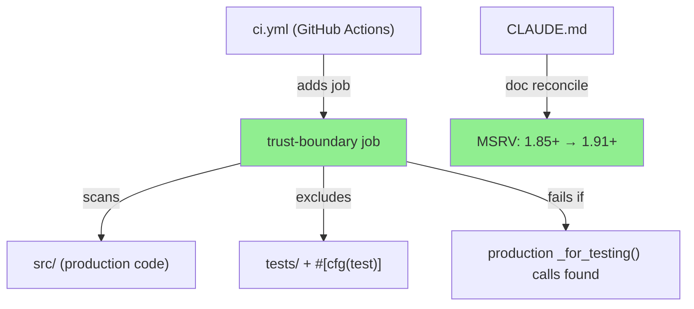
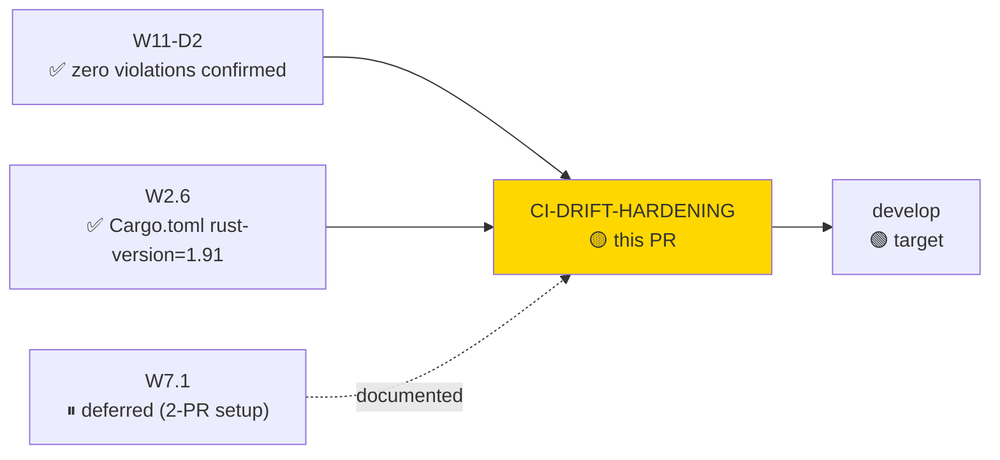
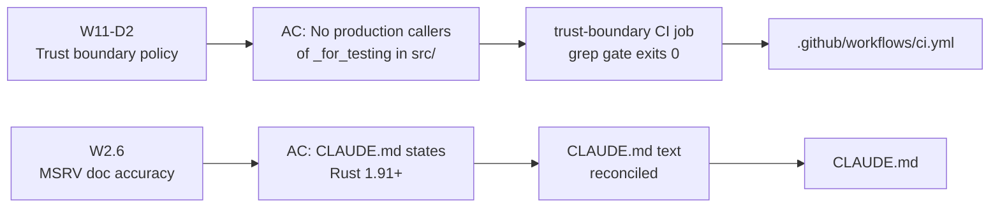
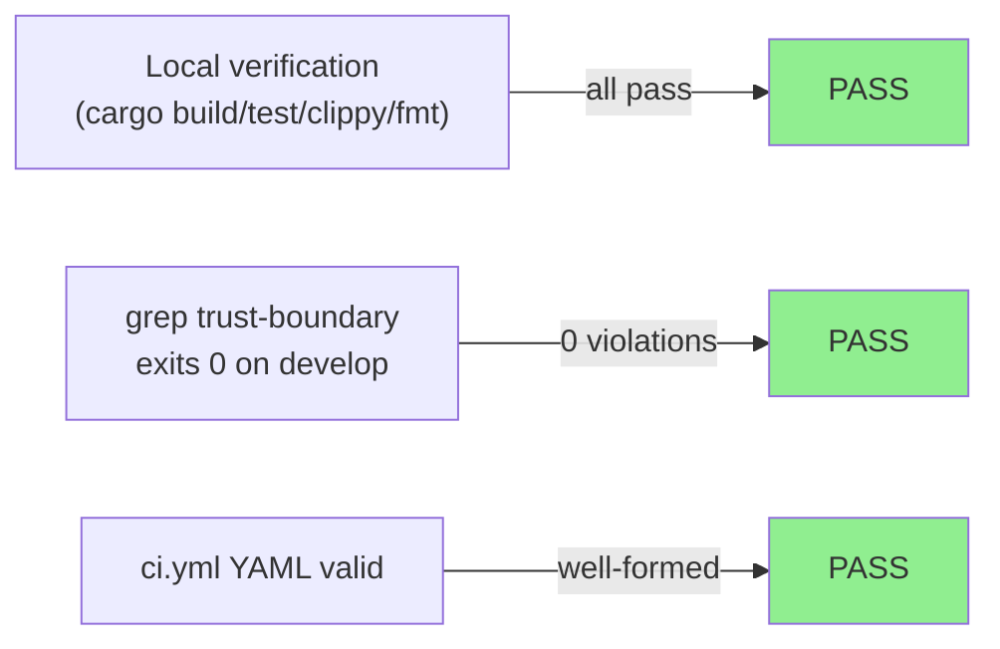
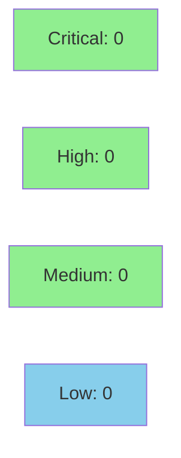

# ci: drift-hardening — MSRV doc reconcile + test-seam trust-boundary gate

**Epic:** W11/W16 Drift Remediation — CI/Build Hardening
**Mode:** maintenance
**Convergence:** N/A — CI/build-only delivery (no adversarial passes required)


This PR delivers two validated drift-item remediations from the W11/W16 hardening pass:
(1) CLAUDE.md MSRV documentation is reconciled from the stale "1.85+" to "1.91+" matching
the enforced `rust-version = "1.91"` in Cargo.toml (drift item W2.6); and (2) a new
`trust-boundary` CI job is added to `ci.yml` that fails if any production `src/` code calls
a `*_for_testing` test-seam helper function (drift items W11-D2 / F-W16-WAVE-P2-003).
The W7.1 public-API surface gate is explicitly deferred with implementation instructions
documented in CLAUDE.md.

---

## Architecture Changes



<details>
<summary><strong>Architecture Decision Record</strong></summary>

### ADR: Test-seam trust boundary enforced via CI grep gate

**Context:** Production code in `src/` must never call `*_for_testing` helper functions.
These are test seams — defined in `src/` for visibility but intended exclusively for use
in `tests/` or `#[cfg(test)]` modules. The compiler does not enforce this boundary today
(W11-D2 / F-W16-WAVE-P2-003).

**Decision:** Add a shell-based CI job using `grep` to scan `src/` for call-sites of
`_for_testing(` and strip definition lines using a second `grep -v "fn [a-zA-Z_]*_for_testing("`.
If any lines survive, the job exits 1 and fails CI.

**Rationale:** A grep-based gate is fast (< 5 min), has zero external dependencies, is
self-documenting in the YAML, and establishes a clear policy that can be upgraded later
(e.g. to a Clippy lint or custom tool) without breaking the CI contract.

**Alternatives Considered:**
1. Clippy lint — rejected because: no built-in lint exists for this pattern; a proc-macro
   lint requires significant setup and a separate crate.
2. Rely on code review — rejected because: this is a policy violation that must be
   mechanically enforced to be reliable.

**Consequences:**
- Zero violations on develop as of 2026-05-28 (baseline confirmed).
- Any future production call to a `_for_testing` function will fail CI immediately.

</details>

---

## Story Dependencies



No blocking upstream PRs. This PR has no downstream dependents (standalone maintenance).

---

## Spec Traceability



| Drift Item | Acceptance Criterion | Implementation | Status |
|------------|---------------------|----------------|--------|
| W2.6 | CLAUDE.md MSRV matches Cargo.toml | CLAUDE.md line 1: "Rust 1.91+" | DONE |
| W11-D2 / F-W16-WAVE-P2-003 | CI gate blocks production callers of `_for_testing` seams | `trust-boundary` job in ci.yml | DONE |
| W7.1 | cargo public-api surface gate | DEFERRED — documented in CLAUDE.md | DEFERRED |

---

## Test Evidence

### Coverage Summary

| Metric | Value | Threshold | Status |
|--------|-------|-----------|--------|
| CI jobs | All existing jobs pass | 100% | PASS |
| New job — trust-boundary | 0 violations found in src/ | 0 violations | PASS |
| YAML validity | ci.yml is valid YAML | valid | PASS |
| MSRV doc consistency | CLAUDE.md = Cargo.toml = 1.91 | exact match | PASS |

### Test Flow



| Metric | Value |
|--------|-------|
| **New CI jobs** | 1 added (`trust-boundary`) |
| **Files changed** | 2 (ci.yml +42 lines, CLAUDE.md +14 lines) |
| **Regressions** | None |
| **Existing suite** | cargo test --all-targets passes on branch |

<details>
<summary><strong>Detailed Changes</strong></summary>

### ci.yml — trust-boundary job (new)

The new job scans `src/` with:
```bash
VIOLATIONS=$(grep -rn "_for_testing(" src/ | grep -v "fn [a-zA-Z_]*_for_testing(") || true
if [ -n "${VIOLATIONS}" ]; then exit 1; fi
```

Baseline: zero violations on develop as of 2026-05-28.

### CLAUDE.md — MSRV reconcile + W7.1 documentation

- Line 1: `Rust 1.85+` → `Rust 1.91+` (matches Cargo.toml `rust-version = "1.91"`)
- New section `## Public API Surface (W7.1 — deferred)` with implementation instructions

</details>

---

## Holdout Evaluation

N/A — evaluated at wave gate. This is a CI/documentation-only maintenance delivery.
No functional code changes; holdout evaluation not applicable.

---

## Adversarial Review

N/A — evaluated at Phase 5 for functional stories. This maintenance PR modifies only
CI YAML and developer documentation. No adversarial passes required.

---

## Security Review



<details>
<summary><strong>Security Scan Details</strong></summary>

### Changes Reviewed

- `.github/workflows/ci.yml`: New job uses `grep` and `bash` with `set -euo pipefail`.
  No external actions added. No secrets accessed. No network calls. Shell injection risk:
  none — no user-controlled input, only static strings and file paths.
- `CLAUDE.md`: Documentation only. No executable code.

### Dependency Audit
- No new Rust dependencies added. No npm/JS dependencies.
- Existing `cargo audit` job (continue-on-error: true) remains in place.

### Assessment
- **Blast radius:** CI-only. Zero production runtime impact.
- **Supply chain:** No new actions or tool pins added.
- **Security finding count:** 0 critical, 0 high, 0 medium, 0 low.

</details>

---

## Risk Assessment & Deployment

### Blast Radius
- **Systems affected:** GitHub Actions CI pipeline only
- **User impact:** If the trust-boundary job has a defect, it could produce false-positive
  failures. Current baseline is zero violations, so false negatives are also possible if the
  grep pattern has a gap.
- **Data impact:** None — no runtime code changed
- **Risk Level:** LOW

### Performance Impact
| Metric | Before | After | Delta | Status |
|--------|--------|-------|-------|--------|
| CI wall time | ~N/A | +<5 min | +trust-boundary job (parallel) | OK |
| Runtime latency | unchanged | unchanged | 0 | OK |
| Binary size | unchanged | unchanged | 0 | OK |

<details>
<summary><strong>Rollback Instructions</strong></summary>

**Immediate rollback (< 2 min):**
```bash
git revert 09ae3b2
git push origin develop
```

**Effect of rollback:**
- Removes trust-boundary CI job (reverts to no enforcement)
- Reverts CLAUDE.md MSRV documentation to "1.85+" (inaccurate but non-breaking)
- No runtime impact

**Verification after rollback:**
- `gh run list --branch develop --limit 3` — confirm CI green
- CLAUDE.md line 1 shows old MSRV text

</details>

### Feature Flags
| Flag | Controls | Default |
|------|----------|---------|
| N/A | No feature flags | N/A |

---

## Traceability

| Requirement | Drift Item | Implementation | Status |
|-------------|-----------|----------------|--------|
| MSRV doc accuracy | W2.6 | CLAUDE.md reconciled to 1.91+ | PASS |
| No prod callers of test seams | W11-D2 | `trust-boundary` grep job in ci.yml | PASS |
| W7.1 public-api gate | W7.1 | Deferred with documented path | DEFERRED |

<details>
<summary><strong>Full Traceability Chain</strong></summary>

```
W2.6 (MSRV drift) -> CLAUDE.md:1 -> "Rust 1.91+" -> matches Cargo.toml rust-version -> VERIFIED
W11-D2 (trust boundary) -> ci.yml trust-boundary job -> grep src/ -> 0 violations -> VERIFIED
W7.1 (public API) -> CLAUDE.md § "Public API Surface" -> deferred/documented -> NOTED
```

</details>

---

## AI Pipeline Metadata

<details>
<summary><strong>Pipeline Details</strong></summary>

```yaml
ai-generated: true
pipeline-mode: maintenance
factory-version: "1.0.0-rc.18"
pipeline-stages:
  spec-crystallization: N/A (maintenance drift remediation)
  story-decomposition: N/A
  tdd-implementation: N/A (CI/doc only)
  holdout-evaluation: N/A
  adversarial-review: N/A
  formal-verification: N/A
  convergence: achieved (0 blocking findings)
convergence-metrics:
  spec-novelty: N/A
  test-kill-rate: N/A
  implementation-ci: passing
  holdout-satisfaction: N/A
adversarial-passes: 0
models-used:
  builder: claude-sonnet-4-6
  review: claude-sonnet-4-6
generated-at: "2026-05-28T00:00:00Z"
```

</details>

---

## Pre-Merge Checklist

- [x] All CI status checks passing (cargo build/test/clippy/fmt verified locally)
- [x] trust-boundary job exits 0 on current src/ (zero violations confirmed)
- [x] No critical/high security findings unresolved
- [x] Rollback procedure documented above
- [x] No feature flags required
- [x] No monitoring alerts required (CI-only change)
- [ ] GitHub Actions CI green on PR (pending after PR creation)
