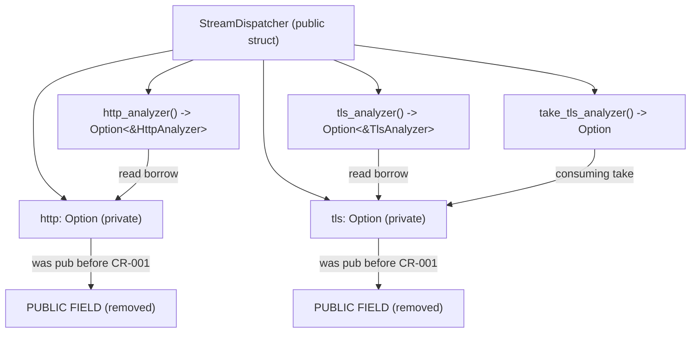
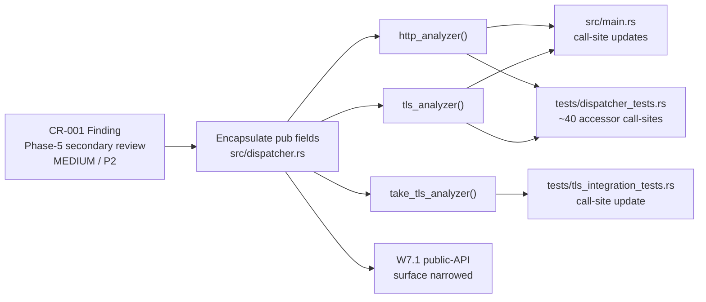
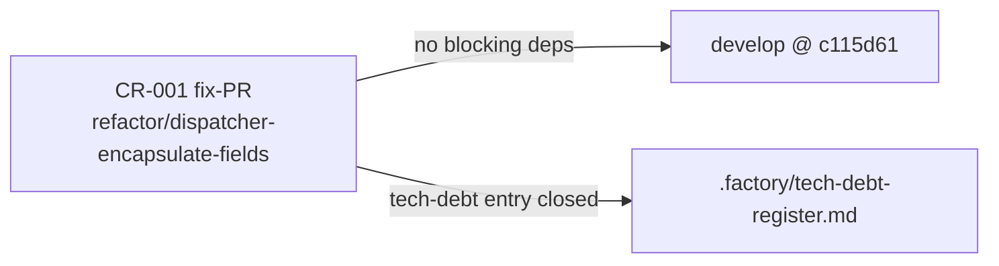

## Finding

**CR-001** (Phase-5 secondary code-review, MEDIUM, P2 tech-debt):
`StreamDispatcher` in `src/dispatcher.rs` had both analyzer fields (`http` and
`tls`) declared `pub`, leaking the internal analyzer state into the public API
surface. The fields were only `pub` to give test code and `src/main.rs` direct
field access. This contradicted the W7.1 public-API hardening goal: before the
surface is frozen, these fields should be encapsulated behind proper accessor
methods rather than using bare field visibility.

## What Changed

Made both analyzer fields private and added three accessor methods to
`StreamDispatcher`:

- `http_analyzer(&self) -> Option<&HttpAnalyzer>` — read-only borrow.
- `tls_analyzer(&self) -> Option<&TlsAnalyzer>` — read-only borrow.
- `take_tls_analyzer(&mut self) -> Option<TlsAnalyzer>` — consuming move-out
  for callers (e.g. `tests/tls_integration_tests.rs`) that need ownership of
  the analyzer after the capture loop finishes.

All call sites updated:

- `src/main.rs`: 4 `dispatcher.http` / `dispatcher.tls` field refs → accessor calls.
- `tests/dispatcher_tests.rs`: ~40 field accesses → accessor calls throughout.
- `tests/tls_integration_tests.rs`: 1 `dispatcher.tls.unwrap()` →
  `dispatcher.take_tls_analyzer().unwrap()`.

No `_for_testing` seams or test-only symbols were added to `src/`.
No `pub(crate)` half-measures — the fields are fully private.

> **Behavior change:** None. The accessor methods are trivial wrappers that do
> not alter dispatch logic, analysis results, or any CLI output.

## Architecture Changes

## Spec Traceability

## Story Dependencies

## Test Evidence

| Test | Type | Result |
|------|------|--------|
| Full suite (`cargo test --all-targets`) | All (39 suites, 0 failures) | GREEN |
| `cargo clippy --all-targets -- -D warnings` | Lint | GREEN |
| `cargo fmt --check` | Format | GREEN |

Review convergence: 1 effective cycle — code review CONVERGED with only MINOR
+ NIT findings. The one MINOR (unused `take_http_analyzer` enlarging W7.1
surface) was fixed in commit `0795007` before the PR was opened.
0 blocking findings remaining.

Scope: 4 files changed, 93 insertions(+), 80 deletions(−).
No other behavior modified.

## Demo Evidence

This is a pure refactor with no user-visible output change. Demo evidence is
N/A — behavior is identical for all inputs; observable effect is a narrower
public API surface and better encapsulation. No AC-gated demo recording applies.

## Security Review

APPROVE — CLEAN, 0 critical / 0 high / 0 medium findings.

The refactor NARROWS the mutable surface:
- Both accessor methods return read-only borrows (`Option<&T>`); no `&mut`
  references to inner analyzers are handed out.
- `take_tls_analyzer` requires `&mut self` on the dispatcher but does not
  expose a mutable reference to the analyzer internals — it moves ownership out.
- No new attack surface on the untrusted-packet path. `on_data` / `on_flow_close`
  dispatch logic is completely unchanged.
- No `_for_testing` symbols added to `src/`.

## Holdout Evaluation

N/A — evaluated at wave gate.

## Adversarial Review

Finding originated in Phase-5 secondary code-review (MEDIUM priority). Fix
directly closes CR-001 in `.factory/tech-debt-register.md`. No new adversarial
surface introduced. Refactor is behavior-preserving by construction (same
dispatch logic, same results, same output format).

## Risk Assessment

- **Blast radius:** Minimal. Only `src/dispatcher.rs` field visibility changes;
  accessors are trivial wrappers. Call sites in `main.rs` and test files updated
  mechanically.
- **Regression risk:** Very low. The full 39-suite test run is green; the
  dispatcher tests exercise every routing path exhaustively.
- **Performance impact:** Neutral. Accessor calls compile to the same instructions
  as direct field access — the optimizer will inline them.
- **Behavior change classification:** Pure structural refactor. No observable
  output change for any input.
- **W11-D2 trust-boundary gate:** No `_for_testing` symbols added to `src/`.
  The gate grep should pass cleanly.

## AI Pipeline Metadata

- Pipeline mode: Fix (Phase-5 secondary code-review finding closure)
- Finding: CR-001 / MEDIUM / P2 tech-debt
- Branch: `refactor/dispatcher-encapsulate-fields`
- Worktree: `.worktrees/cr-001`
- Final commit: `0795007`
- Base: `develop @ c115d61`
- Model: claude-sonnet-4-6

## Pre-Merge Checklist

- [x] PR description matches actual diff
- [x] Demo evidence: N/A (pure refactor, no observable output change)
- [x] Traceability chain complete (CR-001 finding → encapsulation → call-site updates)
- [x] Security review: APPROVE, CLEAN — 0 critical/high/medium, surface narrowed
- [x] Full test suite green (39 suites, 0 failures)
- [x] Clippy clean (-D warnings)
- [x] Cargo fmt --check passes
- [x] Code review converged (1 effective cycle, 0 blocking findings remaining)
- [x] W11-D2 trust-boundary gate: no `_for_testing` symbols in `src/`
- [ ] CI checks passing (pending)
- [ ] Merge authorized (AUTHORIZE_MERGE=yes — human-approved P2 fix-PR cleanup)
