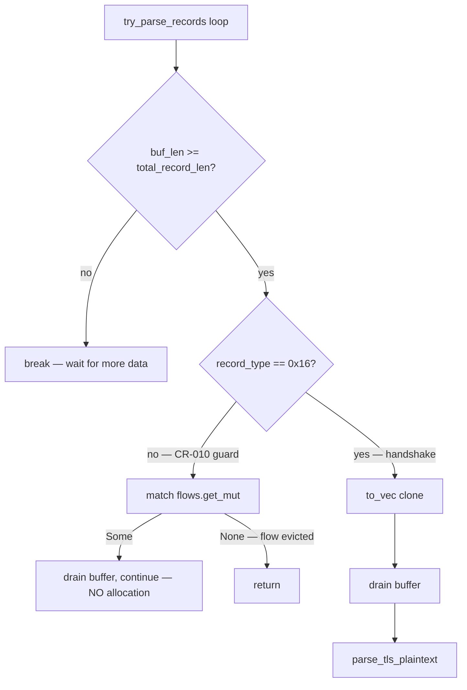
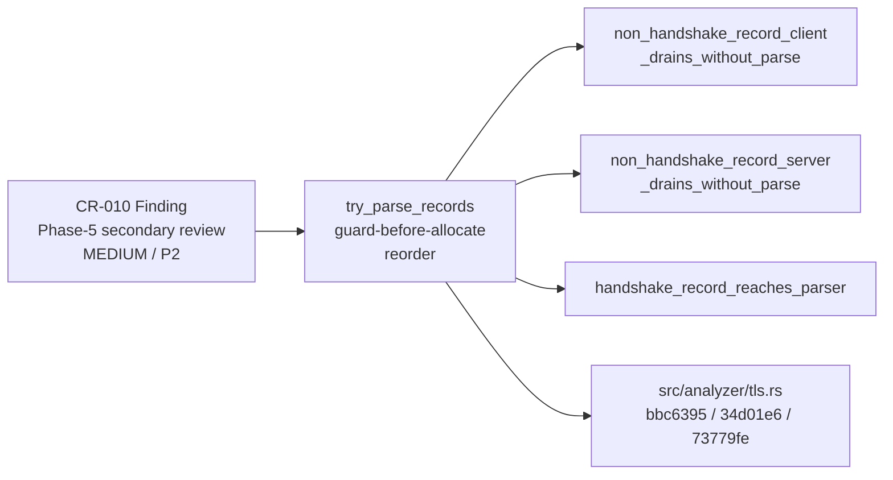
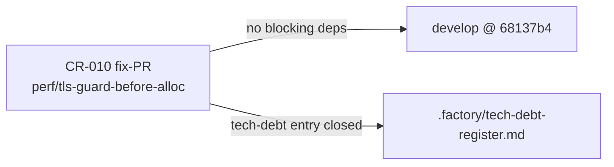

## Finding

**CR-010** (Phase-5 secondary code-review, MEDIUM, P2 tech-debt):
`src/analyzer/tls.rs::try_parse_records` was allocating record byte-slices
(`.to_vec()`) **before** the `0x16` handshake content-type guard fired. On
long-lived sessions or adversarial/non-TLS floods, every non-handshake record
(ChangeCipherSpec `0x14`, Alert `0x15`, ApplicationData `0x17`, unknown `0x00`,
etc.) incurred a per-record heap allocation that was immediately discarded.
Behavior was byte-identical for valid TLS sessions; only unnecessary allocations
were produced.

## What Changed

Reordered `try_parse_records` so the `0x16` content-type guard fires
**before** the `to_vec()` clone:

- Non-`0x16` records now drain the buffer and `continue` without any heap
  allocation.
- The `Vec<u8>` clone is reached only for the handshake (`0x16`) fast path,
  which is the only path that needs parsed bytes.
- The drain in the non-`0x16` branch uses an explicit `match` on `get_mut`
  rather than `if let` — a `None` (flow evicted by an earlier `on_flow_close`)
  now returns instead of continuing, eliminating the fragile reliance on the
  next iteration catching a non-advancing loop (MAJOR finding in code review
  Pass 1).

Two review passes reached convergence. Three new regression tests added:
- `non_handshake_record_client_drains_without_parse`
- `non_handshake_record_server_drains_without_parse`
- `handshake_record_reaches_parser`

> **Behavior change:** None for valid TLS. All records still drained from the
> buffer in the same order. Only the redundant per-record allocation is
> eliminated for the non-handshake fast path.

## Architecture Changes

## Spec Traceability

## Story Dependencies

## Test Evidence

| Test | Type | Direction | Result |
|------|------|-----------|--------|
| `non_handshake_record_client_drains_without_parse` | Unit | ClientToServer | GREEN |
| `non_handshake_record_server_drains_without_parse` | Unit | ServerToClient | GREEN |
| `handshake_record_reaches_parser` | Unit | ClientToServer | GREEN |
| Full suite (`cargo test --all-targets`) | All (115 unit + 4 integration) | — | GREEN |
| `cargo clippy --all-targets -- -D warnings` | Lint | — | GREEN |
| `cargo fmt --check` | Format | — | GREEN |

Scope: 1 file changed, 188 insertions(+), 6 deletions(−). No other behavior
modified.

Review convergence: 2 cycles (Pass 1 → 1 MAJOR + 3 MINOR/NIT → fixed in
34d01e6; Pass 2 → 2 NITs → fixed in 73779fe → CONVERGED, 0 blocking findings).

## Demo Evidence

This is a pure hot-path micro-optimization with no user-visible output change.
Demo evidence is N/A — behavior is byte-identical for valid TLS streams;
observable effect is reduced heap allocation under adversarial/non-TLS flood
traffic, which is a runtime performance property, not a functional output.
No AC-gated demo recording applies.

## Security Review

APPROVE — 0 critical / 0 high / 0 medium findings.

5 LOW / informational findings identified (all pre-existing, not introduced
by this PR):

| Finding | CWE | Status |
|---------|-----|--------|
| Integer overflow on `total_record_len` | CWE-190 | Pre-existing; `MAX_BUF` + `MAX_RECORD_PAYLOAD` bounds guard fires before drain |
| Out-of-bounds drain on corrupt length field | CWE-125 | Pre-existing; `buf_len < total_record_len` guard fires before drain |
| Unbounded buffer growth on adversarial input | CWE-400 | Pre-existing; `MAX_BUF` truncation guard in place |
| No TLS record authentication | CWE-693 | Informational; analyzer is read-only / passive |
| HashMap insertion without capacity bound | CWE-400 | Pre-existing; `MAX_MAP_ENTRIES` guard in place |

All guards confirmed firing **before** the new `0x16` guard branch. No new
attack surface introduced. The guard reorder does not change the execution path
for any malformed or adversarial record — the existing bound checks remain the
first line of defense.

## Holdout Evaluation

N/A — evaluated at wave gate.

## Adversarial Review

Finding originated in Phase-5 secondary code-review (MEDIUM priority). Fix
directly closes CR-010 in `.factory/tech-debt-register.md`. No new adversarial
surface introduced.

## Risk Assessment

- **Blast radius:** Minimal. Only the non-handshake record path in
  `try_parse_records` is affected. All handshake records, all other analyzers,
  all CLI flags, and all output formats are unchanged.
- **Regression risk:** Low. Three new focused regression tests cover the
  guard boundary. Full suite (119 tests) green.
- **Performance impact:** Positive — eliminates per-packet heap allocation on
  non-handshake records. On adversarial/non-TLS floods this removes O(n)
  allocations where n = non-handshake record count per session.
- **Behavior change classification:** Pure internal optimization. No observable
  output change for any input that produces valid TLS analysis.

## AI Pipeline Metadata

- Pipeline mode: Fix (Phase-5 secondary code-review finding closure)
- Finding: CR-010 / MEDIUM / P2 tech-debt
- Branch: `perf/tls-guard-before-alloc`
- Worktree: `.worktrees/perf-tls-guard-before-alloc`
- Final commit: `73779fe`
- Base: `develop @ 68137b4`
- Model: claude-sonnet-4-6

## Pre-Merge Checklist

- [x] PR description matches actual diff
- [x] Demo evidence: N/A (pure optimization, no observable output change)
- [x] Traceability chain complete (CR-010 finding → guard reorder → regression tests)
- [x] Security review: APPROVE, 0 critical/high/medium
- [x] Full test suite green (119 tests, 0 failures)
- [x] Clippy clean (-D warnings)
- [x] Cargo fmt --check passes
- [x] Code review converged (2 cycles, 0 blocking findings remaining)
- [ ] CI checks passing (pending)
- [ ] Merge authorized (AUTHORIZE_MERGE=yes — human-approved fix-PR cleanup)
