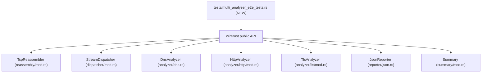
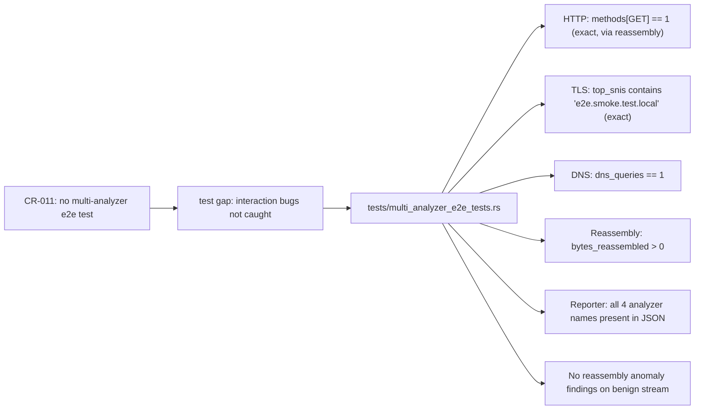
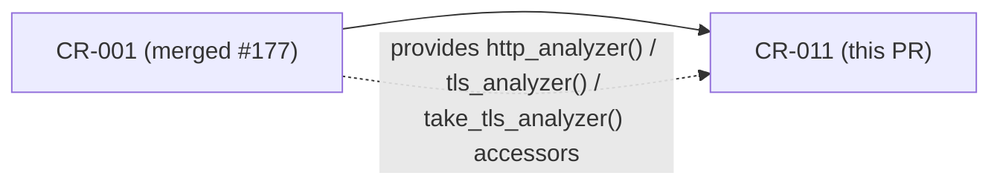

## Summary

Adds the first multi-analyzer end-to-end smoke test (`tests/multi_analyzer_e2e_tests.rs`) that drives a single synthetic packet stream through HTTP + TLS + DNS + TCP reassembly + reporter together and asserts on the final aggregated JSON output. Closes CR-011 — the test gap where only narrower per-analyzer/integration tests existed.

**Test-only change — no `src/` modifications.**

## What This PR Delivers (CR-011)

| Field | Value |
|-------|-------|
| Debt ID | CR-011 |
| Priority | P2 |
| Type | fix-pr-delivery (Phase-5 secondary review finding) |
| Branch | `test/multi-analyzer-e2e` |
| Base commit | `02e9c00` (develop) |
| Final commit | `d1ee45e` |
| Review cycles | 3 (converged: 0 blocking findings) |

## Architecture Changes

No `src/` changes. A single new integration test file is added:

## Spec Traceability

## Story Dependencies

CR-001 was merged in PR #177 and is a prerequisite: the test uses the `http_analyzer()`, `tls_analyzer()`, and `take_tls_analyzer()` CR-001 accessors exclusively — no direct field access.

## What the Test Exercises

The single test `test_cr011_multi_analyzer_http_tls_dns_reassembly_reporter_e2e`:

1. **HTTP via reassembly** — TCP flow (client:49100 → server:80). A `GET /smoke-test HTTP/1.1` request is split across **two TCP segments** (segment A: headers line + Host partial; segment B: Host remainder + CRLF pair). The reassembler delivers each contiguous prefix to `HttpAnalyzer`; `httparse` returns `Partial` on A and `Complete` on B. Flow closes via `CloseReason::Fin` (compact monotonic timestamps keep it within the 300-second idle window).

2. **TLS ClientHello** — TCP flow (client:49101 → server:443). One complete TLS 1.2 ClientHello record with SNI `e2e.smoke.test.local`. Uses the same builder pattern as `tls_analyzer_tests.rs`.

3. **DNS query (packet-level)** — UDP packet (client:12345 → server:53). Minimal 12-byte DNS query (QR=0, QDCOUNT=1). `DnsAnalyzer.analyze()` classifies and counts it; no findings emitted (BC-2.08.004).

4. **Reporter aggregation** — All four analyzer summaries collected and rendered via `JsonReporter`. All assertions target the final JSON output surface.

5. **Falsifiability** — the test would fail in >= 5 independent ways if any analyzer stopped contributing:
   - `methods["GET"] == 1` (exact; would fail on 0 or 2)
   - SNI exact string equality `==` (not substring)
   - `dns_queries == 1`
   - `bytes_reassembled > 0`
   - `reassembler.findings().is_empty()` on the benign stream
   - all four analyzer names present in the JSON array

## Test Evidence

| Gate | Result |
|------|--------|
| `cargo fmt --check` | PASS |
| `cargo clippy --all-targets -- -D warnings` | PASS |
| `cargo test --all-targets` | PASS (40 suites, 0 failures) |
| New test `test_cr011_multi_analyzer_...` | PASS |

## Review Convergence

| Cycle | Findings | Blocking (CRITICAL/HIGH/MAJOR) | Fixed | Status |
|-------|----------|-------------------------------|-------|--------|
| 1 | 4 | 2 MAJOR | 4 | Resolved |
| 2 | 2 | 1 MEDIUM + 1 LOW | 2 | Resolved |
| 3 | 0 | 0 | — | APPROVE |

**Pass 1 findings (both MAJOR fixed):**
- MAJOR-1: HTTP flow was closing via idle-timeout rather than FIN due to a ~1,000,000-second timestamp gap in `make_tcp_packet`. Fixed by using compact monotonic timestamps (1, 2, 3, …).
- MAJOR-2: `summary.ingest()` not called on all packets (missing DNS and TLS packets). Fixed by adding `summary.ingest()` on every packet, mirroring `run_analyze()`.

**Pass 2 findings (both addressed):**
- MEDIUM: Hardcoded TLS FIN seq `5100` was wrong — should be `5000 + tls_hello_len`. Fixed with computed seq number.
- LOW: DNS findings not extended into `all_findings`. Fixed by extending immediately at the packet-processing site (isomorphic with `run_analyze()`).

**Pass 3:** 0 findings. APPROVE.

## Security Review

N/A — test-only change. No production code (`src/`) modified. No new dependencies. No network calls, file I/O, or external surfaces introduced. Test uses only synthetic in-memory packets.

## Risk Assessment

| Dimension | Assessment |
|-----------|-----------|
| Blast radius | Zero — test-only, no `src/` changes |
| Performance impact | None — test file only |
| Rollback complexity | Delete test file |
| CI risk | Low — trust-boundary gate (W11-D2) greps `src/`; no `src/` changes here |

## AI Pipeline Metadata

| Field | Value |
|-------|-------|
| Pipeline mode | fix-pr-delivery (P2 tech-debt) |
| Review cycles | 3 |
| Approach | Phase-5 secondary code review finding → implementation → review convergence |

## Pre-Merge Checklist

- [x] PR description populated from template
- [x] Demo evidence: N/A (test-only; no UX/CLI output to record)
- [x] Security review: N/A (test-only, no production code)
- [x] Review converged: 0 blocking findings after 3 cycles
- [x] CI gates passing: fmt, clippy, test all green
- [x] Dependency PR #177 (CR-001) merged before this PR
- [x] Squash-merge authorized (3-commit branch → 1 clean commit on develop)
- [x] Post-merge: mark CR-011 CLOSED in `.factory/tech-debt-register.md`
