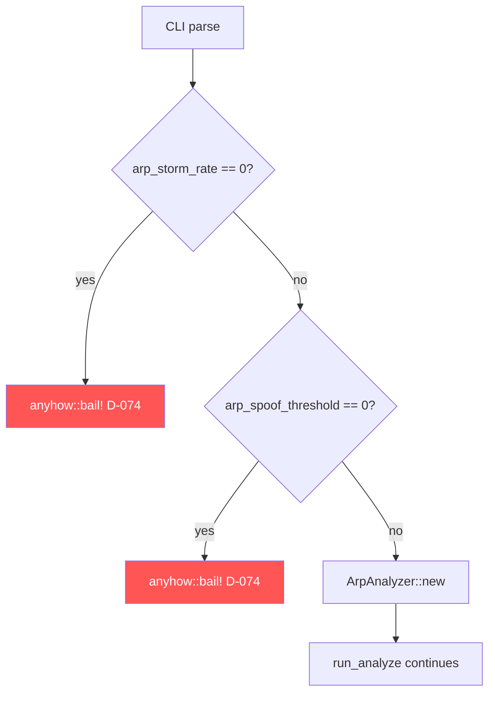
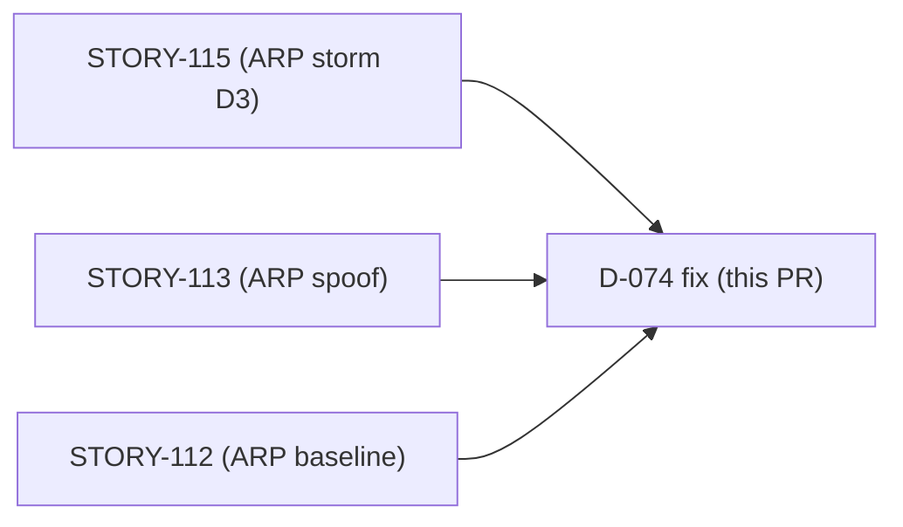
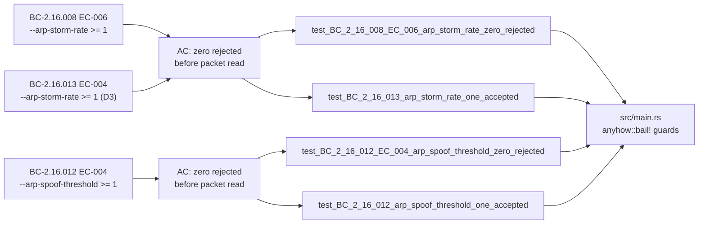

## Summary

Reject `--arp-storm-rate 0` and `--arp-spoof-threshold 0` with a fatal CLI
error before any packet processing begins. Mirrors the existing modbus
threshold guards (BC-2.14.024 P3a/P3b). Fixes finding F-ARP-F4P1-001,
implements decision D-074.

## Finding & Decision

| Field | Value |
|-------|-------|
| Finding | F-ARP-F4P1-001 (F4 convergence-remediation) |
| Decision | D-074 |
| Root cause | `--arp-storm-rate 0` and `--arp-spoof-threshold 0` were accepted by the CLI, allowing the ARP analyzer to operate with degenerate zero thresholds |
| Fix | Two `anyhow::bail!` guards in `run_analyze` (mirroring the modbus guards on lines 110-115 of `src/main.rs`) |
| Scope | `src/main.rs` (+10 lines), `tests/bc_2_16_d074_arp_threshold_zero_tests.rs` (new, 193 lines) |

## Reject-Zero Rationale

- **`--arp-storm-rate 0`**: The D3 storm detector computes rate = frames /
  window. A zero storm-rate threshold means every window would fire a CRITICAL
  storm finding, flooding the output. Also risks divide-by-zero or degenerate
  integer comparison paths depending on downstream arithmetic. Must be >= 1.
- **`--arp-spoof-threshold 0`**: A spoof-threshold of 0 means "fire HIGH on
  every ARP frame seen", which is never the intended behaviour. Must be >= 1.
- **Inclusive `>=` comparison**: The guard uses `== 0` (i.e., reject when
  value equals zero; accept 1 and above). This mirrors exactly how
  `modbus_write_burst_threshold` and `modbus_write_sustained_threshold` are
  guarded (BC-2.14.024 P3a/P3b).

## Architecture Changes

Changes are limited to `src/main.rs::run_analyze` (before any analyzer
construction). No library types, no public API, no protocol logic changed.

## Story Dependencies

No upstream PRs are open — all dependency stories (STORY-112, STORY-113,
STORY-115) have already merged into develop.

## Spec Traceability

| BC | EC | AC | Test | Implementation |
|----|----|----|------|----------------|
| BC-2.16.008 v1.8 | EC-006 | storm-rate 0 rejected | `test_BC_2_16_008_EC_006_arp_storm_rate_zero_rejected` | `if arp_storm_rate == 0 { bail!(...) }` in `src/main.rs` |
| BC-2.16.012 v1.3 | EC-004 | spoof-threshold 0 rejected | `test_BC_2_16_012_EC_004_arp_spoof_threshold_zero_rejected` | `if arp_spoof_threshold == 0 { bail!(...) }` in `src/main.rs` |
| BC-2.16.013 v1.3 | EC-004 | storm-rate 0 rejected (D3 flag) | `test_BC_2_16_013_arp_storm_rate_one_accepted` | same guard as BC-2.16.008 |
| BC-2.14.024 | P3a/P3b | modbus analog (existing, passing) | existing modbus tests (unmodified) | existing modbus guards (unmodified) |

## Test Evidence

| Test | Type | Status |
|------|------|--------|
| `test_BC_2_16_008_EC_006_arp_storm_rate_zero_rejected` | CLI integration (negative) | GREEN |
| `test_BC_2_16_012_EC_004_arp_spoof_threshold_zero_rejected` | CLI integration (negative) | GREEN |
| `test_BC_2_16_013_arp_storm_rate_one_accepted` | CLI integration (positive boundary) | GREEN |
| `test_BC_2_16_012_arp_spoof_threshold_one_accepted` | CLI integration (positive boundary) | GREEN |

- 4 new tests, 4 GREEN locally (`cargo test d074`)
- Full suite (`cargo test --all-targets`) passes
- `cargo clippy --all-targets -- -D warnings` clean
- `cargo fmt --check` clean
- Test file: `tests/bc_2_16_d074_arp_threshold_zero_tests.rs`

Pattern mirrors `test_BC_2_14_024_burst_threshold_zero_rejected` and
`test_BC_2_14_024_sustained_threshold_zero_rejected` in
`bc_2_14_105_modbus_dispatch_tests.rs` (identical assert_cmd + exit-code +
stderr-contains pattern).

## Holdout Evaluation

N/A — evaluated at wave gate (fix-PR rigor: no holdout required).

## Adversarial Review

N/A — evaluated at Phase 5 (fix-PR rigor).

## Security Review

CLI input-validation change. Attack surface analysis:
- The guards operate on `u32` values already parsed by clap (type-safe
  unsigned integer). No string interpolation, no shell expansion, no
  file-path handling introduced.
- `anyhow::bail!` writes a controlled error message to stderr and exits
  non-zero. No memory allocation beyond the error string, no heap growth
  proportional to input, no DoS surface.
- The change reduces attack surface by preventing the ARP analyzer from
  ever being instantiated with `storm_rate=0` or `spoof_threshold=0`.
- No injection, no auth surface, no OWASP top-10 concerns.

**Security verdict: PASS — no issues found.**

## Risk Assessment

| Dimension | Assessment |
|-----------|-----------|
| Blast radius | Minimal — only affects `run_analyze` startup path when a zero value is explicitly supplied |
| Regression risk | None — existing tests for valid values (>=1) continue to pass; guards fire only on zero |
| Performance impact | None — two integer comparisons at startup, O(1) |
| Behavioral delta | Zero values now fail-fast with a clear message instead of silently proceeding |

## AI Pipeline Metadata

| Field | Value |
|-------|-------|
| Pipeline mode | fix-pr-delivery (convergence remediation) |
| Finding | F-ARP-F4P1-001 |
| Decision | D-074 |
| Story | N/A (cross-story fix) |
| Model | claude-sonnet-4-6 |
| Branch | fix/arp-threshold-zero-reject |
| Commit | 3c1cecb |

## Pre-Merge Checklist

- [x] PR description matches actual diff
- [x] BC traceability chain complete (BC → AC → Test → Code)
- [x] 4 tests written, 4 GREEN
- [x] Full suite passes locally
- [x] Clippy clean (`-D warnings`)
- [x] fmt clean
- [x] Security review: PASS
- [x] No .factory/ or STATE.md changes (state-manager owns those)
- [x] No dependency PRs outstanding (all ARP stories merged)
- [ ] CI checks green (pending push)
- [ ] PR review: APPROVE (pending)
- [ ] Merged into develop
