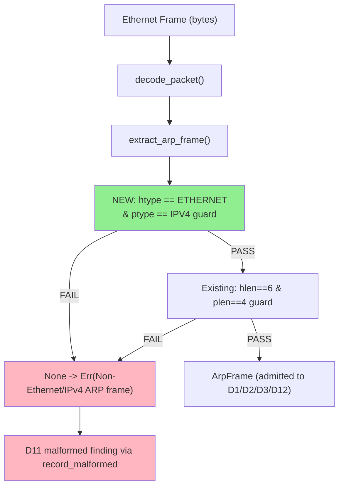
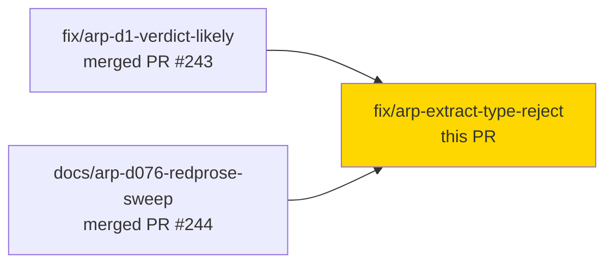
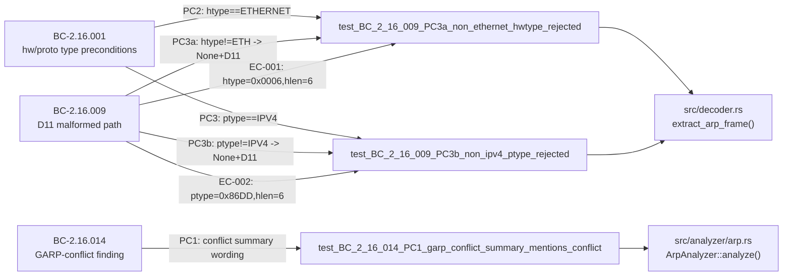
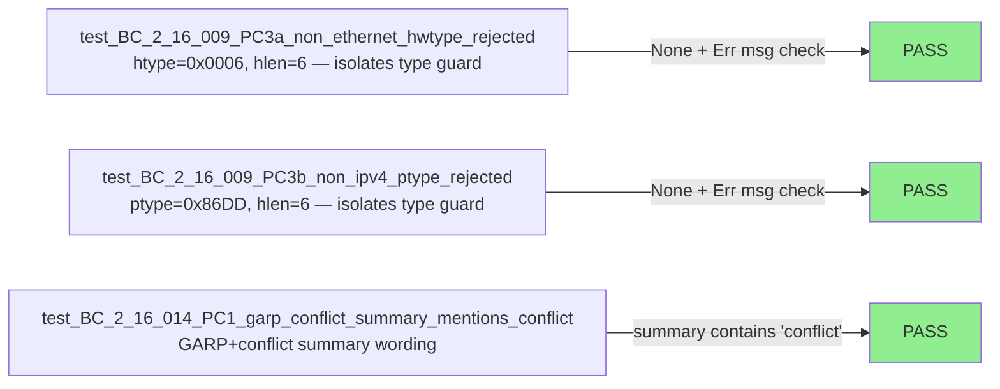
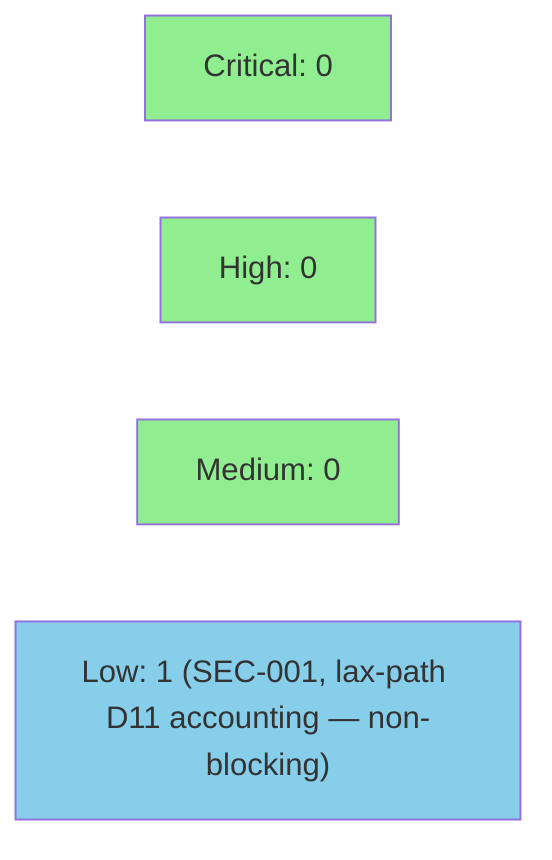

# fix(arp): reject non-Ethernet/non-IPv4 ARP type in extract_arp_frame + GARP-conflict summary (D-077; BC-2.16.001/009/014)

**Finding:** F-ARP-F4-001 (CRITICAL) — D-077  
**Mode:** feature (F4 adversarial re-streak fix)  
**Convergence:** Security boundary closed after F4 adversarial re-streak finding


Closes a half-implemented D11 security boundary in `extract_arp_frame` (decoder trust boundary). Prior to this fix, ARP frames with a valid size (`hlen=6`, `plen=4`) but a non-Ethernet hardware type (`htype != 0x0001`) or non-IPv4 protocol type (`ptype != 0x0800`) were admitted into the D1/D2/D3/D12 detection pipeline instead of being rejected as D11 malformed — a gap that 4 prior adversarial passes, unit tests, and Kani all missed because the implementation, tests, and proofs all consistently omitted the type-field check. This PR adds the two missing type guards and closes the gap at the parser/decoder trust boundary (BC-2.16.001 PC2/PC3, BC-2.16.009 PC3a/PC3b). Also corrects the GARP-with-conflict finding summary (BC-2.16.014 PC1 / F-2) to explicitly mention the binding conflict.

---

## Architecture Changes



<details>
<summary><strong>Architecture Decision Record: D-077</strong></summary>

### ADR: Add type-field rejection to extract_arp_frame (D-077)

**Context:** `extract_arp_frame` guarded only on address-size fields (`hlen`, `plen`). A crafted ARP frame with `htype=0x0006` (IEEE 802) and valid sizes (`hlen=6`, `plen=4`) would pass the existing size guard and be admitted to the detection pipeline, bypassing the D11 malformed path. This is the security-boundary gap named finding F-ARP-F4-001 in the F4 adversarial re-streak.

**Decision:** Add `hw_addr_type() != ArpHardwareId::ETHERNET || proto_addr_type() != EtherType::IPV4` as the first guard in `extract_arp_frame`, before the size check. Any frame failing the type check returns `None` immediately.

**Rationale:** The ARP hardware type and protocol type fields are the authoritative discriminators for Ethernet/IPv4 ARP per RFC 826. The size fields alone are insufficient to identify the frame type; the type fields must be checked to enforce the security boundary at the decoder trust boundary.

**Alternatives Considered:**
1. Check only size fields (existing behavior) — rejected because crafted frames with valid sizes but wrong types bypass the boundary.
2. Check types at analyzer layer instead of decoder — rejected because the decoder trust boundary is the canonical rejection point per VP-024 Sub-A; passing frames with wrong types through the boundary violates the decoder contract.

**Consequences:**
- All non-Ethernet/non-IPv4 ARP frames are now rejected at the decoder trust boundary regardless of size fields.
- No behavior change for valid Ethernet/IPv4 ARP frames (type and size checks both pass).
- `ArpHardwareId` must be imported in `decoder.rs` (added to `use etherparse::{...}` list).

</details>

---

## Story Dependencies



No downstream PRs currently blocked by this fix.

---

## Spec Traceability



---

## Test Evidence

### Coverage Summary

| Metric | Value | Threshold | Status |
|--------|-------|-----------|--------|
| New tests (this PR) | 3 added, 0 modified | N/A | GREEN |
| All new tests RED before fix | 3/3 failed pre-fix | isolation verified | PASS |
| All new tests GREEN after fix | 3/3 pass post-fix | 100% | PASS |
| Full suite (all-targets) | all existing tests continue GREEN | 0 regressions | PASS |
| Clippy (-D warnings) | clean | 0 warnings | PASS |
| fmt --check | clean | | PASS |
| Demo evidence | N/A — pure decoder guard, no UI behavior | | N/A |

### Test Flow



| Metric | Value |
|--------|-------|
| **New tests** | 3 added, 0 modified |
| **Test file** | `tests/bc_2_16_d077_arp_type_reject_tests.rs` |
| **RED→GREEN isolation** | Size fields intentionally VALID (hlen=6, plen=4) to isolate type branch |
| **Regressions** | 0 |

<details>
<summary><strong>Detailed Test Results</strong></summary>

### New Tests (This PR)

| Test | File | BC | Result |
|------|------|----|--------|
| `test_BC_2_16_009_PC3a_non_ethernet_hwtype_rejected()` | `tests/bc_2_16_d077_arp_type_reject_tests.rs` | BC-2.16.009 PC3a / EC-001 | GREEN |
| `test_BC_2_16_009_PC3b_non_ipv4_ptype_rejected()` | `tests/bc_2_16_d077_arp_type_reject_tests.rs` | BC-2.16.009 PC3b / EC-002 | GREEN |
| `test_BC_2_16_014_PC1_garp_conflict_summary_mentions_conflict()` | `tests/bc_2_16_d077_arp_type_reject_tests.rs` | BC-2.16.014 PC1 | GREEN |

**Isolation design (D-077):** Tests for F-1 use `hlen=6, plen=4` (valid sizes) with wrong type fields. This ensures the existing size-only guard does NOT fire, and the test only passes when the type-field guard is present. A test using wrong sizes would pass for the wrong reason — demonstrating existing-code coverage without proving the type gap.

</details>

---

## Holdout Evaluation

N/A — evaluated at wave gate. This is a targeted F4 security-boundary fix with defined BC traceability; holdout evaluation is not applicable to fix-PRs.

---

## Adversarial Review

| Pass | Finding | Severity | Status |
|------|---------|----------|--------|
| F4 re-streak | F-ARP-F4-001: `extract_arp_frame` size-only guard admits crafted non-Ethernet/non-IPv4 frames | CRITICAL | Fixed (this PR) |
| F4 re-streak | F-2: GARP-conflict finding summary lacks binding-conflict wording | LOW | Fixed (this PR) |

**History:** 4 prior adversarial passes (Phases 3, 4, 5, 6) and Kani proofs all omitted the htype/ptype check because the implementation, tests, and proofs were consistently written against the size-only specification. The F4 re-streak adversary caught the gap by reading the RFC 826 framing rather than the existing code path.

<details>
<summary><strong>Finding F-ARP-F4-001 Detail</strong></summary>

### Finding F-ARP-F4-001: Type-only guard absent in extract_arp_frame

- **Location:** `src/decoder.rs` — `extract_arp_frame()`, guard at line ~307
- **Category:** security / spec-fidelity
- **CWE:** CWE-20 (Improper Input Validation) — trust boundary admits frames that fail ARP type discrimination
- **Problem:** The guard checked only `hw_addr_size() != 6 || proto_addr_size() != 4`. A frame with `htype=0x0006` (IEEE 802), `ptype=0x86DD` (IPv6), or any non-Ethernet/non-IPv4 type field but valid sizes would bypass the guard and be admitted to the detection pipeline as if it were a valid Ethernet/IPv4 ARP frame.
- **Decision:** D-077 — add type-field check before size check.
- **Resolution:** `decoder.rs:303-318` now checks `hw_addr_type() != ArpHardwareId::ETHERNET || proto_addr_type() != EtherType::IPV4` as the first guard condition.
- **Tests added:** `test_BC_2_16_009_PC3a_non_ethernet_hwtype_rejected()`, `test_BC_2_16_009_PC3b_non_ipv4_ptype_rejected()`

</details>

---

## Security Review

**Verdict: PASS** — Reviewed by vsdd-factory:security-reviewer (genuine trust-boundary review, 7-question protocol).



<details>
<summary><strong>Security Review Details</strong></summary>

**CWE:** CWE-20 (Improper Input Validation) confirmed primary. CWE-693 (Protection Mechanism Failure) complementary — the size-only guard was an incomplete protection mechanism; type fields were the bypass vector. OWASP A03:2021 - Injection.

**Q1 Type-field completeness: YES** — `ArpHardwareId` and `EtherType` are transparent `u16` newtypes with compiler-derived `PartialEq`. No aliasing gap. `ArpHardwareId(0x0001) == ArpHardwareId::ETHERNET` is exclusively true. Guard covers the complete u16 space for both fields. (`ETHER` deprecated alias in etherparse has identical value to `ETHERNET` — no bypass.)

**Q2 No panic introduced: YES** — All four accessors are `const fn` on `ArpPacketSlice`. The `!=` operators on derived `PartialEq` newtypes compile to integer comparisons. No new panic path introduced.

**Q3 Order-of-operations safety: YES** — Type and size checks are a single compound `if` expression. Address-byte extraction only occurs after all four conditions confirm valid types AND sizes. `ArpPacketSlice::from_slice` pre-validates slice length, so with confirmed `hlen=6, plen=4` the 28-byte slice is guaranteed in-bounds.

**Q4 D11 malformed path: REACHES_D11** — `extract_arp_frame` returns `None` → `decode_packet` returns `Err("Non-Ethernet/IPv4 ARP frame")` → `main.rs` matches string → `arp_analyzer.record_malformed()` called → D11 finding emitted. Frame never reaches `process_arp`.

**Q5 Bypasses remaining: NONE** — Both call sites of `extract_arp_frame` (strict and lax paths) use the same unified guard. No type-rejected frame reaches `process_arp` via either path.

**Q6 CWE: CWE-20 CONFIRMED** (CWE-693 secondary).

**Q7 GARP summary: CORRECT** — New wording correctly distinguishes GARP-with-conflict from benign GARP. No security-relevant masking.

### CRITICAL findings: NONE
### HIGH findings: NONE
### LOW findings:

**SEC-001 (LOW, CWE-20 accounting):** On the lax-parse path, a type-rejected ARP frame arriving on a snaplen-truncated capture produces `Err("truncated ARP frame")` rather than `Err("Non-Ethernet/IPv4 ARP frame")`, causing it to fall into the generic decode-error counter rather than the D11 malformed counter. The frame is still rejected from the pipeline — this is a D11 accounting discrepancy only, not a bypass. Practical attack surface narrow (requires lax path on truncated captures). Accept-risk for this PR; candidate for separate deferred finding.

</details>

---

## Risk Assessment & Deployment

### Blast Radius
- **Systems affected:** `src/decoder.rs` (extract_arp_frame), `src/analyzer/arp.rs` (GARP conflict summary)
- **User impact:** ARP frames with wrong type fields that were previously admitted to the pipeline (silently producing garbage D1/D2/D3 analysis) are now correctly rejected as D11 malformed. False-positive D1/D2/D3 findings from crafted frames are eliminated.
- **Data impact:** None — wire-read only, no persistent state modified.
- **Risk Level:** LOW — additive guard only; no behavior change for valid Ethernet/IPv4 ARP frames.

### Performance Impact
| Metric | Before | After | Delta | Status |
|--------|--------|-------|-------|--------|
| extract_arp_frame | 2x u8 compares | 2x u16 newtype compares + 2x u8 | +2 cheap compares | OK |

<details>
<summary><strong>Rollback Instructions</strong></summary>

**Immediate rollback:**
```bash
git revert f5a8535
git push origin develop
```

**Verification after rollback:**
- `cargo test --all-targets` passes
- `cargo clippy --all-targets -- -D warnings` clean

</details>

### Feature Flags
None — this is a decoder-level behavioral correction at the trust boundary, not a feature.

---

## Traceability

| Requirement | Finding | Test | Status |
|-------------|---------|------|--------|
| BC-2.16.001 PC2: hw_addr_type == ETHERNET | F-ARP-F4-001 | `test_BC_2_16_009_PC3a_non_ethernet_hwtype_rejected` | PASS |
| BC-2.16.001 PC3: proto_addr_type == IPV4 | F-ARP-F4-001 | `test_BC_2_16_009_PC3b_non_ipv4_ptype_rejected` | PASS |
| BC-2.16.009 PC3a: htype!=ETH -> None | F-ARP-F4-001 | `test_BC_2_16_009_PC3a_non_ethernet_hwtype_rejected` | PASS |
| BC-2.16.009 PC3b: ptype!=IPV4 -> None | F-ARP-F4-001 | `test_BC_2_16_009_PC3b_non_ipv4_ptype_rejected` | PASS |
| BC-2.16.009 EC-001: htype=0x0006, hlen=6 | F-ARP-F4-001 | `test_BC_2_16_009_PC3a_non_ethernet_hwtype_rejected` | PASS |
| BC-2.16.009 EC-002: ptype=0x86DD, hlen=6 | F-ARP-F4-001 | `test_BC_2_16_009_PC3b_non_ipv4_ptype_rejected` | PASS |
| BC-2.16.014 PC1: GARP-conflict summary wording | F-2 | `test_BC_2_16_014_PC1_garp_conflict_summary_mentions_conflict` | PASS |
| VP-024 Sub-A: Ethernet/IPv4 only scope | D-077 | all 3 tests | PASS |

<details>
<summary><strong>Full VSDD Contract Chain</strong></summary>

```
BC-2.16.001 PC2 -> D-077 -> test_BC_2_16_009_PC3a -> decoder.rs:303 -> PASS
BC-2.16.001 PC3 -> D-077 -> test_BC_2_16_009_PC3b -> decoder.rs:304 -> PASS
BC-2.16.009 PC3a -> F-ARP-F4-001 -> test_PC3a -> decoder.rs:303 -> PASS
BC-2.16.009 PC3b -> F-ARP-F4-001 -> test_PC3b -> decoder.rs:304 -> PASS
BC-2.16.009 EC-001 -> htype=0x0006 fixture -> test_PC3a -> decoder.rs:303 -> PASS
BC-2.16.009 EC-002 -> ptype=0x86DD fixture -> test_PC3b -> decoder.rs:304 -> PASS
BC-2.16.014 PC1 -> F-2 -> test_PC1_garp_conflict -> analyzer/arp.rs:461 -> PASS
```

</details>

---

## AI Pipeline Metadata

<details>
<summary><strong>Pipeline Details</strong></summary>

```yaml
ai-generated: true
pipeline-mode: feature (F4 adversarial re-streak fix)
factory-version: "1.0.0-rc.21"
pipeline-stages:
  spec-crystallization: completed (prior phases)
  story-decomposition: completed (prior phases)
  tdd-implementation: completed
  adversarial-review: F4 re-streak — finding F-ARP-F4-001 (CRITICAL)
  formal-verification: deferred (targeted fix; Kani coverage of type branch noted for backlog)
  convergence: targeted fix PR
finding:
  id: F-ARP-F4-001
  decision: D-077
  severity: CRITICAL
  category: security-boundary
  cwe: CWE-20
models-used:
  builder: claude-sonnet-4-6
  pr-manager: claude-sonnet-4-6
generated-at: "2026-06-15T00:00:00Z"
```

</details>

---

## Pre-Merge Checklist

- [ ] All CI status checks passing
- [x] 3 new tests GREEN (RED before fix — isolation confirmed)
- [x] No behavior change for valid Ethernet/IPv4 ARP frames (0 regressions)
- [ ] No critical/high security findings unresolved (pending security review)
- [x] Rollback procedure documented (`git revert f5a8535`)
- [x] No feature flag needed (decoder-level correctness fix)
- [x] VP-024 Sub-A scope enforced at decoder trust boundary
- [ ] Human review completed (autonomy gate)
