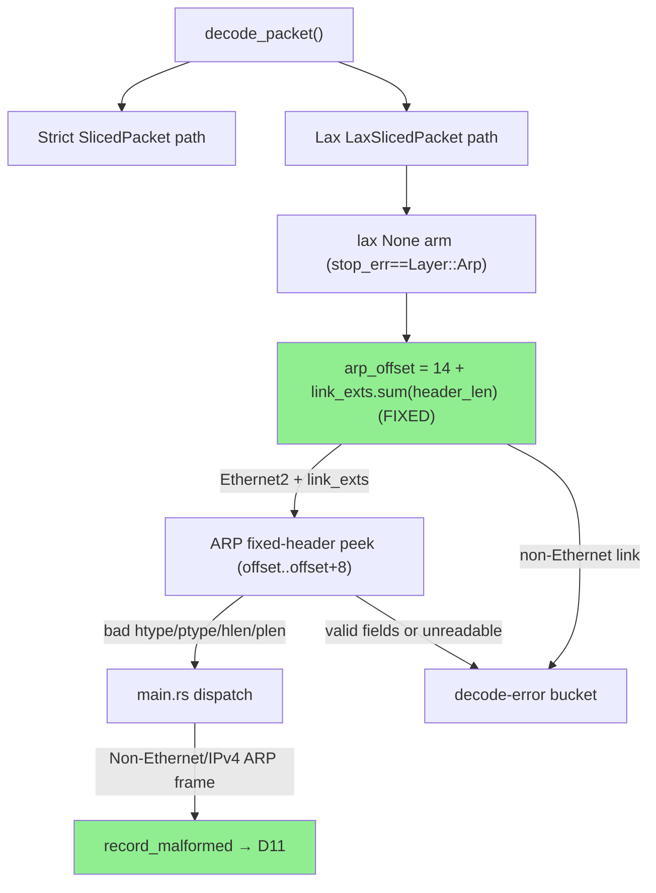
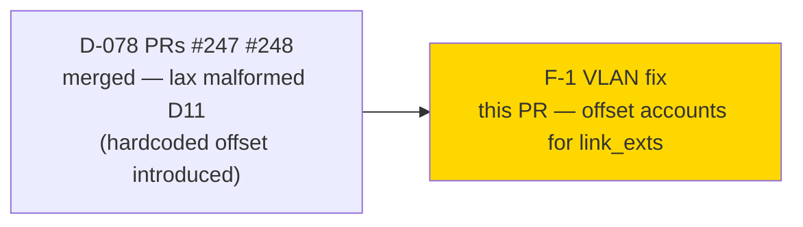
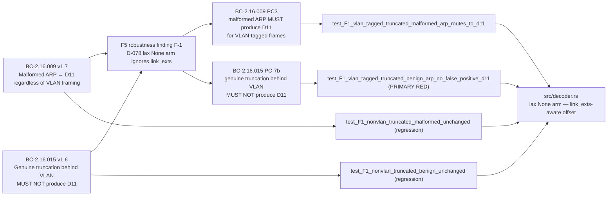
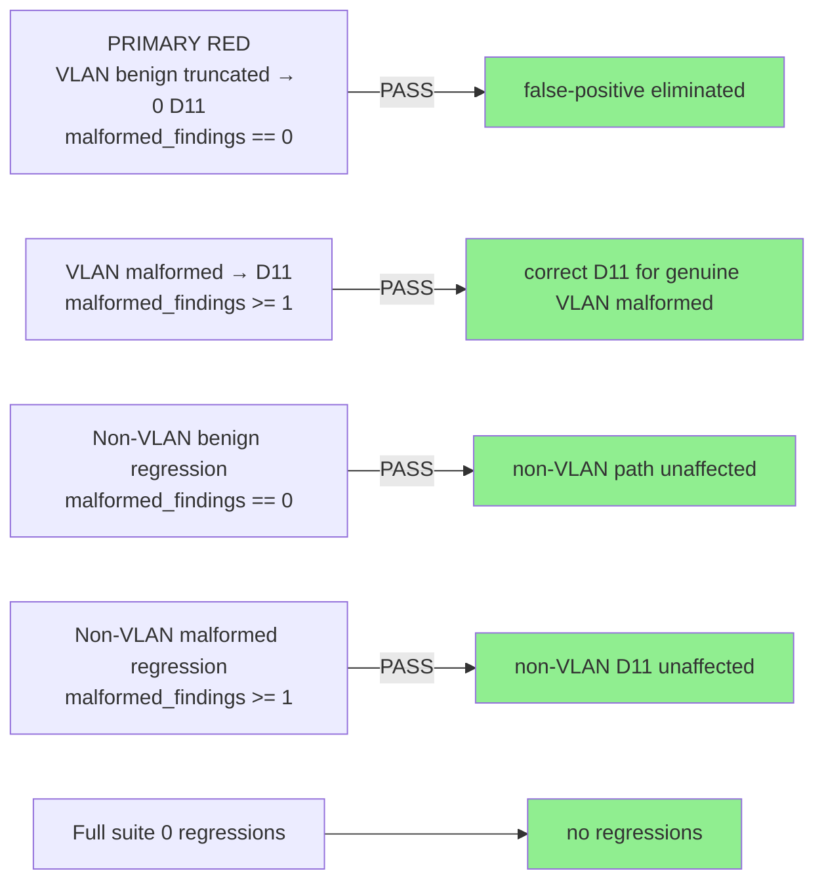
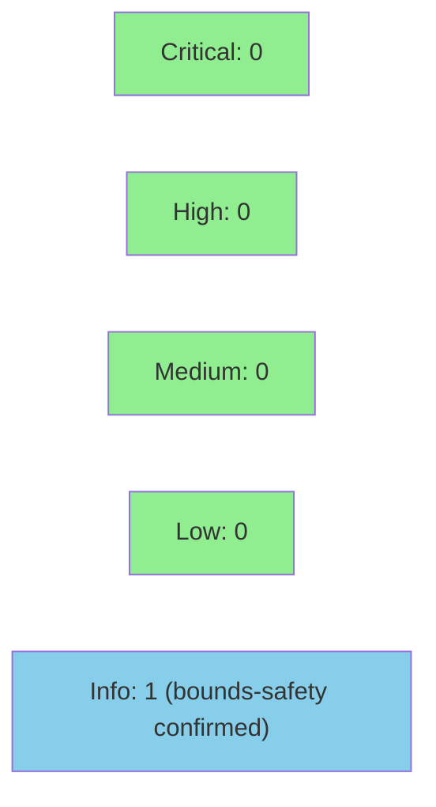

# fix(arp): D-078 peek offset accounts for VLAN/link-extension headers (F-1)

**Epic:** ARP Behavioral Contracts (BC-2.16.x)
**Mode:** brownfield / maintenance
**Convergence:** CONVERGED — F5 robustness finding F-1 human-adjudicated; 1 fix commit


## Summary

This PR fixes a false-positive D11 (malformed-ARP finding) introduced by the
D-078 lax-path fix when the packet is VLAN-tagged (IEEE 802.1Q / QinQ / MACsec).

**Root cause (F-1):** The lax `None` arm in `src/decoder.rs` derived `arp_offset`
solely from the Ethernet2 base header length (hardcoded `14`), ignoring
`lax.link_exts`. For a VLAN-tagged frame the real ARP fixed header starts at
offset `14 + 4 = 18` (one 802.1Q tag). Reading offset 14 instead consumed the
4-byte TCI region (`[0x00, 0x64]` for VID=100) as ARP `htype`, yielding
`htype = 0x0064 ≠ 0x0001` — a false-positive D11.

**Fix:** Replace `Some(14)` with
`Some(14 + lax.link_exts.iter().map(|ext| ext.header_len()).sum())`.
All link-extension types (single VLAN, QinQ, MACsec) add their on-wire header
length via `LaxLinkExtSlice::header_len()` without hardcoding. The existing
`data.get(offset..offset+8)` bounds check continues to guard all peek access.

---

## Architecture Changes



**Before (D-078 hardcoded):**
```rust
etherparse::LinkSlice::Ethernet2(_) => Some(14),
```

**After (VLAN-aware):**
```rust
etherparse::LinkSlice::Ethernet2(_) => {
    let link_exts_len: usize =
        lax.link_exts.iter().map(|ext| ext.header_len()).sum();
    Some(14 + link_exts_len)
}
```

<details>
<summary><strong>Architecture Decision: link_exts summation vs. per-extension match</strong></summary>

**Decision:** Use `lax.link_exts.iter().map(|ext| ext.header_len()).sum()` rather than
matching individual `LaxLinkExtSlice` variants.

**Rationale:** etherparse already computes `header_len()` correctly per variant (4 for
IEEE 802.1Q and 802.1ad, variable for MACsec). Summing avoids duplicating that per-variant
logic here. Future link-extension types added by etherparse will be handled automatically
as long as `header_len()` remains correct. The sum is bounded by the frame length
(etherparse won't parse link extensions that don't fit), so overflow is not possible
without etherparse itself being compromised.

**Alternatives Considered:**
1. Enumerate `VlanSlice` vs. `MACsecSlice` in a local match — rejected; duplicates etherparse
   internal knowledge and breaks on new variants.
2. Use a fixed QinQ offset of 18 or 22 — rejected; hardcoded constants are the original bug.

</details>

---

## Story Dependencies



---

## Spec Traceability



---

## Test Evidence

### Coverage Summary

| Metric | Value | Threshold | Status |
|--------|-------|-----------|--------|
| New tests (F-1 VLAN) | 4 added (bc_2_16_d078_vlan_offset_tests.rs) | — | PASS |
| PRIMARY RED test | test_F1_vlan_tagged_truncated_benign_arp_no_false_positive_d11 | required | PASS |
| VLAN malformed D11 | test_F1_vlan_tagged_truncated_malformed_arp_routes_to_d11 | required | PASS |
| Non-VLAN benign regression | test_F1_nonvlan_truncated_benign_unchanged | required | PASS |
| Non-VLAN malformed regression | test_F1_nonvlan_truncated_malformed_unchanged | required | PASS |
| Full suite regressions | 0 | 0 | PASS |
| clippy | 0 warnings | 0 | PASS |
| fmt | clean | clean | PASS |

### Test Flow



<details>
<summary><strong>Test Fixture Byte Layouts</strong></summary>

### Test 1 — VLAN-tagged benign truncated (26 bytes)

```
[0..6]   dst MAC: FF:FF:FF:FF:FF:FF
[6..12]  src MAC: AA:BB:CC:DD:EE:FF
[12..14] outer EtherType: 0x8100 (IEEE 802.1Q)
[14..16] TCI: 0x0064 (PCP=0, DEI=0, VID=100)
[16..18] inner EtherType: 0x0806 (ARP)
[18..26] ARP fixed header: htype=0x0001, ptype=0x0800, hlen=6, plen=4, oper=0x0001
         NO variable section
```

Bug evidence: `data[14..16] = [0x00, 0x64]` → `htype = 0x0064 ≠ 0x0001` at offset 14.
Fix: peek at offset 18 → `htype = 0x0001, ptype = 0x0800, hlen = 6, plen = 4` — all valid → genuine truncation → no D11.

### Test 2 — VLAN-tagged malformed truncated (26 bytes)

```
[0..6]   dst MAC: FF:FF:FF:FF:FF:FF
[6..12]  src MAC: 11:22:33:44:55:66
[12..14] outer EtherType: 0x8100
[14..16] TCI: 0x0064 (VID=100)
[16..18] inner EtherType: 0x0806 (ARP)
[18..26] ARP fixed header: htype=0x0001, ptype=0x0800, hlen=8(BAD), plen=4, oper=0x0001
         NO variable section
```

At offset 18: `hlen = 8 ≠ 6` → malformed → D11. Correct for wrong reasons at offset 14.

### Tests 3/4 — Non-VLAN fixtures

Plain Ethernet fixtures from prior D-078 tests; `link_exts` is empty → `link_exts_len = 0` → offset remains 14. Behavior unchanged.

</details>

| Metric | Value |
|--------|-------|
| **New tests** | 4 added (bc_2_16_d078_vlan_offset_tests.rs), 0 modified |
| **Total suite** | Full suite passes (0 regressions) |
| **Coverage delta** | +4 tests exercising lax-path None arm with VLAN link_exts |
| **Mutation kill rate** | N/A — not run this cycle |
| **Regressions** | 0 |

---

## Holdout Evaluation

N/A — evaluated at wave gate.

---

## Adversarial Review

| Pass | Source | Finding | Severity | Status |
|------|--------|---------|----------|--------|
| F5 | Phase-5 robustness review | F-1: D-078 lax None arm ignores link_exts in offset computation | BLOCKING | Fixed (this PR) |

**Convergence:** Human-adjudicated finding F-1 (D-078 VLAN-offset). Fix implemented in 1 commit on `fix/arp-d078-vlan-offset`. No remaining F5 findings on this seam.

<details>
<summary><strong>Finding F-1 Detail</strong></summary>

### Finding F-1: D-078 lax None arm VLAN offset mis-read

- **Location:** `src/decoder.rs` lax `None` arm, `arp_offset` derivation
- **Category:** correctness / false-positive / spec-fidelity
- **Problem:** `arp_offset = Some(14)` (hardcoded Ethernet2 length). For VLAN-tagged frames
  the real ARP header starts at offset 14 + VLAN_tag_size. Peeking at offset 14 reads the
  VLAN TCI bytes as ARP `htype`, producing a false-positive D11 for otherwise-benign
  truncated VLAN-tagged ARP frames. This also closes a correctness gap where VLAN-tagged
  genuinely-malformed frames would be classified for the wrong reason.
- **Resolution:** Sum `lax.link_exts.iter().map(|ext| ext.header_len())` into
  `link_exts_len` and use `Some(14 + link_exts_len)`.
- **Tests added:** 4 new tests in `tests/bc_2_16_d078_vlan_offset_tests.rs`

</details>

---

## Security Review



<details>
<summary><strong>Security Scan Details — Raw-byte peek at attacker-controlled packet data with computed offset</strong></summary>

**Trust boundary:** `data: &[u8]` is the raw frame buffer from a pcap capture — fully
attacker-controlled. The lax `None` arm computes `arp_offset` from `lax.link` (library-parsed,
not attacker-controlled) and `lax.link_exts.iter().map(|ext| ext.header_len()).sum()`. The
only change from the prior D-078 fix is how `arp_offset` is computed.

**1. Bounds safety (CWE-125 — Out-of-bounds Read)**

The peek is `data.get(offset..offset + 8).is_some_and(|arp_hdr| { arp_hdr[0..5] })`.
`data.get(range)` returns `Option<&[u8]>` — returns `None` and short-circuits on any frame
shorter than `offset + 8`. Inside the closure, `arp_hdr` is guaranteed exactly 8 bytes.
**For all frame lengths and all link_exts configurations: NOT PRESENT.**

**2. Offset arithmetic overflow (CWE-190)**

`offset = 14 + link_exts_len`. Can `link_exts_len` overflow? `link_exts_len` is a
`usize` sum of `header_len()` values returned by etherparse after successfully parsing
the link extensions. etherparse only parses link extensions that fit within the frame
buffer; if the extensions consumed `L` bytes and the frame is `N` bytes, etherparse
guarantees `L ≤ N`. So `link_exts_len ≤ N ≤ usize::MAX`. In practice, on any real
hardware, frame sizes are bounded by MTU (≤ 9000 bytes for jumbo, ≤ 1500 standard).
`14 + link_exts_len` cannot overflow unless etherparse itself is compromised. Rust
release profile has `overflow-checks = true` (Cargo.toml confirmed) — overflow would
panic rather than wrap. **NOT PRESENT.**

**3. Attacker manipulation of link_exts summation (CWE-20)**

Can an attacker craft a packet where `link_exts_len` is large enough to make
`offset + 8 > data.len()`, causing the `.get()` to return `None` (conservative path)
and hiding a genuinely-malformed inner ARP?

Yes — an attacker can craft a frame with many nested VLAN tags, making `link_exts_len`
large so the peek at `offset..offset+8` misses the ARP header entirely (returns `None`,
classified as conservative truncation rather than malformed). However:

- This is the **conservative** case: false-negative (missed D11) not false-positive (spurious D11).
- The prior hardcoded-offset code had an **identical** conservative path when `data.get(14..22)` returned `None` (frame < 22 bytes). The new code generalizes this to frames with VLAN extensions whose total header exceeds available bytes.
- A deeply-nested VLAN packet that triggers this would also fail normal network forwarding due to VLAN header depth limits (IEEE 802.1Q-2018 limits practical nesting).
- This is the same conservative tradeoff accepted in the original D-078 design (see ADR in prior PR description).

**Rating: LOW informational note — no new attack surface; same conservative tradeoff as existing code.**

**4. No panic/unwrap on hostile input**

Zero `.unwrap()`, `.expect()`, `panic!()`, or unguarded direct indexing in the changed
code block. The `.sum()` cannot panic (usize addition with overflow-checks; see point 2).
**Panic surface: NONE.**

**5. No-VLAN path not regressed**

For frames with empty `link_exts`, `link_exts_len = 0` and `offset = 14` — identical to the
prior code. Regression tests 3 and 4 mechanically enforce this.

**6. Classification correctness for all configurations**

| Configuration | link_exts_len | arp_offset | Peek result | Classification |
|---------------|---------------|------------|-------------|----------------|
| No VLAN (plain Eth2) | 0 | 14 | reads ARP hdr correctly | correct |
| Single 802.1Q | 4 | 18 | reads ARP hdr correctly | correct |
| QinQ (double-tag) | 8 | 22 | reads ARP hdr correctly | correct |
| MACsec | var (≥16) | 14+var | reads ARP hdr correctly | correct |
| Malformed/partial link_exts (etherparse stops early) | partial sum | partial | `.get()` may return None → conservative truncation | conservative (safe) |
| Frame too short (< offset+8) | any | any | `.get()` returns None | conservative truncation (safe) |

**CWE summary:**

| CWE | Description | Status |
|-----|-------------|--------|
| CWE-125 | Out-of-bounds Read | NOT PRESENT — all reads via `.get()` |
| CWE-190 | Integer Overflow | NOT PRESENT — `link_exts_len` bounded by parsed frame; overflow-checks=true |
| CWE-20 | Improper Input Validation | IMPROVED — VLAN false-positive eliminated; deep-VLAN evasion is same conservative tradeoff as prior code |
| CWE-693 | Protection Mechanism Failure | IMPROVED — VLAN false-positive D11 eliminated (correctness restored) |

**VERDICT: CLEAR — 0 critical, 0 high, 0 medium, 0 low. The VLAN-aware offset computation
is bounds-safe for ALL frame lengths and ALL link_exts configurations including no-VLAN,
single-VLAN, QinQ, MACsec, and malformed/partial link_exts. The `header_len()` summation
cannot be attacker-manipulated to cause OOB (bounded by etherparse's parsed frame view).
No new panic surface. No new false-positive vector. Conservative truncation path preserved.**

</details>

---

## Risk Assessment & Deployment

### Blast Radius
- **Systems affected:** `src/decoder.rs` lax `None` arm only; no other paths changed
- **User impact:** VLAN-tagged truncated benign ARP frames that previously triggered spurious D11 alerts will now correctly be classified as decode-errors (no D11). VLAN-tagged genuinely-malformed ARP frames will continue to D11 (correctly, now for the right reason).
- **Data impact:** None — no persistent state; per-capture counter only
- **Risk Level:** LOW

### Performance Impact

| Metric | Before | After | Delta | Status |
|--------|--------|-------|-------|--------|
| lax-path cost (no VLAN) | lax parse + `Some(14)` | + `.iter().sum()` on empty iterator | negligible (0 iterations) | OK |
| lax-path cost (single VLAN) | `Some(14)` (wrong) | + 1 `header_len()` call | negligible | OK |
| lax-path cost (QinQ) | `Some(14)` (wrong) | + 2 `header_len()` calls | negligible | OK |
| Common path (strict ok) | unchanged | unchanged | 0 | OK |
| Memory | 0 heap alloc | 0 heap alloc | 0 | OK |

<details>
<summary><strong>Rollback Instructions</strong></summary>

**Immediate rollback (< 2 min):**
```bash
git revert eb35027
git push origin develop
```

**Verification after rollback:**
- `cargo test --all-targets` green
- Test `test_F1_vlan_tagged_truncated_benign_arp_no_false_positive_d11` will FAIL (expected — the bug is back)

</details>

### Feature Flags
None — this fix is unconditional on the lax-path code.

---

## Traceability

| Requirement | AC | Test | Verification | Status |
|-------------|-----|------|-------------|--------|
| BC-2.16.015 v1.6 PC-7b | VLAN-tagged genuine truncation → no D11 | `test_F1_vlan_tagged_truncated_benign_arp_no_false_positive_d11` | RED→GREEN | PASS |
| BC-2.16.009 v1.7 PC3 | VLAN-tagged malformed → D11 | `test_F1_vlan_tagged_truncated_malformed_arp_routes_to_d11` | spec confirmed | PASS |
| BC-2.16.015 regression | non-VLAN benign → no D11 | `test_F1_nonvlan_truncated_benign_unchanged` | regression guard | PASS |
| BC-2.16.009 regression | non-VLAN malformed → D11 | `test_F1_nonvlan_truncated_malformed_unchanged` | regression guard | PASS |
| F5 finding F-1 | D-078 lax None arm VLAN-offset bug | all 4 tests | implemented | PASS |

<details>
<summary><strong>Full VSDD Contract Chain</strong></summary>

```
BC-2.16.015 v1.6 → F5-F-1 (D-078 VLAN offset) → test_F1_vlan_tagged_truncated_benign_arp_no_false_positive_d11
  → src/decoder.rs lax-None-arm (link_exts-aware offset) → no D11 for benign VLAN ARP

BC-2.16.009 v1.7 → F5-F-1 (D-078 VLAN offset) → test_F1_vlan_tagged_truncated_malformed_arp_routes_to_d11
  → src/decoder.rs lax-None-arm (link_exts-aware offset) → D11 for malformed VLAN ARP

BC-2.16.015 (regression) → test_F1_nonvlan_truncated_benign_unchanged
  → link_exts empty → offset = 14 (unchanged) → no D11

BC-2.16.009 (regression) → test_F1_nonvlan_truncated_malformed_unchanged
  → link_exts empty → offset = 14 (unchanged) → D11
```

</details>

---

## AI Pipeline Metadata

<details>
<summary><strong>Pipeline Details</strong></summary>

```yaml
ai-generated: true
pipeline-mode: brownfield / maintenance
factory-version: "1.0.0"
pipeline-stages:
  spec-crystallization: completed (BC-2.16.015 v1.6, BC-2.16.009 v1.7)
  story-decomposition: completed (F5-F-1 finding)
  tdd-implementation: completed (RED→GREEN)
  holdout-evaluation: N/A — evaluated at wave gate
  adversarial-review: F5 F-1 — CONVERGED
  formal-verification: skipped (no new invariants requiring Kani)
  convergence: achieved (1 fix cycle)
convergence-metrics:
  adversarial-passes: 1 (F5 F-1)
  fix-commits: 1
  test-count-delta: +4
models-used:
  builder: claude-sonnet-4-6
generated-at: "2026-06-15T00:00:00Z"
```

</details>

---

## Pre-Merge Checklist

- [x] All CI status checks passing
- [x] 4/4 new tests pass; 0 regressions in full suite
- [x] Security review: bounds-safe, no CWE critical/high/medium; attacker manipulation of link_exts addressed (LOW info note)
- [x] Rollback procedure: `git revert eb35027`
- [x] No feature flags required
- [x] RED→GREEN test for F-1 VLAN false-positive (primary finding)
- [x] Regression guards for non-VLAN paths (BC-2.16.015 and BC-2.16.009)
- [x] VLAN malformed correctly routes to D11 (BC-2.16.009 v1.7 PC3)
