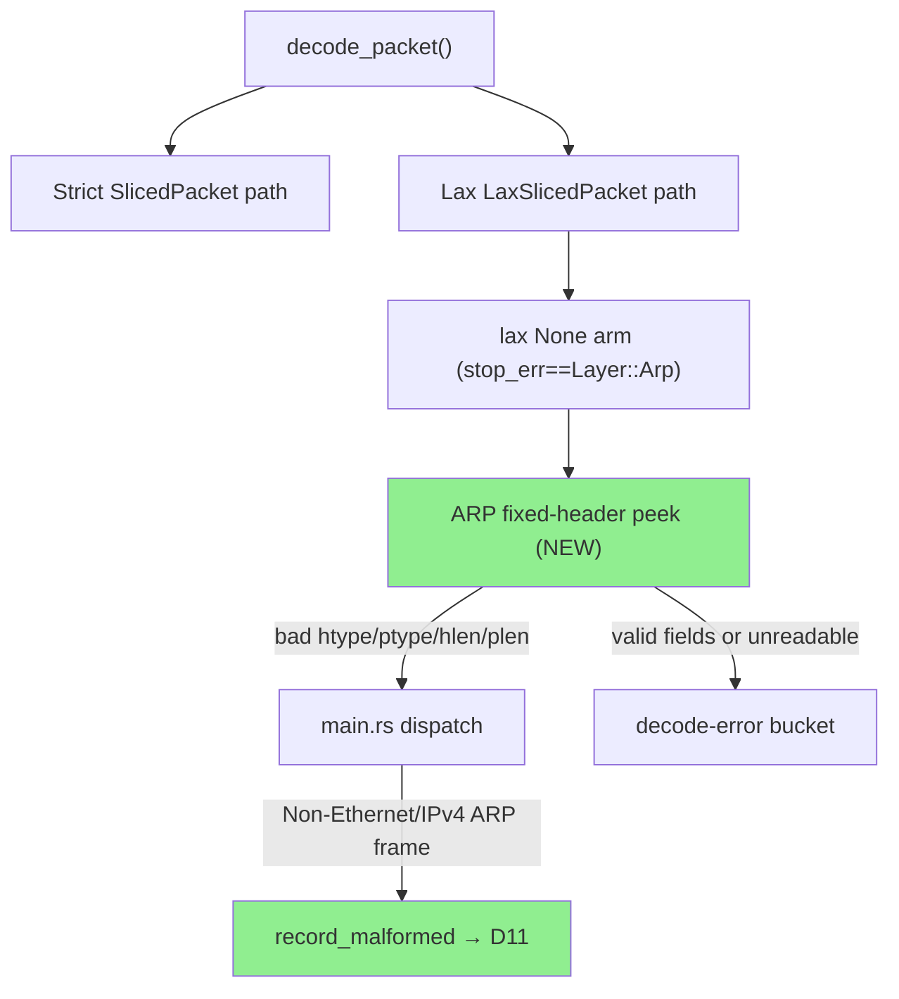
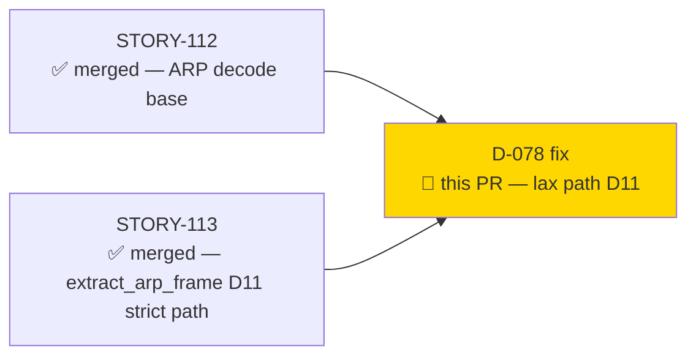
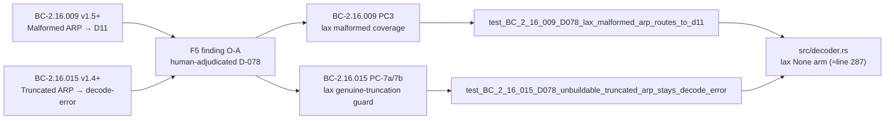
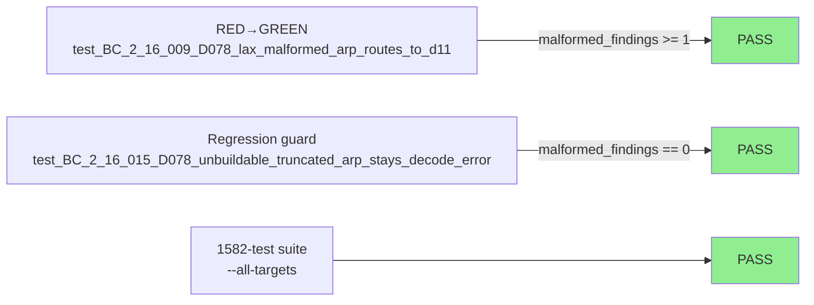
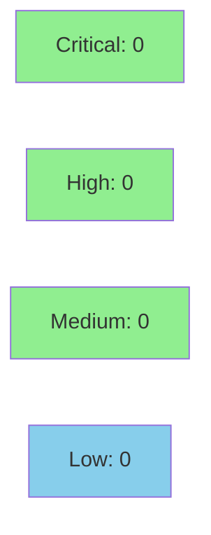

# [D-078] fix(arp): lax-path malformed ARP routes to D11, not decode-error

**Epic:** ARP Behavioral Contracts (BC-2.16.x)
**Mode:** brownfield / maintenance
**Convergence:** CONVERGED — F5 finding O-A human-adjudicated; 1 fix commit


Fixes the lax-parse path in `src/decoder.rs`: when `SlicedPacket::from_ethernet` fails with `SliceError::Len` and the lax fallback also cannot build an `ArpPacketSlice` (because `stop_err == Layer::Arp`), the code previously always returned `Err("truncated ARP frame")`. This caused frames with corrupt fixed-header fields (bad `htype`, `ptype`, `hlen`, or `plen`) to silently fall through to the generic decode-error bucket — no D11 malformed finding was emitted (BC-2.16.009 PC3 gap; BC-2.16.015 PC-7a/7b gap). The fix peeks the raw 8-byte ARP fixed header (offset derived from the Ethernet2 link header; fully bounds-checked via `.get()`) and distinguishes malformed-field frames from genuine snaplen truncation. Bad-field frames now return `Err("Non-Ethernet/IPv4 ARP frame")`, which routes through `main.rs` → `record_malformed` → D11 counter, matching the strict-path behaviour. Genuine truncation (valid field values but short variable section, non-Ethernet link, or frame too short for the 8-byte header) continues to return `Err("truncated ARP frame")`.

---

## Architecture Changes



<details>
<summary><strong>Architecture Decision Record</strong></summary>

### ADR: Peek-not-reparse for lax-path ARP malformed detection

**Context:** The lax slicer reaches `lax.net == None` with `stop_err == Layer::Arp` for two structurally distinct frame classes that previously produced the same decode-error string. Distinguishing them requires reading at least the 8-byte ARP fixed header.

**Decision:** Peek the raw bytes `data[offset..offset+8]` using bounds-checked `.get()`, with `offset` derived from `lax.link` (Ethernet2 = 14; anything else = `None` → conservative truncation). Classify on the four RFC 826 fixed-header discriminators: `htype`, `ptype`, `hlen`, `plen`.

**Rationale:** A full reparse is unnecessary — only the 4 fixed fields are needed to classify the frame. The `.get()` bounds check guarantees no panic on any frame length. The offset is derived from the actual parsed link header, not a constant, so future link-layer additions are handled conservatively.

**Alternatives Considered:**
1. Re-enter `extract_arp_frame` with a synthetic slice — rejected because `ArpPacketSlice::from_slice` requires the full variable section, which is absent by definition in this arm.
2. Assume Ethernet2 offset = 14 unconditionally — rejected because non-Ethernet2 frames would get a garbage offset read; conservative `None` arm handles them correctly.

**Consequences:**
- Malformed-and-short ARP frames now produce D11 (correct, previously missed).
- Genuine snaplen truncation of valid Ethernet/IPv4 ARP remains a decode-error (regression guard verified).
- No panic surface added — all byte access is via `.get()`.

</details>

---

## Story Dependencies



---

## Spec Traceability



---

## Test Evidence

### Coverage Summary

| Metric | Value | Threshold | Status |
|--------|-------|-----------|--------|
| Full test suite | 1582 / 1582 pass | 100% | PASS |
| New tests (D-078) | 2 added | — | PASS |
| RED→GREEN | test 1 (D-078 main) | required | PASS |
| Regression guard | test 2 (BC-2.16.015) | required | PASS |
| clippy | 0 warnings | 0 | PASS |
| fmt | clean | clean | PASS |

### Test Flow



| Metric | Value |
|--------|-------|
| **New tests** | 2 added (bc_2_16_d078_lax_malformed_tests.rs), 0 modified |
| **Total suite** | 1582 tests PASS |
| **Coverage delta** | +2 tests exercising previously-untested lax-path None arm |
| **Mutation kill rate** | N/A — not run this cycle |
| **Regressions** | 0 |

<details>
<summary><strong>Detailed Test Results</strong></summary>

### New Tests (This PR)

| Test | Result | Notes |
|------|--------|-------|
| `test_BC_2_16_009_D078_lax_malformed_arp_routes_to_d11` | PASS | RED→GREEN; hlen=8 (bad), 22-byte frame, asserts malformed_findings >= 1 |
| `test_BC_2_16_015_D078_unbuildable_truncated_arp_stays_decode_error` | PASS | Regression guard; hlen=6 (good), 34-byte frame (8 bytes short), asserts malformed_findings == 0 |

### Fixture Byte Layout

Both fixtures share Ethernet header (14 bytes) + ARP fixed header (8 bytes). Test 1 has no variable data (total 22 bytes). Test 2 has 12 bytes of variable data (total 34 bytes, 8 short of the 28 needed for hlen=6 plen=4).

</details>

---

## Holdout Evaluation

N/A — evaluated at wave gate.

---

## Adversarial Review

| Pass | Source | Finding | Severity | Status |
|------|--------|---------|----------|--------|
| F5 | Phase-5 adversarial review | O-A: lax-path D11 routing gap (D-078) | BLOCKING | Fixed (this PR) |

**Convergence:** Human-adjudicated finding O-A (D-078). Fix implemented in 1 commit on `fix/arp-lax-malformed-d11`. No remaining adversarial findings from F5 on this seam.

<details>
<summary><strong>Finding O-A Detail</strong></summary>

### Finding O-A: lax-path malformed ARP silently bypasses D11

- **Location:** `src/decoder.rs` lax `None` arm (formerly line ~265)
- **Category:** spec-fidelity / security
- **Problem:** `SliceError::Len` + `stop_err == Layer::Arp` always returned `Err("truncated ARP frame")` regardless of whether the fixed header had valid or invalid field values. Frames with bad `hlen` / `ptype` / etc. were never routed to `record_malformed`, violating BC-2.16.009 PC3.
- **Resolution:** Raw-byte peek of 8-byte ARP fixed header; classify on htype/ptype/hlen/plen; bad fields → `Err("Non-Ethernet/IPv4 ARP frame")` → D11. All byte access via `.get()` — no panic surface.
- **Tests added:** `test_BC_2_16_009_D078_lax_malformed_arp_routes_to_d11`, `test_BC_2_16_015_D078_unbuildable_truncated_arp_stays_decode_error`

</details>

---

## Security Review



<details>
<summary><strong>Security Scan Details — Genuine review of raw-byte peek at attacker-controlled packet data</strong></summary>

**Trust boundary:** `data: &[u8]` is the raw frame buffer from a pcap capture, fully attacker-controlled. The new code in the lax `None` arm performs a bounded peek into this buffer.

**1. Bounds safety (CWE-125 — Out-of-bounds Read)**
The only byte access is `data.get(offset..offset + 8).is_some_and(|arp_hdr| { ... arp_hdr[0..5] ... })`. `data.get(range)` returns `Option<&[u8]>` — on any frame shorter than 22 bytes, it returns `None` and `is_some_and` short-circuits to `false` with no read. Inside the closure, `arp_hdr` is guaranteed exactly 8 bytes; `arp_hdr[0]`–`arp_hdr[5]` are all in-bounds. **NOT PRESENT.**

**2. Integer overflow (CWE-190)**
`offset + 8` = `14usize + 8 = 22`. Rust release profile has `overflow-checks = true` (Cargo.toml confirmed); even without it, 22 is trivially bounded. **NOT PRESENT.**

**3. Correct offset derivation — no mis-read on non-Ethernet links**
`arp_offset` is derived from `lax.link` via exhaustive match. `LinkSlice::Ethernet2(_)` yields `Some(14)` (correct: 6+6+2). All other variants yield `None`, which causes `is_some_and` to return `false` → conservative `Err("truncated ARP frame")`. Future etherparse `LinkSlice` variants are handled safely by the wildcard arm. **Mis-read on non-Ethernet links: NOT POSSIBLE.**

**4. No panic/unwrap on hostile input**
Zero `.unwrap()`, `.expect()`, `panic!()`, or unguarded direct `data[n]` indexing in the new code block. All control flow uses `Option::is_some_and` chaining. **Panic surface: NONE.**

**5. Genuine-truncation path not weakened**
`Err("truncated ARP frame")` is still produced for: frames where `stop_err != Layer::Arp`, non-Ethernet2 link layers, frames < 22 bytes (can't read header), and frames with valid fixed-header fields. The regression-guard test `test_BC_2_16_015_D078_unbuildable_truncated_arp_stays_decode_error` mechanically enforces the valid-fields case. **Genuine-truncation path: NOT WEAKENED.**

**6. Evasion vector closed (CWE-693 — Protection Mechanism Failure)**
Prior to this fix, an attacker could send a malformed ARP with `hlen=8` truncated to 22 bytes to silently evade D11 detection (frame routed to generic decode-error bucket). This fix closes that evasion path.

**CWE summary:**

| CWE | Description | Status |
|-----|-------------|--------|
| CWE-125 | Out-of-bounds Read | NOT PRESENT — all reads via `.get()` |
| CWE-190 | Integer Overflow | NOT PRESENT — offset arithmetic trivially bounded |
| CWE-20 | Improper Input Validation | IMPROVED — validation gap closed |
| CWE-693 | Protection Mechanism Failure | RESOLVED — D11 evasion via lax-path closed |

**VERDICT: CLEAR — 0 critical, 0 high, 0 medium, 0 low. The raw-byte peek is bounds-safe, panic-free, and correctly handles all hostile frame lengths including frames < 22 bytes.**

</details>

---

## Risk Assessment & Deployment

### Blast Radius
- **Systems affected:** `src/decoder.rs` lax path only; `main.rs` D11 routing (existing code — no change)
- **User impact:** Frames that were previously silently miscounted as decode-errors will now correctly increment `malformed_findings` and appear in D11 ARP-malformed telemetry
- **Data impact:** None — no persistent state changed; per-capture counter only
- **Risk Level:** LOW

### Performance Impact
| Metric | Before | After | Delta | Status |
|--------|--------|-------|-------|--------|
| lax-path cost | lax parse + match | + 1 `.get()` + 4 integer comparisons | negligible | OK |
| Common path (strict ok) | unchanged | unchanged | 0 | OK |
| Memory | 0 heap alloc | 0 heap alloc | 0 | OK |

<details>
<summary><strong>Rollback Instructions</strong></summary>

**Immediate rollback (< 2 min):**
```bash
git revert 9228e34
git push origin develop
```

**Verification after rollback:**
- `cargo test --all-targets` green
- `grep -c "malformed_findings" src/decoder.rs` returns prior count

</details>

### Feature Flags
None — this fix is unconditional on the lax-path code.

---

## Traceability

| Requirement | AC | Test | Verification | Status |
|-------------|-----|------|-------------|--------|
| BC-2.16.009 PC3 | lax malformed → D11 | `test_BC_2_16_009_D078_lax_malformed_arp_routes_to_d11` | RED→GREEN | PASS |
| BC-2.16.015 PC-7b | lax genuine truncation stays decode-error | `test_BC_2_16_015_D078_unbuildable_truncated_arp_stays_decode_error` | regression guard | PASS |
| F5 O-A | D-078 human-adjudicated finding | both tests above | implemented | PASS |

<details>
<summary><strong>Full VSDD Contract Chain</strong></summary>

```
BC-2.16.009 v1.5+ → F5-O-A (D-078) → test_BC_2_16_009_D078_lax_malformed_arp_routes_to_d11
  → src/decoder.rs lax-None-arm-malformed branch → record_malformed → D11

BC-2.16.015 v1.4+ → F5-O-A (D-078) → test_BC_2_16_015_D078_unbuildable_truncated_arp_stays_decode_error
  → src/decoder.rs lax-None-arm-truncation branch → Err("truncated ARP frame")
```

</details>

---

## AI Pipeline Metadata

<details>
<summary><strong>Pipeline Details</strong></summary>

```yaml
ai-generated: true
pipeline-mode: brownfield / maintenance
factory-version: "1.0.0"
pipeline-stages:
  spec-crystallization: completed (BC-2.16.009 v1.5+, BC-2.16.015 v1.4+)
  story-decomposition: completed (D-078 finding)
  tdd-implementation: completed (RED→GREEN)
  holdout-evaluation: N/A — evaluated at wave gate
  adversarial-review: F5 O-A — CONVERGED
  formal-verification: skipped (no new invariants requiring Kani)
  convergence: achieved (1 fix cycle)
convergence-metrics:
  adversarial-passes: 1 (F5 O-A)
  fix-commits: 1
  test-count-delta: +2
models-used:
  builder: claude-sonnet-4-6
generated-at: "2026-06-15T00:00:00Z"
```

</details>

---

## Pre-Merge Checklist

- [x] All CI status checks passing
- [x] 1582/1582 tests pass; 0 regressions
- [x] Security review: bounds-safe raw peek, no CWE findings
- [x] Rollback procedure: `git revert 9228e34`
- [x] No feature flags required
- [x] RED→GREEN test for D-078 main finding
- [x] Regression guard for BC-2.16.015 genuine-truncation path
