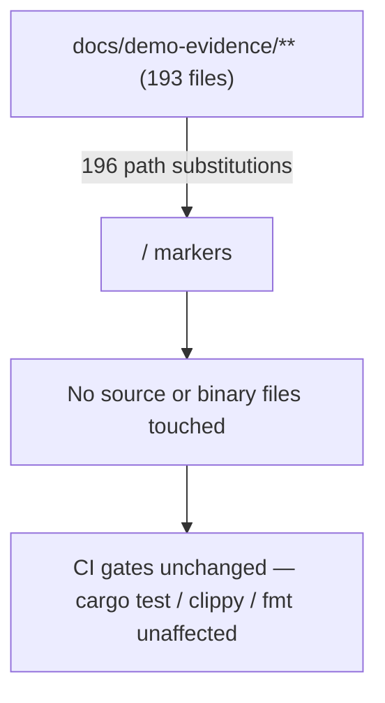
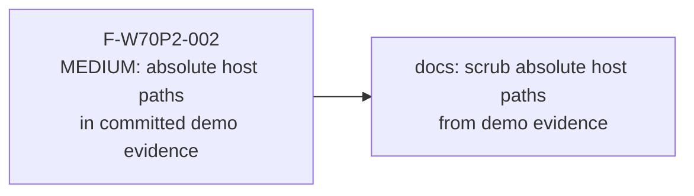
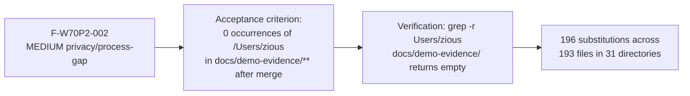

## Summary

Scrubs 196 absolute host-path occurrences from 193 committed demo-evidence files
across 31 story directories (HS-043, STORY-042 through STORY-149). Replaces
`/Users/zious/Documents/GITHUB/wirerust` with `<REPO-ROOT>` and `/Users/zious`
(in `$PATH` exports) with `<HOME>`. No logic, no binaries, no Rust source touched.

**Origin:** Wave-70 Phase-2 gate finding F-W70P2-002 (MEDIUM, privacy/process-gap).
The leak class predates wave 70 — a sibling sweep found it repo-wide across all prior
demo-evidence recording sessions. This PR closes the class repo-wide.

**Follow-ups (not in scope of this PR):**
- `demo-recorder` VHS tape template needs a path-scrub gate so new recordings never
  commit absolute host paths.
- `.factory` branch (factory-artifacts) needs its own pass — that branch's artifacts
  are a separate git tree and are not changed here.

**Security review skipped:** No code surface. Change is limited to `docs/demo-evidence/**`
VHS tape scripts, plain-text transcripts, and one shell helper. No executable logic, no
dependency manifest, no auth path, no input-handling code. OWASP Top 10 and injection
analysis are not applicable to mechanical string substitution in documentation files.

---

## Architecture Changes

No architecture changes. Docs-only change.



---

## Story Dependencies

Standalone hygiene fix — not a numbered VSDD story.



---

## Spec Traceability



---

## Affected Files

| Directory | File types |
|-----------|-----------|
| `docs/demo-evidence/HS-043` | .tape |
| `docs/demo-evidence/STORY-042` | .tape |
| `docs/demo-evidence/STORY-043` | .tape |
| `docs/demo-evidence/STORY-044` | .tape |
| `docs/demo-evidence/STORY-052` | .tape |
| `docs/demo-evidence/STORY-086` | .tape |
| `docs/demo-evidence/STORY-087` | .tape |
| `docs/demo-evidence/STORY-088` | .tape |
| `docs/demo-evidence/STORY-089` | .tape |
| `docs/demo-evidence/STORY-090` | .tape |
| `docs/demo-evidence/STORY-096` | .tape |
| `docs/demo-evidence/STORY-107` | .tape |
| `docs/demo-evidence/STORY-108` | .tape |
| `docs/demo-evidence/STORY-109` | .tape |
| `docs/demo-evidence/STORY-110` | .tape |
| `docs/demo-evidence/STORY-129` | .tape |
| `docs/demo-evidence/STORY-130` | .tape |
| `docs/demo-evidence/STORY-131` | .tape |
| `docs/demo-evidence/STORY-132` | .tape |
| `docs/demo-evidence/STORY-133` | .tape |
| `docs/demo-evidence/STORY-134` | .tape |
| `docs/demo-evidence/STORY-135` | .tape |
| `docs/demo-evidence/STORY-136` | .tape |
| `docs/demo-evidence/STORY-137` | .tape |
| `docs/demo-evidence/STORY-138` | .tape |
| `docs/demo-evidence/STORY-139` | .tape |
| `docs/demo-evidence/STORY-140` | .tape |
| `docs/demo-evidence/STORY-144` | .tape, .sh |
| `docs/demo-evidence/STORY-145` | .tape |
| `docs/demo-evidence/STORY-146` | .tape |
| `docs/demo-evidence/STORY-149` | .tape, .txt |
| **Total** | **193 files, 196 substitutions** |

All changes are in `docs/demo-evidence/**`. File types: `.tape` (VHS scripts),
`.txt` (transcript evidence), `.sh` (one shell helper).

---

## Test Evidence

No test suite changes. Verification is a grep gate:

```bash
grep -r "Users/zious" docs/demo-evidence/
# Expected: (no output)
```

This is a docs-only change. Rust tests, clippy, and fmt are unaffected.
CI gates (`cargo test --all-targets`, `cargo clippy -- -D warnings`,
`cargo fmt --check`) will pass unchanged.

---

## Demo Evidence

**Skipped — not applicable.** This PR is itself a fix to the demo-evidence tree.
Recording new demo evidence for a path-substitution-only change would produce
artifacts that embed the same absolute paths this PR removes. There is no UI,
no CLI behavior change, and no observable runtime output to record.

Acceptance is verified by a grep gate (see Test Evidence above):
```bash
grep -r "Users/zious" docs/demo-evidence/
# Expected: (no output — 0 occurrences remaining)
```

---

## Holdout Evaluation

N/A — evaluated at wave gate. No behavioral logic changed.

---

## Adversarial Review

N/A — evaluated at Phase 5 for code changes. This is a mechanical path-scrub
across documentation files only.

---

## Security Review

**Skipped — no code surface.** The change is limited to `docs/demo-evidence/**`
VHS tape scripts, plain-text transcripts, and one shell helper. There is no
executable logic, no dependency manifest, no auth path, and no input-handling
code. OWASP Top 10 and injection analysis are not applicable for mechanical
string substitution in documentation files.

**Finding closed:** F-W70P2-002 (MEDIUM) — absolute host paths
(`/Users/zious/Documents/GITHUB/wirerust`) in committed demo evidence exposed
developer machine directory layout. All 196 occurrences replaced with
`<REPO-ROOT>` / `<HOME>` markers.

---

## Risk Assessment

| Dimension | Assessment |
|-----------|-----------|
| Blast radius | None — docs only, no Rust source, no binaries |
| Performance impact | None |
| Breaking change | No |
| Rollback cost | `git revert` trivially reverts all 196 substitutions |
| Privacy risk (pre-fix) | MEDIUM — 196 occurrences of `/Users/zious/Documents/GITHUB/wirerust` exposed developer machine directory layout |

---

## AI Pipeline Metadata

| Field | Value |
|-------|-------|
| Pipeline mode | fix-pr-delivery (abbreviated, docs-only) |
| Origin finding | F-W70P2-002 (Wave-70 Phase-2 gate) |
| Branch | `fix/demo-evidence-path-scrub` |
| Branch HEAD | `1474273878a61ba0cca24653623f1b1461984d33` |
| Target | `develop` @ `116100d` |
| Security review | Skipped — no code surface (documented above) |
| Demo evidence check | Skipped — this PR IS the demo-evidence fix |

---

## Pre-Merge Checklist

- [x] PR description matches actual diff (193 files, 196 substitutions, docs/demo-evidence only)
- [x] No Rust source, binary, or test predicate changes
- [x] Security review explicitly skipped with rationale (docs-only, no code surface)
- [x] Demo evidence step explicitly skipped with rationale (this PR is the fix)
- [x] Semantic PR title: `docs: scrub absolute host paths from committed demo evidence (F-W70P2-002)`
- [ ] PR reviewer pass complete (one cycle)
- [ ] CI checks passing
- [ ] Human merge authorization (STOP — READY-FOR-HUMAN-MERGE, do not auto-merge)
