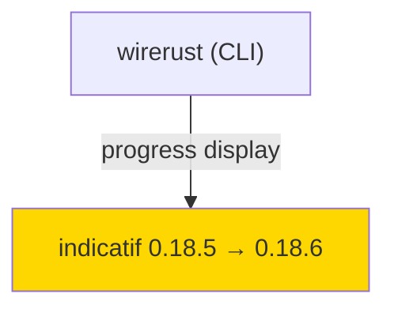
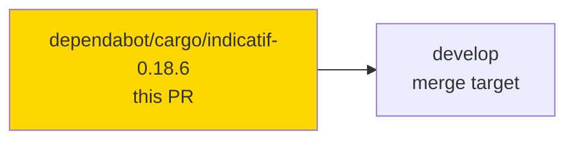
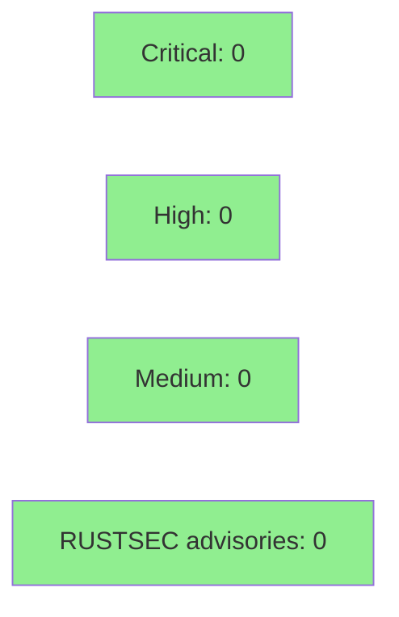

# [DEPENDABOT-386] chore(deps): bump indicatif 0.18.5 → 0.18.6

**Epic:** Dependency maintenance (automated)
**Mode:** maintenance (dependency-bump class)
**Convergence:** N/A — dependency-bump class PR (no adversarial loop)


Bumps the `indicatif` progress-bar library from 0.18.5 to 0.18.6. Upstream fix: Windows
dumb-terminal detection (indicatif#818). No API changes, no behavioral changes on non-Windows
platforms. Soak period: 8 days on crates.io (published 2026-07-01, not yanked, 486k downloads).
Audit+Deny green.

---

## Architecture Changes

No architecture changes. This is a pure dependency version bump.



**Change:** indicatif 0.18.6 fixes Windows dumb-terminal detection (indicatif#818).
No API surface changes. Non-Windows behavior unchanged.

---

## Story Dependencies

No story dependencies. Standalone dependency-maintenance PR.



---

## Spec Traceability

N/A — dependency-bump class PR. No behavioral contracts modified.

---

## Test Evidence

All existing tests pass unchanged. The bump does not modify wirerust source code.

| Metric | Value | Status |
|--------|-------|--------|
| CI checks (post-branch-update, incl. changelog-gate) | 12/12 pass | PASS |
| CHANGELOG gate | be0b2fd — [Unreleased] ### Changed bullet added | PASS |
| Cargo audit | clean | PASS |
| Cargo deny | clean | PASS |

---

## Demo Evidence

N/A — dependency-bump class PR. No user-visible behavior changed; no demo recording required.

---

## Holdout Evaluation

N/A — evaluated at wave gate (dependency-bump class).

---

## Adversarial Review

N/A — evaluated at Phase 5 (dependency-bump class, no behavioral delta).

---

## Security Review



- `cargo audit`: CLEAN (no advisories against indicatif 0.18.6)
- `cargo deny`: CLEAN
- Soak evidence: 8 days on crates.io, not yanked, 486k downloads
- Upstream fix scope: Windows dumb-terminal detection only (indicatif#818)
- No exposure on non-Windows platforms

---

## Risk Assessment & Deployment

### Blast Radius
- **Systems affected:** Progress-bar display only (indicatif is a display dependency)
- **User impact:** Improved Windows terminal detection; no change on macOS/Linux
- **Data impact:** None
- **Risk Level:** LOW

### Performance Impact

No performance impact expected. indicatif 0.18.6 is a bug-fix release (Windows terminal
detection). No hot paths modified.

---

## Traceability

| Requirement | Source | Status |
|-------------|--------|--------|
| Dependency bump | Dependabot PR #386 | PASS |
| Soak gate (8 days) | crates.io 2026-07-01, verified 2026-07-09 | PASS |
| Audit+Deny clean | orchestrator-verified | PASS |
| CHANGELOG entry | added to [Unreleased] ### Changed | PASS |
| CI green (12/12 incl. changelog-gate) | 12/12 pass at 716054a | PASS |

---

## AI Pipeline Metadata

```yaml
ai-generated: false
pipeline-mode: maintenance (dependency-bump)
pr-class: dependabot-cargo
pr-number: 386
soak-days: 8
published-date: "2026-07-01"
yanked: false
crates-io-downloads: 486000
upstream-fix: "Windows dumb-terminal detection (indicatif#818)"
authorization: per-PR human grant 2026-07-09
```

---

## Pre-Merge Checklist

- [x] Soak period verified (8 days, published 2026-07-01)
- [x] Not yanked on crates.io
- [x] cargo audit clean
- [x] cargo deny clean
- [x] CHANGELOG [Unreleased] entry added (### Changed bullet)
- [x] Branch updated to current develop (be0b2fd, gh pr update-branch)
- [x] Fresh CI run complete — 12/12 checks including changelog-gate (716054a, 2026-07-09)
- [x] No CRITICAL/HIGH security findings
- [x] Per-PR human authorization present (2026-07-09)
