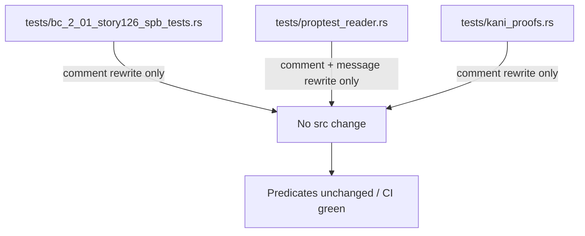
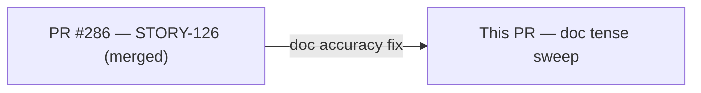
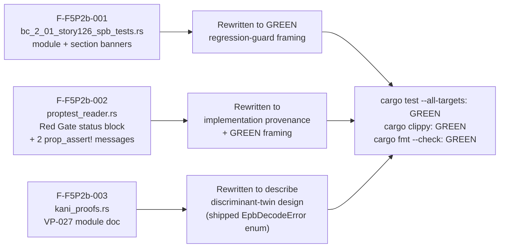

## Summary

Doc-accuracy sweep removing stale Red Gate / `todo!()` prose that survived on
three test files after STORY-126 shipped GREEN. Zero production-code changes,
zero test-predicate changes. Pure comment and assertion-message text rewrites.

**Finding IDs:** DF-GREEN-DOC-TENSE-SWEEP (F-F5P2b-001, F-F5P2b-002, F-F5P2b-003)
**Severity:** 3 × MEDIUM
**Policy basis:** F5 Pass-2 adversarial review — stale RED-Gate prose misrepresents
shipped implementation status and misleads future maintainers.

---

## Architecture Changes

No architecture changes. This PR touches only test file comments and
`prop_assert!` failure-message strings. No `src/` files modified.

---

## Story Dependencies

No story dependencies. This is a standalone doc-accuracy fix triggered by F5
Pass-2 adversarial findings against already-merged STORY-126 (PR #286).

---

## Spec Traceability

---

## Changed Files

| File | Change type | Lines changed |
|------|-------------|---------------|
| `tests/bc_2_01_story126_spb_tests.rs` | Comment rewrite | +39 / -37 |
| `tests/proptest_reader.rs` | Comment + assertion message rewrite | +17 / -19 |
| `tests/kani_proofs.rs` | Module doc rewrite | +14 / -12 |

**Total:** 73 insertions, 71 deletions — comments and assertion messages only.

---

## Test Evidence

- `cargo test --all-targets`: GREEN (verified in worktree `.worktrees/f5-doc-tense` before push)
- `cargo clippy --all-targets -- -D warnings`: GREEN
- `cargo fmt --check`: GREEN
- Zero test predicates changed — all `assert!`, `prop_assert!`, `assert_eq!` call sites
  are structurally identical; only the `format!` string arguments to `prop_assert!`
  failure messages were updated to remove stale RED-Gate language.

---

## Holdout Evaluation

N/A — evaluated at wave gate. This is a doc-accuracy fix, not a behavioral change.

---

## Adversarial Review

N/A — evaluated at Phase 5. These findings were produced by the F5 Pass-2
adversarial review run itself (DF-GREEN-DOC-TENSE-SWEEP policy record).

---

## Security Review

**Skipped — not applicable.** This PR modifies only doc comments and
`prop_assert!` failure-message strings in test files. No production code paths,
no authentication logic, no input handling, no data flows changed. OWASP Top 10
and injection analysis are not relevant to comment-text rewrites.

---

## Risk Assessment

| Dimension | Assessment |
|-----------|-----------|
| Blast radius | Zero — test-file comments only; no runtime behavior |
| Performance impact | None |
| API surface change | None |
| Rollback cost | Trivial — revert single squash commit |
| Risk classification | LOW |

---

## AI Pipeline Metadata

| Field | Value |
|-------|-------|
| Pipeline mode | Feature / doc-accuracy fix |
| Models used | claude-sonnet-4-6 (PR manager) |
| Finding source | F5 Pass-2 adversarial review |
| Worktree | `.worktrees/f5-doc-tense` |
| Branch | `docs/f5-test-doc-tense-sweep` |

---

## Pre-Merge Checklist

- [x] PR description matches actual diff (comments + messages only)
- [x] No test predicates changed (verified by diff inspection)
- [x] No production source files changed
- [x] `cargo test --all-targets` GREEN in worktree
- [x] `cargo clippy --all-targets -- -D warnings` GREEN
- [x] `cargo fmt --check` GREEN
- [x] Semantic PR title uses `docs:` type
- [x] Security review explicitly skipped with rationale (doc-only change)
- [ ] CI checks passing (pending)
- [ ] AI code review complete
- [ ] Squash-merged with branch cleanup
