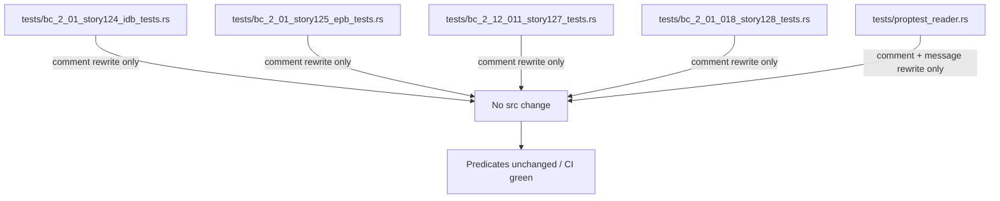
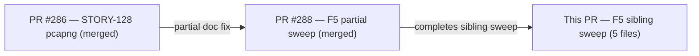
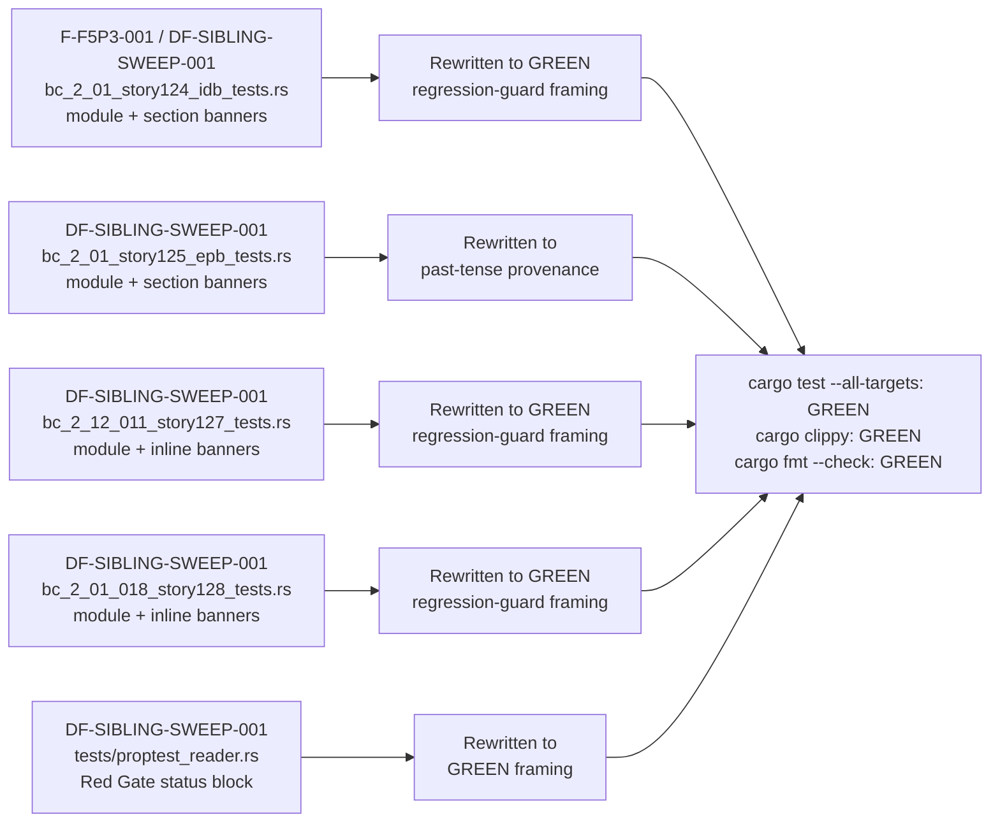

## Summary

F5 Pass-3 sibling sweep: converts stale RED-Gate / `todo!()` prose to GREEN
regression-guard / past-tense provenance framing across 5 in-delta pcapng test
files that PR #288 only partially addressed.

Zero production-code changes, zero test-predicate changes, zero logic changes.
Pure doc-comment and assertion-message text rewrites.

**Finding IDs:** F-F5P3-001 / DF-SIBLING-SWEEP-001  
**Severity:** MEDIUM (doc accuracy / maintainer confusion)  
**Policy basis:** F5 Pass-3 adversarial review — stale RED-Gate prose in
shipped GREEN test suites misrepresents implementation status and misleads
future maintainers. PR #288 fixed 3 files; this PR fixes the remaining 5.

---

## Architecture Changes

No architecture changes. This PR touches only test-file doc comments and
inline assertion-message strings. No `src/` files modified.

---

## Story Dependencies

No story dependencies. This is a standalone doc-accuracy fix targeting
already-merged pcapng stories (STORY-124, STORY-125, STORY-127, STORY-128).

---

## Spec Traceability

---

## Changed Files

| File | Change type | Insertions / Deletions |
|------|-------------|------------------------|
| `tests/bc_2_01_story124_idb_tests.rs` | Comment rewrite | +38 / -44 |
| `tests/bc_2_01_story125_epb_tests.rs` | Comment rewrite | +52 / -72 |
| `tests/bc_2_12_011_story127_tests.rs` | Comment rewrite | +77 / -121 |
| `tests/bc_2_01_018_story128_tests.rs` | Comment rewrite | +90 / -216 |
| `tests/proptest_reader.rs` | Comment rewrite | +6 / -12 |

**Total:** 263 insertions, 465 deletions — comments and doc strings only.
The high deletion count reflects removal of verbose RED-Gate failure rationale
blocks that are no longer accurate.

---

## Test Evidence

- `cargo test --all-targets`: GREEN (verified in worktree `.worktrees/f5-doctense-sweep` before push)
- `cargo clippy --all-targets -- -D warnings`: GREEN
- `cargo fmt --check`: GREEN
- Zero test predicates changed — all `assert!`, `prop_assert!`, `assert_eq!` call sites
  are structurally identical; only surrounding doc-comment text was updated.
- Orchestrator independently grep-verified: residual "passed their Red Gate phase" hits
  are all legitimate past-tense provenance language, not stale RED prose.

---

## Holdout Evaluation

N/A — evaluated at wave gate. This is a doc-accuracy fix, not a behavioral change.

---

## Adversarial Review

N/A — evaluated at Phase 5. These findings were produced by the F5 Pass-3
adversarial review run (DF-SIBLING-SWEEP-001 / F-F5P3-001 finding record).
PR #288 addressed the Pass-2 findings; this PR closes the Pass-3 sibling sweep.

---

## Security Review

**Skipped — not applicable.** This PR modifies only doc comments in test files.
No production code paths, no authentication logic, no input handling, no data
flows changed. OWASP Top 10 and injection analysis are not relevant to
comment-text rewrites in `#[cfg(test)]` context.

---

## Risk Assessment

| Dimension | Assessment |
|-----------|-----------|
| Blast radius | Zero — test-file comments only; no runtime behavior |
| Performance impact | None |
| API surface change | None |
| Rollback cost | Trivial — revert single squash commit |
| Risk classification | LOW |

---

## AI Pipeline Metadata

| Field | Value |
|-------|-------|
| Pipeline mode | Feature / doc-accuracy fix |
| Models used | claude-sonnet-4-6 (PR manager) |
| Finding source | F5 Pass-3 adversarial review |
| Worktree | `.worktrees/f5-doctense-sweep` |
| Branch | `docs/f5-doctense-sibling-sweep` |
| Partial fix | PR #288 (`docs/f5-test-doc-tense-sweep`) addressed 3 files |
| This PR completes | 5 remaining in-delta files |

---

## Pre-Merge Checklist

- [x] PR description matches actual diff (comments only)
- [x] No test predicates changed (verified by diff inspection)
- [x] No production source files changed
- [x] `cargo test --all-targets` GREEN in worktree
- [x] `cargo clippy --all-targets -- -D warnings` GREEN
- [x] `cargo fmt --check` GREEN
- [x] Semantic PR title uses `docs:` type
- [x] Security review explicitly skipped with rationale (doc-only change)
- [ ] CI checks passing (pending)
- [ ] AI code review complete
- [ ] Squash-merged with branch cleanup
