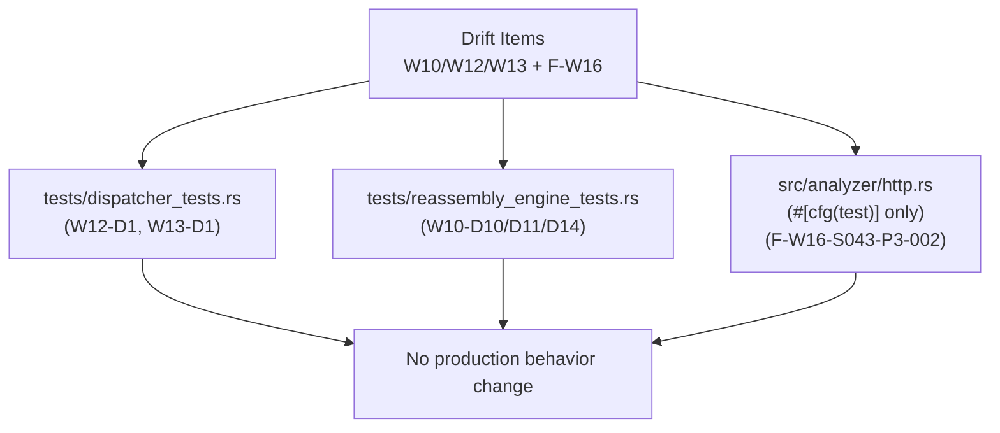
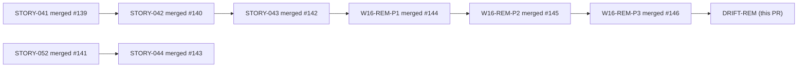
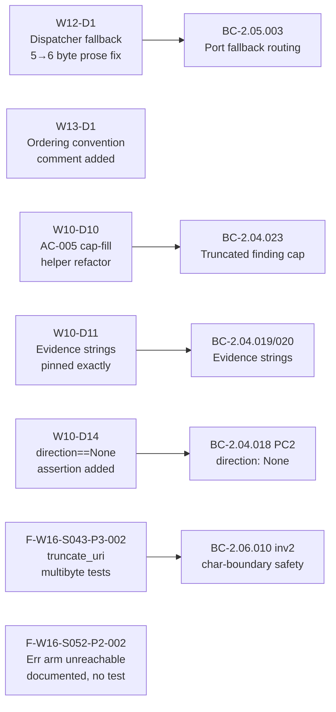

# test: drift-remediation coverage + assertion strengthening

**Scope:** Test-only — no production behavior changes
**Branch:** `test/drift-remediation-coverage`
**Commit:** `76ae222`
**Drift items addressed:** W10-D10, W10-D11, W10-D14, W12-D1, W13-D1, F-W16-S043-P3-002
**Unreachable-arm documented:** F-W16-S052-P2-002 (dead defensive code, no test added)

---

## Summary

Seven validated drift findings (DF-VALIDATION-001 policy satisfied) are remediated here.
All changes are confined to `tests/dispatcher_tests.rs`, `tests/reassembly_engine_tests.rs`,
and `#[cfg(test)]` blocks in `src/analyzer/http.rs` — zero production behavior change.

- **W12-D1:** Corrected "5-byte" → "6-byte" prose in three dispatcher fallback test assertions
  (the actual test arrays at those sites are `[0x16,0x04,0x01,0x00,0x01,0xFF]` = 6 bytes).
  Port-80/8080 tests use genuine 5-byte arrays and are unchanged.
- **W13-D1:** Added top-of-file block comment to `dispatcher_tests.rs` documenting the
  BC-prefixed test ordering/grouping convention.
- **W10-D10:** Refactored `test_BC_2_04_023_truncated_finding_dropped_at_cap` to use the
  existing `fill_findings_to_cap` helper instead of re-implementing the 10,000-flow fill loop.
  Behavior identical; eliminates duplicated logic.
- **W10-D11:** Pinned exact evidence strings in `test_BC_2_04_019` ("Possible evasion attempt")
  and `test_BC_2_04_020` ("Long unbroken run of undersized TCP segments; possible
  segmentation-based IDS evasion") against the canonical source values in `src/reassembly/mod.rs`.
- **W10-D14:** Added `assert_eq!(f.direction, None)` to `test_BC_2_04_018` covering BC-2.04.018
  PC2 (ConflictingOverlap findings carry `direction: None`).
- **F-W16-S043-P3-002:** Added three `#[cfg(test)]` unit tests in `src/analyzer/http.rs` for
  `truncate_uri` — exercises multibyte char-boundary safety (2-byte 'é', 4-byte '🎯' codepoints
  with byte limit mid-codepoint) per BC-2.06.010 invariant 2.
- **F-W16-S052-P2-002:** The `Err(_)` arm in `handle_client_hello` is functionally unreachable
  via `on_data` (nom `many0(complete(...))` absorbs Error, returns Ok). Documented as dead
  defensive code in commit message; no test added.

---

## Architecture Changes

---

## Story Dependencies

All upstream PRs already merged. No blockers.

---

## Spec Traceability

---

## Findings Detail

| Finding ID | Severity | File | Description |
|------------|----------|------|-------------|
| W12-D1 | MEDIUM | `tests/dispatcher_tests.rs` | "5-byte" → "6-byte" prose in 3 assertion messages for port-443/8443/8443-canonical tests |
| W13-D1 | LOW | `tests/dispatcher_tests.rs` | Top-of-file ordering convention block comment |
| W10-D10 | LOW | `tests/reassembly_engine_tests.rs` | Use `fill_findings_to_cap` helper in cap-fill test |
| W10-D11 | MEDIUM | `tests/reassembly_engine_tests.rs` | Pin exact evidence strings for T1036 and small-segment findings |
| W10-D14 | MEDIUM | `tests/reassembly_engine_tests.rs` | Add `direction == None` assertion for ConflictingOverlap |
| F-W16-S043-P3-002 | MEDIUM | `src/analyzer/http.rs` (#[cfg(test)]) | 3 new unit tests for `truncate_uri` multibyte char-boundary safety |
| F-W16-S052-P2-002 | INFO | — (documented only) | `Err(_)` arm in `handle_client_hello` is unreachable via `on_data`; no test added |

---

## Test Evidence

- `cargo test --all-targets` — ~847 tests, all green
- `cargo clippy --all-targets -- -D warnings` — clean
- `cargo fmt --check` — clean
- Files changed: 3 files (+135/-53), all test code
- Zero production code added or modified; blast radius = zero

---

## Holdout Evaluation

N/A — evaluated at wave gate.

---

## Adversarial Review

All drift findings validated per DF-VALIDATION-001 before implementation.
F-W16-S052-P2-002 documented as dead defensive code with nom `many0/complete` semantics
explanation; no regression risk.

---

## Demo Evidence

N/A — test-quality and assertion-strengthening fixes only. No new user-visible ACs
introduced. Prior demo evidence for affected stories remains valid and unaffected.

---

## Security Review

N/A — test-only changes (plus one `#[cfg(test)]` module in `src/`). No production paths
modified. No new dependencies introduced. No input validation, authentication, or
data-handling production code touched.

---

## Risk Assessment

- **Blast radius:** Zero — all changes are in `#[cfg(test)]` or `tests/`. No production
  behavior altered.
- **Performance impact:** None.
- **Rollback:** Trivial — test-only changes can be reverted without any runtime impact.

---

## AI Pipeline Metadata

- **Pipeline mode:** brownfield-drift-remediation
- **Models used:** claude-sonnet-4-6
- **Policy satisfied:** DF-VALIDATION-001 (all drift items validated before fix)

---

## Pre-Merge Checklist

- [x] PR description matches actual diff (test-only, 7 drift items)
- [x] All upstream story PRs and wave PRs merged
- [x] `cargo test --all-targets` green (~847 tests)
- [x] `cargo clippy --all-targets -- -D warnings` clean
- [x] `cargo fmt --check` clean
- [x] Security review: N/A (test-only)
- [x] Demo evidence: N/A (no new ACs)
- [x] Semantic PR title: `test: drift-remediation coverage + assertion strengthening`
- [x] Target branch: `develop`
- [x] DF-VALIDATION-001 policy: all items validated before filing
