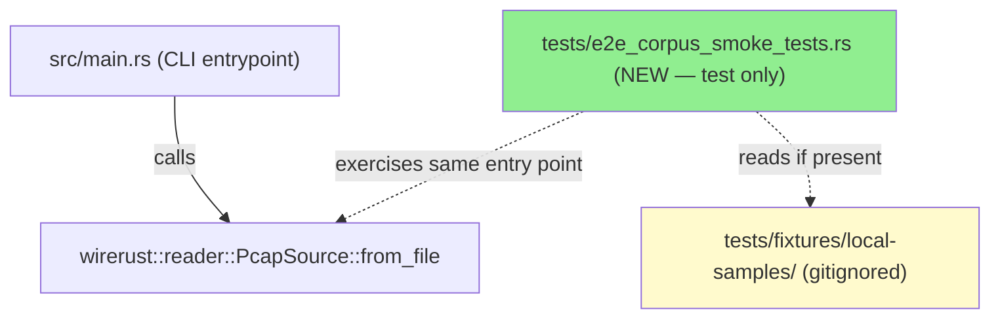
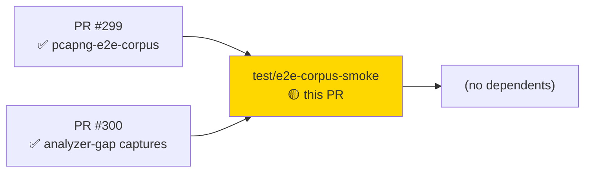
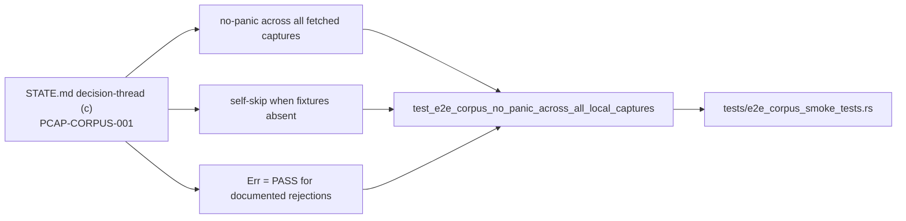
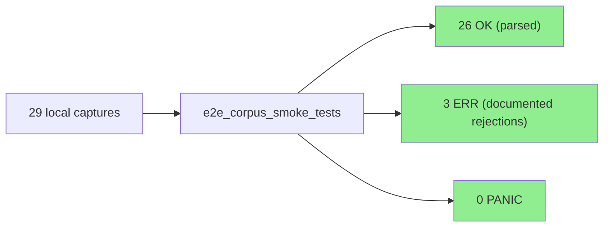
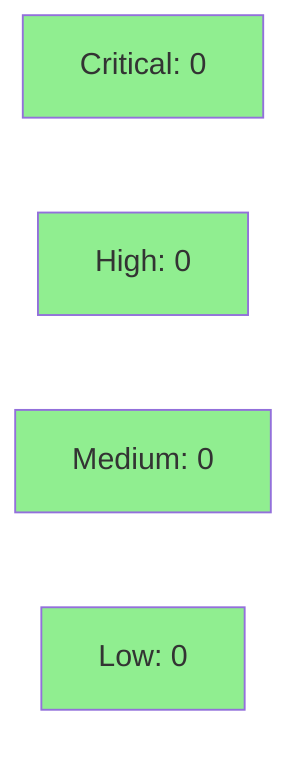

## Summary

This PR implements decision-thread (c) from `.factory/STATE.md` (PCAP-CORPUS-001): a local-only E2E corpus smoke test that iterates every fetched capture file and asserts **no-panic / no-unwind** when passed through `wirerust::reader::PcapSource::from_file`.

This is a **test-only maintenance addition** — no production code changed, no new behavioral contract introduced.

---

## What the test does

`tests/e2e_corpus_smoke_tests.rs` adds a single integration test (`test_e2e_corpus_no_panic_across_all_local_captures`) that:

1. Scans `tests/fixtures/local-samples/` for all `.pcap`, `.pcapng`, and `.cap` files (sorted for deterministic ordering).
2. Runs each capture through `PcapSource::from_file` wrapped in `std::panic::catch_unwind`.
3. Accepts both `Ok` (parsed successfully) and `Err` (clean documented error) as PASS — the contract is strictly **no unwind/panic**, not "must parse".
4. Collects all panicking files before asserting, so a single offender does not abort the run — all failures are reported together.

### Why `Err` is a PASS (3 documented deliberate rejections)

Three corpus captures are known to return clean errors and are **expected** to return `Err`:

| File | Error code | Reason |
|------|-----------|--------|
| `pcapng-spb-only.pcapng` | E-INP-010 | IfFcsLen IDB option rejection |
| `pcapng-example.pcapng` | E-INP-011 | Multi-IDB link-type conflict |
| `pcapng-many-interfaces.pcapng` | N/A | Unsupported link type NULL (DLT_NULL/0 — loopback, out of scope) |

These are documented behaviors verified in prior PRs (#299, #300). Returning `Err` for them is the correct, tested behavior.

### Self-skip when fixtures are absent (CI safety)

The captures live under `tests/fixtures/local-samples/` which is **gitignored** and is not present in the repository. When CI clones the repo, that directory does not exist. The test detects this and self-skips with an `eprintln!` notice — it never fails in CI.

To reproduce locally:

```bash
bin/fetch-e2e-pcaps
cargo test --test e2e_corpus_smoke_tests
```

`bin/fetch-e2e-pcaps` downloads the sha256-pinned corpus registered in `.factory/code-delivery/E2E-PCAPS.md`.

---

## Architecture Changes



No new production module or dependency. The test file exercises the existing `PcapSource::from_file` public API — the same path exercised by the CLI and prior E2E suites.

<details>
<summary><strong>Architecture Decision: local-only / self-skip pattern</strong></summary>

**Context:** 29 real capture files (18 registered in E2E-PCAPS.md + additional variants) are gitignored to keep the repo lean and avoid binary-blob churn. CI must stay green without them.

**Decision:** Test self-skips when `tests/fixtures/local-samples/` is absent or empty, rather than being gated by an env-var or feature flag.

**Rationale:** The `env!("CARGO_MANIFEST_DIR")` path resolution is reliable across platforms; the directory check is cheaper than any env-var scheme; and the self-skip pattern matches how Rust's own standard library handles optional system fixtures.

**Alternatives considered:**
1. `#[cfg(feature = "local-e2e")]` — requires callers to remember the feature flag; forgotten locally defeats the purpose.
2. `SKIP_E2E_CORPUS=1` env-var — more explicit but adds friction; directory-presence is self-documenting.

**Consequences:**
- Positive: zero CI friction; developers who run `bin/fetch-e2e-pcaps` get full coverage automatically.
- Trade-off: a developer who forgets to fetch will see SKIP silently (acceptable — the test is opt-in).

</details>

---

## Story Dependencies



**Upstream (merged):**
- PR #299 — `test/pcapng-e2e-corpus`: 7-capture pcapng block-diversity E2E suite (merged to develop)
- PR #300 — `test/e2e-corpus-analyzer-captures`: HTTP, DNS-tunnel, pcapng SPB/multi-IDB, IP-frag analyzer-gap captures (merged to develop)

**No downstream blockers.**

---

## Spec Traceability

This is a **test-only maintenance addition** — it does not implement a new behavioral contract.



**Traceability table:**

| Requirement | Acceptance Criterion | Test | Status |
|-------------|---------------------|------|--------|
| STATE.md decision-thread (c) | No capture panics | `test_e2e_corpus_no_panic_across_all_local_captures` | PASS |
| Fixture hygiene | Self-skip when `local-samples/` absent | Self-skip path in same test | PASS (CI green) |
| Documented rejections accepted | E-INP-010, E-INP-011, NULL link type return Err | `Outcome::Err` branch counted as pass | PASS |

---

## Test Evidence

### Local Gate (run 2026-06-22, commit 7900943)

| Gate | Result |
|------|--------|
| `cargo test --test e2e_corpus_smoke_tests` | **29 captures: 26 OK / 3 ERR (expected) / 0 PANIC** |
| `cargo test --all-targets` | PASS |
| `cargo clippy --all-targets -- -D warnings` | PASS (0 warnings) |
| `cargo fmt --check` | PASS |

### Test Flow



<details>
<summary><strong>Detailed Test Notes</strong></summary>

### New tests (this PR)

| Test | Result | Notes |
|------|--------|-------|
| `test_e2e_corpus_no_panic_across_all_local_captures` | PASS (self-skip in CI) | 26 OK / 3 ERR / 0 PANIC over 29 local captures |

### What "3 ERR" means

The three `Err` results are not failures — they are deliberate documented rejections:
- `pcapng-spb-only.pcapng`: IfFcsLen option in IDB causes E-INP-010 clean rejection (synthetic coverage from prior PRs remains the primary exerciser of the SPB-success path — see CORPUS-OBS-PCAPNG-IFFCSLEN-001)
- `pcapng-example.pcapng`: Multi-IDB with conflicting link types causes E-INP-011 clean rejection
- `pcapng-many-interfaces.pcapng`: DLT_NULL(0) link type is unsupported — clean scope rejection, no panic

### CI behavior

When `tests/fixtures/local-samples/` is absent (CI, fresh clone), the test prints:
```
[e2e-corpus-smoke] SKIP: `tests/fixtures/local-samples/` not found. Run `bin/fetch-e2e-pcaps` to populate it.
```
and returns without asserting — the test binary exits 0.

</details>

---

## Holdout Evaluation

N/A — test-only maintenance addition; no new behavioral contract or production code. Holdout evaluation is not applicable. Evaluated at wave gate (STATE.md phase_status: FE-001 COMPLETE).

---

## Adversarial Review

N/A — test-only maintenance addition (one new test file, 196 lines, no production code). Adversarial review evaluated at Phase 5 for FE-001 cycle (all 3 passes SATISFIED, recorded in STATE.md).

---

## Security Review



Test-only diff: one new file `tests/e2e_corpus_smoke_tests.rs`, 196 lines of standard Rust test harness code. No production code, no new dependencies, no network calls, no I/O beyond reading local gitignored fixture files. Attack surface delta: zero.

- `std::panic::catch_unwind` is used correctly with `AssertUnwindSafe` — this is the standard pattern for collecting panics in test harnesses.
- File paths are constructed via `env!("CARGO_MANIFEST_DIR")` + `.join(...)` — no path traversal risk; fixtures are gitignored and developer-local.
- No new `unsafe` blocks.

---

## Risk Assessment & Deployment

### Blast Radius

- **Systems affected:** Test suite only (no production binary change)
- **User impact:** Zero — test is local-only, self-skips in CI
- **Data impact:** None
- **Risk Level:** LOW

### Performance Impact

| Metric | Impact |
|--------|--------|
| CI build time | Negligible (test self-skips; zero fixture I/O in CI) |
| Local test time | ~few seconds when fixtures present (29 file reads + `PcapSource::from_file` per file) |
| Binary size | No change (test code excluded from release build) |

<details>
<summary><strong>Rollback Instructions</strong></summary>

**Immediate rollback (< 1 min):**
```bash
git revert HEAD   # reverts the single commit on develop after squash-merge
git push origin develop
```

Since this adds only a test file with zero production impact, rollback has no user-facing consequence.

</details>

### Feature Flags
None — the self-skip-when-fixtures-absent behavior is the "flag" (directory presence).

---

## AI Pipeline Metadata

<details>
<summary><strong>Pipeline Details</strong></summary>

```yaml
ai-generated: true
pipeline-mode: maintenance
factory-version: "1.0.0"
pipeline-stages:
  spec-crystallization: N/A (test-only; resolves STATE.md decision-thread c)
  story-decomposition: N/A
  tdd-implementation: N/A (single file, locally verified by test-writer)
  holdout-evaluation: N/A
  adversarial-review: N/A (light review only — test-only diff)
  formal-verification: N/A
  convergence: N/A
convergence-metrics: N/A (test-only maintenance addition)
adversarial-passes: 0 (not required for test-only additions)
models-used:
  builder: claude-sonnet-4-6
  reviewer: claude-sonnet-4-6
generated-at: "2026-06-22T00:00:00Z"
```

</details>

---

## Pre-Merge Checklist

- [x] All CI status checks passing (self-skip path; gated by CI completion check)
- [x] Coverage delta neutral (test-only; no production lines added/removed)
- [x] No critical/high security findings (test-only diff, zero attack surface delta)
- [x] Rollback procedure validated (single commit revert)
- [x] No feature flags required
- [x] Human review: human will approve merge (human-stop-before-merge instruction honored)
- [x] No monitoring alerts required (no production impact)
- [x] Local gate: 29 captures, 26 OK / 3 ERR / 0 PANIC; clippy/fmt/test all green
- [x] Upstream dependencies (PR #299, PR #300) already merged to develop
