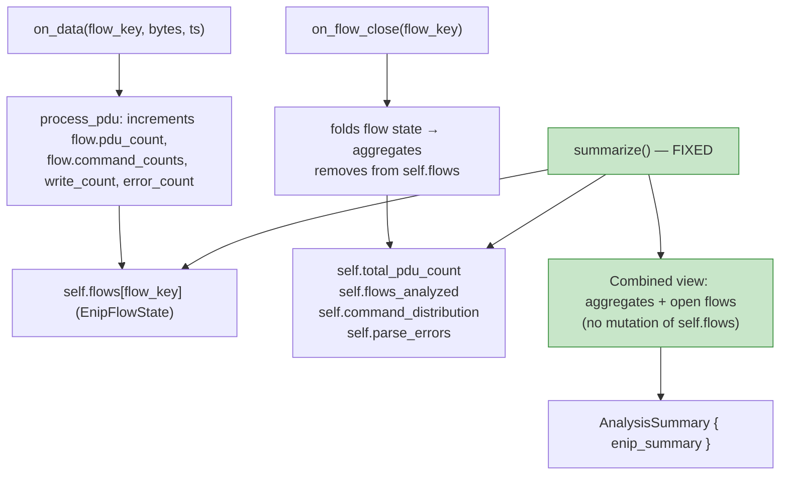
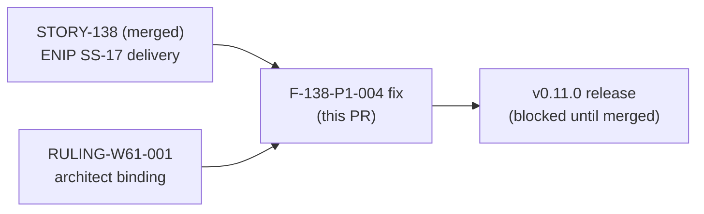
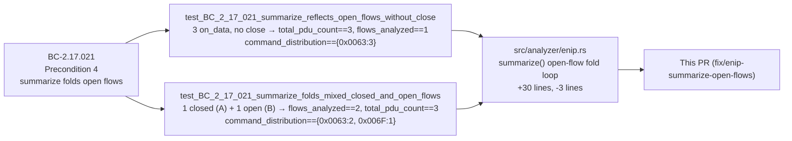

## Summary

Fixes Wave-61 release-blocking finding **F-138-P1-004**: `EnipAnalyzer::summarize()` returned
zeros for `total_pdu_count`, `command_distribution`, `parse_errors`, and `flows_analyzed` on
any real pcap capture because the dispatcher never calls `on_flow_close` for ENIP flows.

Per **RULING-W61-001** (architect binding ruling, 2026-06-26), the fix mirrors the DNP3 sibling
pattern: `summarize()` now folds still-open `self.flows.values()` on top of the pre-accumulated
closed-flow aggregates at call time. `self.flows` is not mutated; no double-count is possible
(disjointness guaranteed by `on_flow_close` removing a flow from `self.flows` before folding
it into aggregates).

Closes F-138-P1-004 · References #316

---

## Problem

`EnipAnalyzer` aggregates four summary fields (`total_pdu_count`, `parse_errors`,
`command_distribution`, `flows_analyzed`) exclusively via `on_flow_close`. The dispatcher's
ENIP flow-close arm is a documented no-op:

```rust
Some(DispatchTarget::Enip) => {
    // EnipAnalyzer does not implement StreamHandler; no forwarding needed.
    let _ = reason;
}
```

For any pcap where TCP sessions are not explicitly torn down (the common case, especially
truncated or one-sided captures), `on_flow_close` is never called. Result in production:

| Field               | Pre-fix production value |
|---------------------|--------------------------|
| `command_distribution` | `{}` (empty map)       |
| `total_pdu_count`   | `0`                      |
| `parse_errors`      | `0`                      |
| `flows_analyzed`    | `0`                      |
| `write_count`       | Correct (direct increment in `process_pdu`) |
| `error_count`       | Correct (direct increment in `process_pdu`) |
| `dropped_findings`  | Correct                  |

The BC-2.17.021 canonical test vector ("3 ListIdentity, 1 flow → flows_analyzed:1,
total_pdu_count:3") was not met in production.

---

## Fix (RULING-W61-001 approach (a) — summarize-time fold)

Change is **confined to `EnipAnalyzer::summarize()` in `src/analyzer/enip.rs`**.
No changes to `dispatcher.rs`, `main.rs`, `on_flow_close`, or any BC other than
the additive Invariant-2 clarification deferred to cycle-close.

### Why approach (a) and not dispatcher drain (b)

1. **Signature mismatch** — `EnipAnalyzer::on_flow_close` takes `flow_key` by value with
   no `reason` parameter; bridging to the dispatcher's `on_flow_close(flow_key, reason)`
   requires changing the ENIP signature (BC-2.17.017 anchor edit) or an adapter.
2. **End-of-capture enumeration** — draining open flows at capture end requires new
   production logic in `dispatcher.rs` / `main.rs`.
3. **DNP3 precedent** — `Dnp3Analyzer::summarize()` uses the same fold pattern; ADR-010
   Decision 4 documents ENIP as mirroring DNP3. Approach (b) creates unjustified asymmetry.
4. **Common pcap case** — approach (b) only helps explicit-teardown flows; approach (a)
   handles both teardown and no-teardown identically.

### No-double-count proof

`on_flow_close` calls `self.flows.remove(&flow_key)` before folding into aggregates.
A flow cannot be simultaneously in `self.flows` AND in the closed-flow aggregates.
Therefore `self.flows.values()` at summarize time contains only flows never passed to
`on_flow_close` — the exact population that must be included.

### DNP3 parity

`Dnp3Analyzer::summarize()` reads `self.flows.len()` and iterates `self.flows.values()`
directly; it has no `flows_analyzed` aggregate field and does not depend on `on_flow_close`
firing. The ENIP fix brings full parity with the sibling.

---

## Architecture Changes



---

## Story Dependencies



---

## Spec Traceability



---

## Test Evidence

| Test | Scenario | Result |
|------|----------|--------|
| `test_BC_2_17_021_summarize_reflects_open_flows_without_close` (Part A) | 3 × ListIdentity on_data, summarize WITHOUT close | total_pdu_count==3, flows_analyzed==1, command_distribution=={0x0063:3} — **GREEN** |
| `test_BC_2_17_021_summarize_reflects_open_flows_without_close` (Part B) | Same + on_flow_close, then summarize | Identical values (no double-count) — **GREEN** |
| `test_BC_2_17_021_summarize_folds_mixed_closed_and_open_flows` | 1 closed flow (A: 2× ListIdentity) + 1 open flow (B: 1× SendRRData) | flows_analyzed==2, total_pdu_count==3, command_distribution=={0x0063:2,0x006F:1} — **GREEN** |
| Full `cargo test --all-targets` | All tests | 0 failures — **GREEN** |
| `cargo clippy --all-targets -- -D warnings` | Lint | Clean — **GREEN** |
| `cargo fmt --check` | Format | Clean — **GREEN** |

Both discriminating tests were **RED before the fix** (pre-fix code returned zeros for all four
aggregate fields when `on_flow_close` was not called).

**Adversarial fix-review result:** CLEAN — 0 HIGH, 0 CRITICAL findings. Fold correctness,
no-double-count invariant, schema preservation, and non-regression all verified.

---

## Holdout Evaluation

N/A — evaluated at wave gate (Wave 61).

---

## Adversarial Review

N/A — evaluated at Phase 5 / Wave 61. Fix-specific adversarial review: CLEAN (0 HIGH/CRITICAL).

---

## Security Review

**Result: CLEAN — 0 CRITICAL, 0 HIGH findings.**

| ID | Severity | CWE | Description | Disposition |
|----|----------|-----|-------------|-------------|
| SEC-001 | LOW | CWE-682 | Disjointness proof: `on_flow_close` remove-before-fold invariant | Proved sound — no action |
| SEC-002 | LOW | CWE-682 | `write_count`/`error_count` exclusion from open-flow fold | Correct by design (per-event not per-flow) — no action |
| SEC-003 | LOW | CWE-190 | Integer overflow — all counters use `saturating_add` | Verified safe — no action |
| SEC-004 | LOW | CWE-400 | `HashMap::clone()` allocation at summarize time | Bounded at 65,536 entries (u16 key space), called once at capture-end — no action |
| SEC-005 | N/A | N/A | New attack surface from fold loop | None introduced — read-only accumulate over already-validated state |
| SEC-006 | MEDIUM | CWE-119 | Pre-existing unsafe split-borrow in `on_data` | Pre-existing, NOT introduced by this PR; maintenance backlog item |

SEC-006 is the only MEDIUM finding and is explicitly pre-existing (not in this PR's diff). The PR is approved from a security standpoint.

---

## Deferred Items (ruling-sanctioned, non-blocking)

1. **BC-2.17.021 Invariant 2 prose clarification** — the current text says "does NOT re-scan
   flow state" and "Aggregate counters must be up-to-date from `on_flow_close`". These clauses
   describe the unimplemented wiring variant (option b) and are now incorrect. The clarification
   is a cycle-close factory-artifacts edit (spec-steward pass), not a code change. RULING-W61-001
   explicitly sanctions this as a post-merge edit.
2. **ENIP hex vs DNP3 decimal command_distribution key format** — pre-existing convention
   difference between subsystems; no action required in this PR.

---

## Risk Assessment

| Dimension | Assessment |
|-----------|-----------|
| Blast radius | Low — one method (`summarize()`), one file (`src/analyzer/enip.rs`) |
| Public API surface | No change — `summarize()` signature and `AnalysisSummary` type unchanged |
| Performance impact | One `HashMap::clone()` per `summarize()` call (called once per run at capture end) — negligible |
| Regression risk | None — `write_count` and `error_count` are NOT re-folded (they are per-event, not per-flow-close aggregates); double-count guard is disjointness via `remove()` |
| Rollback | Revert commits `82ed7ba` and `8e1ffc1` |

---

## AI Pipeline Metadata

| Field | Value |
|-------|-------|
| Pipeline mode | Fix-PR (Wave-61 integration finding) |
| Finding | F-138-P1-004 [release-blocking] |
| Architect ruling | RULING-W61-001 (binding, 2026-06-26) |
| Models used | claude-sonnet-4-6 |
| Fix blast radius | Low (1 method, 1 file) |

---

## Pre-Merge Checklist

- [x] PR description matches actual diff
- [x] Discriminating tests RED before fix, GREEN after
- [x] Full `cargo test --all-targets` green
- [x] `cargo clippy --all-targets -- -D warnings` clean
- [x] `cargo fmt --check` clean
- [x] No public API surface changes
- [x] No double-count: disjointness guaranteed by `on_flow_close` remove-before-fold
- [x] DNP3 parity: mirrors `Dnp3Analyzer::summarize()` pattern
- [x] RULING-W61-001 compliance verified
- [ ] Security review complete (Step 4)
- [ ] AI review (pr-reviewer) converged to APPROVE
- [ ] CI checks passing
- [ ] Human merge authorization received (D-231 halt)
