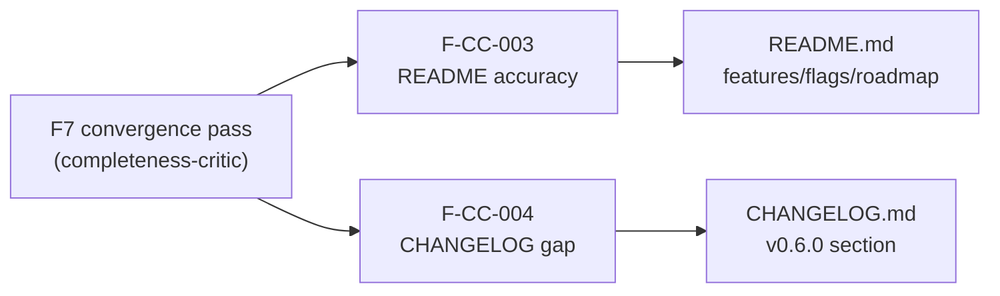
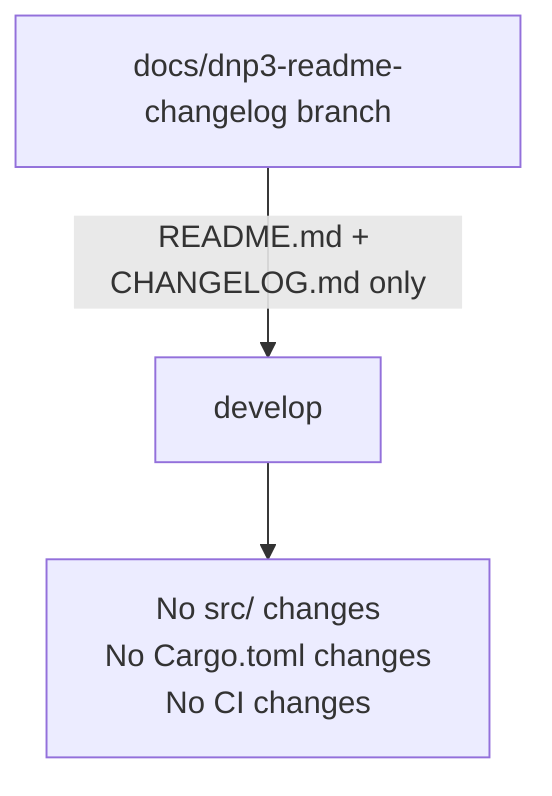

## docs(dnp3): document DNP3 analyzer + CLI flags in README/CHANGELOG (F-CC-003/004)

### Fix Summary

**Findings addressed:**
- **F-CC-003** — README listed shipped features (Modbus TCP, DNP3, MITRE mapping) in the "Roadmap/planned" section, actively misleading users about the current capability set
- **F-CC-004** — CHANGELOG had zero entry for v0.6.0 while DNP3 TCP analysis is the headline feature of that release

**Source phase:** F7 delta-convergence / completeness-critic pass
**Severity:** MEDIUM (user-facing documentation accuracy)
**Scope:** Docs only — `README.md` and `CHANGELOG.md`; no source code touched

---

### What Changed

**README.md**
- Features section: updated protocol list to include Modbus TCP and DNP3 TCP with accurate capability descriptions
- Added `--modbus`, `--modbus-write-burst-threshold`, `--modbus-write-sustained-threshold`, `--dnp3`, `--dnp3-direct-operate-threshold`, and `--mitre` to the Analyze flags block; removed the previously documented but non-existent `-v`/`--verbose` flag
- Added "Supported Protocol Analyzers" table listing all 5 protocol analyzers with port, flag, default, and MITRE ATT&CK for ICS techniques
- Added "DNP3 TCP Analyzer" subsection with full detection table (9 detections, technique IDs, tactics, and triggers)
- Roadmap section: removed "MITRE ATT&CK mapping" and "ICS/OT protocols (Modbus, DNP3)" — these are now shipped, not planned

**CHANGELOG.md**
- Added `[0.6.0] - 2026-06-12` section documenting: DNP3 TCP analyzer (port 20000, Rule 6), 5 MITRE ATT&CK for ICS techniques (T1692.001/T1691.001/T0827/T0814/T0836), new CLI flags (`--dnp3`, `--dnp3-direct-operate-threshold`), `MitreTactic::IcsImpact` variant, T1691.001 and T0827 catalog entries, and formal verification (Kani VP-023, fuzz, mutation)
- Updated `[Unreleased]` compare link from `v0.5.0...HEAD` to `v0.6.0...HEAD`
- Added `[0.6.0]` compare link

---

### Why

The F7 completeness-critic convergence pass identified two accuracy gaps in user-facing docs that misrepresent the shipped capability set. Leaving DNP3/Modbus in the "planned" roadmap after shipping them, and shipping v0.6.0 without a CHANGELOG entry, degrades release traceability and would confuse downstream users.

---

### Spec Traceability

---

### Architecture Changes

No source code changes. Docs-only fix.

---

### Security Review

Docs-only change. Reviewed for:
- No credentials, tokens, or API keys introduced
- No internal URLs or sensitive endpoint references
- No executable code paths modified
- External links checked: only existing GitHub compare URLs (standard CHANGELOG format)

Result: **CLEAN** — no security findings.

---

### Test Evidence

- `cargo build` passes in worktree (docs-only; no compilation changes)
- `cargo fmt --check` passes in worktree
- No test changes — docs-only fix

---

### Risk Assessment

- **Blast radius:** Docs only — zero runtime impact
- **Performance impact:** None
- **Rollback:** Trivially revertable (2 markdown files)

---

### Pre-Merge Checklist

- [x] Docs changes accurately reflect the shipped code surface
- [x] No secrets or sensitive data introduced
- [x] `cargo fmt --check` clean
- [x] `cargo build` passes
- [x] PR title is semantic (`docs(dnp3): ...`)
- [x] Security review: CLEAN
- [x] CI must pass before merge

---

### AI Pipeline Metadata

- Pipeline mode: fix-pr-delivery (docs-only)
- Fix findings: F-CC-003, F-CC-004
- Branch: `docs/dnp3-readme-changelog`
- Worktree: `.worktrees/dnp3-docs`
