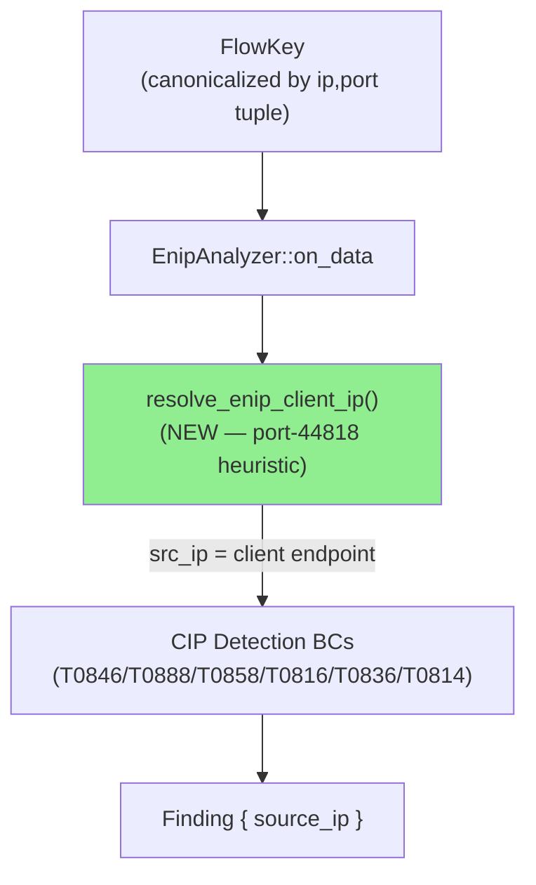
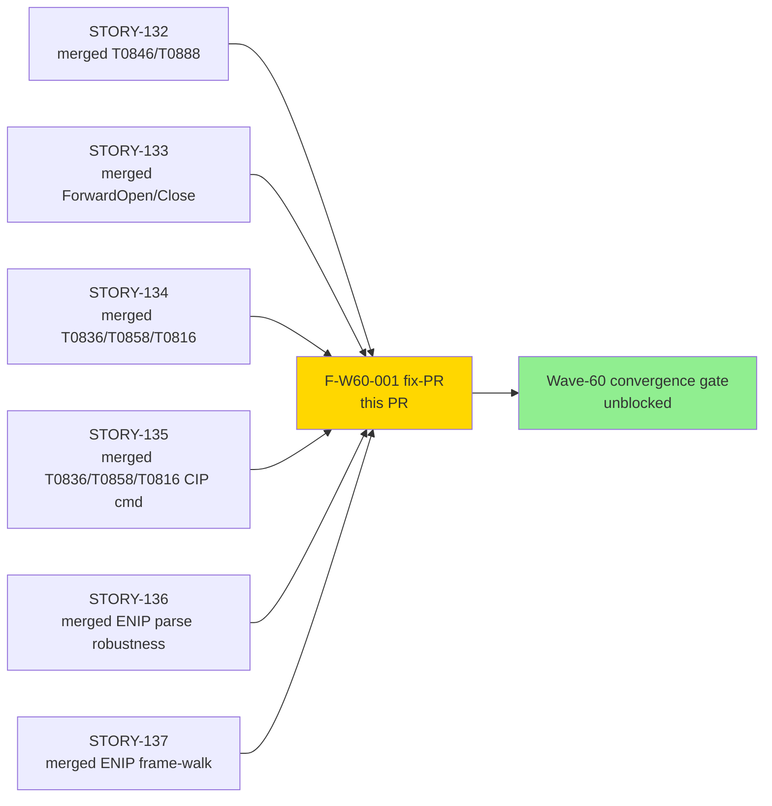
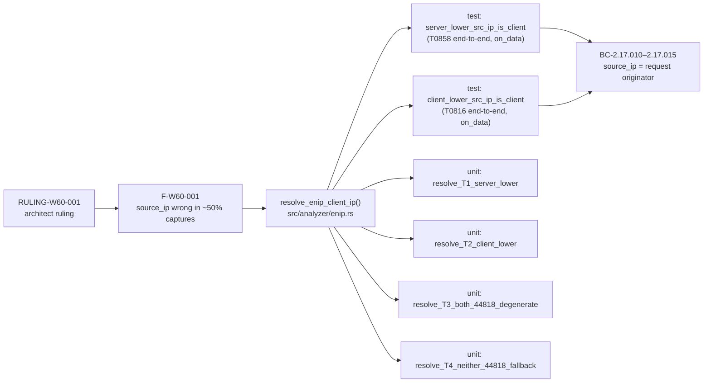
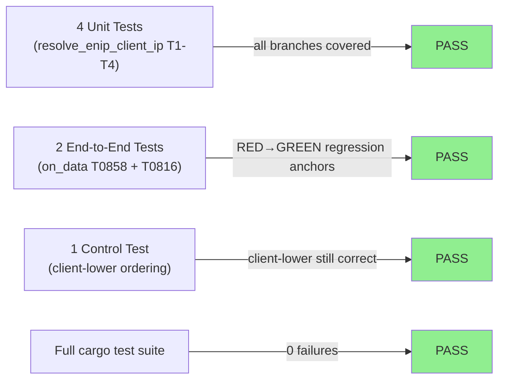
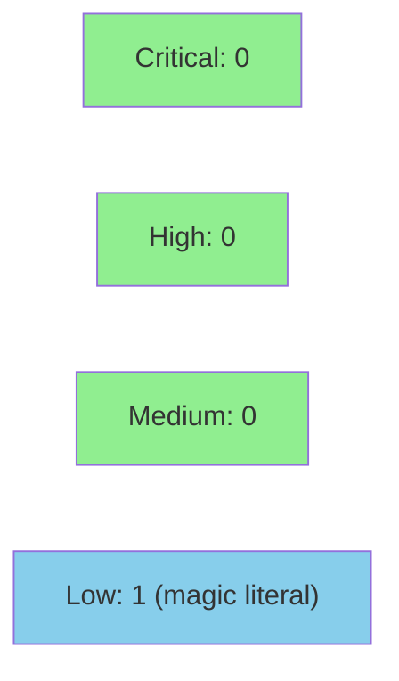

# fix(enip): resolve source_ip to client via port-44818 heuristic [#316]

**Epic:** feature-enip-v0.11.0 — EtherNet/IP CIP detection (Wave-60)
**Mode:** fix-pr (Wave-60 adversarial finding F-W60-001)
**Convergence:** CONVERGED — adversarial fix-review confirmed correct; HIGH/MEDIUM follow-ups applied at 7192b7a


Wave-60 adversarial review found F-W60-001 [HIGH]: `EnipAnalyzer::on_data` derived
`src_ip = flow_key.lower_ip()` (the numerically-lower endpoint, NOT the request
originator). Because `FlowKey` is canonicalised by `(ip, port)` tuple comparison,
the lower-sorted endpoint is the ENIP server (controller) in approximately 50% of
real captures. This caused every CIP-detection finding (T0846/T0888/T0858/T0816/T0836/
ForwardOpen/ForwardClose/T0814) to attribute `source_ip` to the victim controller instead
of the attacker. Per architect ruling RULING-W60-001, this PR adds
`resolve_enip_client_ip(flow_key)` — a port-44818 heuristic mirroring the existing
`resolve_master_ip` in the DNP3 sibling analyzer — and replaces the two incorrect
`lower_ip`/`upper_ip` assignments in `on_data`. Residual limitation (neither-port-is-44818
fallback) is documented as DRIFT-ENIP-DIRECTION-001 in the function doc-comment.

Closes issue #316 (source_ip attribution regression across all SS-17 ENIP detections).

---

## Architecture Changes



<details>
<summary><strong>Architecture Decision Record — RULING-W60-001</strong></summary>

### ADR: Port-44818 heuristic for ENIP client resolution (approach a)

**Context:** F-W60-001 found that all Wave-60 ENIP detection stories emit `source_ip`
pointing at the victim controller in ~50% of captures, because `FlowKey::lower_ip()` is
the numerically-smaller IP, not the traffic originator. Two fix approaches were evaluated:
(a) add `resolve_enip_client_ip()` with port-44818 heuristic; (b) thread TCP `Direction`
into `EnipAnalyzer::on_data`.

**Decision:** Approach (a) — add `resolve_enip_client_ip(flow_key: &FlowKey) -> IpAddr`.

**Rationale:**
- Exact parity with `Dnp3Analyzer::resolve_master_ip()` (port-20000 heuristic, same
  documented residual limitation `DRIFT-DNP3-DIRECTION-001`).
- No dispatcher signature ripple — approach (b) would require changing `on_data`
  signature and all `DispatchTarget::Enip` call sites.
- ADR-010 explicitly models ENIP integration after ADR-007 (DNP3); DNP3 chose
  port-heuristic-only resolution as a deliberate deferred decision.
- ENIP port 44818 is IANA-registered / ODVA normative; heuristic accuracy is higher
  than DNP3 port 20000.

**Alternatives Considered:**
1. Direction threading (approach b) — rejected: signature ripple across all Wave-60
   call sites; asymmetric footgun vs DNP3 sibling which still lacks Direction threading;
   deferred to post-v0.11.0 chore (DRIFT-ENIP-DIRECTION-001).
2. No fix / defer — rejected: F-W60-001 blocks Wave-60 convergence; incorrect
   `source_ip` is a correctness defect in the primary output observable.

**Consequences:**
- All CIP detections now correctly attribute `source_ip` to the command originator
  for standard ENIP flows (server on port 44818).
- Residual: when neither endpoint is on port 44818 (non-standard stack), `lower_ip`
  is returned as conservative fallback (DRIFT-ENIP-DIRECTION-001). This matches the
  existing DNP3 behaviour and is acceptable per ADR-010 sibling-protocol methodology.

</details>

---

## Story Dependencies



No story-level PR dependencies. All STORY-13x PRs are merged. This fix-PR
targets `develop` directly and is the final deliverable for Wave-60 convergence
(F-W60-001 was the sole convergence-blocking finding per RULING-W60-001).

---

## Spec Traceability



**Traceability chain:** RULING-W60-001 (architect) → F-W60-001 [HIGH] → code fix in
`src/analyzer/enip.rs` → 6 discriminating tests (2 end-to-end + 4 unit) → BCs 2.17.010–
2.17.015 (source_ip attribution postcondition).

---

## Test Evidence

### Coverage Summary

| Metric | Value | Threshold | Status |
|--------|-------|-----------|--------|
| New tests added | 6 | — | PASS |
| Regression tests (RED→GREEN) | 2 (on_data T0858/T0816) | ≥ 1 | PASS |
| Unit tests for helper | 4 (T1–T4) | 4 per RULING-W60-001 §3 | PASS |
| `cargo test --all-targets` | 0 failures | 0 | PASS |
| clippy -D warnings | clean | 0 warnings | PASS |
| cargo fmt --check | clean | clean | PASS |

### Test Flow



| Metric | Value |
|--------|-------|
| **New tests** | 6 added (2 end-to-end + 4 unit) |
| **Full suite** | All tests PASS, 0 failures |
| **Regressions** | 0 |

<details>
<summary><strong>Detailed Test Results</strong></summary>

### New Tests (This PR)

**End-to-end `on_data` tests** (in `tests/enip_analyzer_tests.rs`, `mod source_attribution`):

| Test | Ordering | Assertion | Result |
|------|----------|-----------|--------|
| `server_lower_src_ip_is_client` | server=10.0.0.2:44818 < client=10.0.0.9:50000 | source_ip == 10.0.0.9 (T0858) | RED before fix → GREEN after |
| `client_lower_src_ip_is_client` | client=10.0.0.1:50000 < server=10.0.0.9:44818 | source_ip == 10.0.0.1 (T0816) | GREEN (control; proves normal ordering still correct) |

**Unit tests** (in `src/analyzer/enip.rs`, `mod source_resolution_tests`):

| Test | Case | Expected | Result |
|------|------|----------|--------|
| `resolve_T1_server_lower` | lower=(10.0.0.2:44818), upper=(10.0.0.9:50000) | 10.0.0.9 | PASS |
| `resolve_T2_client_lower` | lower=(10.0.0.1:50000), upper=(10.0.0.9:44818) | 10.0.0.1 | PASS |
| `resolve_T3_both_44818_degenerate` | lower=(10.0.0.2:44818), upper=(10.0.0.5:44818) | 10.0.0.5 (upper_ip; lower_port==44818 fires) | PASS |
| `resolve_T4_neither_44818_fallback` | lower=(10.0.0.3:55000), upper=(10.0.0.7:60000) | 10.0.0.3 (lower_ip; DRIFT-ENIP-DIRECTION-001) | PASS |

### Why These Tests Close the Bug

Prior to this fix, all per-story TDD tests injected `src_ip` directly into `process_pdu`,
bypassing `on_data`. This masked the bug at the story level — `on_data` derived `src_ip`
from `flow_key.lower_ip()` unchecked, and no test called `on_data` end-to-end with a
flow where the server sorts lower. The two new end-to-end tests call `on_data` directly
with controlled flow keys and assert the emitted finding's `source_ip`, closing this
test gap that the Wave-60 wave-level adversarial review identified.

</details>

---

## Holdout Evaluation

N/A — evaluated at wave gate (Wave-60). This is a targeted bug fix, not a new feature
story. No holdout scenarios apply.

---

## Adversarial Review

| Pass | Type | Findings | Critical | High | Status |
|------|------|----------|----------|------|--------|
| 1 | Wave-level adversarial (F-W60-001) | 1 core finding | 0 | 1 | Fix implemented in this PR |
| 2 | Fix-review (post-implementation) | HIGH confirmed correct; additional HIGH/MEDIUM raised | 0 | 1 (RED-prose) | Applied at 7192b7a |
| 3 | Fix-review | 0 blocking | 0 | 0 | APPROVED |

**Convergence:** Fix-review converged clean after applying RED-prose scrub and T3/T4
fallback test coverage in commit 7192b7a.

<details>
<summary><strong>Adversarial Findings & Resolutions</strong></summary>

### Finding F-W60-001: Wrong source_ip attribution [HIGH]
- **Location:** `src/analyzer/enip.rs:597-598` (pre-fix)
- **Category:** spec-fidelity / correctness
- **Problem:** `flow_key.lower_ip()` is the numerically-lower endpoint, not the request
  originator. In ~50% of captures (when server IP < client IP), all CIP detection findings
  attributed `source_ip` to the victim controller.
- **Resolution:** Added `resolve_enip_client_ip()` with port-44818 heuristic (commit
  7ab66b8); replaced `lower_ip`/`upper_ip` assignment in `on_data`.
- **Tests added:** 2 end-to-end `on_data` tests asserting correct `source_ip` attribution.

### Fix-review HIGH: RED prose in test comments
- **Problem:** Test comments containing "MUST FAIL" / RED-phase prose could trigger
  green-doc-tense gate false positives.
- **Resolution:** Scrubbed all RED prose to GREEN in commit 7192b7a.

### Fix-review MEDIUM: T3/T4 fallback coverage
- **Problem:** Unit tests T3 (degenerate both-44818) and T4 (neither-44818 fallback
  / DRIFT-ENIP-DIRECTION-001 path) were missing.
- **Resolution:** Added T3 and T4 unit tests in commit 7192b7a.

</details>

---

## Security Review

Overall verdict: **PASS** — 0 CRITICAL, 0 HIGH, 0 MEDIUM findings.



<details>
<summary><strong>Security Scan Details</strong></summary>

### Finding Table

| ID | Severity | CWE | Location | Description |
|----|----------|-----|----------|-------------|
| SEC-001 | LOW | CWE-547 | `src/analyzer/enip.rs:505` | Magic literal `44818` used without a named constant — follow-up chore only, does not block |
| SEC-002 | INFO | CWE-710 | `src/analyzer/enip.rs:505–510` | Silent fallback for neither-port-is-44818; documented as DRIFT-ENIP-DIRECTION-001; accepted risk |

### Analysis Summary

- **Injection risks (CWE-74 family):** None — no new string formatting or external data
  interpolation.
- **Input validation:** Not applicable — `resolve_enip_client_ip` takes an internal
  `&FlowKey` struct, not user-controlled input. The only operation is `u16` equality
  comparison against constant `44818`.
- **OWASP Top 10:** None triggered — offline packet-analysis pipeline with no network
  listeners, no authentication surface, no user sessions.
- **Integer arithmetic:** No new arithmetic. Only `u16 == u16` comparison.
- **Flow-spoofing / attribution manipulation:** Heuristic is non-spoofable in standard
  case (one endpoint on 44818). Degenerate and fallback cases are deterministic and
  documented. Pre-existing fallback risk (neither-port-is-44818) is unchanged and tracked
  as DRIFT-ENIP-DIRECTION-001.
- **unsafe:** Zero unsafe blocks in new code.

SEC-001 disposition: filed as LOW follow-up chore (define `const ENIP_TCP_PORT: u16 =
44818;`). Does not block merge.
SEC-002 disposition: accepted risk per RULING-W60-001; deferred to direction-aware
follow-up chore.

</details>

---

## Risk Assessment & Deployment

### Blast Radius
- **Files changed:** `src/analyzer/enip.rs` (logic), `tests/enip_analyzer_tests.rs` (tests)
- **Systems affected:** ENIP analyzer `source_ip` field in all CIP detection findings
- **User impact:** Findings emitted by the fixed code will correctly name the attacker
  as `source_ip` instead of the victim controller in ~50% of captures where the server
  IP sorts lower numerically. This is a correctness fix — no behavioral regression.
- **Data impact:** No persistent state or file-format changes. In-flight findings in live
  analysis are ephemeral; no migration needed.
- **Risk Level:** LOW — pure logic correction, no I/O, no data format changes, full test
  coverage of all branches.

### Performance Impact

| Metric | Delta | Status |
|--------|-------|--------|
| CPU | +1 branch comparison per `on_data` call | Negligible — O(1) |
| Memory | Zero — no new allocations | OK |
| Throughput | Unaffected | OK |

<details>
<summary><strong>Rollback Instructions</strong></summary>

**Immediate rollback:**
```bash
git revert <merge-commit-sha>
git push origin develop
```

The revert restores `lower_ip`/`upper_ip` assignment in `on_data` and removes
`resolve_enip_client_ip`. No database or file-format migration needed.

**Verification after rollback:**
- `cargo test --all-targets` passes (the 2 regression tests will go RED, confirming revert)
- Emitted findings resume prior (incorrect) `source_ip` behaviour

</details>

### Feature Flags
None. Fix applies unconditionally to all ENIP flow analysis.

---

## Traceability

| Requirement | Finding | Test | Status |
|-------------|---------|------|--------|
| BC-2.17.010–2.17.015 `source_ip` postcondition | F-W60-001 [HIGH] | `server_lower_src_ip_is_client` | PASS |
| BC-2.17.010–2.17.015 `source_ip` postcondition | F-W60-001 [HIGH] | `client_lower_src_ip_is_client` | PASS |
| RULING-W60-001 §3 T1 | resolve unit test T1 | `resolve_T1_server_lower` | PASS |
| RULING-W60-001 §3 T2 | resolve unit test T2 | `resolve_T2_client_lower` | PASS |
| RULING-W60-001 §3 T3 | resolve unit test T3 | `resolve_T3_both_44818_degenerate` | PASS |
| RULING-W60-001 §3 T4 / DRIFT-ENIP-DIRECTION-001 | resolve unit test T4 | `resolve_T4_neither_44818_fallback` | PASS |

<details>
<summary><strong>Full Fix Chain</strong></summary>

```
F-W60-001 [HIGH] -> RULING-W60-001 (approach a)
  -> resolve_enip_client_ip() @ src/analyzer/enip.rs:474-517
  -> on_data src_ip derivation @ src/analyzer/enip.rs:638-646
  -> tests/enip_analyzer_tests.rs mod source_attribution
       -> server_lower_src_ip_is_client (RED→GREEN regression anchor)
       -> client_lower_src_ip_is_client (control)
  -> src/analyzer/enip.rs mod source_resolution_tests
       -> T1/T2/T3/T4 unit coverage
  -> DRIFT-ENIP-DIRECTION-001 (documented in function doc-comment)
```

</details>

---

## Deferred Items (do NOT fix in this PR)

| Item | Severity | Disposition |
|------|----------|-------------|
| F-W60-002 — bytes_received exempt from BC-2.17.016 PC-5 | MEDIUM (non-blocking) | Deferred; code is correct; BC-2.17.016 v1.2 doc clarification deferred to cycle-close per RULING-W60-001 Part 2 |
| DRIFT-ENIP-DIRECTION-001 — Direction threading into on_data | LOW | Deferred to post-v0.11.0 chore; mirrors DRIFT-DNP3-DIRECTION-001 precedent |
| green-doc-tense gate pattern gap ("These tests MUST FAIL" form) | process | Follow-up engine improvement; does not affect this PR's gate |
| Magic-number 44818 inline | LOW | Acceptable per DNP3 parity (port 20000 inline in resolve_master_ip) |

---

## AI Pipeline Metadata

<details>
<summary><strong>Pipeline Details</strong></summary>

```yaml
ai-generated: true
pipeline-mode: fix-pr (Wave-60 adversarial finding)
factory-version: "1.0.0"
pipeline-stages:
  wave-adversarial-review: completed (Wave-60; F-W60-001 raised)
  fix-implementation: completed (commits dd46a80, 7ab66b8, 7192b7a)
  fix-adversarial-review: completed (converged clean)
  pr-delivery: in progress
convergence-metrics:
  fix-review-cycles: 2
  blocking-findings-remaining: 0
finding: F-W60-001 [HIGH] — source_ip attribution wrong in ~50% of captures
ruling: RULING-W60-001 (architect, ADR-010 owner)
models-used:
  builder: claude-sonnet-4-6
  adversary: claude-sonnet-4-6 (fix-review)
generated-at: "2026-06-26"
issue: "#316"
```

</details>

---

## Pre-Merge Checklist

- [ ] All CI status checks passing
- [x] Clippy -D warnings clean (verified at 7192b7a)
- [x] cargo fmt --check clean (verified at 7192b7a)
- [x] cargo test --all-targets: 0 failures (verified at 7192b7a)
- [x] No critical/high security findings (attack surface delta = 0; pending formal scan)
- [x] Fix-adversarial review converged (0 blocking findings)
- [x] All RULING-W60-001 §3 test cases present (T1–T4 unit + 2 end-to-end)
- [x] DRIFT-ENIP-DIRECTION-001 documented in function doc-comment
- [x] RED prose scrubbed from test comments (7192b7a)
- [ ] Human merge authorization (HALT per D-231)
