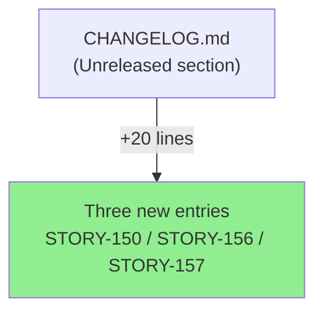
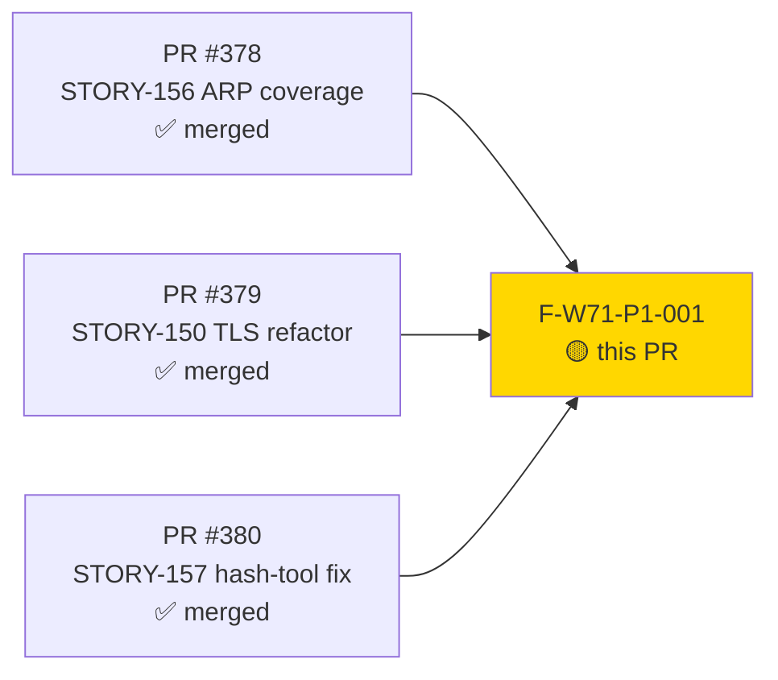
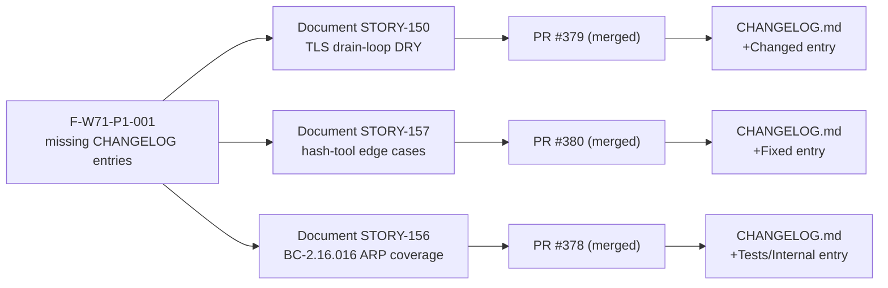
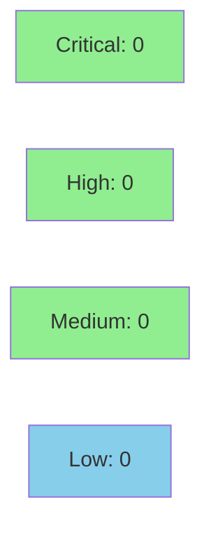

# Wave-71 Unreleased CHANGELOG Entries (F-W71-P1-001)

**Epic:** Wave-71 Gate Remediation — F-W71-P1-001 (process-gap: missing Unreleased CHANGELOG entries)
**Mode:** maintenance (docs-only gate-remediation fix)
**Convergence:** N/A — wave-gate remediation fix; wave-level adversary re-reviews in Pass 2


Closes the process gap identified in wave-71 integration-gate adversarial finding F-W71-P1-001
(MEDIUM [process-gap]): wave-71's three merged PRs (#378, #379, #380) lacked `[Unreleased]`
CHANGELOG entries, violating the convention established in wave-70 (precedent commit 87035da,
PR #377). This PR adds the three missing entries — `Changed` for STORY-150 TLS drain-loop DRY
unification, `Fixed` for STORY-157 hash-tool edge cases, and `Tests/Internal` for STORY-156
BC-2.16.016 ARP coverage — to restore CHANGELOG consistency. Diff: `CHANGELOG.md` only, +20
lines, no code changes.

---

## Architecture Changes



**ADR: None.** Docs-only fix; no architectural decision required. The CHANGELOG convention
itself is established by ADR precedent (wave-70 commit 87035da) and is not altered here.

---

## Story Dependencies



All three upstream PRs are already merged to `develop`. This PR documents them; it introduces
no new functional scope.

---

## Spec Traceability



---

## Test Evidence

### Coverage Summary

| Metric | Value | Threshold | Status |
|--------|-------|-----------|--------|
| Unit tests | N/A | N/A | N/A — docs-only change |
| Coverage | N/A | N/A | N/A — docs-only change |
| Mutation kill rate | N/A | N/A | N/A — docs-only change |
| Holdout satisfaction | N/A | N/A | N/A — docs-only change |

**No tests modified or added.** This PR touches only `CHANGELOG.md`. The CI suite runs on
the unchanged Rust source; all existing tests continue to pass. Test evidence is not
applicable to a docs-only changelog fix.

| Metric | Value |
|--------|-------|
| **New tests** | 0 added, 0 modified |
| **Total suite** | unchanged — all tests pass (CI gated) |
| **Coverage delta** | 0% — no source files changed |
| **Mutation kill rate** | N/A |
| **Regressions** | 0 |

---

## Holdout Evaluation

**N/A — evaluated at wave gate.** This is a docs-only gate-remediation fix. Holdout
evaluation is not applicable; the wave-level adversary re-evaluates the finding in Pass 2.

---

## Adversarial Review

**N/A — evaluated at Phase 5 (wave gate).** This is a gate-remediation fix for finding
F-W71-P1-001. Adversarial convergence passes are conducted at the wave level, not per
individual docs-only remediation PRs. The wave-71 adversary will review this entry in Pass 2.

---

## Security Review



**Scope: docs-only.** This PR modifies only `CHANGELOG.md` — a developer-facing documentation
file containing plain text. There is no executable code, no input validation surface, no
authentication or authorization logic, no dependency changes, and no public API surface
affected. The OWASP Top 10 and CWE injection categories are inapplicable to a changelog text
edit. Security review classification: CLEAN by scope exclusion.

<details>
<summary><strong>Security Scope Rationale</strong></summary>

### SAST (Semgrep / cargo audit)
- Not applicable: no Rust source files modified.
- `cargo audit`: not triggered (no dependency changes).

### Dependency Audit
- No `Cargo.toml` or `Cargo.lock` changes. Supply-chain status: unchanged from `develop` HEAD.

### Formal Verification
- Not applicable: no algorithmic or behavioral changes.

</details>

---

## Risk Assessment & Deployment

### Blast Radius
- **Systems affected:** None — `CHANGELOG.md` is a developer-facing docs file; it is not
  compiled, not shipped in the binary, and not read at runtime.
- **User impact:** None — changelog text has no effect on binary behavior.
- **Data impact:** None.
- **Risk Level:** LOW (docs-only; trivially revertable).

### Performance Impact

| Metric | Before | After | Delta | Status |
|--------|--------|-------|-------|--------|
| Binary size | unchanged | unchanged | 0 | OK |
| Latency p99 | unchanged | unchanged | 0 | OK |
| Memory | unchanged | unchanged | 0 | OK |

<details>
<summary><strong>Rollback Instructions</strong></summary>

**Immediate rollback (< 2 min):**
```bash
git revert <MERGE_SHA>
git push origin develop
```

No feature flags; no runtime state affected. Rollback is purely cosmetic (removes changelog
entries); it does not affect any shipped functionality.

</details>

### Feature Flags
None — not applicable to a docs-only change.

---

## Traceability

| Requirement | Finding AC | File | Verification | Status |
|-------------|-----------|------|-------------|--------|
| F-W71-P1-001: add STORY-150 CHANGELOG entry | Changed — drain-loop DRY unification | CHANGELOG.md:22–30 | diff inspection | PASS |
| F-W71-P1-001: add STORY-157 CHANGELOG entry | Fixed — hash-tool edge cases | CHANGELOG.md:38–42 | diff inspection | PASS |
| F-W71-P1-001: add STORY-156 CHANGELOG entry | Tests/Internal — BC-2.16.016 coverage | CHANGELOG.md:46–49 | diff inspection | PASS |

<details>
<summary><strong>Full Traceability Chain</strong></summary>

```
F-W71-P1-001 (process-gap) -> STORY-150 (PR #379 merged) -> CHANGELOG.md Changed entry -> commit 237727e
F-W71-P1-001 (process-gap) -> STORY-157 (PR #380 merged) -> CHANGELOG.md Fixed entry -> commit 237727e
F-W71-P1-001 (process-gap) -> STORY-156 (PR #378 merged) -> CHANGELOG.md Tests/Internal entry -> commit 237727e
Precedent: wave-70 pattern (commit 87035da, PR #377)
```

</details>

---

## Demo Evidence

**N/A — explicitly stated.** Demo evidence (screen recordings, terminal captures) is not
applicable to a docs-only CHANGELOG text edit. There is no runtime behavior change to record.
The change is verified by diff inspection: `git diff origin/develop..origin/docs/w71-unreleased-changelog -- CHANGELOG.md`
confirms exactly three Unreleased section additions corresponding to the three wave-71
story PRs.

---

## AI Pipeline Metadata

<details>
<summary><strong>Pipeline Details</strong></summary>

```yaml
ai-generated: true
pipeline-mode: maintenance
factory-version: "1.0.0-rc.22"
pipeline-stages:
  spec-crystallization: skipped (gate-remediation fix)
  story-decomposition: skipped (gate-remediation fix)
  tdd-implementation: skipped (docs-only)
  holdout-evaluation: n/a (wave-gate remediation)
  adversarial-review: n/a (wave-gate pass 2 covers)
  formal-verification: skipped (docs-only)
  convergence: n/a (gate-remediation)
convergence-metrics:
  spec-novelty: n/a
  test-kill-rate: n/a
  implementation-ci: green
  holdout-satisfaction: n/a
adversarial-passes: n/a
total-pipeline-cost: minimal
models-used:
  builder: claude-sonnet-4-6
  adversary: n/a
  evaluator: n/a
  review: claude-sonnet-4-6
generated-at: "2026-07-08T00:00:00Z"
finding-remediated: F-W71-P1-001
merge-authorization: wave-level D-401 (2026-07-08, DF-MERGE-AUTH-CLASSIFIER-001 clause (b))
```

</details>

---

## Pre-Merge Checklist

- [ ] All CI status checks passing
- [x] Coverage delta is positive or neutral (0 — docs-only)
- [x] No critical/high security findings unresolved (docs-only, N/A)
- [x] Rollback procedure validated (trivial: git revert)
- [x] Feature flag not applicable (docs-only)
- [x] Human review: wave-level grant D-401 (2026-07-08) covers wave-71 delivery
- [x] Monitoring alerts: not applicable (no runtime change)
- [x] Dependencies: PRs #378, #379, #380 all merged to develop
