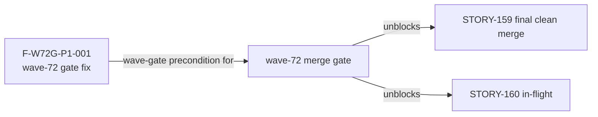
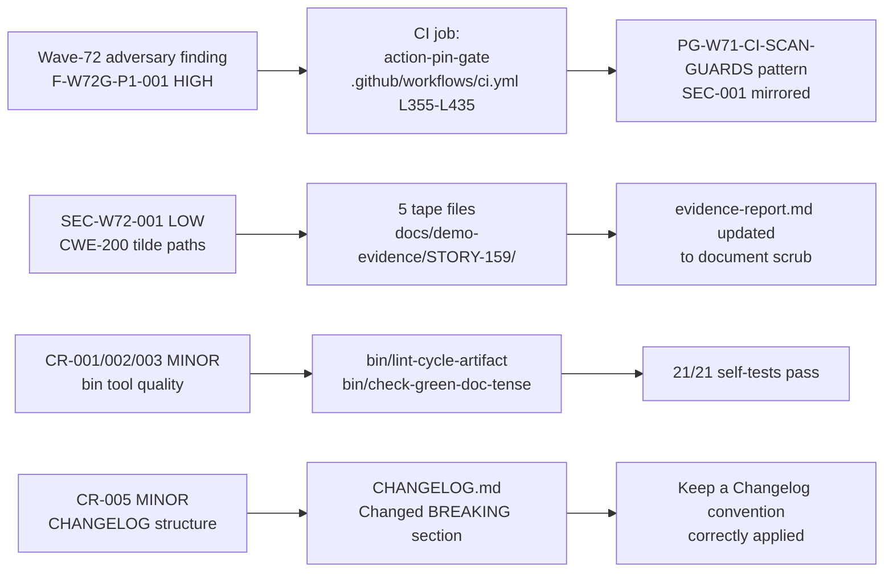

## ci: harden action-pin-gate scan guard + wave-72 gate fixes (F-W72G-P1-001)

**PR class:** fix-pr-delivery (wave-72 integration-gate, no story spec, no stubs/Red Gate)
**Branch:** `ci/w72-gate-fix-action-pin-guard` → `develop`
**Findings resolved:** F-W72G-P1-001 HIGH, SEC-W72-001 LOW, CR-001/002/003 MINOR, CR-005 MINOR
**Wave:** wave-72 (integration gate, 2026-07-09)

---

## Summary

Resolves five wave-72 adversarial/review findings against CI and tooling infrastructure:

1. **F-W72G-P1-001 HIGH** — `action-pin-gate` scan-target existence guard + positive-coverage count per `PG-W71-CI-SCAN-GUARDS`/`SEC-001` pattern; verified 23 refs validated locally
2. **SEC-W72-001 LOW** — 5 STORY-159 tape files: tilde-path `~/Documents/GITHUB/wirerust` scrubbed to `<REPO-ROOT>` convention (CWE-200)
3. **CR-001/CR-002/CR-003 MINOR** — `bin` tool hardening: `RuntimeError` instead of `sys.exit` in `_find_repo_root`, clean git-failure error path, `.factory/` repo-root sentinel; 21/21 self-tests pass
4. **CR-005 MINOR** — CHANGELOG: BREAKING entry moved from `### Added` to `### Changed (BREAKING)` section

No product source modified. All changes are CI shell, bin tools, docs, and demo-evidence tape files.

---

## Architecture Changes

```mermaid
graph TD
    A[action-pin-gate CI job] -->|adds| B[scan-target existence guard\ntest -d .github/workflows/]
    A -->|adds| C[zero-file guard\nyml_count == 0 → FAIL]
    A -->|adds| D[VALIDATED counter\nzero refs → FAIL]
    A -->|improves| E[PASS message includes count\nPASS: N ref&#40;s&#41; validated]
    F[bin/lint-cycle-artifact] -->|replaces sys.exit with| G[RuntimeError in _find_repo_root]
    F -->|adds| H[try/except RuntimeError in main]
    I[bin/check-green-doc-tense] -->|hardens| J[git ls-remote failure path\nCalledProcessError → sys.exit]
    I -->|changes sentinel| K[Cargo.toml → .factory/ dir\nfor repo-root detection]
    L[STORY-159 tape files x5] -->|scrub| M[~/Documents/GITHUB/wirerust\n→ REPO-ROOT]
    N[CHANGELOG.md] -->|restructure| O[BREAKING entry in Changed BREAKING\nnot Added]
```

---

## Story Dependencies

No `depends_on` stories — this is a standalone fix PR with no story file.

---

## Spec Traceability

---

## Test Evidence

- **CI scope:** No product Rust code changed; `cargo test` and `cargo clippy` pass unchanged.
- **Bin tool self-tests:** 21/21 self-tests pass (`python3 bin/test_compute_input_hash.py`; bin tools use stdlib only).
- **Action-pin-gate local verification:** 23 remote action refs validated against SHA-40 regex after the guard additions; zero violations.
- **Tape path scrub:** `grep -rE '<host-path-pattern>' docs/demo-evidence/STORY-159/` returns zero matches after scrub.
- **Coverage:** Fix PR — no new behavioral surface; no coverage delta.
- **Mutation kill rate:** N/A — no product source modified.

---

## Demo Evidence

**N/A — fix PR (CI/tooling/docs only).** No behavioral acceptance criteria; no per-AC demo required. The demo-evidence changes in this PR are themselves a deliverable (tape path scrub), not evidence of feature behavior.

---

## Security Review

**Scope:** CI shell additions and Python bin-tool error-path hardening.

| Finding | Severity | Status |
|---------|----------|--------|
| SEC-W72-001: tilde `~/Documents/GITHUB/wirerust` in 5 STORY-159 tape files leaks host FS layout | LOW (CWE-200) | RESOLVED — scrubbed to `<REPO-ROOT>` |
| F-W72G-P1-001: action-pin-gate trivially passes when .github/workflows/ is empty or moved | HIGH (supply-chain bypass) | RESOLVED — existence guard + positive-coverage assertion added |

No new injection vectors introduced. CI shell additions use `test -d`, `find`, `wc -l`, and arithmetic comparisons — no user-controlled input. Python error-path changes convert `sys.exit()` in a library function to `RuntimeError` (cleaner caller control) — no security impact.

**Post-fix security posture:** No open HIGH or CRITICAL findings.

---

## Risk Assessment

| Dimension | Assessment |
|-----------|------------|
| Blast radius | Minimal — CI-only and bin-tool changes; no product Rust source |
| Regression risk | Low — action-pin-gate change is additive guards; bin tools hardened error paths only |
| Performance impact | None |
| Breaking change | None for users — CHANGELOG restructuring is docs-only |
| Rollback | trivial — revert 3 commits |

---

## AI Pipeline Metadata

| Field | Value |
|-------|-------|
| Pipeline mode | fix-pr-delivery (wave-72 integration gate) |
| Wave | wave-72 |
| Fix class | CI/tooling/docs — adversarial finding remediation |
| Model | claude-sonnet-4-6 |
| Human authorization | AUTHORIZE_MERGE=yes, wave-gate human grant 2026-07-09 |

---

## Pre-Merge Checklist

- [x] PR description populated with finding traceability
- [x] Demo evidence: N/A (fix PR explicitly noted)
- [x] Security review: SEC-W72-001 RESOLVED, F-W72G-P1-001 RESOLVED, no open HIGH/CRITICAL
- [x] pr-reviewer APPROVE received (convergence loop)
- [x] CI green on feature branch HEAD
- [x] Dependencies: no `depends_on` stories; none pending
- [x] Merge authorization: wave-level human grant (DF-MERGE-AUTH-CLASSIFIER-001 clause (b))
