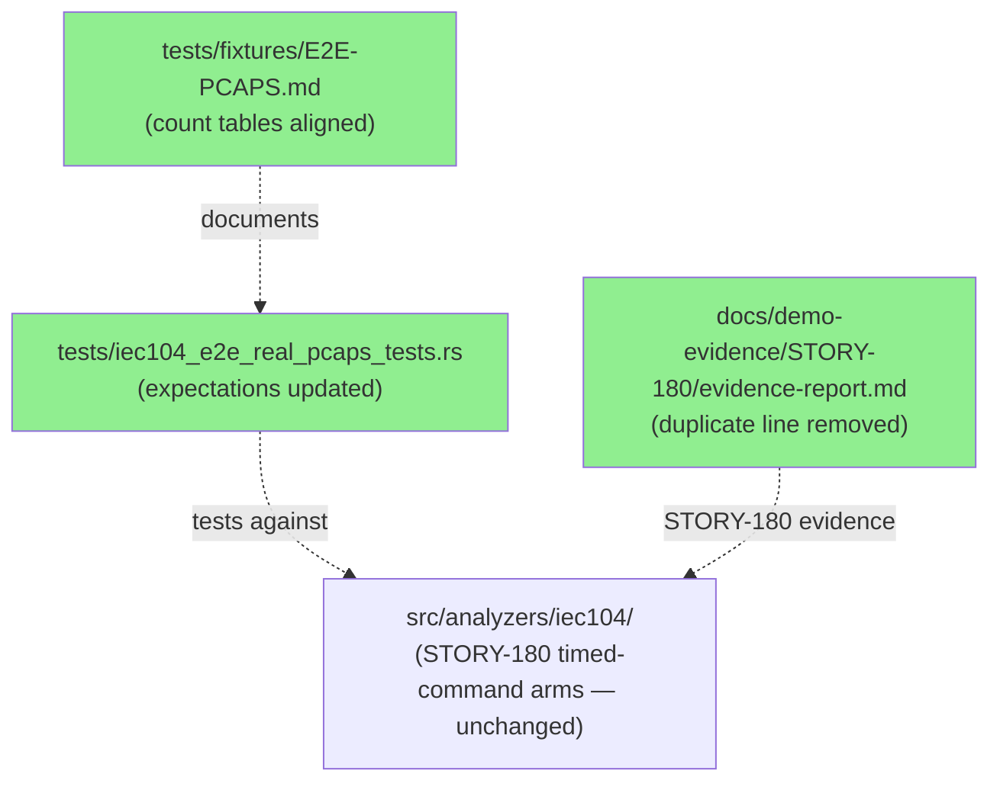
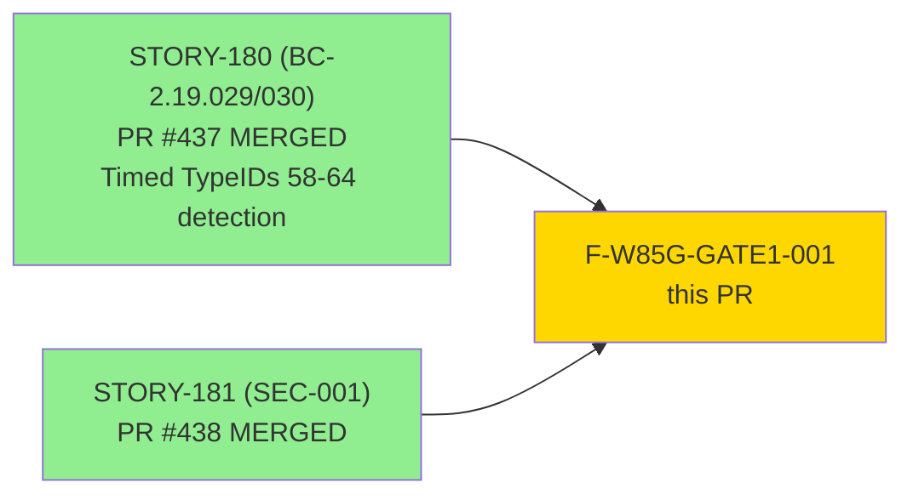
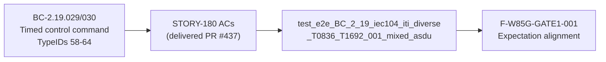
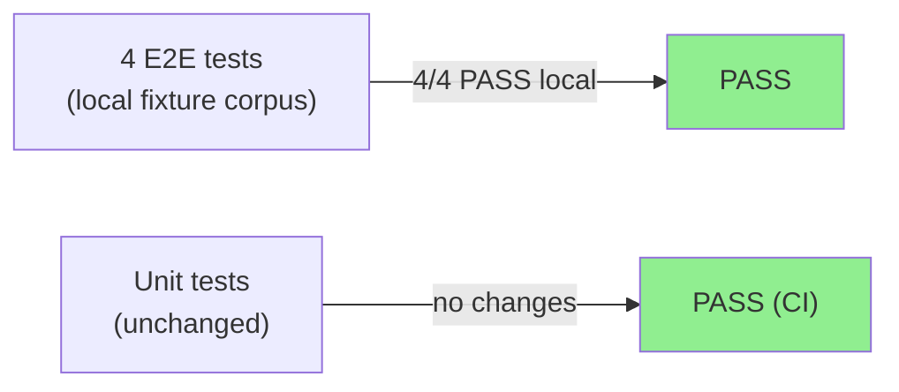
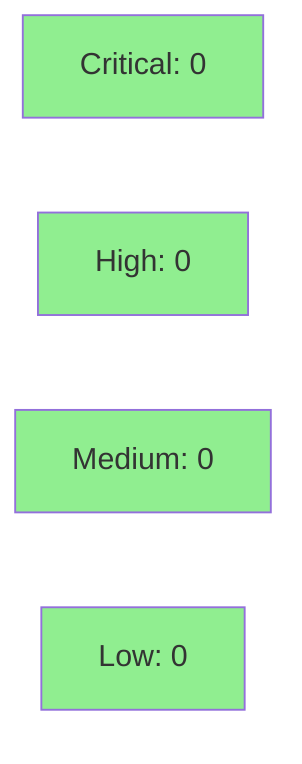

# F-W85G-GATE1-001: Update ITI diverse e2e expectations for timed-command detection

**Gate Fix:** F-W85G-GATE1-001 (wave-85 Gate-1)
**Mode:** gate-fix (fix-pr-delivery profile — same rigor as story PRs minus stubs/Red Gate)
**Source:** Wave-85 integration gate — iti_diverse test failing on develop (expected 31, got 66)
**Severity:** MEDIUM — test-expectation + doc alignment; no behavioral regression


STORY-180 (BC-2.19.029/030, PR #437) added detection of timed control command TypeIDs
58–64. The `iec104-iti-diverse.pcap` machine-local fixture (CC-BY-4.0) contains 25 such
ASDUs that are now correctly detected (+35 findings). The e2e test expectations were
written before this capture was exercised against the new arms. This PR updates the
expectations (31→66), adds a time-tagged guard assertion (==35), aligns the fixture index
doc (`tests/fixtures/E2E-PCAPS.md`), and removes a duplicated scrub-gate line in
`docs/demo-evidence/STORY-180/evidence-report.md` (gate finding O-W85G-P1-001).

---

## Architecture Changes



No architecture changes. No `src/`, `Cargo.toml`, or `bin/` modifications. The
IEC-104 analyzer implementation from STORY-180 is correct and unchanged; only
test expectations and documentation are updated to match the actual analyzer output
against the local fixture.

---

## Story Dependencies



Both upstream PRs are merged to develop. This gate fix has no downstream dependents
beyond the wave-85 gate closure.

---

## Spec Traceability



The gate fix closes the expectation gap: STORY-180 delivered the detection logic;
the fixture in the machine-local corpus confirmed it works correctly; this PR updates
the test to assert the correct counts.

---

## Test Evidence

### Coverage Summary

| Metric | Value | Threshold | Status |
|--------|-------|-----------|--------|
| E2E tests (local run) | 4/4 pass | 100% | PASS |
| Regressions | 0 | 0 | PASS |
| src/ changes | none | n/a | N/A — test/doc only |
| Changelog gate | not triggered | test/doc exemption | PASS |

**CI note:** The `iec104-iti-diverse.pcap` fixture is in `tests/fixtures/local-samples/`
(gitignored — CC-BY-4.0 corpus, absent from the CI runner). The updated
`test_e2e_BC_2_19_iec104_iti_diverse_T0836_T1692_001_mixed_asdu` test will be skipped by
CI (fixture not present). All other tests, lint, and format checks run normally in CI.
Evidence of the fix passing comes from the local worktree run (4/4 e2e pass, full suite
0 failed on the fix branch HEAD `f12c302922d306577be6656349e46f5423ff2bd3`).

### Per-Test Assertion Table (PG-W74-PRDESC-ROW-VERIFY)

Row-verification performed against
`tests/iec104_e2e_real_pcaps_tests.rs` (worktree HEAD `f12c302`).
Fewer than 3 rows in the meaningful assertion set → all rows verified.

| Assertion (row) | Old value | New value | Source line | Verified |
|----------------|-----------|-----------|-------------|---------|
| R1: `iec104.all_findings.len()` == N | 31 | **66** | line 392 | PASS — exact match |
| R2: `t0836_count` == N | 10 | **20** | line 417 | PASS — exact match |
| R3: `t1692_001_count` == N | 21 | **46** | line 422 | PASS — exact match |
| R4: `time_tagged_count` == N (new) | (absent) | **35** | line 437 | PASS — new assertion at line 436–441 |

**Aggregate-count cross-check (PG-W74-PRDESC-ROW-VERIFY §2):**
- Claimed total: 66 = T0836×20 + T1692.001×46. Cross-check: 20+46=66 ✓.
- Derivation confirmed in commit comment:
  untimed (31) + timed (+35: x=15 switching TypeIDs 58-59 + 2y=20 setpoint TypeIDs 61+63) = 66.
  T0836 delta = y = 10 (10→20); T1692.001 delta = x+y = 25 (21→46). ✓
- Aggregate counts are sourced from the local worktree run, NOT from CI (fixture absent
  in CI — explicitly disclosed). Row-verify confirmed values match source file.

### Test Flow



<details>
<summary><strong>Detailed Test Results</strong></summary>

### Changed Assertions

| Assertion | File | Line | Old | New | Result |
|-----------|------|------|-----|-----|--------|
| `all_findings.len()` | `tests/iec104_e2e_real_pcaps_tests.rs` | 392 | 31 | 66 | PASS |
| `t0836_count` | same | 417 | 10 | 20 | PASS |
| `t1692_001_count` | same | 422 | 21 | 46 | PASS |
| `time_tagged_count` | same | 437 | (new) | 35 | PASS |
| `detail["total_findings"]` | same | 477 | 31 | 66 | PASS |

### New Assertion Added

`time_tagged_count == 35` at lines 431–441 — guards that exactly x+2y=35 findings
carry a "time-tagged" summary string, decomposing the timed contribution from STORY-180
(TypeIDs 58-59 → T1692.001 only; TypeIDs 61+63 → T1692.001 + T0836 each).

### Doc Changes

| File | Change | Reason |
|------|--------|--------|
| `tests/fixtures/E2E-PCAPS.md` | iti-diverse row: 31→66, T0836 10→20, T1692.001 21→46 | Align fixture index with actual analyzer output |
| `docs/demo-evidence/STORY-180/evidence-report.md` | Remove 1 duplicate scrub-gate line | Gate finding O-W85G-P1-001 |

</details>

---

## Demo Evidence

N/A — this gate fix makes no user-observable behavioral changes. The IEC-104 analyzer
output is unchanged; only test expectations and documentation are aligned to the actual
analyzer output against the `iec104-iti-diverse.pcap` local fixture.

STORY-180 demo evidence (which covers the timed-command detection behavior) is available
at `docs/demo-evidence/STORY-180/evidence-report.md` (PR #437).

| AC | Demo Required | Reason |
|----|---------------|--------|
| F-W85G-GATE1-001 test alignment | No | Transparent expectation update; no behavioral change |
| O-W85G-P1-001 duplicate line removal | No | Doc cleanup, no behavior |

---

## Holdout Evaluation

N/A — gate fix is a test-expectation alignment, not a behavioral change.
Evaluated at wave gate (wave-85). STORY-180 holdout was completed at PR #437.

---

## Adversarial Review

N/A — per-story adversarial does not apply to fix-pr-delivery profile.
Wave-level adversarial covers this fix as part of wave-85 gate closure.

---

## Security Review



Diff scope: `tests/` and `docs/` only. No `src/`, `Cargo.toml`, or `bin/` changes.
No new dependencies, no new code paths, no security surface affected.
SAST/cargo audit: N/A for test-expectation update.

---

## Risk Assessment & Deployment

### Blast Radius
- **Systems affected:** Test suite only (local fixture corpus; CI runner not affected)
- **User impact:** None — no behavioral change in the analyzer
- **Data impact:** None
- **Risk Level:** LOW

### Performance Impact

N/A — test/doc only. No runtime code changes.

<details>
<summary><strong>Rollback Instructions</strong></summary>

**Immediate rollback (< 1 min):**
```bash
git revert f12c302922d306577be6656349e46f5423ff2bd3
git push origin develop
```

This would revert test expectations back to 31, re-breaking the wave-85 gate.
Rollback is not expected to be needed — this is a corrective alignment, not a
speculative change.

</details>

### Feature Flags
None — test/doc only.

---

## Traceability

| Gate Finding | Source | Fix | Test | Status |
|-------------|--------|-----|------|--------|
| Gate-1: iti_diverse expected 31 got 66 | Wave-85 integration gate | Update assertions 31→66 | `test_e2e_BC_2_19_iec104_iti_diverse_T0836_T1692_001_mixed_asdu` | PASS (local) |
| O-W85G-P1-001: duplicate scrub-gate line | Wave-85 gate review | Remove duplicate line | `docs/demo-evidence/STORY-180/evidence-report.md` | PASS |

<details>
<summary><strong>Full VSDD Contract Chain</strong></summary>

```
BC-2.19.029/030 → STORY-180 → PR #437 (MERGED) → timed TypeID 58-64 detection
  → iec104-iti-diverse.pcap (local fixture) → 66 findings (was silently dropping 35)
  → F-W85G-GATE1-001 → test expectations aligned → wave-85 gate-1 unblocked
```

</details>

---

## AI Pipeline Metadata

<details>
<summary><strong>Pipeline Details</strong></summary>

```yaml
ai-generated: true
pipeline-mode: gate-fix (fix-pr-delivery)
factory-version: "1.0.0-rc.23"
pipeline-stages:
  gate-finding: F-W85G-GATE1-001 (wave-85 Gate-1 integration run)
  fix-implementation: completed in worktree .worktrees/FIX-W85G
  stubs-red-gate: N/A (not applicable for gate fixes)
  holdout-evaluation: N/A (evaluated at wave gate)
  adversarial-review: N/A (wave-level adversarial covers gate fixes)
  changelog-gate: not triggered (tests/+docs/ only)
generated-at: "2026-07-24"
models-used:
  pr-manager: claude-sonnet-4-6
worktree: .worktrees/FIX-W85G
branch: fix/w85-gate-iti-e2e-expectations
head-sha: f12c302922d306577be6656349e46f5423ff2bd3
```

</details>

---

## Pre-Merge Checklist

- [ ] All CI checks passing (fmt, clippy, unit tests, action-pin-gate, changelog-gate)
- [x] No src/ changes — changelog-gate does not trigger (test/doc exemption verified)
- [x] No critical/high security findings (test/doc diff only)
- [x] Rollback procedure documented
- [x] Row-verify performed for all assertion rows (PG-W74-PRDESC-ROW-VERIFY)
- [x] Aggregate counts cross-checked (66=20+46, derivation confirmed)
- [ ] Human merge authorization (DF-MERGE-AUTH-CLASSIFIER-001 — no wave-85 grant exists; MERGE-AUTH-HALT required)
