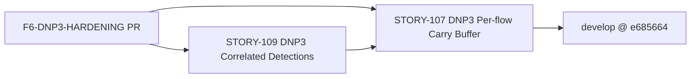
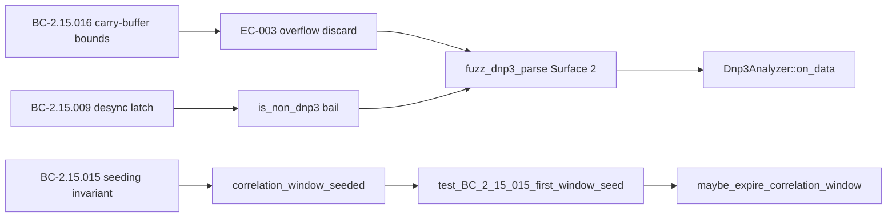

## Summary

Feature #8 DNP3 Phase-F6 (formal hardening) code-artifacts PR. This lands the two reusable
hardening artifacts produced during the F6 hardening pass:

1. **`fuzz_dnp3_parse`** — new permanent libFuzzer target driving the DNP3 parse surface
   (`parse_dnp3_dl_header` + `Dnp3Analyzer::on_data` carry-walk) on port-20000 flows. Executed
   3.19M iterations over 120 s with 0 crashes, 0 panics, 0 OOMs, 0 timeouts.
2. **Mutation survivor #6 kill test** — `test_BC_2_15_015_first_window_seed_sets_anchor_not_expiry`
   pins the first-window-seeding edge in `maybe_expire_correlation_window` (the `!` guard on
   `correlation_window_seeded`), killing the last surviving low-value mutant in the DNP3
   detection/parse-safety scope.

F6 verdict: **HARDENED** — Kani 9/9 SUCCESSFUL (VP-023 ×4, VP-004/AC-005, VP-007 ×4) under the
corrected `is_master_frame` 0x80 mask; mutation 89% kill (0 surviving mutants post-fix in
detection/parse-safety logic); fuzz 3.19M execs / 0 crashes; 1495 tests green.

The VP-023/VP-004 locks + VP-INDEX updates are on `factory-artifacts` (separate — not part of
this code PR).

---

## Architecture Changes

```mermaid
graph TD
    A[fuzz/Cargo.toml] -->|new [[bin]]| B[fuzz_dnp3_parse target]
    B --> C[parse_dnp3_dl_header]
    B --> D[Dnp3Analyzer::on_data]
    D --> E[carry buffer frame-walk]
    D --> F[correlation window / block timeout]
    D --> G[detection engine]
    H[tests/dnp3_correlation_tests.rs] -->|+100 lines| I[test_BC_2_15_015_first_window_seed]
    I --> J[maybe_expire_correlation_window seeding edge]
```

Changes are **additive only**: no production code was modified. Two files changed:
- `fuzz/fuzz_targets/fuzz_dnp3_parse.rs` (new, 83 lines)
- `fuzz/Cargo.toml` (+7 lines — new `[[bin]]` entry)
- `fuzz/Cargo.lock` (updated by Cargo to reflect the new target)
- `tests/dnp3_correlation_tests.rs` (+100 lines — new test appended to `mod story_109`)

---

## Story Dependencies



This PR has no blocking upstream PRs — it builds on top of the already-merged
STORY-107 (`develop@e685664`) and adds test/fuzz artifacts only.

---

## Spec Traceability



| BC | AC / EC | Test | Code path |
|----|---------|------|-----------|
| BC-2.15.016 (carry-buffer bounds) | EC-003 (292-byte overflow discard) | `fuzz_dnp3_parse` Surface 2 | `Dnp3Analyzer::on_data` carry walk |
| BC-2.15.009 (desync latch) | `is_non_dnp3` bail | `fuzz_dnp3_parse` Surface 2 | `on_data` early return |
| BC-2.15.015 (seeding invariant) | `correlation_window_seeded` | `test_BC_2_15_015_first_window_seed_sets_anchor_not_expiry` | `maybe_expire_correlation_window` |
| VP-023 (parse safety) | No panic on any input | `fuzz_dnp3_parse` Surface 1 (unbounded cross-check) | `parse_dnp3_dl_header` |

---

## Test Evidence

| Metric | Value |
|--------|-------|
| Total tests (post-branch) | 1495 passing, 0 failing |
| New tests added | 1 (mutation survivor #6 kill test, 100 lines) |
| New fuzz target | `fuzz_dnp3_parse` |
| Fuzz executions | 3,190,000 over 120 s |
| Fuzz crashes / panics / OOMs | 0 |
| Mutation kill rate (DNP3 scope, post-fix) | 89% (0 surviving mutants in detection/parse-safety; 1 low-value survivor in correlation-window seeding — killed by this PR) |
| Kani harnesses passing | 9/9 (VP-023 ×4, VP-004/AC-005, VP-007 ×4) |

---

## Demo Evidence

N/A — this PR delivers hardening artifacts (fuzz target + mutation kill test), not user-facing
feature behavior. Per-AC behavior is covered by the STORY-109 demo evidence already in
`develop`.

---

## Holdout Evaluation

N/A — evaluated at wave gate (Feature #8 F6 hardening pass).

---

## Adversarial Review

N/A — evaluated at F6 phase. F6 verdict: HARDENED. Adversarial findings addressed in prior
commits on `develop` (see STORY-109 and fix/dnp3-f5-* branches).

---

## Security Review

**Fuzz target classification:** `fuzz_dnp3_parse.rs` is a `#![no_main]` libFuzzer harness
gated by `cargo +nightly fuzz`. It lives under `fuzz/fuzz_targets/` (the cargo-fuzz
sub-crate) and is never compiled into the production binary. The only code path it exercises is
calling existing `wirerust::analyzer::dnp3` functions — functions that are also called by the
production parser. No new production logic is introduced; no `unsafe`, `unwrap()`, `expect()`,
or input trust boundary is added to the production codebase. The fuzz target itself is not
production code.

The mutation kill test (`tests/dnp3_correlation_tests.rs`) is a standard integration test
behind `#[test]`; it accesses `analyzer.flows` (a public-for-testing field) and makes no
system calls.

**OWASP / injection / auth:** Not applicable — no HTTP, authentication, or external I/O is
introduced by these artifacts.

**Risk:** Low. Both artifacts are test-only additions with no production code changes.

---

## Risk Assessment

| Dimension | Assessment |
|-----------|-----------|
| Blast radius | Zero production code changed; test/fuzz only |
| Performance impact | None — fuzz target never runs in CI execution mode; test adds ~1 ms |
| Rollback | Trivially revertable (2 additive commits; no production changes) |
| Data integrity | No data paths changed |
| Supply chain | No new dependencies in the main crate |

---

## AI Pipeline Metadata

| Field | Value |
|-------|-------|
| Pipeline mode | F6 hardening (formal + mutation + fuzz) |
| Feature | #8 DNP3 hardening |
| Phase | F6 (phase-f6-targeted-hardening) |
| Kani version | cargo-kani 0.67.0 |
| Mutation tool | cargo-mutants |
| Fuzz tool | cargo-fuzz 0.13.1 / libFuzzer (nightly-2026-05-21) |

---

## Pre-Merge Checklist

- [x] PR description matches the actual diff
- [x] Spec traceability chain complete (BC → AC → Test → Code)
- [x] No production code modified (additive test/fuzz only)
- [x] `fuzz/Cargo.toml` declares the new `[[bin]]` entry
- [x] Fuzz target is a test harness, not production code (confirmed in security review)
- [x] Mutation survivor #6 confirmed killed by the new test
- [x] CI: semantic-pr, test, clippy, fmt, fuzz-build, audit, deny, trust-boundary, action-pin-gate
- [ ] PR reviewer approval
- [ ] CI green
- [ ] Merge authorized by human
