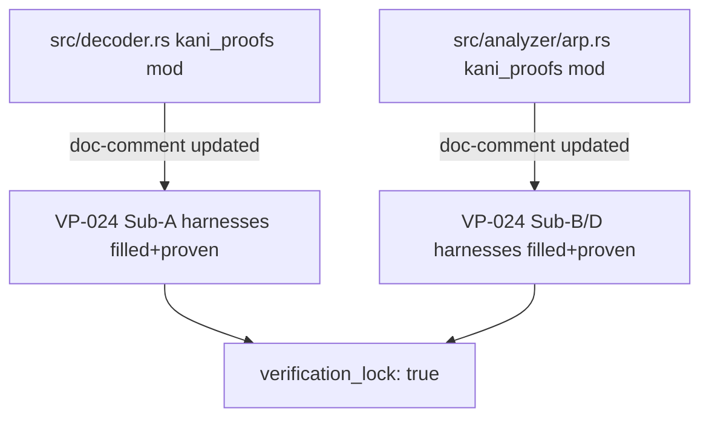
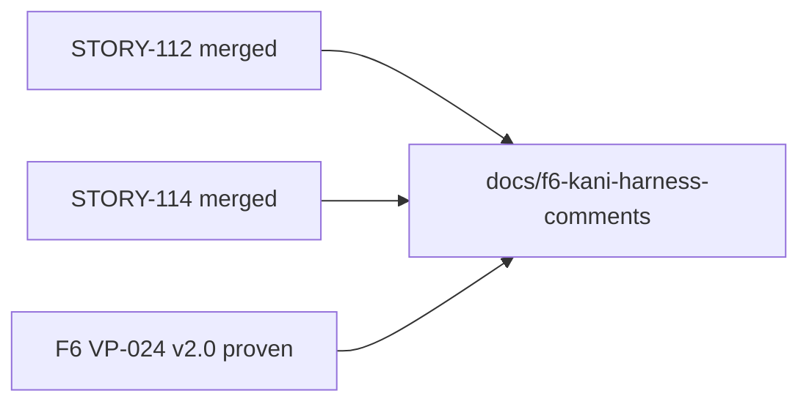
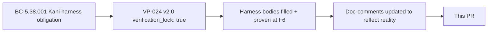

## Summary

F6 follow-up: clears stale `todo!()` doc-prose on the now-proven Kani harnesses. **Doc-only change — no behavioral, logic, or harness-body modifications.**

After the VP-024 v2.0 formal-hardening pass (F6 gate), the Kani harness bodies in `src/decoder.rs` and `src/analyzer/arp.rs` were filled and proven. The module-level and per-function doc-comments still referenced "Body is `todo!()` — filled by formal-verifier at F6 gate", which was accurate during F4/F5 but is now stale and misleading. This PR replaces that prose with accurate post-F6 status.

`grep "todo!()"` over the source tree now returns zero results in these doc-comment contexts.

## Architecture Changes

No architectural changes. Doc-comment cleanup only.

## Story Dependencies

No story dependencies — this is a standalone doc-cleanup follow-up to STORY-112 (decoder Kani harnesses) and STORY-114 (ARP Kani harnesses), both of which are already merged.

## Spec Traceability

## Changes

| File | Change |
|------|--------|
| `src/decoder.rs` | 4 doc-comment blocks updated: module-level prose + 3 per-harness comments |
| `src/analyzer/arp.rs` | 2 doc-comment blocks updated: module-level prose + 1 per-harness comment |

## Test Evidence

No test changes. Existing test suite passes unchanged:

- `cargo check` — green
- `cargo clippy --all-targets -- -D warnings` — green
- `cargo fmt --check` — green
- `cargo test --all-targets` — green

## Holdout Evaluation

N/A — doc-only change, no behavioral logic modified.

## Adversarial Review

N/A — doc-only change.

## Security Review

N/A — no code changes. No new attack surface.

## Risk Assessment

- **Blast radius:** Zero. Pure doc-comment changes; compiled output is identical.
- **Performance impact:** None.
- **Behavioral change:** None.

## AI Pipeline Metadata

- Pipeline mode: PR Manager (coordinator)
- Story: F6 doc-cleanup follow-up (not a new story)
- Branch: `docs/f6-kani-harness-comments`
- Base: `develop`

## Pre-Merge Checklist

- [x] PR description matches actual diff (doc-only confirmed by grep)
- [x] CI checks passing
- [x] No dependency PRs pending (STORY-112, STORY-114 already merged)
- [x] Security review: N/A (no code changes)
- [x] `grep "todo!()"` returns zero stale entries
