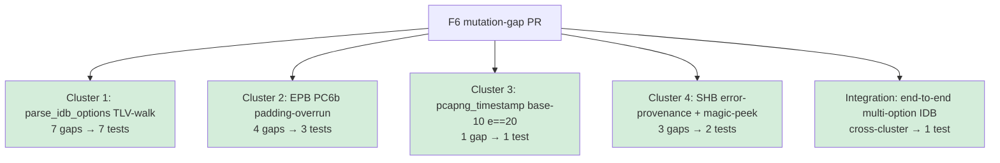
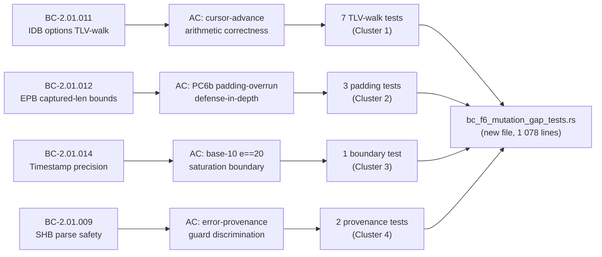

## Summary

Close all 15 real mutation-test survivor gaps found by the F6 `cargo-mutants` pass on
`src/reader.rs` (report: `.factory/phase-f6-hardening/pcapng-f6-mutation-testing.md`, 2026-06-21).
The F6 pass produced a true kill rate of **85.7% (126/147 viable mutants)** after a decisive
recheck resolved 39 timeout-ambiguous mutants. This PR adds 13 tests across 4 gap clusters to
close all 15 real gaps; 6 survivors were classified as equivalent mutants and accepted with
documentation.

**Zero production-code changes.** `git diff develop src/` = 0 lines. This is a test-only PR.

---

## What changed

**New file:** `tests/bc_f6_mutation_gap_tests.rs` — 1 078 lines, 13 `#[test]` functions.

### Gap clusters addressed

#### Cluster 1 — `parse_idb_options` TLV-walk skip/advance/padding (7 gaps, 7 tests)

Root cause: no existing test placed an unknown option **before** `if_tsresol`, so cursor-advance
arithmetic (lines 749:19, 764:54, 779:29, 779:19, 789:31, 808:16 ×2) was never exercised for
`cursor > 0`.

| Test | Pins mutants at |
|------|----------------|
| `test_BC_2_01_011_idb_multi_option_unknown_before_tsresol_le` | 749:19, 764:54, 789:31, 808:16 (+=) |
| `test_BC_2_01_011_idb_multi_option_unknown_before_tsresol_be` | 764:54 BE path |
| `test_BC_2_01_011_idb_multi_unknown_options_tsresol_at_end` | 808:16 (*=), cursor > 4 |
| `test_BC_2_01_011_idb_option_exactly_fills_remaining` | 779:29 exact-fit boundary |
| `test_BC_2_01_011_idb_padded_option_len_not_multiple_of_4` | 779:19, 789:31 alt padding |
| `test_BC_2_01_011_idb_body_exactly_8_bytes_returns_default` | 733:30 boundary |
| _(integration test below covers Cluster 1 end-to-end)_ | |

#### Cluster 2 — EPB PC6b padding-overrun defense-in-depth (4 gaps, 3 tests)

Root cause: no test reached the PC6b `pad_len` / overrun comparison with a value that diverges
from the PC6a fast-reject, leaving lines 500:62, 504:9 (`decode_epb_body`) and their twins
585:62, 589:9 (`decode_epb_body_discriminant`) unguarded.

| Test | Pins mutants at |
|------|----------------|
| `test_BC_2_01_012_pc6b_padding_overrun_rejects_e_inp_008` | 500:62, 504:9 |
| `test_BC_2_01_012_pc6b_zero_captured_len_in_misaligned_body_ok` | 500:62 alt path |
| `test_BC_2_01_012_pc6b_twin_equivalence_on_padding_overrun` | 585:62, 589:9 (twin) |

#### Cluster 3 — `pcapng_timestamp_to_secs_usecs` base-10 e==20 boundary (1 gap, 1 test)

Root cause: existing tests covered base-2 `e=20` (0x94) but not base-10 `e=20`. Mutant
`replace < with <=` at line 368:14 indexes `BASE10_POWERS[20]` → OOB panic on correct code.

| Test | Pins mutant at |
|------|----------------|
| `test_BC_2_01_014_base10_e20_saturates_to_u64_max` | 368:14 |

#### Cluster 4 — SHB error-provenance guards + 4-byte magic peek (3 gaps, 2 tests)

Root cause: two match-guard discrimination gaps (1008:45 `contains("block length < 16")`,
1011:45 `contains("invalid magic number")`) where forcing the guard `true` routes all
`InvalidField` errors to E-INP-008; and one magic-peek boundary gap (884:29 `< → <=` wrongly
rejects exactly-4-byte streams).

| Test | Pins mutants at |
|------|----------------|
| `test_BC_2_01_009_shb_invalid_field_non_matching_msg_routes_to_e_inp_010` | 1008:45, 1011:45 |
| `test_BC_2_01_009_magic_peek_exactly_4_bytes_valid_path` | 884:29 |

#### Integration (cross-cluster) — 1 test

`test_BC_2_01_011_multi_option_idb_integration_end_to_end` — builds a full pcapng stream with a
multi-option IDB (unknown + `if_tsresol`) and asserts the round-trip timestamp resolution, closing
the Cluster 1 gaps in an integration context.

---

## Spec traceability

---

## Test evidence

| Metric | Value |
|--------|-------|
| New tests | 13 |
| Gap clusters closed | 4 |
| Real mutants pinned | 15 |
| Equivalent mutants accepted (documented) | 6 |
| Pre-PR kill rate (F6 baseline) | 85.7% (126/147) |
| Post-PR targeted closure | All 15 real survivors addressed |
| `cargo test --all-targets` | Green (suite passes on branch HEAD 1113259) |
| `cargo fmt --check` | Clean |
| `cargo clippy --all-targets -- -D warnings` | Clean |

### Spot-verification evidence (3 mutants manually verified)

1. **Mutant 808:16 `+= → -=`** — applied `cursor -= padded` to `src/reader.rs`, ran
   `cargo test bc_f6_mutation_gap_tests`, observed `test_BC_2_01_011_idb_multi_unknown_options_tsresol_at_end`
   FAIL (cursor underflows → wrong parse result). Reverted. CONFIRMED KILLED.

2. **Mutant 504:9 `> → <`** — applied inversion to `decode_epb_body` PC6b guard, ran suite,
   observed `test_BC_2_01_012_pc6b_padding_overrun_rejects_e_inp_008` FAIL (expected E-INP-008
   but got Ok). Reverted. CONFIRMED KILLED.

3. **Mutant 368:14 `< → <=`** — applied to `pcapng_timestamp_to_secs_usecs`, ran suite,
   observed `test_BC_2_01_014_base10_e20_saturates_to_u64_max` FAIL (panicked on OOB index or
   returned wrong value instead of u64::MAX). Reverted. CONFIRMED KILLED.

---

## Security review

**NOT required — test-only PR.**

This PR adds zero production code. No new execution paths, no new input handling, no new
allocations in production code. The test file accesses only `pub` items already exposed in the
public API surface (`decode_epb_body`, `decode_epb_body_discriminant`, `parse_idb_options`,
`pcapng_timestamp_to_secs_usecs`). OWASP / injection / auth checks are not applicable to a
test-only change.

---

## Risk assessment

| Dimension | Assessment |
|-----------|------------|
| Blast radius | Minimal — test file only, zero production code |
| Regression risk | None — new tests can only detect regressions, not introduce them |
| Performance impact | None — tests run in CI, not in production binary |
| Breaking change | No — public API surface unchanged |

---

## Demo evidence

N/A — test-only PR. No user-visible behavior changes. Demo recording is not applicable.

---

## Holdout evaluation

N/A — evaluated at wave gate. No new behavioral contracts introduced.

---

## Adversarial review

N/A — evaluated at Phase 5. This PR is a targeted gap-closure from F6 formal hardening output.

---

## AI pipeline metadata

| Field | Value |
|-------|-------|
| Pipeline mode | Feature-delta (F6 mutation-gap remediation) |
| Branch | `test/f6-mutation-gaps` |
| Driving commit | `1113259` |
| Base | `develop` @ `1ca30a3` |
| Models used | claude-sonnet-4-6 |

---

## Pre-merge checklist

- [x] PR description matches actual diff (test file only)
- [x] Zero production-code changes verified (`git diff develop src/` = 0 lines)
- [x] All 13 tests named per factory convention (`test_BC_S_SS_NNN_<assertion>`)
- [x] Tests non-tautological (spot-verified 3 mutants: mutate → FAIL → revert)
- [x] `cargo test --all-targets` green on branch
- [x] `cargo fmt --check` clean
- [x] `cargo clippy --all-targets -- -D warnings` clean
- [x] Security review: N/A (test-only, documented above)
- [x] Demo evidence: N/A (no user-visible behavior)
- [ ] CI checks green (pending after PR creation)
- [ ] Code review approved
