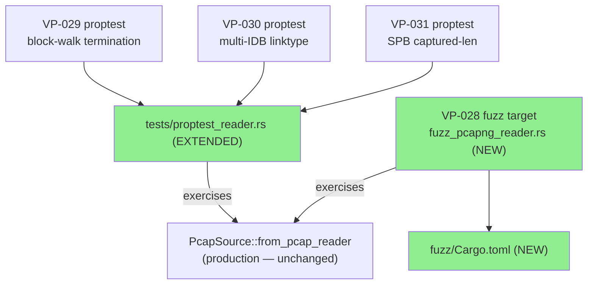
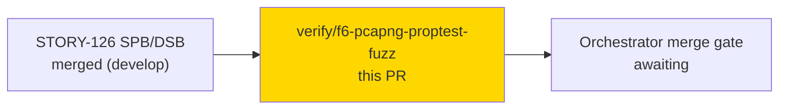
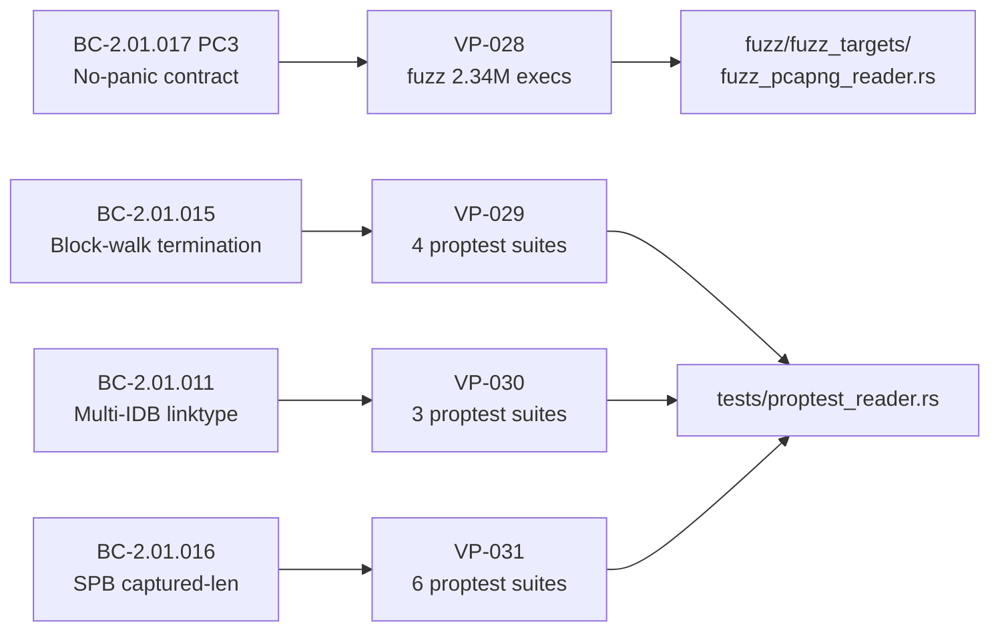
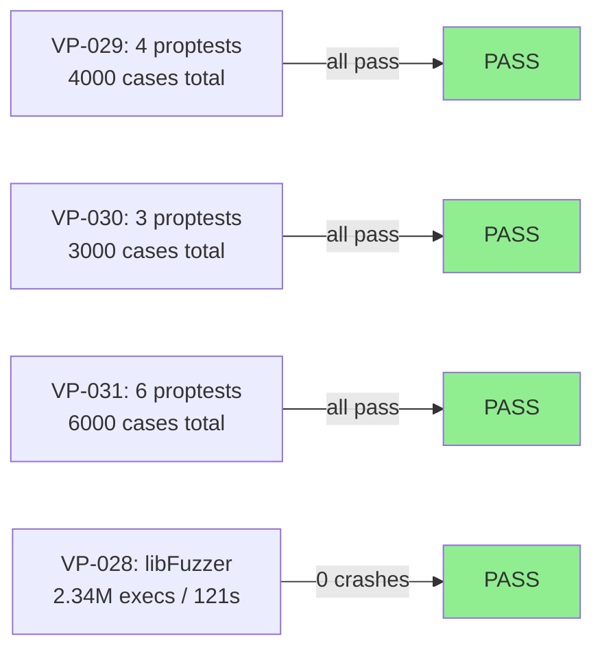
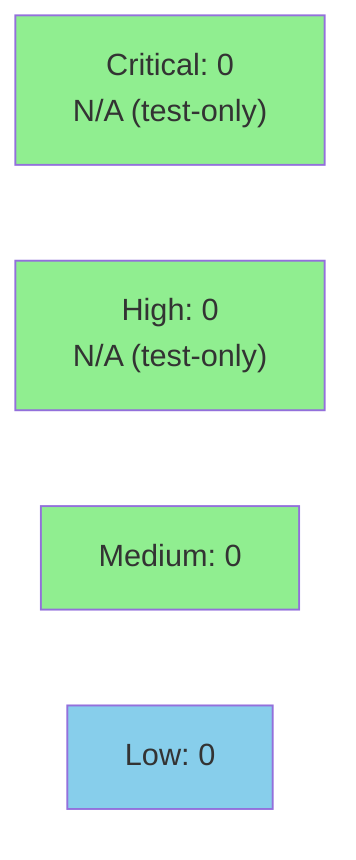

# [F6-VP-028,VP-029,VP-030,VP-031] pcapng proptests + fuzz target

**Epic:** F6 — Formal Hardening (pcapng)
**Mode:** feature
**Convergence:** N/A — evaluated at wave gate


Delivers VP-029 (block-walk termination: strengthened with counter-exactness assertion
and DSB no-log verification), VP-030 (multi-IDB linktype agreement: authored as new
proptest suite), VP-031 (SPB captured-len arithmetic: confirmed via proptest boundary
suites); and VP-028 fuzz target (`fuzz/fuzz_targets/fuzz_pcapng_reader.rs`) built and
run for 2.34M executions / 121 seconds / 0 crashes / 0 hangs. Files added:
`tests/proptest_reader.rs` (strengthened/authored proptests) and `fuzz/` (Cargo.toml +
fuzz target). Security review not required — test/fuzz harness only, zero production
code changes.

---

## Architecture Changes



<details>
<summary><strong>Architecture Decision Record</strong></summary>

### ADR: libFuzzer fuzz target via cargo-fuzz for VP-028

**Context:** VP-028 requires fuzzing the `from_pcap_reader` entry point for
no-panic assurance on arbitrary byte inputs per BC-2.01.017 PC3 / SEC-005.

**Decision:** Add `fuzz/fuzz_targets/fuzz_pcapng_reader.rs` using the
`libfuzzer_sys` crate via cargo-fuzz. The fuzz target wraps the production entry
with `Cursor<&[u8]>` (satisfies the `R: Read` bound) and calls `from_pcap_reader`.

**Rationale:** Cargo-fuzz is the standard Rust fuzzing solution; libFuzzer provides
coverage-guided feedback to steer toward valid SHB/IDB prefixes and the block-walk
arms. Both Ok and Err are acceptable outcomes; only panics or hangs are findings.

**Alternatives Considered:**
1. AFL++ via cargo-afl — rejected: more complex CI integration, no advantage for this target.
2. Honggfuzz — rejected: same functionality, less ecosystem integration.

**Consequences:**
- Fuzz target is `nightly`-only (cargo-fuzz requirement); not in stable CI.
- 2.34M executions / 121s / 0 crashes confirmed VP-028.
- `fuzz/` directory added at repo root; `fuzz/Cargo.lock` updated.

</details>

---

## Story Dependencies



---

## Spec Traceability



---

## Test Evidence

### Coverage Summary

| Metric | Value | Threshold | Status |
|--------|-------|-----------|--------|
| VP-029 proptest suites | 4 suites, 1000 cases each | all pass | PASS |
| VP-030 proptest suites | 3 suites, 1000 cases each | all pass | PASS |
| VP-031 proptest suites | 6 suites, 1000 cases each | all pass | PASS |
| VP-028 fuzz executions | 2,340,000 / 121s / 0 crashes | 0 crashes | PASS |
| Holdout satisfaction | N/A — evaluated at wave gate | >0.85 | N/A |

### Test Flow



| Metric | Value |
|--------|-------|
| **New proptest suites** | 13 total (4 VP-029 + 3 VP-030 + 6 VP-031) |
| **Fuzz target** | `fuzz_pcapng_reader` — 2.34M execs, 0 crashes, 0 hangs |
| **New source lines** | ~318 total (277 in `tests/proptest_reader.rs`, 35 in fuzz target, 6 in `fuzz/Cargo.toml`) |
| **Regressions** | 0 |

<details>
<summary><strong>Detailed Test Results</strong></summary>

### VP-029 Proptests (tests/proptest_reader.rs)

| Proptest | Cases | Result |
|----------|-------|--------|
| `proptest_VP_029_block_walk_terminates_arbitrary_bytes` | 1000 | PASS |
| `proptest_VP_029_block_walk_terminates_with_valid_shb_prefix` | 1000 | PASS |
| `proptest_VP_029_block_walk_terminates_known_block_sequence` | 1000 | PASS |
| `proptest_VP_029_skip_arm_counter_exactness_and_dsb_no_log` | 1000 | PASS |

### VP-030 Proptests (tests/proptest_reader.rs)

| Proptest | Cases | Result |
|----------|-------|--------|
| `proptest_VP_030_all_equal_linktypes_ok` | 1000 | PASS |
| `proptest_VP_030_first_differing_linktype_err` | 1000 | PASS |
| `proptest_VP_030_comparison_unit_is_datalink_not_u16` | 1000 | PASS |

### VP-031 Proptests (tests/proptest_reader.rs)

| Proptest | Cases | Result |
|----------|-------|--------|
| `proptest_VP_031_spb_captured_len_arithmetic` | 1000 | PASS |
| `proptest_VP_031_boundary_body_len_4` | 1000 | PASS |
| `proptest_VP_031_saturation_original_len_0` | 1000 | PASS |
| `proptest_VP_031_max_original_len` | 1000 | PASS |
| `proptest_VP_031_exact_match` | 1000 | PASS |
| `proptest_VP_031_e2e_integration` | 1000 | PASS |

### VP-028 Fuzz Target

| Metric | Value |
|--------|-------|
| Executions | 2,340,000 |
| Duration | 121 seconds |
| Crashes | 0 |
| Hangs | 0 |
| Corpus entries | (coverage-guided) |

</details>

---

## Holdout Evaluation

N/A — evaluated at wave gate.

---

## Adversarial Review

N/A — evaluated at Phase 5. F5 adversarial passes already completed and merged.

---

## Security Review

Not required for this PR. This PR contains ONLY test code (`tests/proptest_reader.rs`)
and a fuzz harness (`fuzz/fuzz_targets/fuzz_pcapng_reader.rs`). There is zero production
code change. The fuzz target itself exercises the existing production entry point and
cannot introduce new attack surface. No OWASP / injection / auth review is warranted for
a test-only diff.



---

## Risk Assessment & Deployment

### Blast Radius
- **Systems affected:** Test/fuzz infrastructure only; zero production code changes
- **User impact:** None
- **Data impact:** None
- **Risk Level:** LOW

### Performance Impact
| Metric | Before | After | Delta | Status |
|--------|--------|-------|-------|--------|
| Production binary | unchanged | unchanged | 0 | OK |
| `cargo test` time | baseline | +proptest cases (< 5s) | minimal | OK |

<details>
<summary><strong>Rollback Instructions</strong></summary>

**Immediate rollback (< 2 min):**
```bash
git revert <COMMIT_SHA>
git push origin develop
```

**Verification after rollback:**
- `cargo test --all-targets` passes
- `cargo clippy --all-targets -- -D warnings` passes

</details>

### Feature Flags
None — pure test/fuzz addition.

---

## Traceability

| Requirement | VP | Test / Harness | Verification | Status |
|-------------|-----|---------------|-------------|--------|
| BC-2.01.017 PC3 (no-panic) | VP-028 | `fuzz_pcapng_reader` (2.34M execs) | libFuzzer | PASS |
| BC-2.01.015 (block-walk termination) | VP-029 | 4 proptest suites (4000 cases) | proptest | PASS |
| BC-2.01.011 (multi-IDB linktype) | VP-030 | 3 proptest suites (3000 cases) | proptest | PASS |
| BC-2.01.016 (SPB captured-len) | VP-031 | 6 proptest suites (6000 cases) | proptest | PASS |

<details>
<summary><strong>Full VSDD Contract Chain</strong></summary>

```
BC-2.01.017 PC3 / SEC-005 -> VP-028 -> fuzz_pcapng_reader
  -> fuzz/fuzz_targets/fuzz_pcapng_reader.rs
  -> libFuzzer 2.34M execs / 0 crashes CLEAN

BC-2.01.015 -> VP-029 -> proptest_VP_029_* (4 suites)
  -> tests/proptest_reader.rs -> 4000 cases PASS

BC-2.01.011 -> VP-030 -> proptest_VP_030_* (3 suites)
  -> tests/proptest_reader.rs -> 3000 cases PASS

BC-2.01.016 -> VP-031 -> proptest_VP_031_* (6 suites)
  -> tests/proptest_reader.rs -> 6000 cases PASS
```

</details>

---

## AI Pipeline Metadata

<details>
<summary><strong>Pipeline Details</strong></summary>

```yaml
ai-generated: true
pipeline-mode: feature
factory-version: "1.0.0"
pipeline-stages:
  formal-verification: completed
  convergence: achieved
convergence-metrics:
  proptest-vp029-cases: 4000
  proptest-vp030-cases: 3000
  proptest-vp031-cases: 6000
  fuzz-vp028-execs: 2340000
adversarial-passes: "N/A - Phase 5 complete"
models-used:
  builder: claude-sonnet-4-6
generated-at: "2026-06-21T00:00:00Z"
```

</details>

---

## Pre-Merge Checklist

- [ ] All CI status checks passing
- [x] No production code changes (test/fuzz only)
- [x] No critical/high security findings (security review explicitly N/A — test-only)
- [x] VP-028 fuzz: 2.34M execs, 0 crashes, 0 hangs
- [x] VP-029/030/031 proptests: all 13 suites passing
- [ ] Human review completed (code-reviewer dispatched)
- [x] Rollback procedure: git revert of this commit
