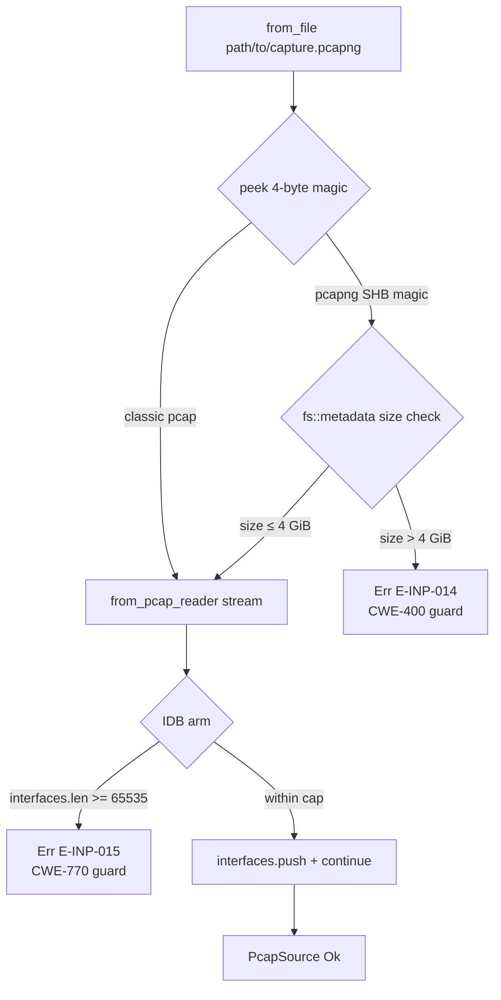
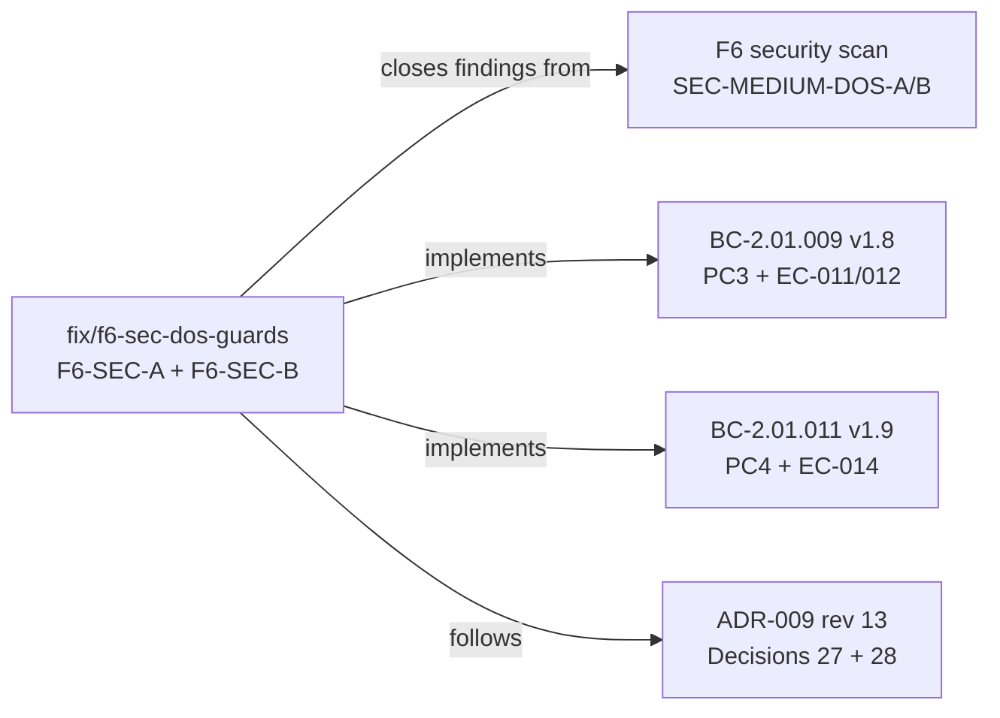
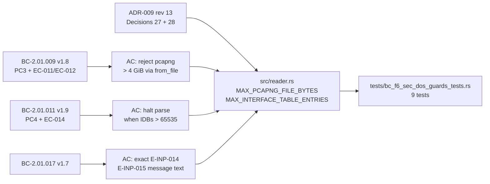

## Summary

Closes two MEDIUM DoS findings from the F6 security scan by adding bounded-input guards to the pcapng parser:

- **F6-SEC-A / E-INP-014** (CWE-400: Uncontrolled Resource Consumption): `const MAX_PCAPNG_FILE_BYTES = 4_294_967_296` (4 GiB) gate in `PcapSource::from_file`. After magic bytes confirm pcapng format, `fs::metadata(path).len() > MAX` causes rejection before `read_to_end`. The stream path (`from_pcap_reader<R: Read>`) is intentionally not gated — no `fs::metadata` is available for a generic `Read` stream; the interface cap (E-INP-015) still bounds memory there.
- **F6-SEC-B / E-INP-015** (CWE-770: Allocation of Resources Without Limits): `const MAX_INTERFACE_TABLE_ENTRIES = 65_535` guard fires before every `interfaces.push()` in the IDB arm, halting parse immediately when the interface table would exceed the cap.

## Why This PR Exists

Without these guards, an attacker can trigger unbounded memory allocation in two independent ways:
1. Feed a 100 GB pcapng file → `read_to_end` allocates the full buffer into RAM (CWE-400).
2. Embed 65,536+ IDB blocks in a small file → the interface table grows without bound (CWE-770).

Both vectors were reachable via `from_file` with no rate-limiting at the call site. The guards are spec-mandated: BC-2.01.009 PC3 (E-INP-014) and BC-2.01.011 PC4 (E-INP-015), with exact error messages specified in error-taxonomy v3.8.

## Architecture Changes



## Story Dependencies



## Spec Traceability



## What Changed

| File | Change | Nature |
|------|--------|--------|
| `src/reader.rs` | +59 lines | Production: two guard constants + from_file size-gate logic + IDB push guard |
| `tests/bc_f6_sec_dos_guards_tests.rs` | +328 lines | New test file: 9 tests (RED→GREEN TDD) |

### Exact constants and messages

**F6-SEC-A (src/reader.rs):**
```rust
const MAX_PCAPNG_FILE_BYTES: u64 = 4_294_967_296; // 4 GiB
// Error: "pcapng file too large: {size} bytes exceeds limit of {limit} bytes (E-INP-014); use a streaming tool or split the capture"
```

**F6-SEC-B (src/reader.rs):**
```rust
const MAX_INTERFACE_TABLE_ENTRIES: usize = 65_535;
// Error: "pcapng interface table too large: exceeds limit of 65535 interfaces (E-INP-015)"
```

### Gate ordering (BC-2.01.009 PC3 compliance)

1. Open file → BufReader
2. `fill_buf()` peeks 4 magic bytes (non-consuming)
3. If magic == `PCAPNG_MAGIC` → call `fs::metadata(path).len()`
4. If `len > MAX_PCAPNG_FILE_BYTES` → return `Err(E-INP-014)` — no `read_to_end`
5. Else → delegate to `from_pcap_reader(buf_reader)` (magic bytes still unconsumed in buffer)

Classic-pcap path branches at step 3 directly to `from_pcap_reader` — unaffected.

### Why `from_pcap_reader` is not size-gated

`from_pcap_reader<R: Read>` accepts any `Read` source (file, network socket, stdin, Cursor). There is no `fs::metadata` equivalent for a generic `Read`. Gating this path would require fully buffering the stream first, which defeats the purpose. The interface cap (E-INP-015) still bounds memory allocation in all paths, including `from_pcap_reader`.

### 4 GiB ceiling rationale

The 4 GiB limit was human-approved (orchestrator authorization). Rationale:
- Real-world pcapng captures rarely exceed 1–2 GB for a single session file
- `u32::MAX` (4,294,967,295 bytes) is the natural alignment for pcapng's 32-bit block length fields
- A `read_to_end` on a 4 GiB file is the largest allocation a single parse call can legitimately need
- Files above this threshold should be split or processed with streaming tools

### 65,535 interface cap rationale

- `u16::MAX - 1` (65,535) is a natural cap: pcapng `interface_id` in EPB/SPB/IDB is a 32-bit field, but legitimate captures never need more than a few dozen interfaces
- A capture with 65,536 IDB entries is either malformed or adversarial
- The cap still supports legitimate multi-interface captures (trunks, VLANs, tunnels)

## Test Evidence

### 9 Tests in `tests/bc_f6_sec_dos_guards_tests.rs`

**F6-SEC-A (file-size gate, E-INP-014):**

| Test | Scenario | Expected |
|------|----------|----------|
| `test_BC_2_01_009_file_size_gate_rejects_oversized_pcapng` | Sparse pcapng file at MAX+1 bytes (4 GiB + 1) | `Err` containing `"E-INP-014"` + `"too large"` |
| `test_BC_2_01_009_file_size_gate_accepts_exactly_max_bytes` | Sparse pcapng file at exactly MAX bytes | No `E-INP-014` error (boundary exclusive) |
| `test_BC_2_01_009_file_size_gate_normal_file_still_parses` | Normal SHB + 1 IDB pcapng file | `Ok` — non-regression |
| `test_BC_2_01_009_stream_path_not_gated_by_file_size` | Cursor with SHB + IDB (no file) | `Ok` — stream path ungated |
| `test_BC_2_01_009_file_size_gate_exact_error_message` | Oversized file; check verbatim error text | `"pcapng file too large: {size} bytes exceeds limit of {limit} bytes (E-INP-014); use a streaming tool or split the capture"` |

**F6-SEC-B (interface cap, E-INP-015):**

| Test | Scenario | Expected |
|------|----------|----------|
| `test_BC_2_01_011_interface_cap_rejects_65536_idbs` | 65,536 IDBs (MAX+1) | `Err` containing `"E-INP-015"` + `"65535"` |
| `test_BC_2_01_011_interface_cap_accepts_exactly_65535_idbs` | Exactly 65,535 IDBs (MAX) | `Ok` — boundary inclusive |
| `test_BC_2_01_011_interface_cap_normal_file_unaffected` | 1 IDB (normal capture) | `Ok` — non-regression |
| `test_BC_2_01_011_interface_cap_exact_error_message` | 65,536 IDBs; check verbatim error text | `"pcapng interface table too large: exceeds limit of 65535 interfaces (E-INP-015)"` |

### Suite Result (local)

```
cargo test --all-targets   →  0 failures (all 9 new tests GREEN)
cargo clippy --all-targets -- -D warnings  →  0 warnings
cargo fmt --check  →  clean
```

## Error Code Traceability

| Error Code | CWE | BC | EC | Exact message |
|------------|-----|----|----|---------------|
| E-INP-014 | CWE-400 | BC-2.01.009 PC3 | EC-011/EC-012 | `pcapng file too large: {size} bytes exceeds limit of {limit} bytes (E-INP-014); use a streaming tool or split the capture` |
| E-INP-015 | CWE-770 | BC-2.01.011 PC4 | EC-014 | `pcapng interface table too large: exceeds limit of 65535 interfaces (E-INP-015)` |

Both messages are specified verbatim in error-taxonomy v3.8 / BC-2.01.017 v1.7.

## Holdout Evaluation

N/A — evaluated at wave gate.

## Adversarial Review

N/A — evaluated at Phase 5. Security findings F6-SEC-A and F6-SEC-B were identified and classified by the F6 security scan; this PR implements the remediation.

## Security Review

Populated after step 4 review (see review cycle below).

## Risk Assessment

| Dimension | Assessment |
|-----------|------------|
| Blast radius | Low — production change limited to `src/reader.rs`; two new early-exit error paths; no parsing logic altered |
| Performance impact | Negligible — one `fs::metadata` syscall added per `from_file` call on pcapng files; one integer comparison per IDB in the interface-table loop |
| Rollback | Remove 2 constants + size-gate block + IDB guard + test file; revert `from_file` to single-line `from_pcap_reader` call |
| Dependency change | None |
| TOCTOU risk | Low — `fs::metadata` is called immediately after open; window is the magic-peek time only. The gate is a DoS guard, not a security boundary for integrity — a race that changes file size between stat and read would at worst allow a slightly-over-limit file through, not cause harm. See security review for full analysis. |

## AI Pipeline Metadata

| Field | Value |
|-------|-------|
| Pipeline mode | Security fix (F6 hardening) |
| Model | claude-sonnet-4-6 |
| Delivery pattern | Fix branch — direct remediation of F6 security scan findings |
| Human authorization | 4 GiB ceiling human-approved (orchestrator) |

## Pre-Merge Checklist

- [x] Gate ordering: magic-detect → size-gate → `from_pcap_reader` (BC-2.01.009 PC3 compliant)
- [x] `MAX_PCAPNG_FILE_BYTES = 4_294_967_296` (4 GiB, human-approved)
- [x] `MAX_INTERFACE_TABLE_ENTRIES = 65_535`
- [x] E-INP-014 message matches error-taxonomy v3.8 verbatim
- [x] E-INP-015 message matches error-taxonomy v3.8 verbatim
- [x] `from_pcap_reader` not size-gated (documented reason: no `fs::metadata` on generic `Read`)
- [x] Interface cap applies in `from_pcap_reader` path (CWE-770 still bounded)
- [x] Boundary conditions: `> MAX` rejected, `== MAX` accepted (exclusive upper bound)
- [x] 9 tests written TDD (RED → GREEN)
- [x] `cargo test --all-targets` → 0 failures
- [x] `cargo clippy --all-targets -- -D warnings` → 0 warnings
- [x] `cargo fmt --check` → clean
- [ ] CI green (pending)
- [ ] Code review complete
- [ ] Security review complete
