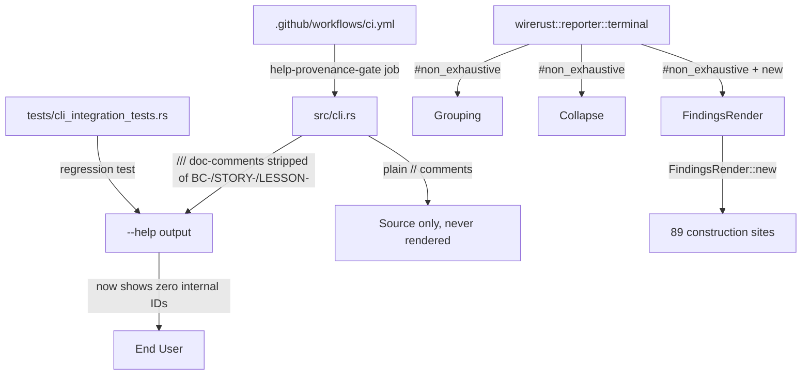
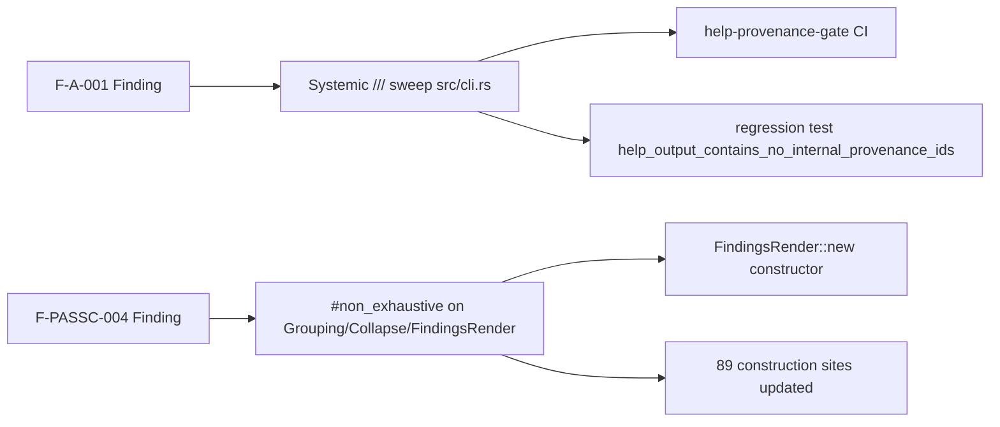

## Fix: F7 Round-2 CLI Hardening

**Findings Closed:** F-A-001 (MEDIUM) + F-PASSC-004 (LOW)
**Phase:** F7 (adversarial convergence)
**Severity:** MEDIUM (F-A-001 systemic sweep) + LOW (F-PASSC-004 non_exhaustive)
**Branch:** `fix/f7-r2-cli-hardening`
**Related Issues:** Closes #62 (TerminalReporter enum-of-modes), relates to #259 (collapse grouping)

---

### What Changed

#### F-A-001 — Internal factory ID provenance leak in `--help` output (MEDIUM, systemic sweep)

All `///` doc-comments in `src/cli.rs` (the sole clap-derive module) were audited and
stripped of every internal factory ID pattern (`BC-`, `STORY-`, `LESSON-`). Clap renders
`///` doc-comments verbatim into `--help` output; `//` comments are never rendered.

- **12+ CLI flags** had internal IDs in their `///` doc-comments; all moved to plain `//`
  comments immediately above or below the `///` block.
- Provenance information is fully preserved — it is simply invisible to end users.
- A new CI gate `help-provenance-gate` was added to `.github/workflows/ci.yml` to prevent
  recurrence. It scans `src/cli.rs` for `///` lines matching `BC-[0-9]`, `STORY-[0-9]`,
  or `LESSON-` and fails the build if any match is found.
- A regression test `help_output_contains_no_internal_provenance_ids` was added to
  `tests/cli_integration_tests.rs` that runs `wirerust analyze --help` and asserts the
  output contains no `BC-`, `STORY-`, or `LESSON-` substrings. The test was fail-verified
  before the fix was applied.

**Reporter output is unchanged.** Only help text was modified.

#### F-PASSC-004 — Missing `#[non_exhaustive]` on public reporter enums (LOW)

Added `#[non_exhaustive]` to `Grouping`, `Collapse`, and `FindingsRender` in
`wirerust::reporter::terminal`. These types are `pub` in a public crate and were first
introduced in v0.9.0, so this is a free change before any downstream crates could have
hardcoded struct-literal construction.

Since `tests/` is an external crate (separate compilation unit), struct-literal construction
of `FindingsRender { grouping: .., collapse: .. }` would be blocked by `#[non_exhaustive]`.
A `FindingsRender::new(grouping, collapse)` constructor was added to provide the canonical
construction path. All 89 construction sites were updated:
- 2 in `src/main.rs`
- 87 in `tests/` (across `reporter_terminal_tests.rs`, `reporter_tests.rs`,
  `bc_2_09_100_multitag_tests.rs`, `dnp3_f5_remediation_tests.rs`)

CHANGELOG `[0.9.0]` was updated to note `#[non_exhaustive]` on these types and the new
constructor. ADR-0003 Phase-B was updated to name the `grouping_from_flag` /
`collapse_findings_from_flag` helper functions.

---

### Why

F-A-001 was identified in F7 adversarial review: internal factory IDs (`BC-2.09.100`,
`STORY-062`, `LESSON-P1.04`, etc.) were visible in `wirerust analyze --help` output, leaking
internal implementation provenance to end users. The human-approved scope was a full systemic
sweep (not a targeted fix) plus a CI gate to prevent recurrence.

F-PASSC-004 was identified in F7 Pass-C review: `Grouping`, `Collapse`, and `FindingsRender`
lacked `#[non_exhaustive]`, meaning adding a new variant or field would be a semver-breaking
change. Per LESSON-P2.10 and ADR-0003 growth path, these should be non-exhaustive since
v0.9.0 is their introduction point.

---

### Scope Decisions (Human-Approved)

1. **Full sweep** of all `///` doc-comments in `src/cli.rs` — not just the single flag
   initially flagged — because the pattern was systemic across 12+ flags.
2. **CI gate** `help-provenance-gate` added to prevent recurrence. Gate is scoped to
   `src/cli.rs` only (not over-broad); if a new clap-derive module is added, the gate
   comment instructs maintainers to append its path.
3. **`#[non_exhaustive]` + constructor** rather than a narrower approach, because v0.9.0
   is the introduction version of these types and this is the correct time to apply it.

---

### Testing

- [x] `cargo test --all-targets` — all tests pass (0 failures)
- [x] `cargo clippy --all-targets -- -D warnings` — clean
- [x] `cargo fmt --check` — clean
- [x] `help-provenance-gate` CI check — passes on swept `src/cli.rs`
- [x] `help_output_contains_no_internal_provenance_ids` regression test — passes (was
      fail-verified before fix)
- [x] 89 `FindingsRender` construction sites updated and compile correctly with `#[non_exhaustive]`

---

### Architecture Changes

---

### Spec Traceability

---

### Pre-Merge Checklist

- [x] Branch: `fix/f7-r2-cli-hardening`
- [x] Semantic PR title: `fix(cli): F7-R2 hardening — sweep --help provenance leaks + CI gate + non_exhaustive reporter types`
- [x] All tests pass locally
- [x] Clippy clean
- [x] Fmt clean
- [x] No demo needed — reporter output unchanged (F-A-001 is help-text only; F-PASSC-004 is attribute + API change)
- [ ] PR-reviewer approval
- [ ] Security-reviewer sign-off
- [ ] CI checks green
- [ ] Human gate — explicit merge authorization required
