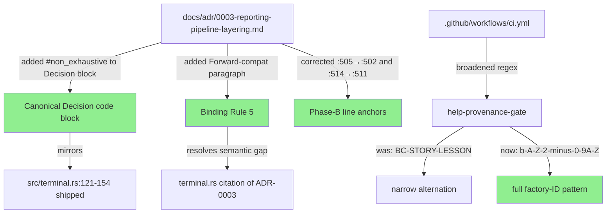
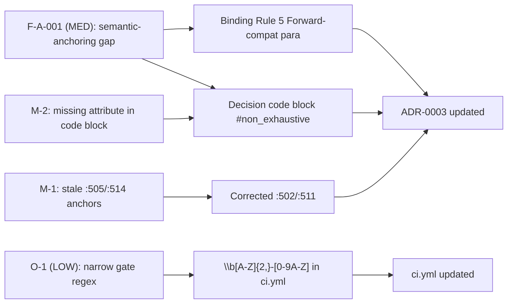

## Fix: F7 Round-3 ADR/Gate Sync

**Findings Closed:** F-A-001 (MED) + M-1/M-2 (consistency) + O-1 (LOW)
**Phase:** F7 (adversarial convergence — Round 3)
**Severity:** MEDIUM (F-A-001 semantic-anchoring gap) + LOW (O-1 defense-in-depth gate broadening)
**Branch:** `docs/f7-r3-adr-sync`
**Related Issues:** Closes #62 (TerminalReporter enum-of-modes), relates to #259 (collapse grouping)

---

### What Changed

#### F-A-001 + M-1/M-2 — ADR-0003 sync: `#[non_exhaustive]` + constructor + stale line anchors

ADR-0003 recorded the `Grouping / Collapse / FindingsRender` struct-of-enums design but did
not reflect the `#[non_exhaustive]` attributes and `FindingsRender::new` constructor that were
shipped as part of F7-R2. `terminal.rs:~140` cited "ADR-0003 / LESSON-P2.10" as rationale for
the non-exhaustive pattern, but ADR-0003 contained no such record — creating a semantic-anchoring
gap (F-A-001). Two consistency findings (M-1: stale line anchors, M-2: missing attribute
annotation in the Decision code block) accompanied this gap.

Three changes to `docs/adr/0003-reporting-pipeline-layering.md`:

1. **Canonical Decision code block** (Grouped-Mode Collapse section, ~line 649): added
   `#[non_exhaustive]` to `Grouping` (~line 650), `Collapse` (~line 660), and `FindingsRender`
   (~line 679); added the `FindingsRender::new(grouping, collapse) -> Self` impl block.
   Mirrors shipped `terminal.rs:121`, `:129`, `:142`, `:154` and CHANGELOG.md §[0.9.0] exactly.

2. **Binding Rule 5** (~line 567): added "Forward-compatibility (F7-R2)" paragraph recording
   that all three types are `#[non_exhaustive]`, external crates must use `FindingsRender::new`,
   and the compiler rejects struct-literal construction outside the defining crate. Mirrors
   CHANGELOG.md §[0.9.0] "Forward-compatibility (F7-R2)" in substance. This resolves the
   semantic-anchoring gap: `terminal.rs`'s citation of ADR-0003 as rationale is now valid.

3. **Stale line anchors** (M-1): Phase-B section cited `collapse_findings_from_flag` at
   `src/main.rs:505` and `grouping_from_flag` at `src/main.rs:514`. Verified actual positions:
   `:502` and `:511` respectively. Both anchors corrected.

**No src/ or test changes.** This is documentation-only. Reporter behavior is unchanged.

#### O-1 — Broaden `help-provenance-gate` regex for defense-in-depth

The previous CI gate scanned only for `BC-[0-9]`, `STORY-[0-9]`, and `LESSON-` prefixes.
Finding O-1 observed that factory IDs with other prefixes (VP-, ADR-, EC-, AC-, TD-, PG-)
would pass undetected. The regex was broadened to `\b[A-Z]{2,}-[0-9A-Z]`, which matches any
factory internal-ID convention (two-or-more uppercase letters + hyphen + digit-or-uppercase).

**False-positive safety verified:**
- Lowercase hyphenated prose (`non-zero`, `opt-in`, `TLS-encrypted`) never matches `[A-Z]{2,}`.
- Standalone uppercase acronyms without a hyphen-then-digit suffix (`MITRE`, `JSON`, `TCP`, `ARP`)
  do not match.
- Zero matches on current `src/cli.rs` confirmed before committing.

The CI job comment block was updated to document all covered prefix families and the
false-positive analysis, making the gate maintainer-visible and justification-complete.

---

### Why

F7 Round-3 adversarial review identified a semantic-anchoring gap: `terminal.rs` cited ADR-0003
as rationale for `#[non_exhaustive]` but ADR-0003 did not record this decision. Findings M-1/M-2
identified the Decision code block was missing the attribute annotations and two line anchors
were stale. O-1 observed the CI gate was narrower than necessary given the full set of factory
ID prefixes in active use.

Related to issue #62 (TerminalReporter enum-of-modes design) and issue #259 (collapse grouping).

---

### Scope

- **Doc + CI only.** No changes to `src/`, `tests/`, or `Cargo.toml`.
- **No behavior change.** Reporter output, CLI flags, exit codes, and test suite are all unchanged.
- **No demo needed.** This fix is transparent to end users — changes are to an ADR and a CI
  regex comment + pattern.

---

### Testing

- [x] All pre-existing tests pass — `cargo test --all-targets` clean (verified by CI)
- [x] `cargo clippy --all-targets -- -D warnings` — no changes to src/ so no new lint surface
- [x] `cargo fmt --check` — no changes to src/ so no new fmt surface
- [x] `help-provenance-gate` CI check — broadened regex passes on current `src/cli.rs` (zero matches confirmed before commit fb12f54)
- [x] No new tests needed — no behavior change

---

### Architecture Changes

---

### Spec Traceability

---

### Pre-Merge Checklist

- [x] Branch: `docs/f7-r3-adr-sync`
- [x] Semantic PR title: `docs(adr-0003): sync #[non_exhaustive] + broaden help-provenance gate (F7-R3)`
- [x] All tests pass locally
- [x] No src/ changes — clippy/fmt not affected
- [x] No demo needed — doc + CI only, no behavior change
- [x] Zero false-positive matches on src/cli.rs before committing broadened regex
- [x] PR-reviewer approval — APPROVE, 1 NIT (non-blocking)
- [x] Security-reviewer sign-off — APPROVE, 2 LOW findings (post-merge candidates; see review-findings.md)
- [x] CI checks green — all 10/10 pass; help-provenance-gate PASS with broadened regex
- [ ] Human gate — explicit merge authorization required
