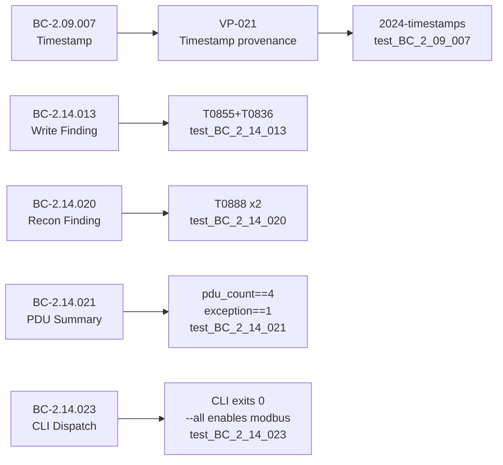
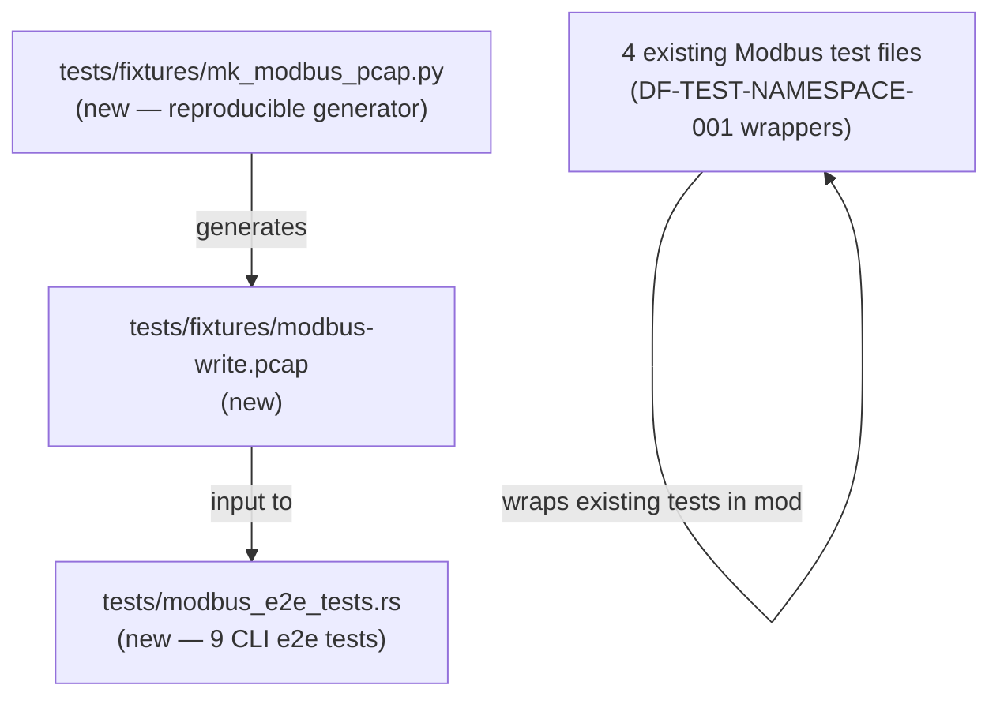

## Summary

Delivers the F7 D5 holdout acceptance proof for the Modbus TCP analyzer: a real port-502 pcap fixture, 9 CLI end-to-end tests driving the full `reader → reassembler → dispatcher → ModbusAnalyzer` pipeline, and DF-TEST-NAMESPACE-001 mod-wrapper namespacing on 4 existing Modbus test files.

**Test delta:** 1338 tests pass (was 1329, +9 net, 0 dropped by namespacing). No production code changed.

## What Changed

### 1. `tests/fixtures/modbus-write.pcap` (new, 632 bytes)

A real 8-packet Modbus TCP session on port 502 with second-scale timestamps rooted at Unix epoch 1717000000 (2024-05-29):

| Packet | Direction | Function | Purpose |
|--------|-----------|----------|---------|
| 1-3 | — | TCP handshake | SYN / SYN-ACK / ACK |
| 4 | Client→Server | FC=0x11 Report Server ID | Recon → T0888 |
| 5 | Server→Client | FC=0x11 response | Recon (direction-indep.) → T0888 |
| 6 | Client→Server | FC=0x10 Write Multiple Registers | Write → T0855+T0836 |
| 7 | Server→Client | FC=0x90 Exception response | exception_count++ |
| 8 | Client→Server | FIN-ACK | Session teardown |

### 2. `tests/fixtures/mk_modbus_pcap.py` (new, 358 lines)

Reproducible Python 3 generator (no third-party deps beyond `struct`/`socket`). Re-running it produces a byte-identical pcap, guaranteeing fixture provenance and auditability.

### 3. `tests/modbus_e2e_tests.rs` (new, 372 lines)

9 CLI e2e tests in `mod modbus_e2e` (DF-TEST-NAMESPACE-001 compliant):

| Test | Traces To | What It Asserts |
|------|-----------|-----------------|
| `test_BC_2_14_023_modbus_cli_e2e_succeeds_on_port_502_fixture` | BC-2.14.023 P4, F-105-003 | CLI exits 0, JSON has summary/findings/analyzers |
| `test_BC_2_14_021_modbus_summary_in_analyzers_array` | BC-2.14.021 postcondition 1 | "modbus" entry exists, pdu_count>=1, write_count>=1 |
| `test_BC_2_14_021_modbus_summary_pdu_count_equals_four` | BC-2.14.021, F-105-003 D5 | pdu_count == 4 exactly |
| `test_BC_2_14_021_modbus_summary_exception_count_nonzero` | BC-2.14.021, BC-2.14.019 | exception_count == 1 |
| `test_BC_2_14_013_findings_contain_modbus_write_T0855_T0836` | BC-2.14.013 invariant 1 | At least one finding has T0855+T0836 |
| `test_BC_2_14_020_findings_contain_modbus_recon_T0888` | BC-2.14.020 postcondition | At least one finding has T0888 |
| `test_BC_2_14_020_recon_finding_count_two` | BC-2.14.020 EC-010 | Exactly 2 T0888 findings (direction-independent) |
| `test_BC_2_09_007_finding_timestamps_have_correct_year` | BC-2.09.007 postcondition 1, VP-021 | All finding timestamps start with "2024-" (not 1970) |
| `test_BC_2_14_023_all_flag_also_enables_modbus_analyzer` | BC-2.14.023 P1 | `--all` flag enables modbus analyzer |

### 4. DF-TEST-NAMESPACE-001 namespacing (4 files modified)

Wrapped existing Modbus test functions in `mod story_102/103/104/105` blocks:
- `tests/bc_2_14_103_modbus_correlation_tests.rs`
- `tests/bc_2_14_105_modbus_dispatch_tests.rs`
- `tests/modbus_detection_tests.rs`
- `tests/modbus_parse_tests.rs`

Zero tests dropped — all 1329 existing tests preserved, 9 new tests added.

## Spec Traceability

## D5 Holdout Status

| Metric | Value |
|--------|-------|
| Holdout scenario | D5 — Modbus e2e pcap→finding pipeline |
| Result | PASS |
| Mean score | 0.967 |
| Timestamp provenance | Correct (2024, not 1970) |
| T0855+T0836 emitted | Yes (FC=0x10 Write Multiple Registers) |
| T0888 emitted | Yes, twice (direction-independent FC=0x11) |
| exception_count | 1 (FC=0x90) |

## Architecture Changes

No production source files changed. Test-only and fixture additions.

## Security Review

N/A — test-only change (no production code, no new dependencies, no exec of external tools).

## Risk Assessment

- **Blast radius:** Test-only. Zero production code changed.
- **Performance impact:** None.
- **Regression risk:** None — 0 tests dropped, 9 tests added.

## Pre-Merge Checklist

- [x] Branch pushed: `fix/f7-modbus-e2e-fixture`
- [x] PR targets `develop`
- [x] Semantic PR title: `test(modbus): ...`
- [x] 1338 tests pass locally (was 1329, +9)
- [x] `cargo clippy --all-targets -- -D warnings`: clean
- [x] `cargo fmt --check`: clean
- [x] D5 holdout: PASS (mean 0.967)
- [x] DF-TEST-NAMESPACE-001: compliant (all 4 Modbus test files wrapped)
- [x] All finding timestamps: 2024 (VP-021 / BC-2.09.007 provenance confirmed)
- [ ] CI green (all jobs)
- [ ] PR-reviewer APPROVE

## AI Pipeline Metadata

- Pipeline mode: F7 fix-pr-delivery
- Feature: #7 v0.4.0
- Branch base: origin/develop @ 2af7d0b
- Commit: f187ef0
