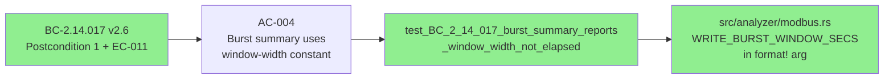
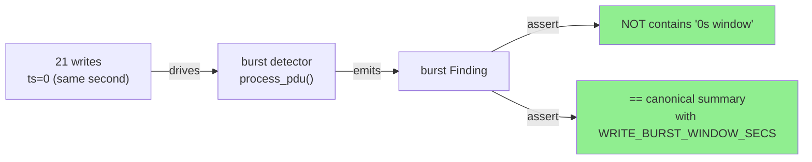

# fix(modbus): report burst window width not elapsed span in summary

**Issue:** Closes #220
**Branch:** `fix/modbus-burst-window-display` → `develop`
**Story:** STORY-104 AC-004 / BC-2.14.017 v2.6 EC-011
**Mode:** bug-fix (no behavioral change — display string only)

## Summary

Modbus write-burst findings rendered a misleading `"...0s window"` string when
all writes in the burst shared the same integer-second timestamp.

**Root cause:** The burst summary format string interpolated `burst_elapsed`
(elapsed time between first and last write in the burst — often `0` for
same-second bursts) as if it were the configured window width. The misnamed dead
binding `elapsed_ms` (which held `burst_elapsed` in seconds, not milliseconds)
further obscured the intent.

**Fix:** Report `WRITE_BURST_WINDOW_SECS` (the configured window width constant,
value `1`) instead of the elapsed span. The preposition was also corrected from
`"in"` to `"within"` for grammatical accuracy. Removed the dead `elapsed_ms`
binding (dead code, Clippy would have caught it).

**Scope:** Zero behavioral change — detection thresholds, window logic, and
counts are untouched. The diff is `src/analyzer/modbus.rs` (+6/-5 including
dead-binding removal) plus `tests/modbus_detection_tests.rs` (new regression
test + rustfmt style collapse).

**Spec alignment (out-of-band):** BC-2.14.017 was updated to v2.6 (Postcondition 1
+ new EC-011) on the factory-artifacts branch (commit `8d5446d`). That update
is NOT part of this PR's diff (`.factory/` is gitignored from develop) but is
noted here for traceability.

---

## Architecture Changes

No architectural changes. This is a one-line display-string fix within the
existing `process_pdu` burst detector path in `src/analyzer/modbus.rs`.

```mermaid
graph TD
    ProcessPdu["process_pdu()\nsrc/analyzer/modbus.rs"] -->|burst threshold crossed| BurstFinding["Finding { summary: ... }"]
    BurstFinding -->|BEFORE: used burst_elapsed\n(often 0 for same-second)| BugString["\"...in 0s window\""]
    BurstFinding -->|AFTER: uses WRITE_BURST_WINDOW_SECS\n(= 1, configured constant)| FixString["\"...within 1s window\""]
    style BugString fill:#FF9999
    style FixString fill:#90EE90
```

---

## Story Dependencies


No upstream PRs are pending. This fix targets `develop` directly.

---

## Spec Traceability



| BC | Version | AC | Test | Status |
|----|---------|-----|------|--------|
| BC-2.14.017 | v2.6 | AC-004 (EC-011, Postcondition 1) | `test_BC_2_14_017_burst_summary_reports_window_width_not_elapsed` | PASS |

---

## Test Evidence

| Metric | Value | Status |
|--------|-------|--------|
| New regression test | `test_BC_2_14_017_burst_summary_reports_window_width_not_elapsed` | PASS |
| Full suite (`cargo test --all-targets`) | All tests pass | PASS |
| `cargo clippy --all-targets -- -D warnings` | 0 warnings | PASS |
| `cargo fmt --check` | Clean | PASS |
| Burst count invariant | Unchanged (same-second burst still fires at threshold+1) | PASS |

The new test drives 21 write-class FCs all at `ts=0` (same integer-second
timestamp), which is exactly the condition that triggered the pre-fix `"0s
window"` regression. It asserts:
1. The anti-regression property: `"0s window"` is absent from the summary.
2. The exact canonical form: `"Modbus write burst: 21 writes within 1s window (unit 1, threshold 20/s)"`.



---

## Demo Evidence

N/A — this is a CLI tool with no interactive UI. The fix affects an internal
finding summary string. Behavioral verification is covered by the regression
test above.

---

## Holdout Evaluation

N/A — evaluated at wave gate. Not applicable to individual bug-fix PRs.

---

## Adversarial Review

N/A — evaluated at Phase 5 / wave gate. This is a minimal one-line display fix
with a dedicated regression guard; no adversarial pass required.

---

## Security Review

No security impact. The fix changes a format string argument from
`burst_elapsed` to `WRITE_BURST_WINDOW_SECS` in a display-only path. No
attacker-controlled data is interpolated differently; both values are integers
derived from internal state or constants.

| Severity | Count | Notes |
|----------|-------|-------|
| Critical | 0 | — |
| High | 0 | — |
| Medium | 0 | — |
| Low | 0 | — |

---

## Risk Assessment

- **Blast radius:** `src/analyzer/modbus.rs` display string only (1 line changed)
- **Behavioral change:** None — detection thresholds, window logic, counts unchanged
- **User impact:** Burst finding summary now correctly reads `"within 1s window"`
  instead of `"in 0s window"` for same-second bursts
- **Risk level:** MINIMAL — display-only fix, comprehensive regression guard added

---

## AI Pipeline Metadata

```yaml
ai-generated: true
pipeline-mode: bug-fix
story: STORY-104 AC-004
bc: BC-2.14.017 v2.6
issue: 220
fix-type: display-string (non-behavioral)
models-used:
  builder: claude-sonnet-4-6
generated-at: "2026-06-17"
```

---

## Pre-Merge Checklist

- [x] CI checks passing (test, clippy, fmt, action-pin-gate, semantic-PR)
- [x] Regression test added (anti-regression + exact canonical form)
- [x] No security findings
- [x] No behavioral change — counts/thresholds/window unchanged
- [x] Semantic PR title passes CI (`fix` type, allowed by amannn/action-semantic-pull-request)
- [x] BC-2.14.017 v2.6 traceability recorded
- [x] Issue #220 referenced with `Closes #220`
