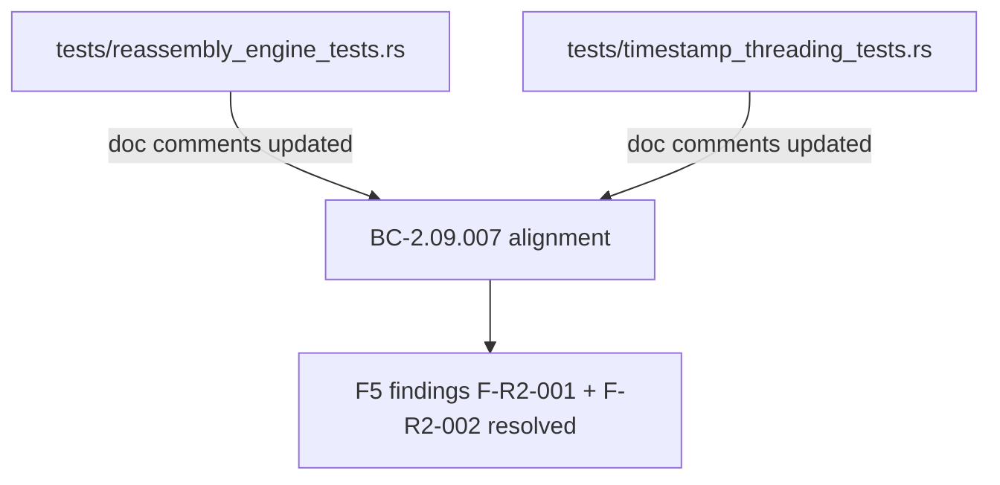
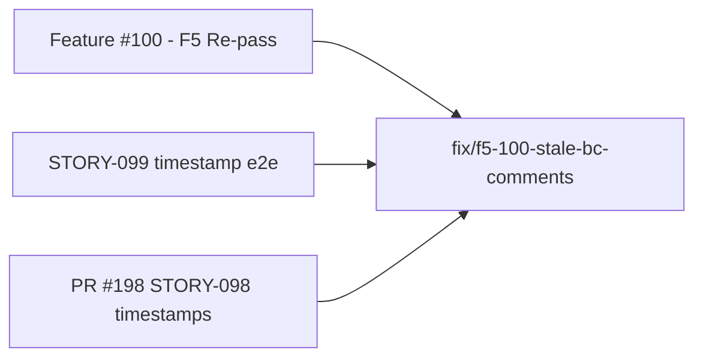
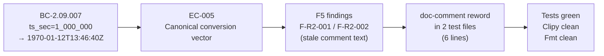

## Summary

Comment-only documentation-truth fix. Six stale doc-comment lines in two test files falsely stated that BC-2.09.007 "mislabels the date as 2001" — the BC was since corrected to specify `ts_sec=1_000_000 → 1970-01-12T13:46:40Z`. Addresses F5 re-pass findings F-R2-001 and F-R2-002 (Feature #100).

**No assertion changes. No logic changes. No source-code changes. Tests, clippy, and fmt all pass locally.**

---

## Architecture Changes

No architecture changes. This PR modifies doc-comment strings in test files only.

---

## Story / Feature Dependencies

Depends on: STORY-098 (PR #198, merged), STORY-099 (PR #199/#200, merged).

---

## Spec Traceability

**Traceability chain:**
- BC-2.09.007 (corrected) specifies `ts_sec=1_000_000 → 1970-01-12T13:46:40Z`
- EC-005 is the canonical conversion test vector
- F5 re-pass identified F-R2-001 (reassembly_engine_tests.rs stale comment) and F-R2-002 (timestamp_threading_tests.rs stale comment)
- This PR updates the 6 stale lines to reflect the corrected BC wording

---

## Files Changed

| File | Change Type | Lines |
|------|-------------|-------|
| `tests/reassembly_engine_tests.rs` | doc comments only | 4 lines rewrapped |
| `tests/timestamp_threading_tests.rs` | doc comments only | 2 lines rewrapped |

---

## Test Evidence

All tests verified locally in the worktree before this PR was opened.

| Gate | Result |
|------|--------|
| `cargo test --all-targets` | PASS |
| `cargo clippy --all-targets -- -D warnings` | PASS (0 warnings) |
| `cargo fmt --check` | PASS |

No assertions were changed; the test behavior is identical to the base commit.

---

## Holdout Evaluation

N/A — evaluated at wave gate.

---

## Adversarial Review

N/A — evaluated at Phase 5 (F5 re-pass identified these findings; this PR is the resolution).

---

## Security Review

N/A — comment-only change. No executable code paths modified. No input validation, auth, or data-flow changes. Security review not required per triage.

---

## Risk Assessment

| Dimension | Assessment |
|-----------|-----------|
| Blast radius | Minimal — doc comments only, zero runtime impact |
| Behavior change | None |
| Assertion change | None |
| Performance impact | None |
| Rollback complexity | Trivial (revert single commit) |

---

## Pre-Merge Checklist

- [x] PR description matches actual diff
- [x] Comment-only — no logic/assertion changes confirmed
- [x] BC-2.09.007 wording aligned in both test files
- [x] F-R2-001 (reassembly_engine_tests.rs) addressed
- [x] F-R2-002 (timestamp_threading_tests.rs) addressed
- [x] Tests passing locally
- [x] Clippy clean
- [x] Fmt clean
- [ ] CI green (awaiting)
- [ ] PR review approved

---

## AI Pipeline Metadata

| Field | Value |
|-------|-------|
| Pipeline mode | fix-pr-delivery |
| Story/Fix ID | FIX-F5-100-STALE-BC-COMMENTS |
| Models used | claude-sonnet-4-6 |
| Change classification | documentation-truth (comment-only) |
