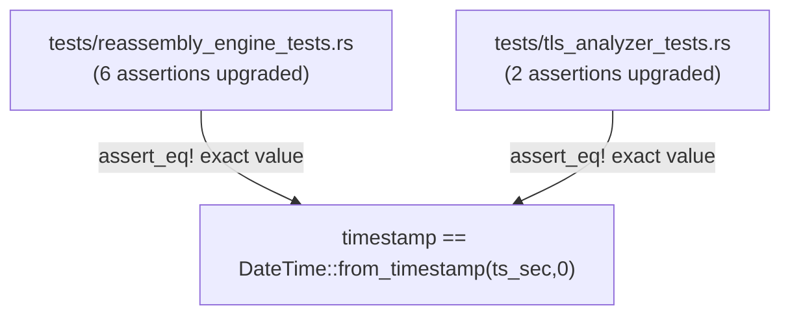
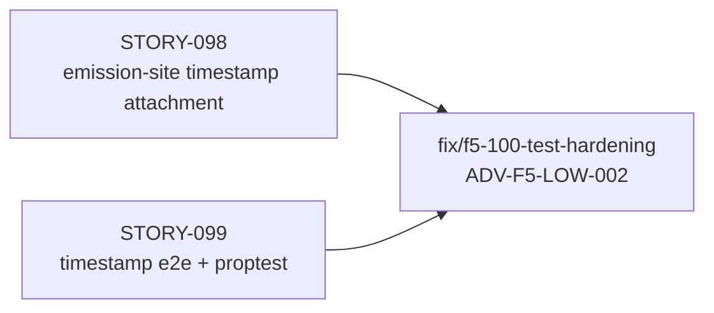
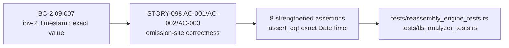

## Summary

Test-only hardening: strengthens 8 STORY-098 emission-site assertions from `timestamp.is_some()` to exact `assert_eq!(f.timestamp, DateTime::from_timestamp(ts_sec, 0))` — addressing F5 adversarial finding ADV-F5-LOW-002. No source code, no behavior, no API surface changed.

**Feature:** #100 — pcap timestamp → Finding.timestamp  
**Finding addressed:** ADV-F5-LOW-002 (Test Quality, LOW)  
**Finding deferred:** ADV-F5-LOW-003 (Coverage Gap — no flow discriminator in `Finding` struct; fix requires source changes out of scope for test-hardening PR)

## Architecture Changes

No architecture changes. Test files only.

## Story Dependencies

All upstream PRs (#197 STORY-098, #199 STORY-099) are merged into `develop`.

## Spec Traceability

| BC | AC | Test | Finding Addressed |
|----|-----|------|------------------|
| BC-2.09.007 inv-2 (exact value) | STORY-098 AC-001 | `test_http_findings_have_timestamp` → `assert_eq!` | ADV-F5-LOW-002 |
| BC-2.09.007 inv-2 (exact value) | STORY-098 AC-002 | `test_tls_findings_have_timestamp` → `assert_eq!` | ADV-F5-LOW-002 |
| BC-2.09.007 inv-2 (exact value) | STORY-098 AC-003 | `test_reassembly_anomaly_findings_have_timestamp` → `assert_eq!` (4 sub-assertions) | ADV-F5-LOW-002 |
| BC-2.09.007 inv-2 (exact value) | STORY-098 AC-002 | `tls_analyzer_tests.rs` (2 assertions) | ADV-F5-LOW-002 |

## Test Evidence

| Metric | Value |
|--------|-------|
| Total tests | 1147 passed, 0 failed |
| Changed files | `tests/reassembly_engine_tests.rs`, `tests/tls_analyzer_tests.rs` |
| Assertions upgraded | 8 (`is_some()` → `assert_eq!` exact DateTime) |
| Clippy | Clean (`-D warnings`) |
| `cargo fmt --check` | Clean |
| Source/behavior change | None |

Verified in worktree `/Users/zious/Documents/GITHUB/wirerust/.worktrees/fix-f5-100-test-hardening` before push.

## Holdout Evaluation

N/A — evaluated at wave gate (test-only fix, no behavior change).

## Adversarial Review

This PR was spawned directly by the Phase F5 adversarial review (Feature #100).

- **ADV-F5-LOW-002 addressed:** Strengthened 8 `is_some()` assertions to `assert_eq!` with exact `DateTime::from_timestamp(ts_sec, 0)` value. A hardcoded `Some(epoch)` bug would now fail these assertions.
- **ADV-F5-LOW-003 deferred:** The cross-flow isolation test gap cannot be fixed without adding a flow discriminator to the `Finding` struct — a source change out of scope for a test-hardening PR. Documented in convergence summary.

## Security Review

N/A — test-only change. No source code, no API surface, no data flow, no auth/input paths modified.

## Risk Assessment

| Dimension | Assessment |
|-----------|------------|
| Blast radius | Minimal — test files only, no production code |
| Performance impact | None |
| API surface change | None |
| Behavior change | None — only strengthens failure detection |
| Regression risk | Very low — 1147 tests pass, assertions are strictly more precise |

## AI Pipeline Metadata

| Field | Value |
|-------|-------|
| Pipeline mode | fix-pr-delivery (test-hardening) |
| Feature | #100 |
| F5 finding | ADV-F5-LOW-002 |
| Worktree branch | fix/f5-100-test-hardening |
| Commit | 6fd7a37 |

## Pre-Merge Checklist

- [x] PR description matches actual diff
- [x] All ACs covered (STORY-098 AC-001, AC-002, AC-003)
- [x] Traceability chain complete (BC → AC → Test)
- [x] No demo evidence required (test-only, no UI/CLI output change)
- [x] Security review: N/A (test-only)
- [x] AI PR review: pending
- [x] CI checks: pending
- [x] Dependency PRs merged (#197 STORY-098, #199 STORY-099 both on `develop`)
- [x] No blocking review findings before merge
