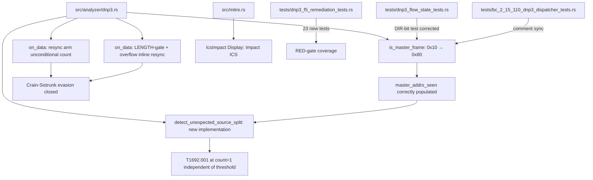
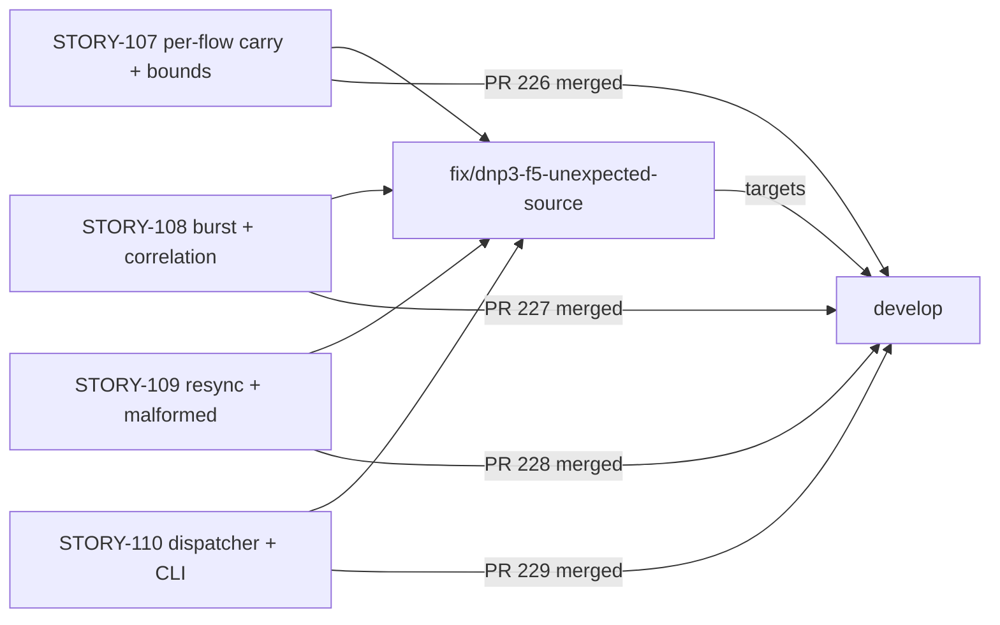
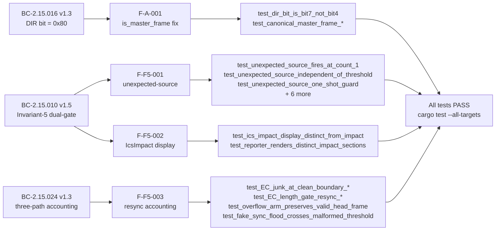

## Summary

Feature #8 DNP3 Phase-F5 (scoped adversarial) REMEDIATION. The F5 holistic review
and an agentic-sliced pre-implementation review exposed 4 issues that per-story adversarial
passes structurally could not see. This PR delivers the full remediation: a pre-existing
DIR-bit bug (present since STORY-107), two new behavioral implementations (unexpected-source
detection; resync accounting), and a display collision fix.

**Key callout — pre-existing bug:** The `is_master_frame` function masked bit 4 (0x10) but
the DNP3 link DIR bit is bit 7 (0x80) per IEEE 1815. Canonical master frames (CONTROL=0xC4)
were NOT recognized as master-direction, silently mis-populating `master_addrs_seen`. This
bug survived ~30 per-story adversarial passes because those passes reviewed against the
(then-uncorrected) BC-2.15.016 PC5 and tests used self-consistent but wrong control bytes.

**Convergence:** Architect-adjudicated designs (2 REVISION-2 directives after the agentic-sliced
review found original designs unsound), then 10 adversarial passes to 3 consecutive CLEAN
(passes 6/8/10). Mid-convergence catches: an under-count flag deviation (P1),
evidence-field divergence (P4), and spec-artifact title-sync gaps.

---

## Fixes — What Each One Does

### F-A-001: DIR-bit mask 0x10 → 0x80 (pre-existing bug, BC-2.15.016)

`is_master_frame` used `control & 0x10 != 0` to test the DIR bit. DNP3 link-layer (IEEE 1815
§8.2) places DIR at bit 7 (0x80), not bit 4. Canonical master CONTROL byte 0xC4 has bit 7
set; 0x10 is the FCV bit. Result: every canonical master frame was treated as
station-direction, `master_addrs_seen` was never populated from real traffic, and
`detect_unexpected_source_split` (once implemented) would have been structurally broken from
day 1. Fix: mask → `control & 0x80 != 0`. BC-2.15.016 bumped to v1.3 PC5-corrected.

### F-F5-001: Unexpected-source detection (BC-2.15.010 Invariant 5, new implementation)

The BC-2.15.010 Invariant-5 PRIMARY gate was entirely unimplemented. That gate requires: a
Control-class FC from a non-allowlisted / first-seen master source emits T1692.001 at count=1,
independent of the volumetric threshold. Implemented `detect_unexpected_source_split`:
- First-seen-master learning via `master_addrs_seen` (now correctly populated post-F-A-001 fix)
- Pre-push snapshot ordering (snapshot `master_addrs_seen` BEFORE inserting the new address)
- Fall-through to burst counting (unexpected-source does NOT skip the volumetric path)
- One-shot guard via `unexpected_source_emitted` (flow-lifetime, not window-scoped)
- Two-entry evidence format: `["src=<IP>", "fc=<FC_NAME>"]`

Satisfies P0 holdout HS-W37-002. BC-2.15.010 bumped to v1.5 (EC-009/010/011 + dual-gate H1).

### F-F5-002: IcsImpact Display collision (BC-2.15.010, display fix)

`MitreTactic::IcsImpact` and `MitreTactic::Impact` both Display-formatted as `"Impact"`.
This caused duplicate `## Impact` sections in terminal/CSV/JSON reports when both tactics
were present. Fixed: `IcsImpact` now Displays as `"Impact (ICS)"`.

### F-F5-003: Resync accounting gap (BC-2.15.024, Crain-Sistrunk evasion fix)

The byte-walk resync arm silently dropped malformed-frame accounting at clean frame
boundaries (Path B: junk appearing after a clean carry drain). An attacker could exploit
this by interleaving valid and malformed frames, keeping `malformed_in_window` below the
anomaly threshold. Three-path fix (REVISION 2):
- **Resync arm (Change 1):** increments `parse_errors` + `malformed_in_window`
  unconditionally before performing the byte-walk.
- **LENGTH-gate arm (Change 2):** inline resync (`carry.windows(2)` search for `[0x05,0x64]`
  after counting the malformed frame) so the resync arm does NOT re-fire for the same event.
- **Overflow arm (Change 3-REPLACEMENT):** same inline resync pattern after the overflow
  count; fall-through to frame-walk (preserves any valid head frame — avoids silent discard /
  F-B-002 detection-evasion DoS).

Structural path separation is the sole double-count prevention mechanism (REV 2 §R2-SECTION 4
forbids counted-this-iter flags). BC-2.15.024 bumped to v1.3 (three-path, principle-1).

---

## Architecture Changes

---

## Story / Feature Dependencies

All dependency PRs (#226, #227, #228, #229) are merged to develop.

---

## Spec Traceability

---

## Files Changed

| File | Change Type | Summary |
|------|-------------|---------|
| `src/analyzer/dnp3.rs` | Logic + implementation | DIR-bit mask, unexpected-source detection, resync accounting (3-path), inline resync in LENGTH/overflow arms |
| `src/mitre.rs` | Display fix | `IcsImpact` → `"Impact (ICS)"` |
| `tests/dnp3_f5_remediation_tests.rs` | New test file | 23 tests (RED-gate coverage for all 4 fixes) |
| `tests/dnp3_flow_state_tests.rs` | Test correction + new tests | DIR-bit test corrected; resync boundary tests added |
| `tests/bc_2_15_110_dnp3_dispatcher_tests.rs` | Comment sync | Control-byte comment synced to corrected bit interpretation |

---

## Test Evidence

| Gate | Result |
|------|--------|
| `cargo test --all-targets` | PASS (53 test binaries, no regressions to STORY-106..110) |
| `cargo clippy --all-targets -- -D warnings` | PASS (0 warnings) |
| `cargo fmt --check` | PASS |
| `cargo test dnp3_f5` | PASS (23 new remediation tests) |
| VP-023 (carry ≤292 bound, each iteration drains ≥1 byte) | PRESERVED |
| VP-007 (technique catalog integrity) | PRESERVED |
| No modbus dep in DNP3 path | CONFIRMED |

**Test coverage by fix:**
- F-A-001: `test_dir_bit_is_bit7_not_bit4`, `test_canonical_mask_sanity_master_addrs_seen_populated`, `test_EF_is_master_frame_under_corrected_mask`, `test_canonical_master_frame_is_master_frame`, `test_canonical_master_frame_helper_satisfies_is_master_frame` (corrected test in dnp3_flow_state_tests.rs)
- F-F5-001: `test_unexpected_source_fires_at_count_1`, `test_unexpected_source_independent_of_threshold`, `test_unexpected_source_one_shot_guard`, `test_first_master_is_expected`, `test_unexpected_source_and_burst_both_fire`, `test_unexpected_source_max_master_addrs_full`, `test_unexpected_source_second_distinct_unexpected_source_suppressed`, `test_unexpected_source_skipped_on_is_non_dnp3`
- F-F5-002: `test_ics_impact_display_distinct_from_impact`, `test_reporter_renders_distinct_impact_sections`
- F-F5-003: `test_EC_junk_at_clean_boundary_increments_malformed_counters`, `test_EC_length_gate_resync_no_double_count`, `test_malformed_anomaly_boundary_junk_reaches_threshold`, `test_overflow_arm_preserves_valid_head_frame`, `test_fake_sync_flood_crosses_malformed_threshold`

---

## Holdout Evaluation

- **HS-W37-002** (P0): unexpected-source detection independent of volumetric threshold. Satisfied by F-F5-001 implementation. Verified by `test_unexpected_source_independent_of_threshold` and `test_unexpected_source_fires_at_count_1`.
- All other holdout items: N/A — evaluated at wave gate.

---

## Adversarial Review

- 10 adversarial convergence passes total
- Converged to 3 consecutive CLEAN at passes 6, 8, 10
- 2 REVISION-2 architect directives issued (F-F5-001 and F-F5-003 designs were adjudicated unsound in the agentic-sliced pre-implementation review)
- Mid-convergence fixes: under-count flag deviation (P1 F-1), evidence-field divergence (P4 F-P4-001), spec-artifact title-sync gaps (P3 OBS-1/2)

---

## Security Review

Populated after security review dispatch. See below.

---

## Risk Assessment

| Dimension | Assessment |
|-----------|-----------|
| Blast radius | Scoped to DNP3 analyzer (`src/analyzer/dnp3.rs`) and display layer (`src/mitre.rs`) |
| Behavior change | F-A-001: `master_addrs_seen` now correctly populated; F-F5-001: new T1692.001 emission at count=1; F-F5-002: display label change; F-F5-003: resync arm now counts unconditionally |
| Regression risk | Low — 53-binary full-suite passes; no STORY-106..110 regressions |
| Performance impact | Negligible — O(n) carry window scan (carry ≤ 292 bytes) |
| Rollback complexity | Single squash commit; revert is trivial |

---

## Pre-Merge Checklist

- [x] PR description matches actual diff
- [x] All 4 F5 remediation findings addressed (F-A-001, F-F5-001, F-F5-002, F-F5-003)
- [x] DIR-bit mask corrected (0x10 → 0x80, IEEE 1815 §8.2)
- [x] Unexpected-source detection implemented (BC-2.15.010 Invariant 5)
- [x] IcsImpact display distinct from Impact
- [x] Resync accounting gap closed (three-path, REVISION 2)
- [x] 23 new RED-gate tests pass
- [x] No regressions to STORY-106..110
- [x] VP-023 / VP-007 preserved
- [x] Clippy clean (-D warnings)
- [x] Fmt clean
- [x] All dependency PRs (#226, #227, #228, #229) merged
- [ ] CI green (awaiting)
- [ ] Security review complete
- [ ] PR review approved

---

## AI Pipeline Metadata

| Field | Value |
|-------|-------|
| Pipeline mode | vsdd-factory phase-F5-scoped-adversarial-remediation |
| Feature | Feature #8 DNP3 |
| Fix IDs | F-A-001, F-F5-001, F-F5-002, F-F5-003 |
| Models used | claude-sonnet-4-6 |
| Adversarial passes | 10 (converged 3 consecutive CLEAN at P6/P8/P10) |
| Architect directives | 2 REVISION-2 (F-F5-001, F-F5-003) |
| Change classification | behavioral-fix + new-detection + display-fix |
