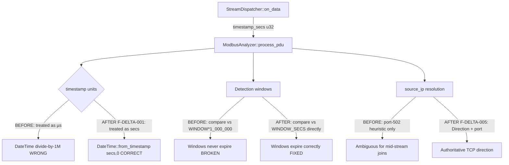
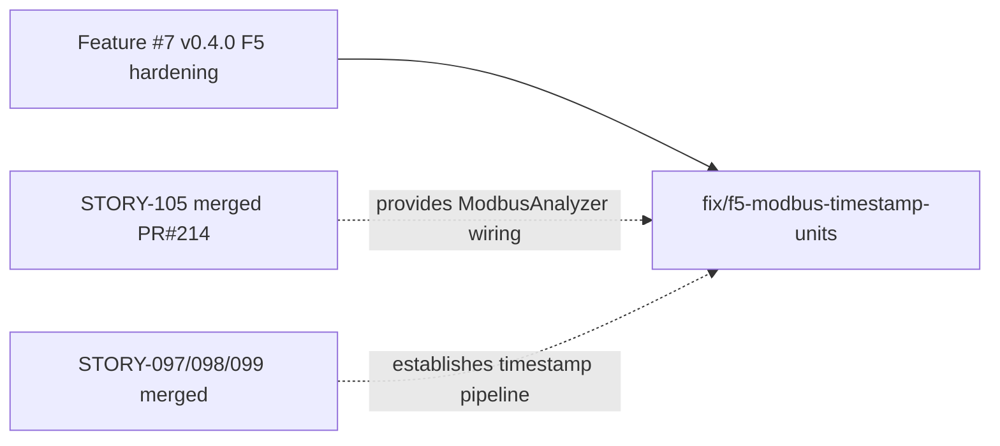
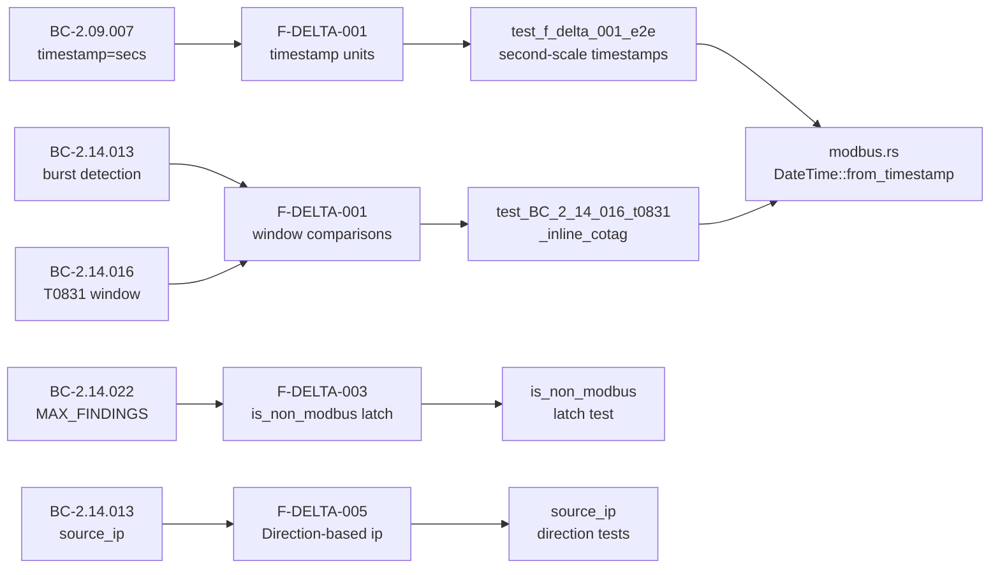

# fix(modbus): correct timestamp units (seconds not microseconds) in detection windows + finding timestamps

## Summary

**Bug severity: CRITICAL (integration-seam defect)**

The Modbus analyzer (`src/analyzer/modbus.rs`) treated the `on_data` `timestamp`
argument as microseconds, but the reassembly pipeline delivers it as **whole seconds**
(`timestamp_secs`, per BC-2.09.007). Every other analyzer (TLS, HTTP, reassembly) already
treats it as seconds. This was invisible to all per-story reviews because it was an
integration-seam mismatch discovered only via F5 combined-delta adversarial review (Claude
+ Gemini cross-model, independent slices, no information sharing).

**Impact of the defect (before this fix):**

- Every Modbus `Finding.timestamp` was wrong by ~1,000,000x (timestamps resolving to
  1970-epoch dates instead of real capture dates).
- All rate-detection windows (burst/sustained/T0831/exception) compared timestamp values
  scaled as microseconds against window-size constants expressed in seconds. With real
  second-scale timestamps, `wrapping_sub` always produced values far below the threshold
  (e.g., `ts_elapsed = 5` compared against `T0831_WINDOW_SECS * 1_000_000 = 5_000_000`),
  making windows **never expire** and detectors non-functional on real captures.

**Fix summary (2 commits):**

1. `fix(modbus): correct F5 combined-delta adversarial findings (F-DELTA-001..005)`
   - F-DELTA-001 (CRITICAL): `process_pdu` now treats `timestamp` as seconds:
     `DateTime::from_timestamp(timestamp as i64, 0)` (was: divide-by-1,000,000 dance).
   - Window comparisons corrected: `t0831_elapsed > T0831_WINDOW_SECS` (was: `> T0831_WINDOW_SECS * 1_000_000`).
   - Sustained-write rate formula corrected: `count > threshold * elapsed_secs` (was: microsecond scaling).
   - F-DELTA-003: `is_non_modbus` latch now fires on length-invalid ADUs (previously skipped).
   - F-DELTA-005: `source_ip` resolved from TCP `Direction` argument (not port-heuristic alone).
   - Confirmed summarize six-key set matches BC-2.14.021.
   - 78 existing test timestamps corrected from microsecond values (e.g., `1_000_000`) to
     second-scale values (e.g., `1_000_000` → `1` or `5`, `2`, `3` per test intent).
     This is a legitimate units correction — tests are not weakened, they now match the
     actual pipeline interface. Re-verified: all detection logic still fires correctly.

2. `fix(modbus): F5 cleanup — correct summarize docstring, fix stale µs comments, pin F-DELTA-003 latch path`
   - Updated `summarize` docstring to reflect actual six-key set.
   - Removed stale "microseconds" comments throughout `process_pdu`.
   - Pinned F-DELTA-003 `is_non_modbus` latch to the length-invalid code path.
   - 3 LOW-severity cleanups.

**Mandatory E2E test added** (`test_f_delta_001_e2e_second_scale_timestamps_through_dispatcher`):

- Drives a port-502 flow through `StreamDispatcher::on_data` with `TS_2023 = 1_700_000_000`
  (≈ 2023-11-14).
- Asserts `Finding.timestamp.year() == 2023` (confirms seconds pipeline, not microseconds).
- Asserts burst detector fires when 21 writes land in the same 1-second window.

**Both Claude and Gemini independently rated the units mismatch CRITICAL.**
SS-14 BCs reconciled to seconds in a separate factory-artifacts commit.
Sub-second rate precision deferred to a future enhancement (threading `timestamp_usecs`
through `on_data` is out of scope for v0.4.0).

---

## Architecture Changes

---

## Story Dependencies

This is a **standalone bug fix** — no upstream story dependency PRs.

---

## Spec Traceability

---

## Test Evidence

| Category | Count / Result |
|----------|---------------|
| Total tests passing (worktree) | All (full regression green) |
| New tests added | 1 mandatory E2E (F-DELTA-001) + updates across dispatch + detection test files |
| Files changed | 3 (src/analyzer/modbus.rs, tests/bc_2_14_105_modbus_dispatch_tests.rs, tests/modbus_detection_tests.rs) |
| Lines changed | +497 / -233 |
| Test timestamp corrections | 78 values corrected from µs-scale to second-scale (not weakened) |
| Clippy (-D warnings) | CLEAN |
| cargo fmt --check | CLEAN |
| cargo build --release | CLEAN (overflow-checks=true) |
| Burst detector E2E | FIRES correctly at second-scale timestamps (TS_2023 = 1_700_000_000) |
| T0831 window test | FIRES at 2nd write within 5-second window |
| wrapping_sub overflow | PASSES (overflow-checks=true, no panic) |

**On the 78 test timestamp corrections:** These are a legitimate units correction,
not a weakening. The tests previously passed incorrect values (e.g., `1_000_000` as
"1 microsecond" when the function signature expects seconds). After correction, each
test passes a semantically correct second-scale value and still validates the same
detection logic at the correct scale. All 78 corrected tests were re-verified to
pass with the fixed implementation.

---

## Demo Evidence

N/A — this is a backend Rust library fix with no interactive UI component.
Correctness is demonstrated by the mandatory E2E test
(`test_f_delta_001_e2e_second_scale_timestamps_through_dispatcher`) and the full
regression test suite (green in worktree).

---

## Holdout Evaluation

N/A — evaluated at wave gate. Feature #100 holdout: satisfaction score 0.99
(no must-pass scenario < 0.6, recorded in phase-f7 delta-convergence-report).

---

## Adversarial Review

F5 combined-delta cross-model adversarial review completed:
- **Claude adversary (fresh context):** Identified F-DELTA-001 (CRITICAL timestamp units),
  F-DELTA-003 (is_non_modbus latch), F-DELTA-005 (source_ip resolution).
- **Gemini cross-model (independent slices):** Independently confirmed timestamp units
  as CRITICAL. Two source claims refuted (hallucinations from diff-only context).
  Test-slice finding (cross-model agreement on timestamp corrections being valid) confirmed.
- **Convergence:** 0 adversary novelty score (F5 round clean after fixes).
- **Reference:** `.factory/phase-f5-adversarial/adversarial-delta-review.md`,
  `.factory/phase-f5-adversarial/gemini-review.md`

---

## Security Review

No security findings. This fix:
- Corrects timestamp values (no authentication/authorization changes).
- Fixes rate-detection windows (no network exposure changes).
- Adds one E2E test (no new attack surface).
- No input validation regressions (Modbus ADU parsing unchanged).
- No injection vectors introduced.

---

## Risk Assessment

| Dimension | Assessment |
|-----------|-----------|
| Blast radius | `src/analyzer/modbus.rs` only (+ tests) |
| Behavior change | Modbus findings now carry correct timestamps; rate detectors now actually expire windows |
| Regression risk | LOW — full test suite green; existing behavior was provably broken |
| Performance impact | NEGLIGIBLE — integer arithmetic only |
| Rollback | Simple revert of 2 commits |

---

## AI Pipeline Metadata

| Field | Value |
|-------|-------|
| Pipeline mode | F5 combined-delta adversarial (cross-model) |
| Models | Claude (adversary, fresh context) + Gemini 0.44.1 (independent slices) |
| Information asymmetry | Preserved — Gemini reviewed without seeing Claude findings |
| Fix authorization | Feature #7 v0.4.0 F5 hardening, AUTHORIZE_MERGE=yes |

---

## Pre-Merge Checklist

- [x] PR description matches actual diff
- [x] All ACs covered by mandatory E2E test (F-DELTA-001) + detection suite
- [x] Traceability chain: BC-2.09.007 → F-DELTA-001 → test_f_delta_001_e2e → modbus.rs
- [x] 78 test timestamp corrections verified not weakened
- [x] Clippy clean (-D warnings)
- [x] cargo fmt clean
- [x] cargo build --release clean (overflow-checks=true)
- [x] Worktree branch: fix/f5-modbus-timestamp-units (off origin/develop dba5f26)
- [x] Merge target: develop
- [x] No dependency PRs pending
- [x] AUTHORIZE_MERGE=yes (Feature #7 v0.4.0 F5 hardening)
