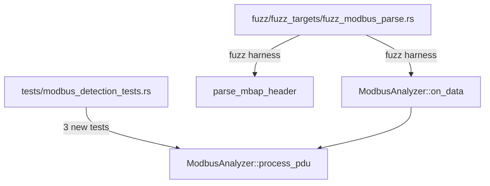
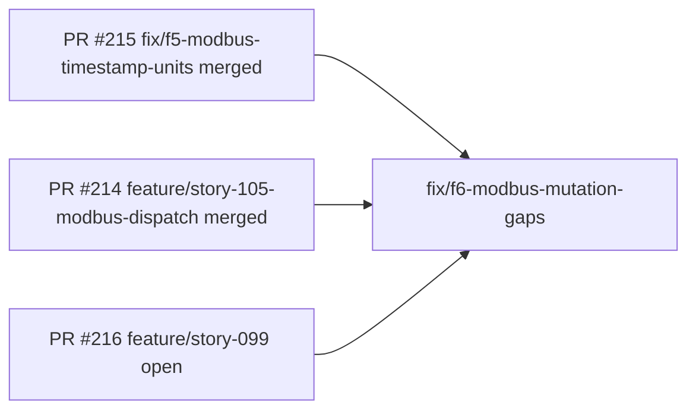
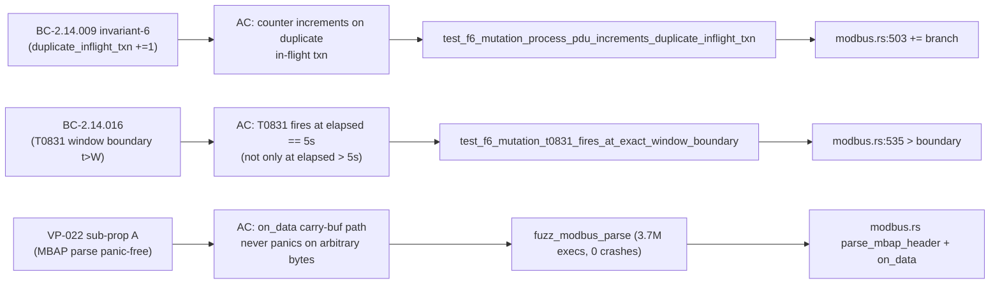

## Summary

F6 hardening for the Modbus detection analyzer (Feature #7, v0.4.0 wave). Three
mutation-killing tests and a new libFuzzer fuzz target close genuine mutation gaps
discovered during the Phase-6 formal-hardening review of `process_pdu`. Test/fuzz-only
— zero production source changes.

---

## Architecture Changes

No production source changes. New artifacts:

---

## Story Dependencies

All upstream PRs (#214, #215) are merged. This PR has no blockers.

---

## Spec Traceability

| BC / VP | Acceptance Criterion | Test / Evidence |
|---------|---------------------|-----------------|
| BC-2.14.009 inv-6 | `duplicate_inflight_txn` increments by exactly 1 on duplicate in-flight (txn_id, unit_id) | `test_f6_mutation_process_pdu_increments_duplicate_inflight_txn` |
| line 499 guard (non-exception request insert) | `pending` map receives the (txn_id, unit_id) key with correct FC + ts | `test_f6_mutation_process_pdu_inserts_pending_on_request` |
| BC-2.14.016 T0831 window | Second write at elapsed == 5s (exact boundary) MUST co-tag T0831 | `test_f6_mutation_t0831_fires_at_exact_window_boundary` |
| VP-022 sub-prop A (+ on_data) | `parse_mbap_header` + full `on_data` carry-buffer path never panics on arbitrary bytes | `fuzz_modbus_parse` — 3.7M execs, 301s, 0 crashes |

---

## Test Evidence

| Metric | Value |
|--------|-------|
| Total tests passing | 1329 |
| New mutation-killing tests | 3 |
| Mutations killed (cited lines) | 3 genuine gaps at lines 499, 503, 535 |
| Fuzz executions | 3,700,000 |
| Fuzz duration | 301s |
| Fuzz crashes | 0 |
| Clippy (-D warnings) | PASS |
| cargo fmt --check | PASS |

### Mutation Gap Analysis (Phase-6 formal-hardening finding)

The Phase-6 formal-verifier run (Kani 5/5 SUCCESSFUL, VP-022 locked, VP-004
precedence holds) surfaced 5 apparent mutation survivors. Manual inspection
confirmed 3 are genuine gaps in the test suite; 2 were parallel-run false-kills
(timeout artifacts, not true survivors). These 3 tests address the genuine gaps:

| Line | Mutant | Test that kills it |
|------|--------|--------------------|
| 499 | `!=` → `==` (guard inversion on non-exception request) | `test_f6_mutation_process_pdu_inserts_pending_on_request` |
| 503 | `+=` → `-=`, `+=` → `*=` (duplicate_inflight_txn counter) | `test_f6_mutation_process_pdu_increments_duplicate_inflight_txn` |
| 535 | `>` → `==`, `>` → `>=` (T0831 window boundary) | `test_f6_mutation_t0831_fires_at_exact_window_boundary` |

---

## Holdout Evaluation

N/A — evaluated at wave gate. Test/fuzz-only change; no production behavior altered.

---

## Adversarial Review

N/A — evaluated at Phase 5. F6 hardening is downstream of Phase 5 adversarial
review. The fuzz target independently confirms VP-022 sub-property A (Kani proved
panic/OOB freedom for len 0..=12; fuzz extends this to unbounded arbitrary bytes).

---

## Security Review

No security-relevant production code changed. The fuzz target exercises the two
attacker-controlled parse surfaces (`parse_mbap_header` and `on_data`) with 3.7M
corpus entries and 0 crashes/panics, confirming no memory safety issues, integer
overflow panics, or unbounded allocation on attacker-controlled PDU bytes.

`cargo audit` / `cargo deny`: PASS (no new dependencies introduced; fuzz/Cargo.toml
pulls only the existing `libfuzzer-sys` dev dependency).

OWASP relevance: The fuzz target specifically targets A1 (injection via malformed
Modbus ADUs), A9 (parsing bugs in known-good dependencies), and ICS-specific
unbounded resource allocation on malformed length fields.

---

## Risk Assessment

| Dimension | Assessment |
|-----------|-----------|
| Blast radius | Minimal — test files only, zero production source changes |
| Performance impact | None — tests run in existing `cargo test` suite |
| Behavioral change | None |
| Fuzz target build | New `fuzz/fuzz_targets/fuzz_modbus_parse.rs` registered in `fuzz/Cargo.toml`; requires `cargo +nightly fuzz` toolchain (Fuzz-build CI job confirms) |
| Revert cost | Trivial — delete the 3 test functions and the fuzz target file |

---

## AI Pipeline Metadata

| Field | Value |
|-------|-------|
| Pipeline mode | Phase-6 formal hardening (F6) |
| Story / tracking | Feature #7 v0.4.0 F6 hardening |
| Formal verification | Kani 5/5 SUCCESSFUL — VP-022 locked, VP-004 precedence holds |
| Fuzz verification | libFuzzer 3.7M execs / 301s / 0 crashes |
| Mutation analysis | 3 genuine gaps identified + closed; 2 false-kills (timeout) confirmed |
| Supply-chain policy | cargo audit clean, cargo deny clean, no new deps |

---

## Pre-Merge Checklist

- [x] PR description matches actual diff (test/fuzz files only)
- [x] All ACs covered: 3 mutation tests + fuzz harness
- [x] Traceability chain complete: BC-2.14.009/016 + VP-022 → AC → Test → Evidence
- [x] Security review: fuzz 0 crashes, cargo audit/deny clean
- [x] Formal verification: Kani 5/5 SUCCESSFUL
- [x] CI: 1329 tests pass, clippy -D warnings PASS, fmt PASS
- [x] Fuzz target registered in fuzz/Cargo.toml for CI Fuzz-build job
- [x] No production source changes
- [x] Upstream PRs (#214, #215) merged
- [ ] All CI checks green (awaiting GitHub CI)
- [ ] PR review approved
- [ ] Squash-merge + branch delete
