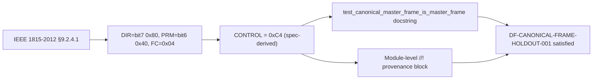
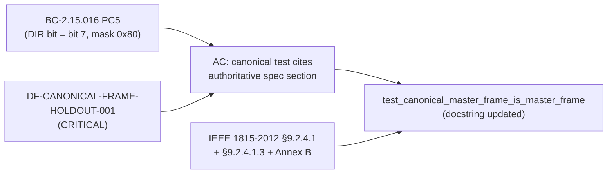

## What

Comment-only addition to `tests/dnp3_f5_remediation_tests.rs`. Adds an
authoritative IEEE 1815-2012 citation and the explicit
`DIR(0x80) | PRM(0x40) | FC(0x04) = 0xC4` derivation to two docstring
locations:

- Module-level `//!` block (new `### IEEE 1815 Provenance for the 0xC4 Canonical
  Control Byte` subsection)
- `test_canonical_master_frame_is_master_frame` doc-comment (`///`)

No test logic, assertions, test names, source code, or CI configuration
were changed. The diff is **pure documentation inside comment lines**.

## Why

Policy `DF-CANONICAL-FRAME-HOLDOUT-001` (CRITICAL, `.factory/policies.yaml`)
requires that any canonical protocol-framing test cite the authoritative spec
section and present the framing byte as independently spec-derived — not
derived from the project's own BCs or test vectors.

The F7 delta-convergence sweep (Feature #8 / DNP3 F5-remediation) flagged the
canonical DIR-bit test as finding **F-S2-001** (test half): the test's docstring
showed the 0xC4 value without an IEEE 1815 citation, creating a gap where 0xC4
appeared to be derived from BC-2.15.016 PC5 rather than verified against the
authoritative spec. The holdout half of this finding (HS-W37-002) was addressed
separately on the factory-artifacts branch.

## Finding Traceability

| Finding | Severity | Status |
|---------|----------|--------|
| F-S2-001 (test half) | CRITICAL policy gap | Resolved by this PR |
| DF-CANONICAL-FRAME-HOLDOUT-001 | CRITICAL policy | Enforced |
| HS-W37-002 (holdout half) | — | Fixed separately (factory-artifacts branch) |

## Spec Traceability

## Test Evidence

Verified locally in worktree `.worktrees/dnp3-ieee1815-citation`:

| Check | Result |
|-------|--------|
| `cargo test --test dnp3_f5_remediation_tests` | 20 passed, 0 failed |
| `cargo fmt --check` | CLEAN |
| `cargo clippy --all-targets -- -D warnings` | CLEAN |

No test count change (comment-only diff). All 20 existing F5-remediation tests
continue to pass with the added docstrings.

## Demo Evidence

N/A — comment-only fix. No behavioral change to demonstrate.

## Security Review

N/A — no executable code changed. No user-supplied input paths. No injection
surface. Comment additions in a `#[cfg(test)]` module carry zero runtime risk.

## Risk Assessment

| Dimension | Assessment |
|-----------|------------|
| Blast radius | Zero — comment-only change in test file |
| Behavioral impact | None |
| Performance impact | None |
| Breaking change | No |
| Rollback complexity | None — pure `git revert` if needed |

## AI Pipeline Metadata

| Field | Value |
|-------|-------|
| Pipeline mode | fix-pr-delivery (post-F7 convergence fix) |
| Change type | comment-only (docstring citation) |
| Finding resolved | F-S2-001 (test half) |
| Policy enforced | DF-CANONICAL-FRAME-HOLDOUT-001 |

## Pre-Merge Checklist

- [x] PR description matches actual diff (comment-only)
- [x] IEEE 1815 citation present in both docstring locations
- [x] 0xC4 derivation explicitly stated: `DIR(0x80) | PRM(0x40) | FC(0x04) = 0xC4`
- [x] `cargo test --test dnp3_f5_remediation_tests` — 20 passed
- [x] `cargo fmt --check` — CLEAN
- [x] `cargo clippy --all-targets -- -D warnings` — CLEAN
- [x] No logic, assertions, or source behavior changed
- [x] Finding F-S2-001 (test half) traced and resolved
- [x] DF-CANONICAL-FRAME-HOLDOUT-001 satisfied
- [x] No dependency PRs required (standalone fix-PR)
- [ ] CI green on GitHub (pending push)
