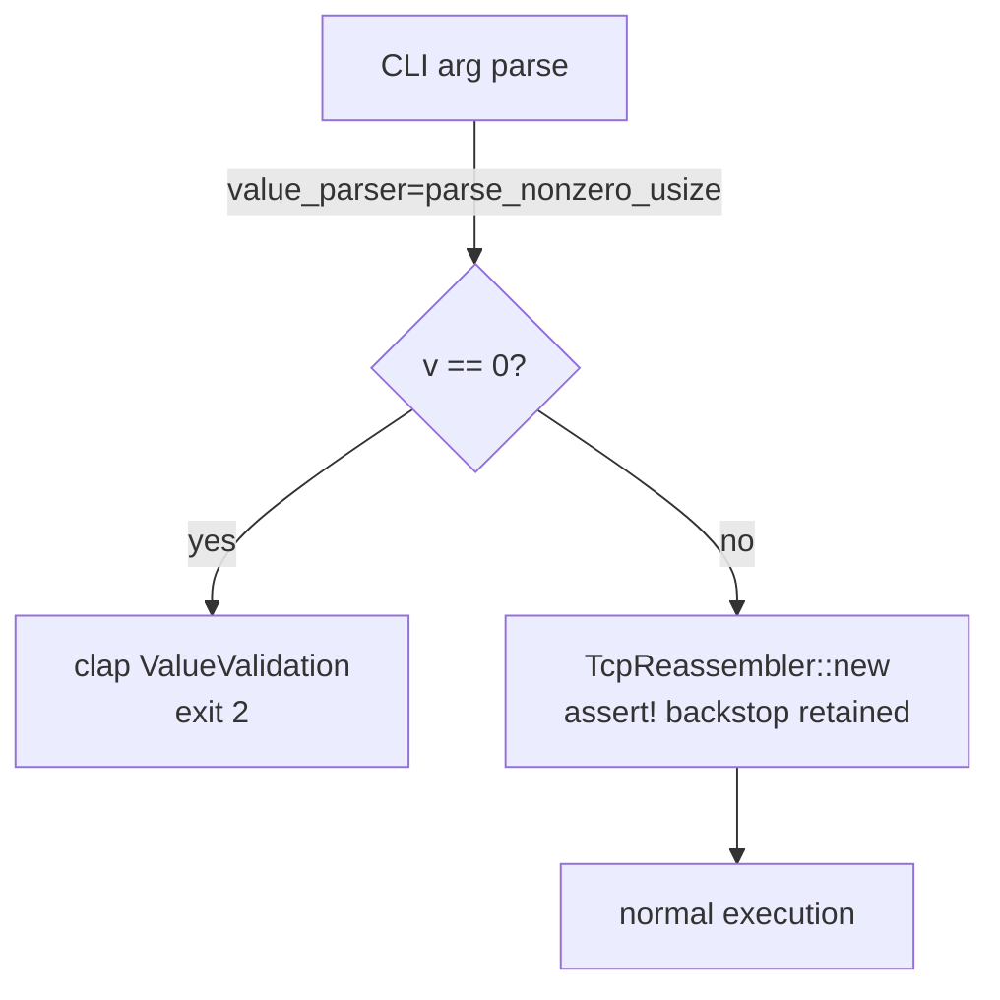
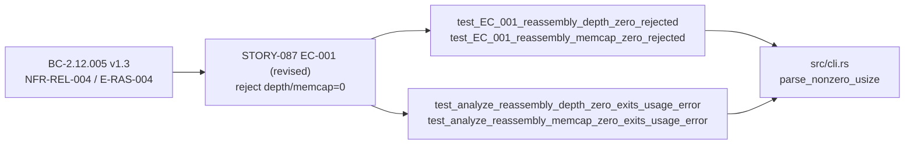
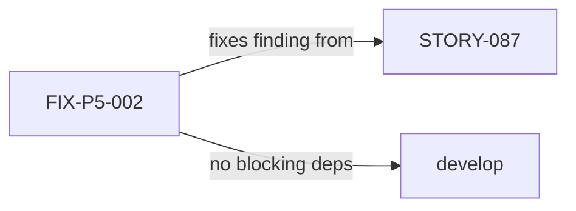

## Finding

**ADV-IMPL-P04-MED-001** (Phase-5 whole-impl adversarial Pass 4): `wirerust analyze
--reassembly-depth 0` (or `--reassembly-memcap 0`) was accepted by clap with no
validation, causing the process to reach `assert!(max_depth > 0)` / `assert!(memcap > 0)`
inside `TcpReassembler::new` and panic with exit code 101. Spec claimed NFR-REL-004 /
E-RAS-004 enforced a range validator that did not exist.

## What Changed

Added a `parse_nonzero_usize` value-parser to both global args in `src/cli.rs`:

```rust
fn parse_nonzero_usize(s: &str) -> Result<usize, String> { … }
```

Both `--reassembly-depth` and `--reassembly-memcap` now carry
`value_parser = parse_nonzero_usize`. Clap rejects `0` at argument-parse time with a
`ValueValidation` error (exit 2) and the message `"0 is not in 1.."`. The internal
`assert!` guards are retained as programmer-error backstops. Default values (10 / 1024)
and all values ≥ 1 are unaffected.

> **Behavior change:** `--reassembly-depth 0` / `--reassembly-memcap 0` previously caused
> a process panic (exit 101) on `analyze`, or were silently accepted on `summary`. Now
> rejected with a clap usage error (exit 2) on **all** subcommands. STORY-087 EC-001
> revised; BC-2.12.005 v1.3 / NFR-REL-004 / E-RAS-004 reconciled on factory-artifacts.

## Architecture Changes



## Spec Traceability



## Story Dependencies



## Test Evidence

| Test | Type | Result |
|------|------|--------|
| `test_EC_001_reassembly_depth_zero_rejected` | Unit (clap parse) | GREEN |
| `test_EC_001_reassembly_memcap_zero_rejected` | Unit (clap parse) | GREEN |
| `test_analyze_reassembly_depth_zero_exits_usage_error` | Integration (assert_cmd) | GREEN |
| `test_analyze_reassembly_memcap_zero_exits_usage_error` | Integration (assert_cmd) | GREEN |
| Full suite (`cargo test --all-targets`) | All | GREEN |
| `cargo clippy --all-targets -- -D warnings` | Lint | GREEN |
| `cargo fmt --check` | Format | GREEN |

Scope: 2 files changed, 118 insertions(+), 14 deletions(−). No other behavior modified.

## Demo Evidence

Recordings in `.factory/demo-evidence/FIX-P5-002/`:

| AC | Recording | Exit Code |
|----|-----------|-----------|
| AC-001 | `AC-001-depth-zero-rejected.gif` | **2** (clap error, no panic) |
| AC-002 | `AC-002-memcap-zero-rejected.gif` | **2** (clap error, no panic) |
| AC-003 | `AC-003-valid-depth-succeeds.gif` | **0** (normal, unaffected) |

Coverage: 3/3 ACs demonstrated (100%). No panic observed on any run.

## Security Review

No security-relevant surface changed. `parse_nonzero_usize` is a pure value validator
with no I/O, no allocation beyond the parsed integer, and no attack surface. Finding
ADV-IMPL-P04-MED-001 was a reliability issue (panic on bad input), not an injection or
auth issue. No OWASP-relevant changes.

## Holdout Evaluation

N/A — evaluated at wave gate.

## Adversarial Review

Finding originated in Phase-5 adversarial Pass 4. Fix directly closes ADV-IMPL-P04-MED-001.

## Risk Assessment

- **Blast radius:** Minimal. Only `--reassembly-depth 0` and `--reassembly-memcap 0` are
  affected. All other values and all other flags are unchanged.
- **Regression risk:** Low. Existing tests cover the success path; new tests cover the
  rejection path.
- **Performance impact:** None. Value parser runs once at argument-parse time.
- **Behavior change classification:** Breaking for callers passing `0`; those callers would
  have panicked before anyway. Net improvement in error-handling quality.

## AI Pipeline Metadata

- Pipeline mode: Fix (Phase-5 adversarial finding closure)
- Story: FIX-P5-002 / ADV-IMPL-P04-MED-001
- Branch: `fix/reassembly-zero-validator`
- Model: claude-sonnet-4-6

## Pre-Merge Checklist

- [x] PR description matches actual diff
- [x] All ACs covered by demo evidence (3/3)
- [x] Traceability chain complete (BC → AC → Test → Demo)
- [x] Security review: no security surface changed
- [x] Full test suite green (cargo test --all-targets)
- [x] Clippy clean (-D warnings)
- [x] Cargo fmt --check passes
- [ ] CI checks passing (pending)
- [ ] pr-reviewer approval (pending)
- [ ] HELD FOR HUMAN/ORCHESTRATOR APPROVAL BEFORE MERGE
