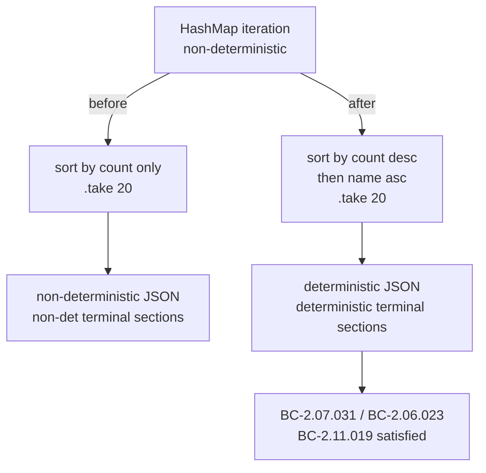
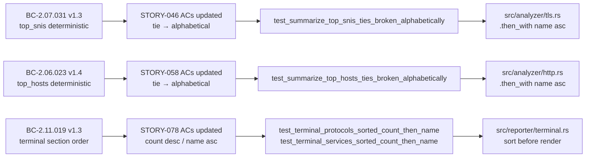
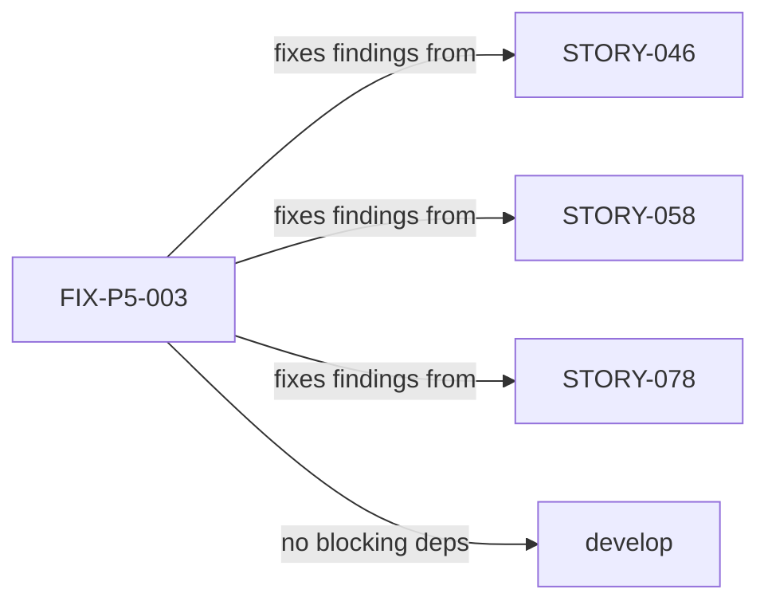

## Finding

**ADV-IMPL-P06-HIGH-001** (Phase-5 whole-impl adversarial Pass 6): `top_snis` (tls.rs) and
`top_hosts` (http.rs) sorted a HashMap-derived Vec by count ONLY, then called `.take(20)`.
Because HashMap iteration order is non-deterministic, ties in count produced per-process-random
ordering AND a non-deterministic selected set, contradicting BC-2.07.031, BC-2.06.023, and
the DET-001 determinism invariant. JSON output varied between runs for any traffic mix where
two or more SNIs/hosts shared the same hit count.

**ADV-IMPL-P06-MED-001** (Phase-5 whole-impl adversarial Pass 6): terminal PROTOCOLS and
SERVICES sections iterated `HashMap`s directly, producing non-deterministic section entry
order across runs, contradicting BC-2.11.019.

## What Changed

**tls.rs / http.rs — stable tiebreaker on top-N sorts:**

```rust
// Before
top_snis.sort_by(|a, b| b.1.cmp(a.1));
// After
top_snis.sort_by(|a, b| b.1.cmp(a.1).then_with(|| a.0.cmp(b.0)));
```

Same one-line change in `http.rs` for `top_hosts`. The tiebreaker is name-ascending — total
lexicographic ordering — so equal-count entries are always emitted in the same order, and the
`.take(20)` selected set is stable across runs.

**terminal.rs — sort-before-render for PROTOCOLS and SERVICES:**

Collected `protocol_counts()` and `service_counts()` into a `Vec`, sorted by
`(count desc, name asc)`, then iterated the sorted vec. JSON/CSV output paths are unchanged.

> **Behavior change:** tie-ordering is now deterministic (alphabetical among equal counts)
> across runs; was HashMap-random. The selected top-N set is also stable.

## Architecture Changes



## Spec Traceability



## Story Dependencies



## Test Evidence

| Test | Type | Result |
|------|------|--------|
| `test_summarize_top_hosts_ties_broken_alphabetically` | Unit (http_analyzer) | GREEN |
| `test_summarize_top_snis_ties_broken_alphabetically` | Unit (tls_analyzer) | GREEN |
| `test_terminal_protocols_sorted_count_then_name` | Unit (reporter_terminal) | GREEN |
| `test_terminal_services_sorted_count_then_name` | Unit (reporter_terminal) | GREEN |
| Full suite (`cargo test --all-targets`) | All | GREEN |
| `cargo clippy --all-targets -- -D warnings` | Lint | GREEN |
| `cargo fmt --check` | Format | GREEN |

Each of the 4 new tests was written as a Red Gate (commit e995994) that fails on
pre-fix HashMap-random ordering and passes only after the tiebreaker is in place
(commit d0313a1). The exact-order assertions are stronger evidence of determinism
than a screen recording.

Scope: 6 files changed, 676 insertions(+), 4 deletions(−)
(672 insertions are test lines; 4 are fix lines in 3 production files).

## Demo Evidence

No separate visual demo recorded. Determinism is directly and mechanically evidenced
by the 4 exact-order assertion tests above — each asserts a specific, stable entry
ordering that was unprovable before the fix. A recording would add no additional
signal beyond what the tests already prove.

## Security Review

No security-relevant surface changed. All three fix sites are pure sort
comparators or Vec construction — no I/O, no user-controlled input, no
allocation beyond in-memory Vec. Findings ADV-IMPL-P06-HIGH-001 and
ADV-IMPL-P06-MED-001 are output-ordering determinism issues, not injection
or auth issues. No OWASP-relevant changes.

## Holdout Evaluation

N/A — evaluated at wave gate.

## Adversarial Review

Findings originated in Phase-5 adversarial Pass 6. Fix directly closes
ADV-IMPL-P06-HIGH-001 and ADV-IMPL-P06-MED-001.

Spec reconciled on factory-artifacts: BC-2.06.023 v1.4, BC-2.07.031 v1.3,
BC-2.11.019 v1.3; STORY-046/058/078 ACs updated.

## Risk Assessment

- **Blast radius:** Minimal. Only the ordering of equal-count entries in top_snis,
  top_hosts, and terminal PROTOCOLS/SERVICES is affected. All counts, totals, and
  analysis logic are unchanged.
- **Regression risk:** Low. The 4 new tests cover the fix path; existing tests cover
  all other behavior. The `.then_with` comparator is a pure total-order extension.
- **Performance impact:** Negligible. One extra string comparison per tied pair during
  sort; these lists are bounded at 20 entries.
- **Behavior change classification:** Output ordering is now deterministic for tied
  entries. Any caller that depended on HashMap-random ordering would have been broken
  by definition. Net improvement in correctness.

## AI Pipeline Metadata

- Pipeline mode: Fix (Phase-5 adversarial finding closure)
- Story: FIX-P5-003 / ADV-IMPL-P06-HIGH-001 + ADV-IMPL-P06-MED-001
- Branch: `fix/deterministic-output-ordering`
- Model: claude-sonnet-4-6

## Pre-Merge Checklist

- [x] PR description matches actual diff
- [x] Traceability chain complete (BC → AC → Test → Code)
- [x] Security review: no security surface changed
- [x] Full test suite green (cargo test --all-targets)
- [x] Clippy clean (-D warnings)
- [x] Cargo fmt --check passes
- [ ] CI checks passing (pending)
- [ ] pr-reviewer approval (pending)
- [ ] HELD FOR HUMAN APPROVAL BEFORE MERGE
