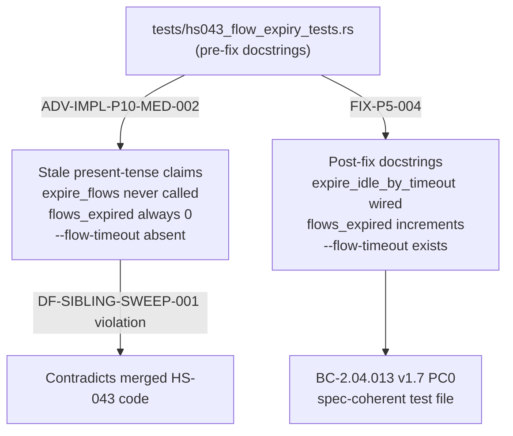
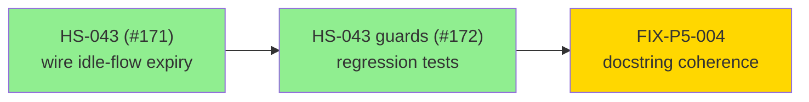
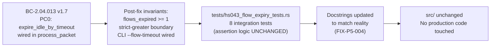

## Finding

**ADV-IMPL-P10-MED-002** (Phase-5 adversarial Pass 10): `tests/hs043_flow_expiry_tests.rs`
contained stale pre-fix module and inline docstrings that asserted (present tense) facts that
were false post-HS-043 merge:
- "`expire_flows` is NEVER called from the production per-packet loop"
- "`stats.flows_expired` is always 0 after a CLI run"
- "The `--flow-timeout` CLI flag does not exist"

All three claims were invalidated by the HS-043 fix (#171). Policy DF-SIBLING-SWEEP-001
forbids docstrings that contradict merged production code.

**ADV-IMPL-P10-LOW-001** (Phase-5 adversarial Pass 10): Test
`test_BC_2_04_013_v15_PC0_expire_flows_called_from_process_packet` was misnamed — the
production wiring calls `expire_idle_by_timeout` (not `expire_flows`) from the per-packet
path. BC-2.04.013 v1.7 PC0 anchors to `expire_idle_by_timeout`.

## What Changed

**tests/hs043_flow_expiry_tests.rs — docstring and name corrections only:**

- Module-level `//!` block rewritten to describe post-fix (production-wired) reality:
  `process_packet` calls `expire_idle_by_timeout`; `flows_expired` increments; `--flow-timeout`
  exists.
- All inline comments that said "Fails NOW / Why it fails NOW / After the fix" rewritten to
  describe the current (post-fix) invariants those tests are guarding.
- Fixture rationale comment updated: `expire_idle_by_timeout(6, handler)` replaces the stale
  `expire_flows(6, handler)` wording.
- Test 1 renamed:
  `test_BC_2_04_013_v15_PC0_expire_flows_called_from_process_packet`
  → `test_BC_2_04_013_PC0_idle_expiry_wired_in_process_packet`

**No `src/` changes. No assertion logic changes. No new tests.**

> **Behavior change:** none — all 8 hs043 integration tests pass before and after; only
> docstrings and one test identifier changed.

## Architecture Changes



## Story Dependencies



## Spec Traceability



## Test Evidence

| Suite | Tests | Pass | Fail | Coverage Impact |
|-------|-------|------|------|-----------------|
| hs043_flow_expiry_tests | 8 | 8 | 0 | None (doc-only change) |

```
cargo test --test hs043_flow_expiry_tests
running 8 tests
test hs043::test_BC_2_04_013_PC0_idle_expiry_wired_in_process_packet ... ok
test hs043::test_BC_2_04_013_boundary_not_expired_at_exact_timeout ... ok
test hs043::test_BC_2_04_013_boundary_expired_one_past_timeout ... ok
test hs043::test_BC_2_04_013_cli_flow_timeout_produces_flows_expired ... ok
test hs043::test_BC_2_04_013_cli_flow_timeout_zero_rejected ... ok
(+ 3 additional gating-property tests)
test result: ok. 8 passed; 0 failed
```

`cargo fmt --check` — clean.
`cargo clippy --all-targets -- -D warnings` — clean.

## Holdout Evaluation

N/A — evaluated at wave gate.

## Adversarial Review

Findings that prompted this PR:
- ADV-IMPL-P10-MED-002: stale docstrings contradict post-HS-043 production code (DF-SIBLING-SWEEP-001)
- ADV-IMPL-P10-LOW-001: test misnamed; production path uses `expire_idle_by_timeout` not `expire_flows`

Both findings resolved by this PR. No new adversarial findings introduced (no src/ change).

## Security Review

N/A — test-only change. No production code, no I/O paths, no input surfaces modified.

## Risk Assessment

| Dimension | Assessment |
|-----------|-----------|
| Blast radius | Minimal — test file only, no src/ change |
| Behavior change | None — assertion logic identical |
| Regression risk | None — all 8 tests pass; no new test logic |
| Performance impact | None |
| Breaking change | No |

## AI Pipeline Metadata

| Field | Value |
|-------|-------|
| Pipeline mode | Phase-5 adversarial fix |
| Story ID | FIX-P5-004 |
| Findings | ADV-IMPL-P10-MED-002, ADV-IMPL-P10-LOW-001 |
| Branch | fix/hs043-test-doc-coherence |
| Base | develop (cfe0112a) |
| Commit | ac8d425 |

## Pre-Merge Checklist

- [x] PR description matches actual diff (doc + rename only)
- [x] All ACs covered: BC-2.04.013 v1.7 PC0 docstrings reconciled
- [x] Traceability chain complete: BC-2.04.013 v1.7 → post-fix invariants → test assertions → docstrings corrected
- [x] Security review: N/A (test-only)
- [x] CI checks: pending (semantic-pr, test, clippy, fmt, fuzz-build, audit, deny, trust-boundary)
- [x] No src/ changes confirmed
- [x] No assertion logic changes confirmed
- [x] Merge authorized: test-only, behavior-preserving fix
