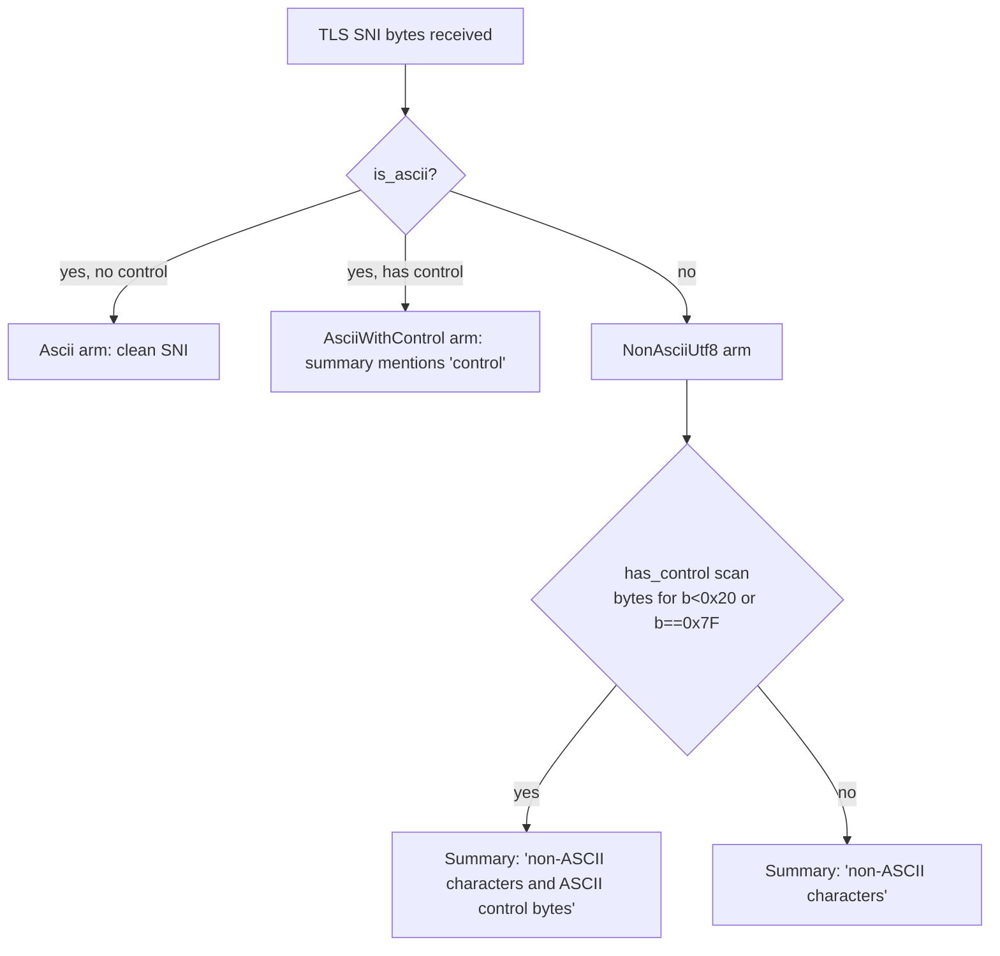
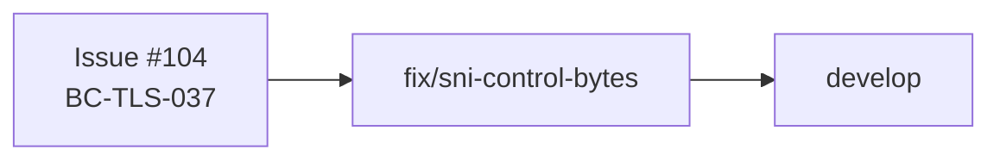
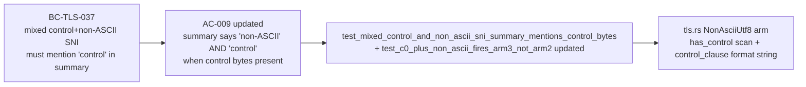

## Summary

Closes #104

**Bug:** A TLS SNI value that is valid UTF-8 but contains _both_ a non-ASCII byte (e.g. `é`, `U+00E9`) _and_ an ASCII C0/DEL control byte routes to the `NonAsciiUtf8` classification arm. That arm's finding summary read `"...contains non-ASCII characters..."` and never mentioned control bytes. A SOC analyst grepping summaries for `"control"` would silently miss these mixed-value cases — the more deliberately-crafted covert-channel / log-poisoning scenario (BC-TLS-037 / issue #104).

**Fix:** In the `NonAsciiUtf8` arm, scan `hostname.bytes()` for any `b < 0x20 || b == 0x7f`. When present, append `"and ASCII control bytes"` to the summary text. The classification enum arm/priority is unchanged — `NonAsciiUtf8` still fires before `AsciiWithControl` (VP-005 invariant; Kani harness `verify_arm3_priority_nonascii_plus_control` preserved). Only the summary text is enriched.

**Scope:** 2 files changed, 122 insertions / 12 deletions. Summary-text-only enrichment; no behavioral change to classification, verdict, category, confidence, direction, or evidence.

---

## Architecture Changes

The byte scan on line `tls.rs:450` uses `hostname.bytes()` — UTF-8 multi-byte continuation bytes are all in `0x80..=0xBF`, so the `b < 0x20 || b == 0x7F` predicate has no false positives.

---

## Story Dependencies

No upstream PRs to wait for. No downstream PRs blocked.

---

## Spec Traceability

| Layer | Item |
|-------|------|
| Behavioral Contract | BC-TLS-037 (issue #104): SOC analyst grepping "control" must find mixed-value SNI |
| Acceptance Criterion | AC-009 (BC-2.07.037 pc2 updated): summary contains both "non-ASCII characters" and "control" |
| Test | `test_mixed_control_and_non_ascii_sni_summary_mentions_control_bytes` (new, red→green) |
| Test (updated) | `test_c0_plus_non_ascii_fires_arm3_not_arm2` — pc2/pc3 assertions updated to match new behavior |
| Implementation | `src/analyzer/tls.rs` — `has_control` + `control_clause` in `NonAsciiUtf8` arm |

---

## Test Evidence

| Metric | Value |
|--------|-------|
| Total tests | 1 127 (1 126 existing + 1 new) |
| New test | `test_mixed_control_and_non_ascii_sni_summary_mentions_control_bytes` — red before fix, green after |
| Updated test | `test_c0_plus_non_ascii_fires_arm3_not_arm2` — pc2/pc3 comment + assertion updated |
| Clippy | clean (`-D warnings`) |
| `cargo fmt --check` | clean |
| TDD cycle | red → green (commit f5d3a67 → 667f9a9) |

---

## Holdout Evaluation

N/A — evaluated at wave gate (BC-TLS-037 is a point summary-text fix, not a holdout scenario).

---

## Adversarial Review

N/A — evaluated at Phase 5. No new attack surface introduced; classification arm priority preserved by Kani harness `verify_arm3_priority_nonascii_plus_control`.

---

## Security Review

Pending — will be populated after Step 4 security scan.

---

## Risk Assessment

| Dimension | Assessment |
|-----------|-----------|
| Blast radius | Minimal — summary-text-only change in one format! macro call |
| Classification behavior | Unchanged — `NonAsciiUtf8` arm priority over `AsciiWithControl` preserved |
| Performance | Negligible — one `bytes().any()` scan per SNI finding (not on hot path) |
| Regression risk | Low — existing 1 126 tests cover all adjacent arms; new test pins new behavior |

---

## AI Pipeline Metadata

| Field | Value |
|-------|-------|
| Pipeline mode | fix-PR lifecycle (9-step coordinator) |
| Branch | `fix/sni-control-bytes` |
| Model | claude-sonnet-4-6 |
| TDD cycle | red → green across 2 commits |

---

## Pre-Merge Checklist

- [x] PR description matches actual diff
- [x] Traceability chain complete (BC-TLS-037 → AC-009 → test → code)
- [x] Demo evidence: N/A (CLI tool; no interactive demo; hex fixture in test assertions)
- [ ] Security review complete
- [ ] AI code review complete (Step 5)
- [ ] CI checks passing (Step 6)
- [ ] Dependency PRs merged (Step 7 — none for this fix)
- [ ] Merge authorized by orchestrator dispatch (Step 8)
