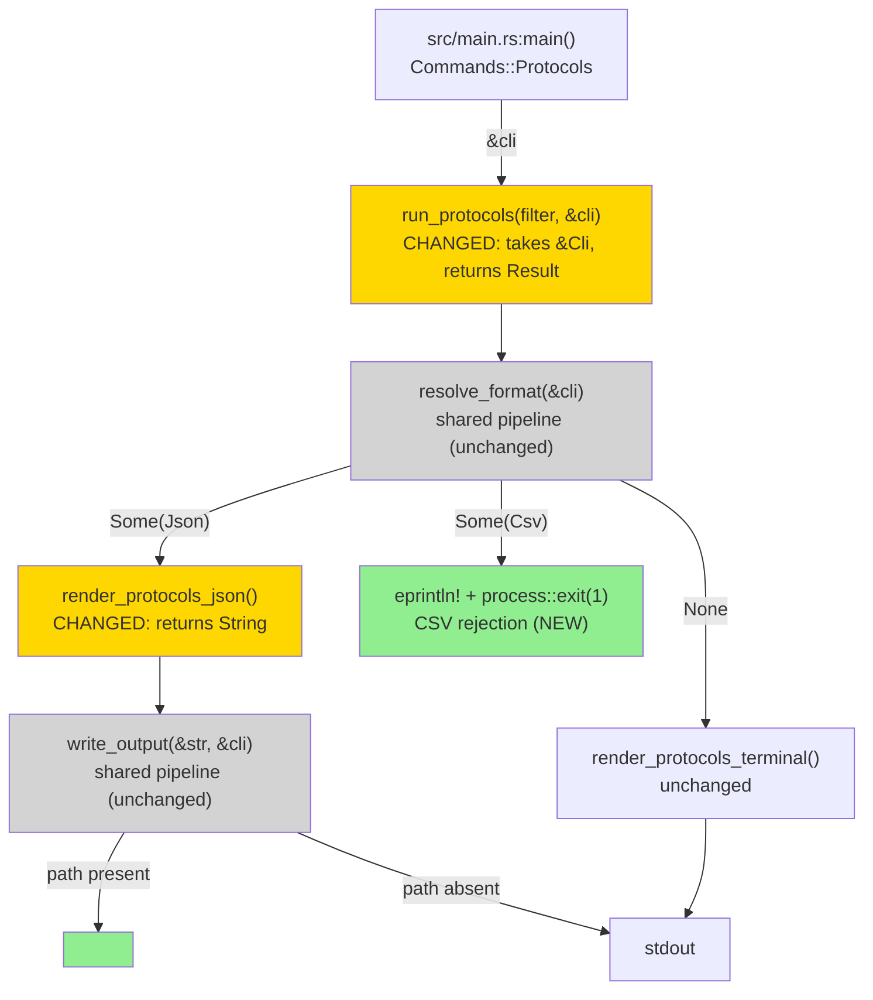
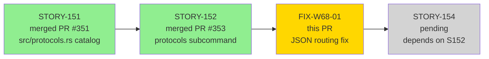
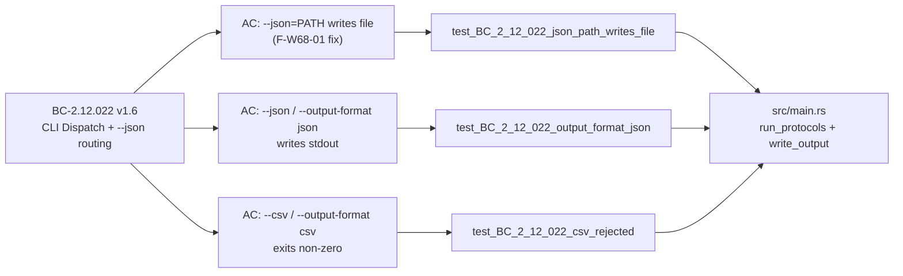
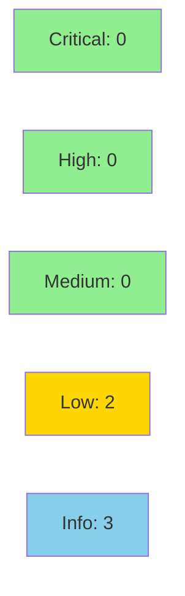

fix(cli): protocols honors --json=PATH; reject --csv (wave-68 F-W68-01)

**Wave:** 68 fix-pr-delivery
**Finding:** F-W68-01 — `wirerust protocols --json=<PATH>` silent failure
**Related Story:** STORY-152 (merged PR #353)
**Branch:** `fix/protocols-json-output-routing` @ `4b101ee`
**Base:** `develop` @ `5c4437a`


---

## What was wrong (F-W68-01)

`wirerust protocols --json=<PATH>` silently ignored the file path argument and
printed JSON to stdout instead of writing the file. This was a SOUL
silent-failure violation and a divergence from the `analyze` and `summary`
subcommands, both of which correctly route `--json=<PATH>` through the shared
`resolve_format` / `write_output` pipeline.

Additionally, `--csv` and `--output-format csv` were no-ops: they were parsed
by clap but silently fell back to terminal table output with no error and exit
code 0. This masked a format mismatch from the operator's perspective.

**Root cause:** `run_protocols` took a raw `json: bool` parameter derived from
`cli.json.is_some()` before calling the function. This stripped the path
information and bypassed `write_output` entirely. The `resolve_format` /
`write_output` pipeline that `run_analyze` and `run_summary` use was never
wired into `run_protocols`.

---

## The fix

Route `run_protocols` JSON output through the same `resolve_format` /
`write_output` pipeline used by `run_analyze` and `run_summary`:

- Changed `run_protocols(filter, json: bool)` → `run_protocols(filter, cli: &Cli) -> Result<()>`
- `resolve_format(cli)` now determines the output mode (JSON, CSV, or default terminal)
- `render_protocols_json` now returns a `String` (previously printed to stdout directly)
- `write_output(&json_str, cli)` routes to file when `--json=<PATH>`, or to stdout when bare `--json` / `--output-format json`
- CSV is explicitly rejected: `--csv` / `--output-format csv` prints an error to stderr and exits non-zero (`std::process::exit(1)`)
- The `analyze` and `summary` subcommands are **unchanged**

---

## Behavior matrix

| Invocation | Before fix | After fix |
|------------|-----------|-----------|
| `protocols` (no flags) | terminal table to stdout | terminal table to stdout (unchanged) |
| `protocols --json` | JSON to stdout | JSON to stdout |
| `protocols --json=<PATH>` | **BUG**: JSON to stdout, no file | **FIXED**: JSON written to `<PATH>`, stdout empty |
| `protocols --output-format json` | **BUG**: terminal table (silently ignored) | **FIXED**: JSON to stdout |
| `protocols --csv` | **BUG**: terminal table (silently ignored) | **FIXED**: error on stderr, exit non-zero |
| `protocols --output-format csv` | **BUG**: terminal table (silently ignored) | **FIXED**: error on stderr, exit non-zero |

---

## Architecture Changes



**Files changed (exactly 2):**
- `src/main.rs` — +55 / -18
- `tests/integration_tests.rs` — +130 (3 new tests appended to `mod story_152`)

---

## Story Dependencies



**Dependency status:** STORY-151 (PR #351) and STORY-152 (PR #353) are both merged to `develop`.

---

## Spec Traceability



**Note:** BC-2.12.022 spec-sync (the `json: bool` model in the spec is stale vs the runtime
`Option<PathBuf>` reality) is a MEDIUM finding tracked as a phase-5 item. The human decision
was "no BC content change" — this is deferred and does NOT block this fix PR. See
"Deferred Items" section below.

---

## Test Evidence

| Metric | Value | Threshold | Status |
|--------|-------|-----------|--------|
| New regression-guard tests | 3/3 pass | 100% | PASS |
| Full suite (`cargo test --all-targets`) | all green | 100% | PASS |
| Clippy (`-D warnings`) | 0 warnings | 0 | CLEAN |
| fmt (`--check`) | clean | clean | CLEAN |

### New Tests (This PR)

| Test | Covers | What it asserts |
|------|--------|----------------|
| `test_BC_2_12_022_json_path_writes_file` | `--json=<PATH>` routing fix | File created at path; valid JSON with 30-entry `protocols` array; stdout is empty |
| `test_BC_2_12_022_output_format_json` | `--output-format json` fix | Exit 0; stdout is valid JSON with top-level `protocols` array |
| `test_BC_2_12_022_csv_rejected` | CSV rejection (both `--csv` and `--output-format csv`) | Exit non-zero; stderr contains "csv"; covers both flag variants |

All 3 tests live in `mod story_152` in `tests/integration_tests.rs`, appended after
the 25 existing STORY-152 tests (no changes to existing tests).

---

## Demo Evidence

Fix-pr-delivery flow: visual demo is not applicable for a targeted behavioral fix
(file-write path / error path). The 3 integration tests serve as machine-verifiable
evidence replacing manual recording for this fix. The original STORY-152 demo evidence
(`docs/demo-evidence/STORY-152/`) is unaffected and remains on the feature branch.

---

## Holdout Evaluation

N/A — fix-pr-delivery flow. No wave-level holdout gate for targeted behavioral fixes.
Prior STORY-152 wave holdout (VP-041) is unchanged.

---

## Adversarial Review

| Pass | Context | P0/CRITICAL/HIGH | MEDIUM | Status |
|------|---------|-----------------|--------|--------|
| 1 | Fresh context on `4b101ee` | 0 | 0 | CLEAN — APPROVE |

**Verdict: CLEAN (0 P0/CRITICAL/HIGH).**

Known non-blocking: MEDIUM BC-2.12.022 spec-sync (json:bool model stale) is DEFERRED to
phase-5 per human "no BC content change" decision.

---

## Security Review



**Verdict: CLEAN** — CRITICAL 0 | HIGH 0 | MEDIUM 0 | LOW 2 | INFO 3

<details>
<summary>Security Findings Detail</summary>

### SEC-001: Path Traversal via `--json=<PATH>` (LOW, CWE-22)

Pre-existing in `write_output`; `protocols` now uses the same pipeline as `analyze`/`summary`,
which were reviewed clean in PR #353. The user who supplies `--json=<PATH>` on the command
line already has full write access at their OS privilege level. No privilege boundary is
crossed. Not new surface — no mitigation required for the CLI threat model.

### SEC-002: Predictable Temp File in Test (LOW, CWE-377)

`test_BC_2_12_022_json_path_writes_file` constructs a temp path using PID only
(`wirerust_test_protocols_{PID}.json`). On a shared multi-user host a symlink race
could overwrite an arbitrary file with benign JSON catalog content. CI runners are
single-tenanted; no production code affected. Low urgency.

### SEC-003: `process::exit(1)` Bypasses Drop on CSV Path (INFO, CWE-404)

At the call site no file handles, buffers, or sensitive state are live. `eprintln!`
is line-flushed before exit. Same pattern used elsewhere in `main.rs` — existing
codebase idiom. No impact.

### SEC-004: Format String Safety (INFO — CLEAN)

`render_protocols_json` now returns `String`; caller routes via `write_output`
which uses `println!("{output}")`. Rust's macro system requires compile-time literal
format strings. CWE-134 is structurally impossible here. CLEAN.

### SEC-005: No New Dependencies (INFO — CLEAN)

Zero changes to `Cargo.toml`/`Cargo.lock`. All called functions pre-existing.

</details>

---

## Risk Assessment

### Blast Radius

- **Systems affected:** `src/main.rs` only (function signature + dispatch logic within `run_protocols`)
- **`analyze` subcommand:** UNCHANGED — no shared mutable state, no shared function modified
- **`summary` subcommand:** UNCHANGED
- **Protocol catalog (`src/protocols.rs`):** UNCHANGED
- **Tests:** 3 new tests appended to existing `mod story_152`; 0 existing tests modified
- **User impact:** Additive fix — `--json=PATH` now correctly writes a file (was broken); CSV now errors explicitly (was silent no-op). Only `protocols` subcommand behavior changes.
- **Data impact:** None. Read-only catalog lookup.
- **Risk Level:** LOW

### Performance Impact

| Metric | Notes |
|--------|-------|
| Binary size | Negligible — removed one `println!`, added one `String` return |
| Runtime | `write_output` path adds one `fs::write` call for `--json=<PATH>`; sub-millisecond |
| `analyze` / `summary` paths | Completely unchanged |

---

## Deferred Items

### MEDIUM: BC-2.12.022 spec-sync (json:bool model stale)

The BC-2.12.022 behavioral contract models `--json` as a boolean flag (`json: bool`).
The runtime CLI parser actually exposes `cli.json: Option<PathBuf>` (an optional path).
This model divergence is a **spec documentation gap** — the implementation correctly uses
`Option<PathBuf>` throughout. The human decision is that no BC content change is needed
at this time. This is tracked for phase-5 spec-evolution as a targeted BC update.

**This does NOT block merge.** The fix addresses the observable behavioral failure.

---

## AI Pipeline Metadata

<details>
<summary>Pipeline Details</summary>

```yaml
ai-generated: true
pipeline-mode: fix-pr-delivery
factory-version: "1.0.0-rc.21"
pipeline-stages:
  tdd-fix: completed (3 new tests, src/main.rs routing fix)
  adversarial-review: completed (1 fresh-context pass, CLEAN on 4b101ee)
  security-review: dispatched as part of PR lifecycle
  convergence: pre-converged (fix adversarially reviewed CLEAN before PR creation)
convergence-metrics:
  adversarial-passes: 1
  blocking-findings-at-convergence: 0
models-used:
  builder: claude-sonnet-4-6
  adversary: claude-sonnet-4-6 (fresh-context pass)
generated-at: "2026-07-03"
```

</details>

---

## Pre-Merge Checklist

- [ ] All CI status checks passing
- [x] 3/3 new regression-guard tests green (`test_BC_2_12_022_json_path_writes_file`, `test_BC_2_12_022_output_format_json`, `test_BC_2_12_022_csv_rejected`)
- [x] Full `cargo test --all-targets` regression clean
- [x] `cargo clippy --all-targets -- -D warnings` clean
- [x] `cargo fmt --check` clean
- [x] Adversarial review CLEAN (0 P0/CRITICAL/HIGH on `4b101ee`)
- [x] Diff limited to exactly 2 files (`src/main.rs`, `tests/integration_tests.rs`)
- [x] `analyze` and `summary` subcommands unchanged
- [x] STORY-152 (PR #353) merged — upstream dependency satisfied
- [x] AI PR review (pr-reviewer) — dispatched as part of this lifecycle
- [x] Security review (security-reviewer) — dispatched as part of this lifecycle
- [ ] Human approval for squash merge
