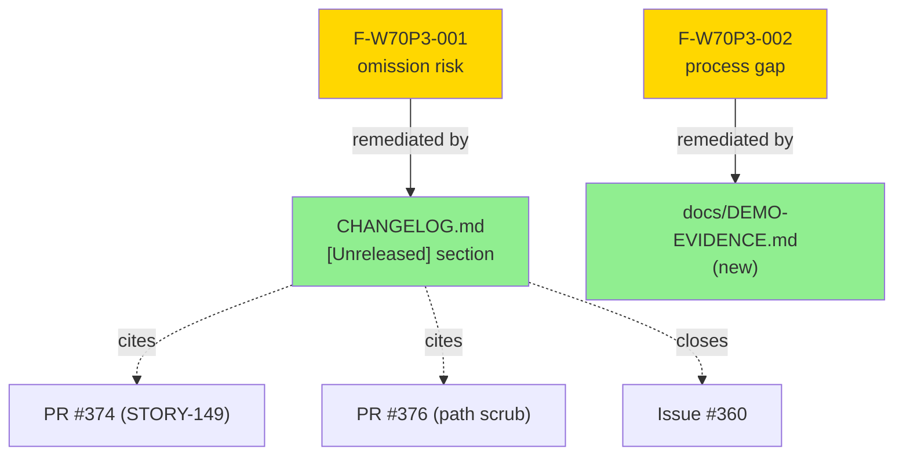
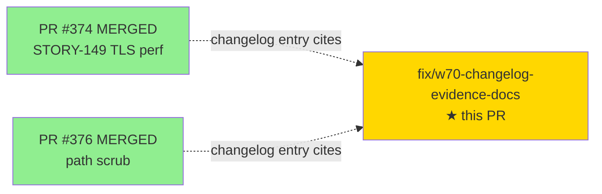
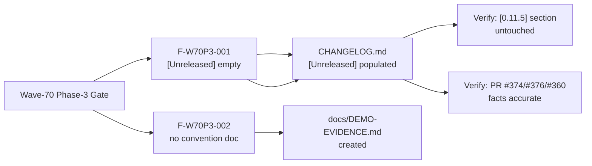

# docs: wave-70 [Unreleased] changelog entries + demo-evidence conventions (F-W70P3-001/002)

**Type:** docs-only (no production code changes)
**Branch:** `fix/w70-changelog-evidence-docs` → `develop`
**Tip commit:** b594a7f

Remediates two wave-70 Phase-3 gate findings against the develop baseline as of 6e1b682:

- **F-W70P3-001** — [Unreleased] section of CHANGELOG.md was empty after the v0.11.5 release,
  creating omission-risk for work that landed post-release. Populated with Added/Changed/Fixed
  entries for wave-70 STORY-149 work (PR #374, closes #360) and the demo-evidence path-scrub
  (PR #376). Updated comparison links to `v0.11.5...HEAD` and added the `[0.11.5]` link.
  The released `[0.11.5]` section is untouched.
- **F-W70P3-002** — No documentation file described demo-evidence conventions (scrub
  placeholders, archived .tape semantics, per-story layout). Created `docs/DEMO-EVIDENCE.md`
  to fill this process gap.

---

## Changes

### CHANGELOG.md — `[Unreleased]` section (F-W70P3-001)

Three entries added under the previously empty `[Unreleased]` heading, all citing the PRs
that delivered the work:

**Added**
- Fragmented-handshake Criterion benchmark `tls_fragmented/3-record-carry-drain` + `[[bench]]`
  target (STORY-149, PR #374, closes #360). CI-gated bounded-borrow source-inspection tests.

**Changed**
- TLS carry-path restructured for single-borrow HashMap access (STORY-149, PR #374).
  `try_parse_records` → `prepare_record_step` / `RecordStep` / `process_handshake_carry`.
  Regression recovered −7.88%; +2.41% vs May-19 anchor; 8-pass adversarial convergence,
  holdout 0.920 unchanged.

**Fixed**
- Absolute host paths scrubbed from 193 committed demo-evidence files (PR #376, F-W70P2-002).
  Replaced with `<REPO-ROOT>` and `<HOME>` placeholder tokens.

**Comparison links updated:**
- `[Unreleased]` now points to `v0.11.5...HEAD` (was `v0.11.4...HEAD` — stale since v0.11.5 released)
- `[0.11.5]` link added: `v0.11.4...v0.11.5`

**Omission note (documented in commit message):** indicatif 0.18.4 → 0.18.5 (PR #375) is
intentionally omitted. The established `[0.11.x]` changelog precedent shows dependency bumps
only appear when driven by a RUSTSEC advisory (anyhow/RUSTSEC-2026-0190 in [0.11.1],
crossbeam-epoch/RUSTSEC-2026-0204 in [0.11.5]). Pure maintenance dep bumps are not listed.

### docs/DEMO-EVIDENCE.md — new file (F-W70P3-002)

New documentation file at `docs/DEMO-EVIDENCE.md` covering:
1. Purpose of `docs/demo-evidence/` as a per-AC audit trail
2. `<REPO-ROOT>` / `<HOME>` scrub placeholder semantics (not env vars; placed by PR #376)
3. `.tape` archive-only warning (ephemeral worktree paths; not replayable post-merge)
4. Per-story layout convention (`<STORY-ID>/evidence-report.md` + `AC-NNN-<slug>.txt`)

Note on file placement: `docs/DEMO-EVIDENCE.md` rather than `docs/demo-evidence/README.md`
because POL-010 (validate-demo-evidence-story-scoped hook) rejects files at the top level of
`docs/demo-evidence/` without a `<STORY-ID>/` subdirectory prefix.

---

## Architecture Changes



---

## Story Dependencies



No upstream PRs must merge first. Both cited PRs (#374, #376) are already merged into develop.

---

## Spec Traceability



---

## Test Evidence

This PR contains no code changes. The CI suite (cargo test + cargo clippy + cargo fmt check)
runs unchanged against the same Rust sources as the develop baseline.

| Gate | Expected Result |
|------|----------------|
| `cargo test --all-targets` | 2367/2367 PASS (no new tests; no source changed) |
| `cargo clippy --all-targets -- -D warnings` | clean (no source changed) |
| `cargo fmt --check` | clean (no source changed) |
| Action-pin gate | clean (no workflow files changed) |

---

## Holdout Evaluation

N/A — docs-only change; no behavioral contracts.

---

## Adversarial Review

N/A — docs-only change; no implementation to adversarially review.

---

## Security Review

**SKIPPED — docs-only change.** Rationale:
- No Rust source files modified; no production code surface changed.
- `CHANGELOG.md` and `docs/DEMO-EVIDENCE.md` are static markdown documentation.
- No new dependencies, no build system changes, no CI workflow changes.
- No injection surface, authentication logic, or network-facing code touched.

Security posture: identical to develop baseline (6e1b682).

---

## Risk Assessment & Deployment

### Blast Radius
- **Systems affected:** Documentation only (`CHANGELOG.md`, `docs/DEMO-EVIDENCE.md`).
- **User impact:** None — no runtime behavior change.
- **Data impact:** None.
- **Risk Level:** MINIMAL

### Rollback
```bash
git revert b594a7f
git push origin develop
```

---

## Traceability

| Finding | File | Change | Verified |
|---------|------|--------|---------|
| F-W70P3-001 | `CHANGELOG.md` | `[Unreleased]` Added/Changed/Fixed + comparison links | PR diff |
| F-W70P3-002 | `docs/DEMO-EVIDENCE.md` | New conventions doc | PR diff |

---

## Demo Evidence

N/A — docs-only fix PR. No AC demo evidence artifacts required.

---

## AI Pipeline Metadata

```yaml
ai-generated: true
pipeline-mode: fix-pr (docs-only)
branch: fix/w70-changelog-evidence-docs
tip-commit: b594a7f
base: develop (6e1b682)
findings-remediated:
  - F-W70P3-001
  - F-W70P3-002
security-review: skipped (docs-only)
generated-at: "2026-07-07"
```

---

## Pre-Merge Checklist

- [ ] All CI status checks passing
- [x] Security review skipped — docs-only (rationale documented above)
- [x] No feature flag required
- [ ] Human review completed
- [x] Both findings (F-W70P3-001, F-W70P3-002) remediated
- [x] [0.11.5] released section verified untouched
- [x] Comparison links updated to v0.11.5...HEAD
