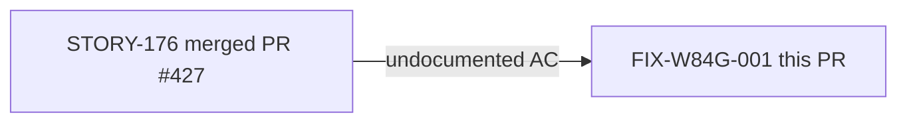
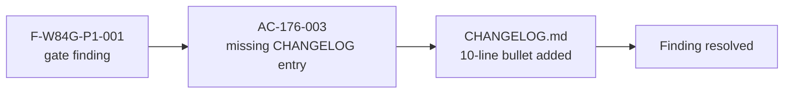

## Summary

CHANGELOG-only documentation fix for finding **F-W84G-P1-001** (wave-84 Gate 3, pass 1 adversarial review).

The gate adversary found that STORY-176 shipped three acceptance criteria but the `[Unreleased]` CHANGELOG section only documented two: AC-176-001 (green-doc-tense gate extensions) and AC-176-002 (stub-era patterns). AC-176-003 — the `.gitignore mutants.out*/` glob, its `bin/test_gitignore_mutants_glob.py` regression guard, and the CI `bin-selftest` wiring — was delivered and merged (PR #427) but not mentioned in CHANGELOG. The content-blind `changelog-gate` job (which only checks that the file was touched, not that all ACs are covered) passed silently.

**Change:** Adds a 10-line `[Unreleased]` bullet in `CHANGELOG.md` documenting AC-176-003.

**No source, binary, or test files are touched.** The `changelog-gate` CI job does NOT fire for this PR because its trigger set excludes `CHANGELOG.md` changes that do not also touch `src/`, `Cargo.toml`, or `bin/` (AC-158-001, PG-W71-CHANGELOG).

## Architecture Changes

```mermaid
graph TD
    A[CHANGELOG.md] -->|adds [Unreleased] bullet| B[AC-176-003 documented]
    B --> C[F-W84G-P1-001 resolved]
```

No architecture changes. Documentation-only fix.

## Story Dependencies



No upstream PRs are unmerged. STORY-176 (PR #427) is already merged into `develop`.

## Spec Traceability



| Finding | AC | Fix |
|---------|-----|-----|
| F-W84G-P1-001 | AC-176-003 undocumented in CHANGELOG | Added `[Unreleased]` bullet in `CHANGELOG.md` |

## Test Evidence

No tests added or modified. This is a documentation-only change; the fix is the CHANGELOG content itself.

- CI `changelog-gate` does NOT trigger (no `src/`, `Cargo.toml`, or `bin/` changes).
- All other CI jobs (Semantic PR, action-pin-gate, cargo test, clippy, fmt) run as normal and are expected to remain green.

## Demo Evidence

N/A — documentation-only fix. No behavioral change to demonstrate. The deliverable is the CHANGELOG.md diff itself (visible in the PR diff view).

## Holdout Evaluation

N/A — evaluated at wave gate.

## Adversarial Review

Finding source: wave-84 Gate 3, pass 1 adversarial review. This PR IS the resolution of the finding.

## Security Review

No security surface changed. CHANGELOG.md is a plain-text documentation file.

## Risk Assessment

- **Blast radius:** Zero — no code, tests, or CI config changed.
- **Performance impact:** None.
- **Rollback:** Revert the single CHANGELOG.md addition with no downstream effect.

## AI Pipeline Metadata

- Pipeline mode: fix-PR-delivery (wave-84 gate fix, no stub/Red Gate/wave-integration)
- Finding ref: F-W84G-P1-001
- Models used: claude-sonnet-4-6

## Pre-Merge Checklist

- [x] PR description matches actual diff (CHANGELOG.md only, 10 lines added)
- [x] All ACs covered by change (AC-176-003 — documentation fix, no demo evidence needed)
- [x] Traceability chain complete (F-W84G-P1-001 → AC-176-003 → CHANGELOG bullet)
- [x] Review findings addressed (this PR IS the fix for the finding)
- [x] No dependency PRs unmerged (STORY-176/PR #427 already merged)
- [x] AUTHORIZE_MERGE=NO — halting at MERGE-READY for human authorization (DF-MERGE-AUTH-CLASSIFIER-001)
