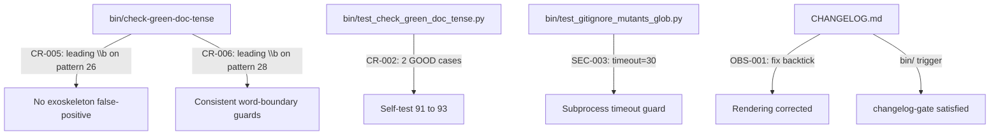
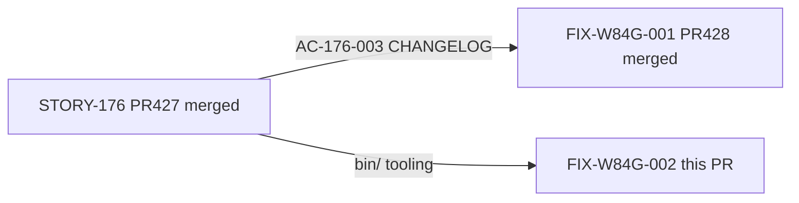
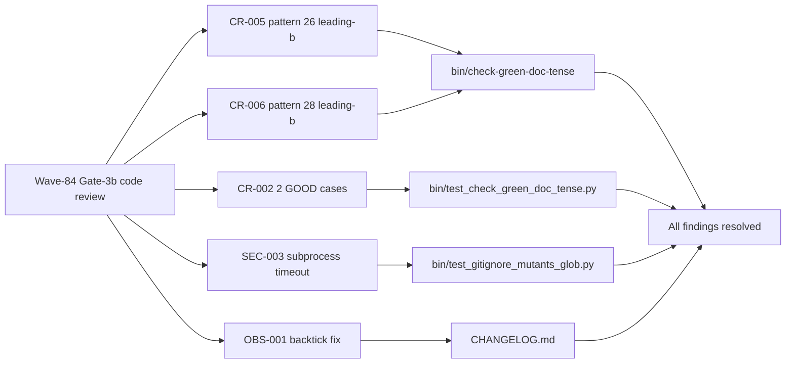

## Summary

Wave-84 Gate-3b code-review + security fixes (findings CR-002, CR-005, CR-006, SEC-003, OBS-001).
All findings are MINOR or LOW severity; all changes are confined to `bin/` tooling and `CHANGELOG.md`.

**Changes by finding:**

- **CR-005** — `bin/check-green-doc-tense` pattern 26: adds leading `\b` to `skeleton compiles?\b`, changing the regex from `skeleton\s+compiles?\b` to `\bskeleton\s+compiles?\b`. Eliminates the "exoskeleton compiles" false-positive class where "skeleton" appears as a non-word-boundary suffix of a longer word.
- **CR-006** — `bin/check-green-doc-tense` pattern 28: adds leading `\b` to `(are|is) (currently) compile-only` for consistency with the pattern-26 fix. Prevents hypothetical mid-word matches.
- **CR-002** — `bin/test_check_green_doc_tense.py`: adds 2 new GOOD test cases — (1) `exoskeleton compiles` exercising the pattern-26 leading-`\b` boundary, (2) `until STORY-153 wired the handler` exercising pattern-29's negative-lookahead on "the". Self-test count: 91 → 93.
- **SEC-003** — `bin/test_gitignore_mutants_glob.py`: wraps the `subprocess.run(["git", "check-ignore", ...])` call with `timeout=30` and converts `subprocess.TimeoutExpired` to an `AssertionError` with a descriptive message.
- **OBS-001** — `CHANGELOG.md`: repairs an unclosed markdown backtick in the AC-176-003 `[Unreleased]` bullet (`**.gitignore mutants.out*/` → `` **`.gitignore` `mutants.out*/` ``). Fixes broken inline-code rendering on GitHub.

A `### Fixed` sub-section is added to `[Unreleased]` in `CHANGELOG.md`, satisfying the `bin/` CHANGELOG obligation (AC-158-001, PG-W71-CHANGELOG).

## Architecture Changes

No production source or CI architecture changes. All changes are in `bin/` tooling (Python scripts) and `CHANGELOG.md`.

## Story Dependencies

No upstream PRs are unmerged. STORY-176 (PR #427) and FIX-W84G-001 (PR #428) are already merged into `develop`.

## Spec Traceability

| Finding | Severity | Fix Location | Status |
|---------|----------|--------------|--------|
| CR-005 | MINOR | `bin/check-green-doc-tense` pattern 26 | Fixed |
| CR-006 | MINOR | `bin/check-green-doc-tense` pattern 28 | Fixed |
| CR-002 | MINOR | `bin/test_check_green_doc_tense.py` | Fixed |
| SEC-003 | LOW | `bin/test_gitignore_mutants_glob.py` | Fixed |
| OBS-001 | MINOR | `CHANGELOG.md` | Fixed |

## Test Evidence

- `bin/test_check_green_doc_tense.py`: self-test count **91 → 93** (2 new GOOD cases added by CR-002).
- `bin-selftest` CI job: runs `bin/test_check_green_doc_tense.py` and `bin/test_gitignore_mutants_glob.py`; expected green.
- `changelog-gate` CI job: triggers because `bin/` files are modified; `CHANGELOG.md` has a new `[Unreleased] ### Fixed` entry.
- All other CI jobs (Semantic PR, action-pin-gate, cargo test, clippy, fmt, green-doc-tense-gate): no source changes; expected green.

## Demo Evidence

N/A — tooling-quality fix. No behavioral/output change to the product CLI or protocol analysis pipeline. The fix is the corrected regex patterns and their test coverage (visible in the PR diff).

## Holdout Evaluation

N/A — evaluated at wave gate.

## Adversarial Review

Finding source: wave-84 Gate-3b code review pass. This PR IS the resolution of all listed findings.

## Security Review

**Verdict: APPROVE** (assessed 2026-07-20 via vsdd-factory:security-reviewer)

- SEC-003 addressed: `subprocess.run` in `bin/test_gitignore_mutants_glob.py` now has `timeout=30` (CWE-400 resource exhaustion) with an explicit `AssertionError` on timeout. Fully closes hung-subprocess risk.
- Regex changes (patterns 26/28): pure narrowing; `\b` is a zero-width assertion with no ReDoS exposure. Not applicable to CWE-1333.
- Subprocess call uses list form throughout — no shell interpolation (CWE-78 not applicable).
- No injection, authentication, OWASP top-10 issues introduced.
- Pre-existing LOW observation (no timeout on `git ls-files` in `check-green-doc-tense`, line ~465) predates this PR; noted for completeness, not a blocker.
- Blast radius: `bin/` Python test tooling only.

## Risk Assessment

- **Blast radius:** `bin/` Python tooling and `CHANGELOG.md`. Zero impact on `src/`, Cargo, or CI workflow files.
- **Performance impact:** None.
- **Rollback:** Revert the single commit; all `bin/` scripts remain independently executable.

## AI Pipeline Metadata

- Pipeline mode: fix-PR-delivery (wave-84 gate fix, no stub/Red Gate/wave-integration)
- Finding refs: CR-002, CR-005, CR-006, SEC-003, OBS-001 (wave-84 Gate-3b code review)
- Models used: claude-sonnet-4-6
- Cost: minimal (single-commit fix PR)

## Pre-Merge Checklist

- [x] PR description matches actual diff (4 files: bin/check-green-doc-tense, bin/test_check_green_doc_tense.py, bin/test_gitignore_mutants_glob.py, CHANGELOG.md)
- [x] All ACs covered by change (CR-002/005/006/SEC-003/OBS-001 fully addressed)
- [x] Traceability chain complete (Gate-3b findings to regex/test/timeout/changelog fixes)
- [x] Review findings addressed (this PR IS the fix for all 5 gate findings)
- [x] No dependency PRs unmerged (STORY-176 #427 and FIX-W84G-001 #428 already merged)
- [x] CHANGELOG `[Unreleased] ### Fixed` entry present (bin/ trigger satisfied)
- [x] AUTHORIZE_MERGE=NO — halting at MERGE-READY for human authorization (DF-MERGE-AUTH-CLASSIFIER-001)
